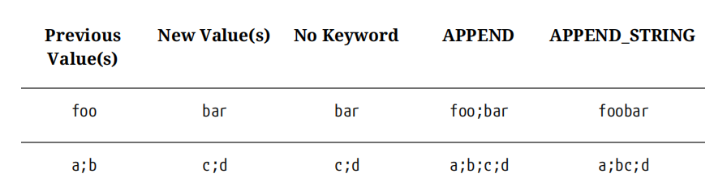

# 属性(property)

参考文件

* [property](https://cmake.org/cmake/help/latest/manual/cmake-properties.7.html)

属性影响着CMake运行的方方面面，从源文件的编译到二进制文件等等。

属性按照它能影响的范围被分为几大类，分别为目录属性(directory property),目标属性(target property),源文件属性(source file property),测试例属性(test case property),缓存变量属性(cache variable property),全局属性(global property).

## 属性与变量的不同

一个变量不直接影响CMake运行，它也不与某个特定的项相关，用户可以自由地定义和删除变量。

属性会直接影响CMake运行，他与一个特定的项(目录、目标、源文件等)直接相关，通常是由CMake官方预先定义了许多属性。

容易引起困惑的是，一个属性的默认值通常由一个特定的变量提供，并在CMakeFileLists运行的某个时间将这个变量的值写入这个属性。那些给属性提供初始值的变量通常以`CMAKE_`开头。

## 修改属性

CMake提供了许多命令来修改属性，最常用的命令就是`set_property()`.

```CMake
set_property(entitySpecific
    [APPEND | APPEND_STRING]
    PROPERTY propertyName values...
)
```

`entitySpecific`指出了哪类属性会被修改，可以为如下的值

```CMake
GLOBAL
DIRECTORY [dir]
TARGET targets...
SOURCE sources... # Additional options with CMake 3.18
INSTALL files...
TEST tests...
CACHE vars...
```

`GLOBAL`就是全局属性，不需要额外指定参数。`DIRECTORY`若是不指定`dir`则指定的就是当前的目录。

`PROPERTY`后面就是属性名和要修改的值。

除了修改CMake预定义的属性，我们还可以定义自己的属性，只需要给出想要定义的属性名和设置的值就可以了。

```CMake
set_property(TARGET MyApp1 MyApp2
    PROPERTY MYPROJ_CUSTOM_PROP val1 val2 val3
)
```

上述的命令为`MyApp1`和`MyApp2`定义了`MYPROJ_CUSTOM_PROP`属性，这个属性值为`val1;val2;val3`.

`APPEND`和`APPEND_STRING`可以被用于控制`values`如何加入这个属性中，`APPEND`就是在原属性值后加上分号`;`和`values`.`APPEND_STRING`在原属性值后加上`values`.要是不使用`APPEND`和`APPEND_STRING`，则是替换原来的值。



## 获取属性

CMake提供了许多命令来获取属性，最常用的命令就是`get_property()`.

```CMake
get_property(resultVar entitySpecific
    PROPERTY propertyName
    [DEFINED | SET | BRIEF_DOCS | FULL_DOCS]
)
```

* 指定`DEFINED`关键字后，`resultVar`会是一个布尔值表示`propertyName`属性是否定义。
* 指定`SET`关键字后，`resultVar`会是一个布尔值表示`propertyName`属性是否被设置了值。
* 指定`BRIEF_DOCS`关键字后，`resultVar`会返回该属性简要文字描述。
* 指定`FULL_DOCS`关键字后，`resultVar`会返回该属性完全文字描述。

## 属性分类

### 全局属性

全局属性直接与整个构建工程相关,它们通常指定了什么工具会被使用，定义工程文件如何被组织。

可以使用`get_cmake_property()`命令获得全局属性，命令格式如下

```CMake
get_cmake_property(resultVar property)
```

### 目录属性

逻辑上，目录属性处于全局属性和目标属性之间。目录属性通常会设置在这里目录之中的目标的默认属性，或者覆写全局属性，给目录提供初始属性。一些只读的目录属性也会提供一些信息。

可以使用一些特定的命令修改或者获取目录属性。

```CMake
set_directory_properties(PROPERTIES
    prop1 val1
    [prop2 val2] ...
)
get_directory_property(resultVar
    [DIRECTORY dir] property
)
get_directory_property(resultVar
    [DIRECTORY dir] DEFINITION varName
)
```

`set_directory_properties()`命令只会应用于本目录.

第二个的`get_directory_property()`可以取得不同作用域的变量的值。

除了直接使用命令操纵目录属性，CMake还提供了一系列的命令间接操纵目录属性，比如`include_directories()`,`add_definitions()`等，这些命令就会填充（通常是加在末尾）对应的属性。

### 目标属性

目录属性控制着目标的方方面面，从提供编译源文件所使用的编译器标志(Flags)到生成文件的保存地点。一些目标属性控制着这个目标在IDE中的显示方法，其它的目标属性控制着编译链接这些文件中的工具。

可以使用一些特定的命令修改或者是获取目标属性。

```CMake
set_target_properties(target1 [target2...]
    PROPERTIES
    propertyName1 value1
    [propertyName2 value2] ...
)
get_target_property(resultVar target propertyName)
```

除了直接修改目标属性的命令，CMake还提供了一系列的以`target_`开头的命令来间接修改目标属性,以及有些修改目录属性的命令也会顺带修改目标属性。

### 源文件属性

源文件属性控制着单个源文件，可以很好地操纵源文件的编译选项，编译方法。

同样的，也可以使用特定的命令修改或者是获取源文件属性。

```CMake
set_source_files_properties(file1 [file2...]
    PROPERTIES
    propertyName1 value1
    [propertyName2 value2] ...
)
get_source_file_property(resultVar sourceFile propertyName)
```

### 缓存变量属性

缓存变量属性和别的属性不太一样，它不影响缓存变量在构建过程中的行为，只是控制着对应的缓存变量是如何在`CMake GUI`中显示的。

常用的缓存变量属性如下

* `TYPE`属性，这个属性值可以是`BOOL`,`FILEPATH`,`PATH`,`STRING`,`INTERNAL`其中之一，控制着缓存变量在GUI中的显示方法。
* `ADVANCED`属性，这个属性是一个布尔值，通常使用命令`mark_as_advanced()`设置，控制缓存变量是否是高级选项。
* `HELPSTRING`属性，这个属性是一个字符串，通常在使用`set()`设置缓存变量时就顺便设置了，但也可以单独改变。
* `STRINGS`属性，这个属性是一个字符串列表，当缓存变量的类型为`STRING`时，CMake就会搜索这个属性，如果这个属性不为空，这个属性就会被认为是这个缓存变量的合法值，CMake GUI会提供一个下拉菜单。注意，这个属性不会强制这个缓存变量必须满足这些值，只是为了方便GUI工具。

### 测试属性

顾名思义，适用于`add_test`加入的测试的属性，控制测试的过程与结果。

## 属性继承(property inheritance)

当使用`add_subdirectory()`命令，CMake将处理子文件夹中的`CMakeFileLists.txt`,此时，子目录的目录属性会继承当前目录的目录属性，作为默认值。

当使用`add_executable()`或`add_library()`命令创建一个新的目标时，这个目标的目标属性会继承当前目标的对应的目录属性，比如`INCLUDE_DIRECTORIES`，`COMPILE_DEFINITIONS`，`COMPILE_OPTIONS`等属性,作为默认值。

当使用`include_directories()`填充目录的`INCLUDE_DIRECTORIES`属性时，它还会填充在当前目录已创建的目标的`INCLUDE_DIRECTORIES`属性，由于未创建的目标也会继承`INCLUDE_DIRECTORIES`属性，所以实际上是当前目录上所有的目标都会受到影响。

## 属性传递

当一个目标依赖另一个目标时，依赖的目标可能会传递一些信息，而被依赖的目标可能会决定依赖目标的可见性。

通过在命令中使用三个关键字控制依赖传递，分别是`PUBLIC`、`INTERFACE`、`PRIVATE`.接下来以一个特定的命令来说明三个关键字的作用。

```CMake
target_link_libraries(targetName
    <PRIVATE|PUBLIC|INTERFACE> item1 [item2 ...]
    [<PRIVATE|PUBLIC|INTERFACE> item3 [item4 ...]]
    ...
)
```

`PRIVATE`关键字就会在目标`targetName`的`LINK_LIBRARIES`属性后加上`item`。

`INTERFACE`关键字就会在目标`targetName`的`INTERFACE_LINK_LIBRARIES`属性后加上`item`。

`PUBLIC`关键字就会在目标`targetName`的`INTERFACE_LINK_LIBRARIES`属性和`LINK_LIBRARIES`的属性后加上`item`。

当`target_link_libraries()`命令运行时，`item1`中的`INTERFACE_LINK_LIBRARIES`属性就会填充到`targetName`的`LINK_LIBRARIES`属性中(与这三个关键字使用无关)，实现了依赖的传递。

## 跨越

## 常用属性

本节列出了CMake常用的属性

### 常用全局属性

#### `CMAKE_CXX_KNOWN_FEATURES`和`CMAKE_C_KNOWN_FEATURES`

这两个全局属性为只读属性，列出了这个版本CMake知道的`C/C++`的特性，可以被用于`target_compile_features()`命令。常用的特性是指定`C/C++`满足的标准，比如`c_std_11`,`cxx_std_11`等。

#### `GENERATOR_IS_MULTI_CONFIG`

这个全局属性为只读属性，表示目前生成器是不是多配置生成器。

### 常用目录属性

本节列出了CMake常用的目录属性，这些目录属性不是直接影响目标构建的，而是在创建目标时，目标属性会继承当前目录对应的目录属性。

#### `INCLUDE_DIRECTORIES` 

包含一个编译器查找头文件目录的列表，通常使用`include_directories()`添加新的表项。

#### `LINK_DIRECTORIES`

包含一个链接器查找库文件目录的列表，通常使用`link_directories()`来添加新的表项。

#### `LINK_OPTIONS`

包含一个提供给链接器的参数的列表，通常使用`add_link_options()`来添加新的表项。

#### `COMPILE_DEFINITIONS`

包含一个预处理器的定义列表，通常使用`add_compile_definitions()`或者是`add_definitions()`添加新的预处理器定义。

#### `COMPILE_OPTIONS`

包含一个传递给编译器的参数的列表，通常使用`add_compile_options()`添加新的参数。

#### `ADDITIONAL_CLEAN_FILES`

全局`clean`目标需要额外删除的文件或者是目录的列表.相对路径相对于当前二进制文件目录。

### 常用目标属性

本节列出了CMake常用的目标属性，这些目标属性直接影响着目标构建，会在构建目标时，传递给`C/C++`编译器。除了下面提到的目标属性，还有与这些属性相关的以`INTERFACE_`开头的对应的属性，这些属性控制着属性的传递。

#### `SOURCES`

包含了目标编译所用的源文件列表，通常使用`add_executable()`,`add_library()`,`add_custom_target()`,`target_sources()`命令添加新的源文件。

#### `INCLUDE_DIRECTORIES`

包含一个编译器查找头文件目录的列表，通常使用`target_include_directories()`添加新的头文件目录。这个列表包含的都是绝对路径，但是也可以在`target_include_directories()`使用相对路径，CMake自动翻译为绝对路径加入这个属性中。在编译目标时，CMake就会添加对应的编译参数，比如`-Idir`。

#### `COMPILE_DEFINITIONS`

包含一个预处理器的定义的列表,也就是相当于在`C/C++`源文件中添加`#define ...`内容,通常使用`target_compile_definitions())`添加新的预处理器定义.每个定义的格式为`VAR=VALUE`,CMake就会自动转换这个格式，在编译目标时，添加对应的编译参数，比如`-DVAR`.

#### `COMPILE_OPTIONS`

包含一个传递给编译器的参数的列表，这个列表的每一项会直接被传递给编译器作为编译时参数（不包括链接时），CMake不做任何处理（除了删除重复的表项重复以及自动加上转义字符防止转义），通常使用`target_compile_options()`添加新的编译器参数。

#### `COMPILE_FLAGS`（已弃用）

包含一个传递给编译器参数的字符串，与上面`COMPILE_OPTIONS`不同的是，CMake直接传递给编译器，不做任何处理。

#### `LINK_LIBRARIES`

包含目标直接链接的库的列表，由于没有对应的目录属性，所以它的初始值是空字符串，通常使用`target_link_libraries()`给目标添加新的库。

这个列表包含的表项可以是

* 库文件的路径，通常是绝对路径
* 只有库文件的名字没有路径，通常也没有任何平台相关的库文件前缀(lib)或者是后缀(.a,.o,.so,.dll)
* 之前使用`add_library()`命令创造的目标名，CMake会自动转换成对应的库文件的绝对路径，并自动解决跨平台的问题

#### `LINK_OPTIONS`

包含一个传递给链接器的参数的列表，通常使用`target_link_options()`添加新的表项。这个属性只有在目标类型为可执行文件，共享库，模块才有作用，对于静态库类型，这个属性没有效果（静态库使用别的属性）。

#### `LINK_FLAGS`

包含一个传递给链接器的参数的字符串，这个属性只有在目标类型为可执行文件，共享库，模块才有作用，对于静态库类型，这个属性没有效果（静态库使用别的属性）。和`LINK_OPTIONS`不同的是，这个属性不支持生成期表达式，而且没有对应的`INTERFACE_`属性与目录属性。

#### `STATIC_LIBRARY_OPTIONS`

包含一个传递给链接器的参数的列表，这个属性只有在目标类型为静态库时才有作用，对于可执行文件，共享库，模块类型，这个属性没有效果。这个属性没有对应的`INTERFACE_`属性与目录属性

#### `STATIC_LIBRARY_FLAGS`

包含一个传递给链接器的参数的字符串,这个属性只有在目标类型为静态库时才有作用，对于可执行文件，共享库，模块类型，这个属性没有效果。这个属性没有对应的`INTERFACE_`属性与目录属性。

#### `LINK_FALGS_<CONFIG>`

包含一个特定构建类型`<CONFIG>`的传递给链接器的参数的字符串，这个属性只有在目标类型为可执行文件，共享库，模块才有作用，对于静态库类型，这个属性没有效果（静态库使用别的属性）。

#### `STATIC_LINK_FLAGS_<CONFIG>`

包含一个特定构建类型`<CONFIG>`的传递给链接器的参数的字符串，这个属性只有在目标类型为静态库时才有作用，对于可执行文件，共享库，模块类型，这个属性没有效果。

#### `<CONFIG>_POSTFIX`

包含特定配置下，要扩展到所生成的文件名的后缀（不是后缀名）。一般来说，只有库文件会有这个属性值。常见的值有`_debug`，表示这个是`debug`配置下的库文件，这个操作允许了多配置生成器下，库文件可以在同一个目录中。

#### `<LANG>_STANDARD`

编译目标的`LANG`语言时，所使用的标准，比如对于`CXX_STANDARD`设置它的值为`17`表示使用`C++17`标准编译，CMake就会给编译器传递`-std=gnu++17`参数。对于不支持这个标准的编译器，取决于`CXX_STANDARD_REQUIRED`来决定是否报错。

这个属性的初始值来自CMake变量`CMAKE_<LANG>_STANDARD`.

#### `<LANG>_STANDARD_REQUIRED`

`<LANG>_STANDARD`是否是必须满足的。

这个属性的初始值来自CMake变量`CMAKE_<LANG>_STANDARD_REQUIRED`.

#### `COMPILE_FEATURES`

编译目标时，所要满足的编译器特性。比如`cxx_std_17`.

#### `IMPORTED`

只读属性，表示目标是否是导入目标.

#### `IMPORTED_LOCATION`

导入目标的路径，必须是完全路径。

#### `RUNTIME_OUTPUT_DIRECTORY`

表示在哪里存放生成的**可执行文件**

这个属性的初始值来自CMake变量`CMAKE_RUNTIME_OUTPUT_DIRECTORY`.

#### `ARCHIVE_OUTPUT_DIRECTORY`

表示在哪里存放生成的**归档文件**，比如静态库。

这个属性的初始值来自CMake变量`CMAKE_ARCHIVE_OUTPUT_DIRECTORY`.

#### `LIBRARY_OUTPUT_DIRECTORY`

表示在哪里存放生成的**动态库文件**，比如共享库。

这个属性的初始值来自CMake变量`CMAKE_LIBRARY_OUTPUT_DIRECTORY`.

#### `POSITION_INDEPENDENT_CODE`

目标是否编译为位置无关的代码.目标创建时，这个属性的初始值来自CMake变量`CMAKE_POSITION_INDEPENDENT_CODE`,如果这个变量未定义，那么对于共享库和模块，默认值为`ON`，否则为`OFF`.

#### `ADDITIONAL_CLEAN_FILES`

全局`clean`目标需要额外删除的文件或者是目录的列表，这个属性用于指明由于特定目标构建时生成的或者是直接与特定目标有关的文件或者目录。相对路径相对于当前二进制文件目录。

### 常用源文件属性

#### `GENERATED`

这个源文件是否是CMake处理时生成的

任何文件是以下情况都会被设置`GENERATED`属性。

* 由CMake对命令处理时创建的文件(不是`build`阶段),比如命令`add_custom_command()`
* 使用`BYPRODUCTS`在命令`add_custom_command()`或`add_custom_target()`声明的文件

#### `LANGUAGE`

这个源文件是以什么语言写成的，要是这个源文件属性未定义，那么就会根据扩展名决定。

典型值为，`CXX`,`C`,`CSharp`等。

### 常用测试属性

#### `WILL_FAIL`

为真时，反转测试结果，测试程序返回值为`0`时测试成功，不为`0`时测试失败。系统级别的错误不受影响。

#### `PASS_REGULAR_EXPRESSION`

测试的标准输出必须满足这个正则表达式**列表**中的任意一项，否则产生测试失败，忽略测试程序返回值。系统级别的错误不受影响。

#### `FAIL_REGULAR_EXPRESSION`

如果测试的标准输出或者标准错误满足这个正则表达式列表中的任意一项，测试失败。忽略测试程序返回值。系统级别的错误不受影响。

#### `SKIP_REGULAR_EXPRESSION`

如果测试的标准输出或者标准错误满足这个正则表达式列表中的任意一项，，这个测试会被标记为`skipped`.忽略测试程序返回值。系统级别的错误不受影响。