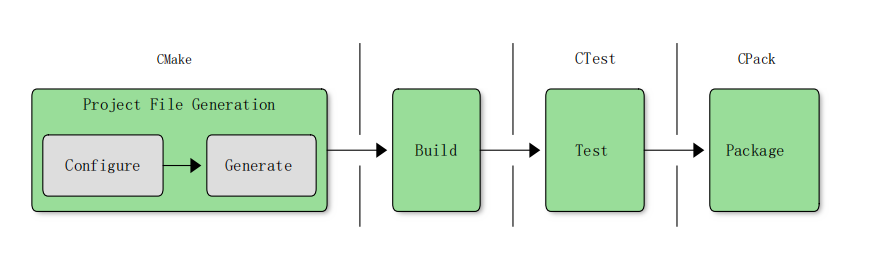

# CMake 学习笔记

CMake工具可以自动化地生成Makefile，而且CMake工具是跨平台的，方便我们把在不同平台编译C/C++文件。
本笔记主要探讨`CMakeFileLists`写法。

参考文件

* CMake 官方文档[CMake Reference Documentation](https://cmake.org/cmake/help/latest/)
* CMake 书籍 [Professional CMake](ProfessionalCMakeAPracticalGuide10th(2021).pdf) 以及中文版 [Professional CMake](Professional-CMake-zh.pdf)

___

## CMake架构



`CMake`读取`CMakeFileLists.txt`生成可执行文件的过程主要分为如上图的几个阶段.

第一个阶段是`configure`阶段，在这个阶段,`CMake`从上至下读取顶层`CMakeFileLists.txt`文件，同时读取使用命令`include`,`add_subdirectory`等包含进来的文件，同时内化读取到的信息（目标，变量等）,方便后续的阶段使用。

第二个阶段是`generate`阶段。在这个阶段，`CMake`使用内化的信息生成指定的`build`文件,比如`Makefile`文件。

上述两个阶段在直接运行`cmake`命令后就会一起运行。

第三个阶段是`build`阶段，在这个阶段，通过`cmake --build`命令就可以生成可执行文件。

第四个阶段是`test`阶段，这个阶段，会运行在`CMakeFileLists.txt`定义的测试代码。

第五个阶段是`package`阶段，这个阶段，会对可执行文件进行打包。

## CMakeFileLists基本元素

`CMakeFileLists`的基本元素很少，这些基本元素就可以组合成`CMakeFileLists.txt`.

### 命令

参考文件

* CMakeFileLists 命令大全[cmake-commands](https://cmake.org/cmake/help/latest/manual/cmake-commands.7.html)

`CMakeFileLists`有很多命令，这些命令可以用来实现不同的功能,比如`project()`、`add_executable()`.

`CMakeFileLists`命令的用法和`C`语言里的函数类似，也可以接受参数，参数之间使用空格或者换行符分隔，但是**不能**有直接的返回值。

```CMake
add_executable(MyExe
    main.cpp
    src1.cpp
    src2.cpp)
```

定义了一个可执行文件`MyExe`目标，使用源文件`main.cpp`,`src1.cpp`,`src2.cpp`来编译。

`CMakeFileLists`命令是大小写**不敏感**的，但是通常习惯使用全小写。

```CMake
add_executable(<name> [WIN32] [MACOSX_BUNDLE]
               [EXCLUDE_FROM_ALL]
               [source1] [source2 ...])
```

`CMakeFileLists`命令的参数一般分为两类，第一类是关键字，也就是有特殊意义的参数，比如上面的`WIN32`就是有关键字，指明了要编译的可执行文件是`WIN32`类型的。有时，这些关键字后面也可以跟着多个参数，指明应该传递给这个关键字的内容。

第二类是普通参数，比如`name`就是指明了可执行文件的名字。

命令的处理一般是在`configure`阶段，但是有些命令全部完成是在`generate`阶段。比如`configure`阶段读取到`add_executable()`命令时，会定义一个可执行文件目标，但是不会立马编译，而是等到`generate`阶段处理完毕所有的`CMakeFileLists`时才生成依赖，所以可以反复调用`add_executable()`。但命令`set()`,在`configure`阶段读取到它时，它就设置了变量，之后就可以直接使用。

### 变量

参考文件

* CMake 定义变量大全[cmake-variables](https://cmake.org/cmake/help/latest/manual/cmake-variables.7.html)
* CMake 常用变量大全[CMAKE VARIABLES](CMAKE_VARIABLES/CMake_Variables.md)

变量是`CMakeFileLists`的基本单元，是大小写**敏感**的。在`CMake`中通常以字符串的形式存储，尽管有的时候也会被命令或者`CMake`翻译为别的类型xs，比如`BOOL`,`FILEPATH`等，但是本质上变量就是字符串。
变量分为两种，第一种是用户自定义的变量。

第二种是CMake定义的变量，这种变量都以`CMAKE_`或是`_CMAKE_`或是`_`开头。这些变量都控制着`CMAKE`行为或者是给用户提供信息，这些变量的值可能会随着特定的命令而被改变，比如`add_subdirectory()`就会改变`CMAKE_CURRENT_SOURCE_DIR`.

无论是哪种变量，都可以通过`set()`命令设置变量，通过`unset()`命令取消变量，但是不推荐修改CMAKE保留的变量。

```CMake
set(<variable> <value>... [PARENT_SCOPE])
```

如果多个`value`被给出，且没有双引号包括他们，那么`CMAKE`就会把他们连在一起，用`;`分隔，这种类型的变量就叫做**列表(LIST)**

```CMake
set(myVar a b c)   # myVar = "a;b;c"
set(myVar a;b;c)   # myVar = "a;b;c"
set(myVar "a b c") # myVar = "a b c"
set(myVar a b;c)   # myVar = "a;b;c"
set(myVar a "b c") # myVar = "a;b c"
```

使用`${myVar}`来引用变量，变量展开是在`configure`阶段，读取到`${myVar}`就会展开，之前没有定义的变量被展开成空字符串。如果想让变量在`generate`阶段展开，需要用到`GENERATOR EXPRESSIONS`。

变量还有环境变量，缓存变量等，在之后讨论。

变量还有作用域可见性的问题，这个在之后就会讨论。

### 程序流控制

CMake提供了三个关键字来实现程序流控制，他们分别是`if()`,`foreach()`,`while()`。

#### if()

`if()`命令格式为

```CMake
if(expression1)
    # commands ...
elseif(expression2)
    # commands ...
else()
    # commands ...
endif()
```

当`expression`是`ON`,`YES`,`TRUE`,`Y`其中之一时（不管是不是有双引号包括且大小写不敏感），都视为满足条件。

当`expression`是`OFF`,`NO`,`FALSE`,`N`,`IGNORE`,`NOTFOUND`，空字符串，或者是以`-NOTFOUND`结尾的字符串其中之一时（不管是不是有双引号包括且大小写不敏感），都视为不满足条件。

当`expression`是一个数字时，它就会按照C语言的风格进行判断，也就是`0`为不满足，其余均为满足条件。

要是上述的字符串都没有出现，且`expression`没有使用双引号`""`包括，那么`expression`就会被认为是变量名（哪怕没有显式地使用`${Var}`)，并进行进一步的展开。

要是上述字符串都没有出现，且`expression`使用双引号包括，那么`expression`不会被认为是变量名，而是直接视为不满足条件。

#### foreach()

`foreach()`命令格式为

```CMake
foreach(loopVar IN [LISTS listVar1 ...] [ITEMS item1 ...])
    # ...
endforeach()
```

`LISTS`关键字指明所跟的参数是一个列表变量需要被展开，`ITEMS`关键字指明所跟的参数是字符串不需要被展开。

每次循环，`loopvar`会被赋值为`IN`关键字后面指明的列表。

```CMake
set(list1 A B)
set(list2)
set(foo WillNotBeShown)
foreach(loopVar IN LISTS list1 list2 ITEMS foo bar)
    message("Iteration for: ${loopVar}")
endforeach()
```

输出为

```Text
Iteration for: A
Iteration for: B
Iteration for: foo
Iteration for: bar
```

#### while()

`while()`命令格式为

```CMake
while(condition)
    # ...
endwhile()
```

`condition`判断跟`if()`语句的`expression`判断逻辑相同。

### 函数与宏

函数和宏与C/C++里定义的函数和宏概念类似，但也有不同。它们都接受参数，但是CMake的函数与宏没有直接返回值（可以间接返回）。而且CMake的函数与宏都直接可以接受任意多的参数，若是少于预定义的参数则后面的参数自动变为**空字符串**，若是多于预定义的参数，则多的参数就会变成**未命名变量(unnamed variable)**。未命名变量需要使用CMake自动定义的变量取得。

函数引入了一个新的**作用域**(Scope)，函数的参数就变成了可以在函数体内部使用的**变量**。

宏**没有**引入一个新的**作用域**(Scope)，宏在调用它的地方进行展开，宏的参数更像是进行了简单的**字符串替换**，将形如`${arg}`进行字符串替换，**不会**定义变量。所以在宏内部使用接受变量名的命令，结果就会不同于预期。

函数与宏定义的格式为

```CMake
function(name [arg1 [arg2 [...]]])
    # Function body (i.e. commands) ...
endfunction()

macro(name [arg1 [arg2 [...]]])
    # Macro body (i.e. commands) ...
endmacro()
```

之后就可以像使用CMake命令一般使用函数与宏。同样的，函数与宏是在`configure`阶段展开的，所有也只能使用在调用点处**之前**所定义的函数。

#### 函数与宏自动定义的变量

CMake还会为函数与宏自动定义一些变量（对于宏来说，是类似于变量），方便用户的使用。

* `ARGC`会被设置为传递给函数或宏的参数的**总数量**。
* `ARGV`会被设置为传递给函数或宏的**所有参数**，包括所有已命名参数和所有未命名参数，以列表存储。
* `ARGN`会被设置为传递给函数或宏的**未命名参数**，以列表存储。

除此以外，`ARGV`和`ARGN`还支持使用下标检索每个列表项，比如`ARGV0`就是传递给函数或宏的第一个参数，`ARGN0`就是传递给函数或宏的第一个未命名的参数。

注意，对于宏来说，上述三个**并不是变量**，而是简单的字符串替换，如果直接使用变量名而不以`${}`包括的话，也**不会**发生字符串替换，此时这些变量的值就是宏调用点处作用域的值。

```CMake
# WARNING: This macro is misleading
macro(dangerous)
    # Which ARGN?
    foreach(arg IN LISTS ARGN)
        message("Argument: ${arg}")
    endforeach()
endmacro()

function(func)
    dangerous(1 2)
endfunction()

func(3)
```

输出结果为

```Text
Argument: 3
```

也就是说，`ARGN`是函数`func`的未命名参数，不是宏`dangerous`的。

### 生成期表达式(Generator Expressions)

有的时候用户需要使用在`generate`阶段才会知道的信息，希望将某些信息的获取延迟到所有`CMakeFileLists.txt`读取完毕后,此时就可以使用生成期表达式。

生成期表达式只能被用于支持它的命令或者是属性中，但是支持它的命令随着CMake版本更新而不断扩大，所以，可以查阅CMake官方文档。

参考文件

* CMake 生成期表达式大全[cmake-generator-expressions](https://cmake.org/cmake/help/latest/manual/cmake-generator-expressions.7.html)
* 自己总结的[CMake_Generator_Expressions](CMake_Generator_Expressions.md)

生成期表达式格式为

```CMake
$<...>
```

比如

```CMake
target_include_directories(tgt PRIVATE /opt/include/$<CXX_COMPILER_ID>)
```

在生成期时，就会被扩展为`/opt/include/GNU`, `/opt/include/Clang`，取决于具体使用的编译器。

还有一种生成期表达式为格式为

```CMake
$<Operator:...>
```

`Operator`就是生成期表达式支持的操作，它包括条件，判断，逻辑等。

## CMakeFileLists基本概念

本节介绍CMakeFileLists的基本概念，用于理解CMake运行。

### 环境变量

CMake允许获取和设置系统当前的环境变量，通过特殊的格式`$ENV{varName}`来获取或是设置系统当前的环境变量。

```CMake
set(ENV{PATH} "$ENV{PATH}:/opt/myDir")
```

上述设置了环境变量`PATH`的值，在后边追加了`:/opt/myDir`.

### 缓存变量(Cache Variable)

普通的变量具有有限的生命周期，在读取到设置该变量的行或者是运行CMakeFileLists时被创建，在CMake结束后被释放。但是缓存变量(Cache Variable)会被存放在一个特殊的文件中，在被创建后便一直存在，除非显式删除，之后的CMake就直接读取这个文件的值不会重新创建。

使用缓存变量的方法和使用普通变量的方法一致，都是通过`${varName}`引用。

#### 设置缓存变量

```CMake
set(varName value... CACHE type "docstring" [FORCE])
```

使用关键字`CACHE`指明这个变量是缓存变量

缓存变量必须设置`type`和`docstring`，这个不会影响CMake处理变量的流程，但会改变`CMake GUI`显示这个变量的方法。

`type`必须是如下几个值

* `BOOL`

缓存变量是一个布尔值，`GUI`使用一个方框勾选的方法显示这个缓存变量。

* `FILEPATH`

缓存变量是一个文件路径，`GUI`使用文件目录表来显示这个缓存变量。

* `PATH`

缓存变量是一个文件夹，`GUI`使用文件目录表来显示这个缓存变量。

* `STRING`

缓存变量是一个字符串，`GUI`使用文本框显示这个缓存变量。

* `INTERNAL`

缓存变量是一个内部变量，不希望显示给用户，`GUI`不显示这个缓存变量。这种类型的缓存变量默认是`FORCE`的。

`docstring`是任意的字符串，用来在`GUI`中描述变量。

默认情况下，如果缓存变量已经存在，则`set()`命令**不会运行**，哪怕是该命令设置的缓存变量值和已经存在的缓存变量值不同。设置关键字`FORCE`可以使得`set()`命令**总是运行**，从而**总是**会覆盖原缓存变量的值。注意，`FORCE`关键字与缓存变量设计的初衷不匹配，缓存变量的设计是希望用户可以通过命令行或者是`GUI`工具方便的修改，而不需要修改CMakeFileLists.txt.

由于设置布尔类型的缓存变量十分常见，CMake提供了另一个命令来方便地设置布尔型缓存变量。

```CMake
option(optVar helpString [initialValue])
```

要是`initialValue`被省略，则默认值是`OFF`.`option`命令不支持`FORCE`关键字。

#### 缓存变量与普通变量交互

使用格式`${varName}`引用变量时，先使用名为`varName`的普通变量，若不存在，则使用名为`varName`的缓存变量，若还是不存在，则返回空字符串。

缓存变量与普通变量交互的关系随着CMake版本变化而变化。

对于最新的版本，当使用`set()`第一次设置缓存变量时，要是之前已经存在了同名的普通变量，则CMake只是单纯地设置缓存变量，不改变普通变量的值；当使用`option()`第一次设置缓存变量时，要是之前已经存在了同名的普通变量，则不会运行该命令，也就是说不设置缓存变量。

对于较旧的版本，当使用`set()`第一次设置缓存变量时或者是之前设置的缓存变量没有一个定义的类型（通过命令行设置的缓存变量）或是使用关键字`FORCE`,`INTERNAL`，CMake还会**移去**当前作用域下同名的普通变量。

#### 用户修改缓存变量

对于开发者来说，通过修改`CMakeFileLists.txt`设置或修改缓存变量，但是对于用户来说，通常使用别的方法设置或修改缓存变量。

* 在命令行设置或修改缓存变量

```shell
cmake -D myVar:type=someValue ...
```

在命令行通过`-D`参数加上变量名`myVar`加上类型`type`加上变量值`someValue`就可以**设置或者是修改**缓存变量。这个操作产生的效果就如同在CMakeFileLists.txt开头使用`set()`命令加上`CACHE`和`FORCE`关键字一样。

注意，由于`-D`参数设置的是缓存变量，所以只需要在一次的`cmake`中使用这个`-D`设置了缓存变量，之后的`cmake`就都不需要设置这个缓存变量了。

```shell
cmake -D foo:BOOL=ON ...
cmake -D "bar:STRING=This contains spaces" ...
cmake -D hideMe=mysteryValue ...
cmake -D helpers:FILEPATH=subdir/helpers.txt ...
cmake -D helpDir:PATH=/opt/helpThings ...
```

```shell
cmake -U Variable
```

在命令行通过`-D`参数就可以**删除**缓存变量，这个删除支持使用通配符`*`和`?`删除一系列缓存变量。

```shell
cmake -U 'help*' -U foo ...
```

* CMake GUI 工具

可以使用`CMake GUI`工具方便地修改缓存变量，常用的`CMake GUI`工具有两种，第一种是基于命令行的`ccmake`，第二种是基于图形化窗口的`cmake-gui`.`ccmake`不需要图形动态库，所以更加稳定。`cmake-gui`需要依赖图形动态库，通常是`qt`，支持使用鼠标。

### 作用域

作用域就相当于C/C++语言中作用域的概念，它影响变量的可见性。可以通过特定的命令创建新的作用域，新的作用域就像是原作用域的子作用域，引入了新的作用域会带来如下影响。

* 所有定义在原作用域的变量都会在子作用域中可见，子作用域可以直接引用这些变量。
* 所有在子作用域中创建的变量都不会再原作用域可见。
* 在子作用域中对原作用域中的变量的修改都是本地的，不会影响原作用域中同名变量的值。

这三个影响其实就是在原作用域调用了子作用域后，把所有原作用域的变量创建了一个副本，子作用域只能使用这个同名的副本，在子作用域退出后，这些副本也被销毁了。

#### 在子作用域中定义父作用域的变量

```CMake
set(variableName value PARENT_SCOPE)
```

注意，这个并不意味着会修改子作用域的变量，它只会修改父作用域的变量，子作用域的同名变量不受影响。

```CMake
CMakeLists.txt
set(myVar foo)
message("Parent (before): myVar = ${myVar}")
add_subdirectory(subdir)
message("Parent (after): myVar = ${myVar}")
```

```CMake
subdir/CMakeLists.txt
message("Child (before): myVar = ${myVar}")
set(myVar bar PARENT_SCOPE)
message("Child (after): myVar = ${myVar}")
```

输出结果为

```shell
Parent (before): myVar = foo
Child (before): myVar = foo
Child (after): myVar = foo
Parent (after): myVar = bar
```

可见，在`set(myVar bar PARENT_SCOPE)`之后，子作用域的同名变量不受影响。

#### 会引入新作用域的命令名

* `add_subdirectory()`
* 用户定义的`function`

### 属性(Property)

属性影响着CMake运行的方方面面，从源文件的编译到二进制文件等等。

属性按照它能影响的范围被分为几大类，分别为目录属性(directory property),目标属性(target property),源文件属性(source file property),测试例属性(test case property),缓存变量属性(cache variable property),工程属性(global property).

参考文件

* CMake 属性大全[cmake-properties](https://cmake.org/cmake/help/latest/manual/cmake-properties.7.html)
* CMake 常用属性[CMake_properties](CMake_Properties.md)

### 目标依赖传递

当一个目标依赖另一个目标时，依赖的目标可能会传递一些信息，而被依赖的目标可能会决定依赖目标的可见性。

通过在命令中使用三个关键字控制依赖传递，分别是`PUBLIC`、`INTERFACE`、`PRIVATE`.接下来以一个特定的命令来说明三个关键字的作用。

```CMake
target_link_libraries(targetName
    <PRIVATE|PUBLIC|INTERFACE> item1 [item2 ...]
    [<PRIVATE|PUBLIC|INTERFACE> item3 [item4 ...]]
    ...
)
```

`PRIVATE`关键字就会在目标`targetName`的`LINK_LIBRARIES`属性后加上`item`。

`INTERFACE`关键字就会在目标`targetName`的`INTERFACE_LINK_LIBRARIES`属性后加上`item`。

`PUBLIC`关键字就会在目标`targetName`的`INTERFACE_LINK_LIBRARIES`属性和`LINK_LIBRARIES`的属性后加上`item`。

当`target_link_libraries()`命令运行时，`item1`中的`INTERFACE_LINK_LIBRARIES`属性就会填充到`LINK_LIBRARIES`属性中(与这三个关键字使用无关)，实现了依赖的传递。

### 构建类型(build type)

构建类型概括了当前用户想要构建怎样的可执行文件或者是库文件，直接影响着CMake的运行，CMake预先定义了一些构建类型，但用户也可以自定义自己的构建类型

CMake预定义的构建类型有

* **Debug**
  不使能优化并且保留所有的Debug信息。
* **Release**
  使能优化并且不保留Debug信息。
* **RelWithDebInfo**
  在运行速度和Debug中折衷。
* **MinSizeRel**
  最小化生成的文件的大小

这些构建类型是通过影响变量`CMAKE_LANG_FLAGS_CONFIG`和CMake代码里用户写的有关的条件判断实现的，用户可以设置`CMAKE_LANG_FLAGS_CONFIG`从而达到不同的效果。

#### 单配置生成器

像Makefile这种软件，在一个构建目录中只支持一个构建类型。对于这种类型的生成器，可以通过设置缓存变量`CMAKE_BUILD_TYPE`实现选择构建类型。比如对于`Ninja`

```shell
cmake -G Ninja -DCMAKE_BUILD_TYPE:STRING=Debug ../source
cmake --build .
```

虽然可以通过修改`CMAKE_BUILD_TYPE`缓存变量切换构建类型，但是通常创建多个构建目录，每个构建目录`CMAKE_BUILD_TYPE`变量值不同。

#### 多配置生成器

像Visual Studio这种软件，在一个构建目录中支持多个构建类型。多配置生成器会忽略`CMAKE_BUILD_TYPE`这个缓存变量，而要求开发者在`build`阶段在IDE中自主选择构建类型。使用这种软件构建工程通常如下

```shell
cmake -G Xcode ../source
cmake --build . --config Debug
```

这意味着，在`configure`和`generate`阶段，CMake不会知道当前构建的构建类型，可以通过设置缓存变量`CMAKE_CONFIGURATION_TYPES`设置可用的构建类型。

#### 常见的错误

对于单配置生成器，构建类型在`configure`阶段便知道了(通过变量`CMAKE_BUILD_TYPE`),但是对于多配置生成器，构建类型在`build`阶段才会知道，也就是说`CMAKE_BUILD_TYPE`变量是空字符串。

以下是错误用法

```CMake
# WARNING: Do not do this!
if(CMAKE_BUILD_TYPE STREQUAL "Debug")
    # Do something only for debug builds
endif()
```

这个逻辑是不可靠的，因为对于多配置生成器，这个逻辑总是无法通过，哪怕在`build`阶段选择了`Debug`。所以，工程应该转而使用生成期表达式`$<CONFIG>`.

#### 用户自定义构建类型

有时，用户可能想要自定义构建类型，并为自定义的构建类型添加默认的编译参数。本节假设加入的构建类型为`Profile`.

开发者可能有两种情况，第一种是使用多配置生成器，通过IDE的下拉列表选择构建类型，第二种是使用单配置生成器，通过GUI或者是命令行修改变量`CMAKE_BUILD_TYPE`,选择构建类型，为了匹配两种情况，CMake代码中也要考虑这两种情况。

多配置生成器所知道的构建类型由缓存变量`CMAKE_CONFIGURATION_TYPES`决定，所以可以通过在`CMAKE_CONFIGURATION_TYPES`中加入`Profile`列表项。在添加新表项时，应该确保`CMAKE_CONFIGURATION_TYPES`不为空。

考虑了多配置生成器的自定义构建类型方法如下

```CMake
cmake_minimum_required(3.11)
project(Foo)
get_property(isMultiConfig GLOBAL
    PROPERTY GENERATOR_IS_MULTI_CONFIG
)
if(isMultiConfig)
    if(NOT "Profile" IN_LIST CMAKE_CONFIGURATION_TYPES)
        list(APPEND CMAKE_CONFIGURATION_TYPES Profile)
    endif()
endif()
# Set relevant Profile-specific flag variables as needed...
```

考虑了单配置生成器的自定义构建类型方法如下

```CMake
set_property(CACHE CMAKE_BUILD_TYPE PROPERTY
    STRINGS Debug Release Profile
)
```

最后，综合了两种情况，结果如下

```CMake
cmake_minimum_required(3.11)
project(Foo)
get_property(isMultiConfig GLOBAL
    PROPERTY GENERATOR_IS_MULTI_CONFIG
) 
if(isMultiConfig)
    if(NOT "Profile" IN_LIST CMAKE_CONFIGURATION_TYPES)
        list(APPEND CMAKE_CONFIGURATION_TYPES Profile)
    endif()
else()
    set(allowedBuildTypes Debug Release Profile)
    set_property(CACHE CMAKE_BUILD_TYPE PROPERTY
        STRINGS "${allowedBuildTypes}"
    ) 
    if(NOT CMAKE_BUILD_TYPE)
        set(CMAKE_BUILD_TYPE Debug CACHE STRING "" FORCE)
    elseif(NOT CMAKE_BUILD_TYPE IN_LIST allowedBuildTypes)
        message(FATAL_ERROR
            "Unknown build type: ${CMAKE_BUILD_TYPE}"
        )
    endif()
endif()
# Set relevant Profile-specific flag variables as needed...
```

为了给我们自定义的构建类型添加编译器参数，我们可以使用生成期表达式`$<CONFIG:>`也可以使用如下的变量

* `CMAKE_<LANG>_FLAGS_<CONFIG>`
* `CMAKE_<TARGETTYPE>_LINKER_FLAGS_<CONFIG>`

使用这些变量，结果如下

```CMake
set(CMAKE_C_FLAGS_PROFILE
    "-p -g -O2"CACHE STRING ""
)
set(CMAKE_CXX_FLAGS_PROFILE
    "-p -g -O2"
    CACHE STRING ""
) 
set(CMAKE_EXE_LINKER_FLAGS_PROFILE
    "-p -g -O2"
    CACHE STRING ""
) 
set(CMAKE_SHARED_LINKER_FLAGS_PROFILE
    "-p -g -O2"
    CACHE STRING ""
) 
set(CMAKE_STATIC_LINKER_FLAGS_PROFILE
    ""
    CACHE STRING ""
) 
set(CMAKE_MODULE_LINKER_FLAGS_PROFILE
    "-p -g -O2"
    CACHE STRING ""
)
```

使用变量`CMAKE_PROFILE_POSTFIX`改变不同的构建类型库文件的后缀，使得同一个目录可以存储这些库文件。

### 自定义任务(CUSTOM TASKS)

自定义任务就是用户自定义的操作，比如`clean`,`copy`等。自定义任务包括自定义命令(custom commands)和自定义任务(custom targets).

#### 自定义目标(Custom Targets)

使用命令`add_custom_target()`就可以创建自定义目标，这个目标执行`command`。这个目标不生成文件，所以总是会被认为是过时的(out of date).

#### 自定义命令(Custom Commands)

使用命令`add_custom_command()`就可以创建自定义命令，自定义命令不需要创建新的目标。

自定义命令有两种格式，第一种格式，它会给已经存在的目标添加额外的步骤，比如在目标构建完毕后运行的自定义命令。第二种格式，就是单纯定义命令，声明输出文件，之后可以使用这个自定义命令。

### CMake命令行命令

CMake命令行命令是为了跨平台CMake兼容而引入的，可以进行平台无关的命令操作，比如复制文件，删除文件等。
