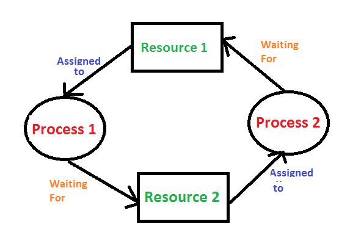
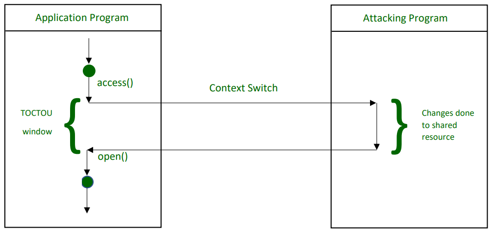

# 并发

并发(Concurrency)指的是应用程序可以同时处理多个任务或线程，这个用于利用当前的多核CPU来大幅提高程序的性能。

## 关键概念

### 线程

线程(Thread)是多任务的基本单元，通过创建多个线程，我们可以实现并发，线程就是一段运行代码的程序，我们可以创建线程，并指定它需要运行的函数。

### 死锁

死锁(Deadlock)指的是两个或多个线程被阻塞并永远等待对方的情况，为了避免死锁，需要小心地使用同步(synchronization)。

在操作系统的应用使用共享资源通过如下的步骤

1. 请求资源
2. 使用资源
3. 释放资源

死锁发生在一系列的线程或进程阻塞，它们都拥有一个资源但都等待获取另一个线程所拥有的资源。

### 竞态

竞态(Race Conditions)发生在多个线程同时读写相同的变量，潜在地破坏程序的运行，带来未定义行为，引发安全问题。

为了避免竞态，可以使用原子操作(atomic instruction)或者使用线程同步的办法，比如锁。

### 饥饿

饥饿(Starvation)发生在当一个线程无法获取到共享资源的使用权时，实际上缓慢运行甚至停止运行的情况。通过合适的同步方法，可以避免饥饿的发生。

### 同步

同步(Synchronization)就是使得几个线程必须先达到我们设定的条件后，才能继续运行的方法，用来避免竞态与饥饿，也可能会带来死锁与饥饿。

### 临界区

临界区(critical sections)是一个程序段，这个程序段不能同时被超过一个线程或进程进入，如果已经有一个线程进入了临界区，其它的尝试进入这个临界区的线程或进程只能暂时挂起(suspended)直到这个线程离开临界区。降低了程序的并发性能，提高了程序的安全性。

### 互斥量与锁

互斥量(Mutex)与锁(Locks)是用于保护共享资源的同步方法，保证同一时刻只有一个线程可以访问临界区，`C++`使用定义在头文件`<mutex>`的`std::mutex`实现互斥量。

### 状态变量

状态变量(Condition Variables)是同步方法，作为标志通知线程什么时候共享资源可以使用。相较于互斥量与锁，它提供了一个无需等待(wait-free)的同步方法.`C++`使用定义在头文件`<condition_variable>`的`condition_variable`对象实现状态变量。

### 未来与承诺

未来(Futures)与承诺(promise)用于异步任务中，只有当线程相互独立时才可以使用这种同步方法。

### 信号量

信号量(Semaphores)也是一个同步原语，用于记录有多少个线程正在访问共享资源，如果超过了指定的值，信号量会阻止接下来线程访问这个共享资源的请求直到别的线程释放这个共享资源。
