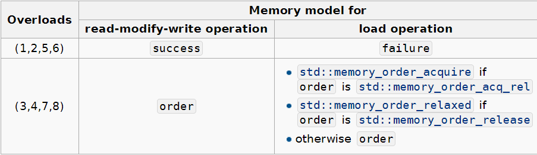

# atomic

参考文档

* [std::atomic](https://en.cppreference.com/w/cpp/atomic/atomic)

定义在`<atomic>`头文件中。

## 类原型

```CPP
template< class T >
struct atomic;
template< class U >
struct atomic<U*>;
template< class U >
struct atomic<std::shared_ptr<U>>;
template< class U >
struct atomic<std::weak_ptr<U>>;
```

## 描述

每个`std::atomic`的实例与全特化都定义了一个原子类型，如果一个线程写入原子对象，而另一个线程从中读取，则行为是明确定义的。

此外，对原子对象的访问可以建立线程间同步，并按照`std::memory_order`指定的顺序对非原子内存访问进行排序。

`std::atomic`既不可复制也不可移动.

在`gcc`和`clang`上，此处描述的某些功能需要链接到`-latomic`。

### 特化

### 主模板

对于`std::atomic<T>`来说。

`T`可以是任何可复制构造与可复制赋值的**平凡可复制**类型。注意任何包含用户定义的复制构造函数都不是平凡可复制的。

### 偏特化模板

对于`std::atomic<U*>`来说。

这个特化适用于所有的指针类型，除了为所有原子类型提供的操作之外，这些特化还支持适合指针类型的原子算术操作，例如`fetch_add`、`fetch_sub`。

对于`atomic<std::shared_ptr<U>>`与`atomic<std::weak_ptr<U>>`这是用于共享指针的原子操作，在`C++20`中定义。

### 整数类型的特化

当特化为整数类型时，`std::atomic`提供了额外的原子操作，适用于整数类型，例如`fetch_add`,`fetch_sub`,`fetch_and`,`fetch_or`,`fetch_xor`.

### 浮点类型的特化

当特化为浮点类型时，`std::atomic`提供适合浮点类型的附加原子操作，例如`fetch_add`和`fetch_sub`。

## 成员函数

### 构造与析构

* [atomic](https://en.cppreference.com/w/cpp/atomic/atomic/atomic)

* [operator=](https://en.cppreference.com/w/cpp/atomic/atomic/operator%3D)

  ```CPP
  T operator=( T desired ) noexcept;
  T operator=( T desired ) volatile noexcept;

  atomic& operator=( const atomic& ) = delete;
  atomic& operator=( const atomic& ) volatile = delete;
  ```

  原子地把`desired`赋值给当前值，和`store`函数一样。

  `std::atomic`不是复制可赋值的。

### 获取信息

* [is_lock_free](https://en.cppreference.com/w/cpp/atomic/atomic/is_lock_free)

  ```CPP
  bool is_lock_free() const noexcept;
  bool is_lock_free() const volatile noexcept;
  ```

  检测该类型的原子操作是否是无锁的。

  除了`std::atomic_flag`之外的所有原子类型都可能使用`mutex`或其他锁定操作来实现，而不是使用无锁原子`CPU`指令。原子类型有时也允许无锁，例如如果在给定的体系结构上只有对齐的内存访问是原子的，则相同类型的未对齐对象必须使用锁。

### 访问对象

* [store](https://en.cppreference.com/w/cpp/atomic/atomic/store)

  ```CPP
  void store( T desired, std::memory_order order =
                            std::memory_order_seq_cst ) noexcept;
  void store( T desired, std::memory_order order =
                            std::memory_order_seq_cst ) volatile noexcept;
  ```

  原子地替换当前值为`desired`,使用`order`指定内存顺序。

  如果`order`是`std::memory_order_consume`、`std::memory_order_acquire`和`std::memory_order_acq_rel`之一，则行为未定义。

* [load](https://en.cppreference.com/w/cpp/atomic/atomic/load)

  ```CPP
  T load( std::memory_order order
            = std::memory_order_seq_cst ) const noexcept;
  T load( std::memory_order order
              = std::memory_order_seq_cst ) const volatile noexcept;
  ```

  原子地加载并返回原子变量的当前值，使用`order`指定内存顺序。

  如果`order`是`std::memory_order_release`和`std::memory_order_acq_rel`之一，则行为未定义。

* [operator T](https://en.cppreference.com/w/cpp/atomic/atomic/operator_T)

  ```CPP
  operator T() const noexcept;

  operator T() const volatile noexcept;
  ```

  原子地加载并返回原子变量的当前值，与`load`相同。

* [exchange](https://en.cppreference.com/w/cpp/atomic/atomic/exchange)

  ```CPP
  T exchange( T desired, std::memory_order order =
                            std::memory_order_seq_cst ) noexcept;

  T exchange( T desired, std::memory_order order =
                            std::memory_order_seq_cst ) volatile noexcept;
  ```

  原子地使用`desired`交换当前值，并返回原值(读-修改-写操作)，使用`order`指定内存顺序。

* [compare_exchange_weak,compare_exchange_strong](https://en.cppreference.com/w/cpp/atomic/atomic/compare_exchange)

  ```CPP
  bool compare_exchange_weak( T& expected, T desired,
                              std::memory_order success,
                              std::memory_order failure ) noexcept;
  (1)
  bool compare_exchange_weak( T& expected, T desired,
                              std::memory_order success,
                              std::memory_order failure ) volatile noexcept;
  (2)
  bool compare_exchange_weak( T& expected, T desired,
                              std::memory_order order =
                                  std::memory_order_seq_cst ) noexcept;
  (3)
  bool compare_exchange_weak( T& expected, T desired,
                              std::memory_order order =
                                  std::memory_order_seq_cst ) volatile noexcept;
  (4)
  bool compare_exchange_strong( T& expected, T desired,
                                std::memory_order success,
                                std::memory_order failure ) noexcept;
  (5)
  bool compare_exchange_strong( T& expected, T desired,
                                std::memory_order success,
                                std::memory_order failure ) volatile noexcept;
  (6)
  bool compare_exchange_strong( T& expected, T desired,
                                std::memory_order order =
                                    std::memory_order_seq_cst ) noexcept;
  (7)
  bool compare_exchange_strong
      ( T& expected, T desired,
        std::memory_order order = std::memory_order_seq_cst ) volatile noexcept;
  ```

  原子地比较`*this`的当前值与`expected`,如果它们在比特意义上相等，则使用`desired`替换原值(读-修改-写操作)。否则，加载存储在`*this`的值到`expected`(`load`操作).

  

  如果`failure`是`std::memory_order_release`或`std::memory_order_acq_rel`,行为未定义。

  如果内部值被成功交换了，则返回`true`,否则，返回`false`.

  比较和复制是**按位进行**的(类似于`std::memcmp`和`std::memcpy`)，不使用构造函数、赋值运算符或比较运算符.

  `compare_exchange_weak`允许虚假失败，也就是，它会如同`*this != expected`一般行动，哪怕它们相等。当`compare_exchange_weak`处于循环中时，`compare_exchange_weak`将在某些平台上产生更好的性能。

  与之相对`compare_exchange_strong`不会产生虚假失败，也就是不必在循环中使用。

## 只在特殊特化的`atomic`的成员函数

### 用于整型，浮点型，指针特化的成员函数

* [fetch_add](https://en.cppreference.com/w/cpp/atomic/atomic/fetch_add)

  用于整型，浮点型

  ```CPP
  T fetch_add( T arg, std::memory_order order =
                        std::memory_order_seq_cst ) noexcept;
  T fetch_add( T arg, std::memory_order order =
                          std::memory_order_seq_cst ) volatile noexcept;
  ```

  用于指针

  ```CPP
  T* fetch_add( std::ptrdiff_t arg,
                std::memory_order order =
                    std::memory_order_seq_cst ) noexcept;
  T* fetch_add( std::ptrdiff_t arg,
                std::memory_order order =
                    std::memory_order_seq_cst ) volatile noexcept;
  ```

  原子地替换内部值为当前值加上`arg`,同时返回原值.该操作是读-修改-写操作,使用`order`指定内存顺序。

  对于有符号整数类型，算术被定义为使用二进制补码表示。没有未定义的结果。

  对于指针，结果可能是未定义的地址，但该操作没有未定义的行为。 如果`T`不是完整的对象类型，则程序格式错误。

* [fetch_sub](https://en.cppreference.com/w/cpp/atomic/atomic/fetch_sub)

  用于整型，浮点型

  ```CPP
  T fetch_sub( T arg, std::memory_order order =
                          std::memory_order_seq_cst ) noexcept;
  T fetch_sub( T arg, std::memory_order order =
                          std::memory_order_seq_cst ) volatile noexcept;
  ```

  用于指针

  ```CPP
  T* fetch_sub( std::ptrdiff_t arg,
                std::memory_order order =
                    std::memory_order_seq_cst ) noexcept;
  T* fetch_sub( std::ptrdiff_t arg,
                std::memory_order order =
                    std::memory_order_seq_cst ) volatile noexcept;
  ```

  原子地替换内部值为当前值减去`arg`,同时返回原值.该操作是读-修改-写操作,使用`order`指定内存顺序。

* [operator+=,-=](https://en.cppreference.com/w/cpp/atomic/atomic/operator_arith2)

  用于整型，浮点型

  ```CPP
  T operator+=( T arg ) noexcept;
  T operator+=( T arg ) volatile noexcept;
  T operator-=( T arg ) noexcept;
  T operator-=( T arg ) volatile noexcept;
  ```

  用于指针

  ```CPP
  T* operator+=( std::ptrdiff_t arg ) noexcept;
  T* operator+=( std::ptrdiff_t arg ) volatile noexcept;
  T* operator-=( std::ptrdiff_t arg ) noexcept;
  T* operator-=( std::ptrdiff_t arg ) volatile noexcept;
  ```

  原子地替换内部值为当前值加上`arg`,同时返回新的值的副本.该操作是读-修改-写操作,使用`order`指定内存顺序。

  等价于`return fetch_add(arg) + arg`或`return fetch_sub(arg) - arg`.

  注意，这个通常的`operator+=`不同，它返回的是内部值的副本。

### 用于整型与指针特化的成员函数

* [operator++,++(int),--,--(int)](https://en.cppreference.com/w/cpp/atomic/atomic/operator_arith)

### 用于整型特化的成员函数

* [fetch_and](https://en.cppreference.com/w/cpp/atomic/atomic/fetch_and)

  ```CPP
  T fetch_and( T arg, std::memory_order order =
                          std::memory_order_seq_cst ) noexcept;
  T fetch_and( T arg, std::memory_order order =
                          std::memory_order_seq_cst ) volatile noexcept;
  ```

  原子地替换内部值为当前值与`arg`的按位与，同时返回原值，使用`order`指定内存顺序。

* [fetch_or](https://en.cppreference.com/w/cpp/atomic/atomic/fetch_or)

  ```CPP
  T fetch_or( T arg, std::memory_order order =
                       std::memory_order_seq_cst ) noexcept;
  T fetch_or( T arg, std::memory_order order =
                        std::memory_order_seq_cst ) volatile noexcept;
  ```

  原子地替换内部值为当前值与`arg`的按位或，同时返回原值，使用`order`指定内存顺序。

* [fetch_xor](https://en.cppreference.com/w/cpp/atomic/atomic/fetch_xor)

  ```CPP
  T fetch_xor( T arg, std::memory_order order =
                        std::memory_order_seq_cst ) noexcept;
  T fetch_xor( T arg, std::memory_order order =
                          std::memory_order_seq_cst ) volatile noexcept;
  ```

  原子地替换内部值为当前值与`arg`的按位异或，同时返回原值，使用`order`指定内存顺序。

* [operator&=,|=,^=](https://en.cppreference.com/w/cpp/atomic/atomic/operator_arith3)

  ```CPP
  T operator&=( T arg ) noexcept;
  T operator&=( T arg ) volatile noexcept;
  T operator|=( T arg ) noexcept;
  T operator|=( T arg ) volatile noexcept;
  T operator^=( T arg ) noexcept;
  T operator^=( T arg ) volatile noexcept;
  ```

  * `operator&=`等价于`return fetch_and(arg) & arg`
  * `operator|=`等价于`return fetch_or(arg) | arg`
  * `operator^=`等价于`return fetch_xor(arg) ^ arg`
