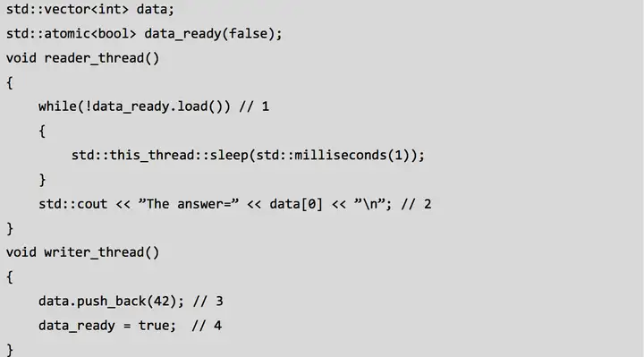

# memory_order

参考文档

* [std::memory_order](https://en.cppreference.com/w/cpp/atomic/memory_order)

定义在`<atomic>`头文件中。

## 枚举类原型

```CPP
typedef enum memory_order {
    memory_order_relaxed,
    memory_order_consume,
    memory_order_acquire,
    memory_order_release,
    memory_order_acq_rel,
    memory_order_seq_cst
} memory_order;
```

## 描述

`std::memory_order`指明了内存访问，包含通常的非`atomic`内存访问在一个`atomic`操作周围是如何排序的。在多核系统上没有任何限制的情况下，当多个线程同时读取和写入多个变量时，一个线程可以观察到值的变化顺序与另一线程写入它们的顺序不同。甚至，不同线程观察到的值变化顺序也不同。由于内存模型允许的编译器转换，即使在单处理器系统上也会出现一些类似的效果。

标准库中所有原子操作的默认行为提供顺序一致`memory_order_seq_cst`的排序.这个默认行为可能会影响性能，所以，原子操作还可以接受第二个参数，表示内存限制约束。

## 简短概述

### `memory_order_relaxed`

`Relaxed operation`,宽松的操作,对其他读取或写入没有同步或排序约束，仅保证此操作的原子性。

### `memory_order_consume`

使用此内存顺序的`load`操作对受影响的内存区域执行消费`consume`操作。当前线程中所有依赖于这个值的读写操作不会被重排到此加载之前。其他线程中对有数据依赖的变量进行`release`同一原子变量的写入，能为当前线程所见。在大多数平台上，这只影响到编译器优化

### `memory_order_acquire`

使用此内存顺序的`load`操作对受影响的内存区域执行获得`acquire`操作，当前线程中所有的读写操作不会被重排到它之前。在其它线程里`release`相同原子变量的写入会在当前线程可见。

### `memory_order_release`

使用此内存顺序的`store`操作执行释放`release`操作。当前线程的读与写操作不能重排到它之后，当前线程的所有写操作会在`acquire`了相同的原子变量的其它线程可见，对该原子变量的带依赖写入变得对于其他`consume`同一原子对象的线程可见.

### `memory_order_acq_rel`

使用此内存顺序的读修改写操作既是`acquire`操作又是`release`操作。当前线程的读或写内存不能被重排到此存储之前或之后。所有`release`同一原子变量的线程的写入可见于修改之前，而且修改可见于其他`acquire`同一原子变量的线程。

### `memory_order_seq_cst`

使用此内存顺序的`load`操作执行`acquire`操作，`store`操作执行`release`操作，而读修改写操作进行`acquire`操作和`release`操作,再加上存在一个单独全序，其中所有线程以同一顺序观测到所有修改.

## 解释

参考文档

* [如何理解 C++11 的六种 memory order？](https://www.zhihu.com/question/24301047/answer/83422523)

### 宽松顺序`Relaxed ordering`

标记为`memory_order_relaxed`的原子操作不是同步操作,它不会为并发的内存访问行为添加顺序约束。它只保证原子性和修改顺序的一致性。

比如，以下例子，其中`x`和`y`初始化为`0`.

```CPP
// Thread 1:
r1 = y.load(std::memory_order_relaxed); // A
x.store(r1, std::memory_order_relaxed); // B
// Thread 2:
r2 = x.load(std::memory_order_relaxed); // C 
y.store(42, std::memory_order_relaxed); // D
```

可能会产生`r1 == r2 == 42`,尽管`A`先于`B`，`C`先于`D`,却无法避免在`y`的修改顺序中`D`会出现于`A`之前，且在`x`的修改顺序中`B`会出现于`C`之前。`D`的对`y`的副作用可能可见于线程`1`中`A`的加载操作，而 `B` 对`x`的副作用可能可见于线程`2`中`C`的加载操作.尤其是，这可能在线程`2`中`D`于`C`之前完成的情况下发生，无论因为编译器重排还是发生于运行时。

宽松内存定序的典型的应用是计数器自增，例如`std::shared_ptr`的引用计数器，因为这只要求原子性，但不要求定序或同步（注意`shared_ptr`计数器自减要求与析构函数进行获得-释放同步）.

### 获得-释放顺序`Release-Acquire ordering`

若线程`A`中的一个原子`store`被标以`memory_order_release`，而线程`B`中同一变量的原子`load`被标以`memory_order_acquire`,且线程`B`中的加载读到了线程`A`中的存储所写入的值，则线程`A`中的存储同步于线程`B`中的加载。

在线程`A`中所有先于原子存储发生的内存写入(包括非原子及宽松原子的)，在线程`B`中成为可见。也就是说，当原子`load`函数返回后，`B`线程保证可以看到线程`A`在`store`前写入内存的所有内容。当然，仅当`B`实际上返回了`A`所存储的值或其释放队列后的值时，这个保证才成立。

同步仅建立在`Release`和`Acquire`同一原子变量的线程之间。其他线程可能看到与被同步线程的一者或两者相异的内存访问顺序。

在强顺序系统（x86、SPARC TSO、IBM 大型机）上，释放-获得定序对于多数指令是自动进行的,所以只会影响编译器的优化。在弱顺序系统（ARM、Itanium、Power PC）上，则必须使用特别的`CPU`加载或内存屏障指令。

互斥锁，比如`std::mutex`,就是释放-获得同步的例子，线程`A`释放锁而线程`B`获得它时，发生于线程`A`上下文的临界区（释放之前）中的所有事件，必须对于执行同一临界区的线程`B`(获得之后)可见。

```CPP
#include <atomic>
#include <cassert>
#include <thread>
#include <vector>
 
std::vector<int> data;
std::atomic<int> flag = {0};
 
void thread_1()
{
    data.push_back(42);
    flag.store(1, std::memory_order_release);
}
 
void thread_2()
{
    int expected=1;
    // memory_order_relaxed 是可以的，因为这是一个 RMW 操作
    // 而 RMW（以任意定序）跟在释放之后将组成释放序列
    while (!flag.compare_exchange_strong(expected, 2, std::memory_order_relaxed))
    {
        expected = 1;
    }
}
 
void thread_3()
{
    while (flag.load(std::memory_order_acquire) < 2)
        ;
    // 如果我们从 atomic flag 中读到 2，将看到 vector 中储存 42
    assert(data.at(0) == 42); //决不出错
}
 
int main()
{
    std::thread a(thread_1);
    std::thread b(thread_2);
    std::thread c(thread_3);
    a.join(); b.join(); c.join();
}
```

线程`2`不需要观测其它的副作用，且对于同一个`atomic`变量，任何定序都是保持修改顺序的。

### 释放-消费定序`Release-Consume ordering`

释放消费定序的规范正在修订中，而且暂时不鼓励使用`memory_order_consume`.

### 序列一致定序`Sequentially-consistent ordering`

被标为`memory_order_seq_cst`的原子操作不仅以与释放-获得定序相同的方式进行内存定序,还对所有带此标签的内存操作建立了一个**单独全序**。

在多生产者-多消费者的情形中，若所有消费者都必须以**相同顺序**观察到所有生产者的动作出现，则可能必须进行序列定序。全序列定序在所有多核系统上都要求完全的内存屏障`CPU`指令。这可能成为性能瓶颈，因为它强制受影响的内存访问传播到每个核心。

此示例演示序列一致定序为必要的场合。任何其他定序都可能触发`assert`，因为可能令线程`c`和`d`观测到原子对象`x`和`y`以相反顺序更改。

```CPP
#include <atomic>
#include <cassert>
#include <thread>
 
std::atomic<bool> x = {false};
std::atomic<bool> y = {false};
std::atomic<int> z = {0};
 
void write_x()
{
    x.store(true, std::memory_order_seq_cst);
}
 
void write_y()
{
    y.store(true, std::memory_order_seq_cst);
}
 
void read_x_then_y()
{
    while (!x.load(std::memory_order_seq_cst))
        ;
    if (y.load(std::memory_order_seq_cst))
        ++z;
}
 
void read_y_then_x()
{
    while (!y.load(std::memory_order_seq_cst))
        ;
    if (x.load(std::memory_order_seq_cst))
        ++z;
}
 
int main()
{
    std::thread a(write_x);
    std::thread b(write_y);
    std::thread c(read_x_then_y);
    std::thread d(read_y_then_x);
    a.join(); b.join(); c.join(); d.join();
    assert(z.load() != 0);  //决不发生
}
```

如果不使用`memory_order_seq_cst`，对于线程`c`与线程`d`来说，观测到`x`与`y`改变的顺序可能不同。

这个情况是由于每个CPU都有一个单独的缓存所造成的，或者是多个读可以并行，从而，在缓存未更新的情况下读取到错误的值。

|   | cache_x | cache_y | memory_x | memory_y |
|:-:|:-------:|:-------:|:--------:|:--------:|
| a |    1    |    0    |     1    |     1    |
| b |    0    |    1    |     1    |     1    |
| c |    1    |    0    |     1    |     1    |
| d |    0    |    1    |     1    |     1    |

如果使用`memory_order_seq_cst`，就会保证每次的`load`

## Synchronized-with 与 happens-before 关系

考虑下述程序：



注意到,非原子性的读(2)和写(3)若在没有强制顺序的情况下访问同一变量,将导致未定义行为。原子变量`data_ready`通过内存模型关系中的`happens-before`和`synchronized-with`, 为它们提供了必要的顺序:

1. 写`data(3)`在写`data_ready(4)`前发生(happens-before);
2. 写`data_ready(4)`在读出`data_ready`的值为真`(1)`前发生(happens-before);
3. `data_ready`的值为真`(1)`在读`data(2)`前发生(happens-before).

### Synchronized-with 关系

该关系描述的是，对于`suitably tagged`（如默认的`memory_order_seq_cst`）在变量`x`上的写操作`W(x)` `synchronized-with`在该变量上的读操作`R(x)`.

如果线程`A`写了变量`x`, 线程`B`读了变量`x`, 那么我们就说线程`A`, `B`间存在`synchronized-with`关系。

### Happens-before 关系

`Happens-before`指明了哪些指令将看到哪些指令的结果。对于单线程而言,这很明了:如果一个操作`A`排列在另一个操作`B`之前,那 么这个操作`A happens-before B`.

对于多线程而言,如果一个线程中的操作`A inter-thread happens-before`另一个线程中的操作`B`, 那么`A happens-before B`.

#### Inter-thread happens-before 关系

`Inter-thread happens-before`概念相对简单,并依赖于`synchronized-with`关系:如果一个线程中的操作`A synchronized-with`另一个线程中的操作`B`, 那么`A inter-thread happens-before B`.`Inter-thread happens-before`关系具有传递性。

`Inter-thread happens-before`可以与`sequenced-before`关系结合:如果`A sequenced-before B`, `B inter-thread happens-before C`, 那么`A inter-thread happens-before C`. 这揭示了如果你在一个线程中对数据进行了一系列操作，那么你只需要一个`synchronized-with`关系,即可使得数据对于另一个执行操作`C`的线程可
见。
