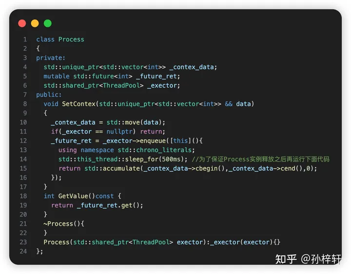
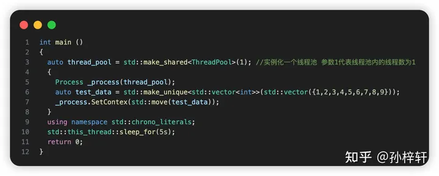
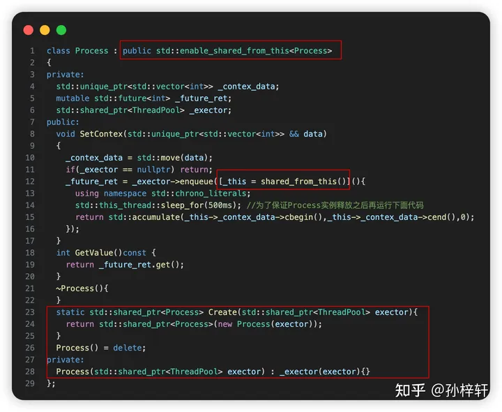

# enable_shared_from_this

参考文档

* CPP Reference[enable_shared_from_this](https://en.cppreference.com/w/cpp/memory/enable_shared_from_this)
* [灵魂拷问std::enable_shared_from_this，揭秘实现原理](https://blog.csdn.net/guangcheng0312q/article/details/134522100)
* [STL enable_shared_from_this深入了解](https://zhuanlan.zhihu.com/p/638029004)

定义在头文件`<memory>`中，用于解决需要获取动态内存对象自身的`shared_ptr`情况。

## 类原型

```CPP
template< class T > class enable_shared_from_this;
```

## 描述

`std::enable_shared_from_this`允许当前由`std::shared_ptr`的`pt`管理的对象`t`可以安全地产生与`t`共享所有权的`shared_ptr`，只需要在程序上访问对象`t`而不是需要访问`pt`来获取`shared_ptr`.

公有继承这个类`enable_shared_from_this<T>`的类`T`会继承成员函数`shared_from_this`.这个成员函数可以返回指向这个类的共享指针。

一个通常的实现是保留一个指向`*this`的`weak`引用。

`shared_ptr`的构造函数会检测到明确且可访问的`enable_shared_from_this`基类，这也是为什么需要使用公有继承的原因。如果发现对象还没有被一个`shared_ptr`管理，就会把`weak-this`赋值为引用这个`shared_ptr`.对已经由另一`std::shared_ptr`所管理的对象构造一个`std::shared_ptr`不会考虑`weak-this`，从而将导致未定义行为。

只容许在先前已由`std::shared_ptr<T>`管理的对象上调用`shared_from_this`。否则抛出`std::bad_weak_ptr`异常.

`enable_shared_from_this`给形如`std::shared_ptr<T>(this)`提供了安全的解决方案，以防止`this`多次构建`shared_ptr`.

## 成员对象

* [weak-this](https://en.cppreference.com/w/cpp/memory/enable_shared_from_this)

  一个内部实现使用的`weak_ptr`,指向第一个`*this`的`shared_ptr`的控制块。

## 成员函数

### 构建与析构

* [enable_shared_from_this](https://en.cppreference.com/w/cpp/memory/enable_shared_from_this/enable_shared_from_this)

  ```CPP
  constexpr enable_shared_from_this() noexcept;
  enable_shared_from_this( const enable_shared_from_this& other ) noexcept;
  ```

  构建一个新的`enable_shared_from_this`对象，`weak-this`使用值初始化。

  没有移动构造函数，从派生自`enable_shared_from_this`的对象移动不会传输其共享标识。

* [~enable_shared_from_this](https://en.cppreference.com/w/cpp/memory/enable_shared_from_this/%7Eenable_shared_from_this)

  ```CPP
  ~enable_shared_from_this();
  ```

* [operator=](https://en.cppreference.com/w/cpp/memory/enable_shared_from_this/operator%3D)

  ```CPP
  enable_shared_from_this& operator=( const enable_shared_from_this &rhs ) noexcept;
  ```

  什么都不做，并返回`*this`.

### 获取共享指针

* [shared_from_this](https://en.cppreference.com/w/cpp/memory/enable_shared_from_this/shared_from_this)

  ```CPP
  std::shared_ptr<T> shared_from_this();
  std::shared_ptr<T const> shared_from_this() const;
  ```

  返回`shared_ptr`，与现有的`shared_ptr`共享`*this`的所有权.

  等效于调用`std::shared_ptr<T>(weak_this)`

* [weak_from_this](https://en.cppreference.com/w/cpp/memory/enable_shared_from_this/weak_from_this)

  ```CPP
  std::weak_ptr<T> weak_from_this() noexcept;
  std::weak_ptr<T const> weak_from_this() const noexcept;
  ```

  返回`std::weak_ptr<T>`,跟随`*this`的所有权。

## 使用情况

在类的外部，我们可以通过对已有的`shared_ptr`进行复制，来共享所有权。在类的内部如果想安全的实现所有权的共享，并且和外部的`shared_ptr`来共同的管理对象，这个时候就需要使用`enable_shared_from_this`模版类了.



注意这个类的`Lambda`表达式捕获了一个`this`的裸指针，这个指针很有可能在使用时超出指向对象的生命周期。



在异步使用这个类时，由于已经超出了生命周期，会产生严重的程序错误。

通过使用`enable_shared_from_this`，可以在类内非侵入式地获取指向当前对象的共享指针。



## 例子

```CPP
#include <iostream>
#include <memory>
 
class Good : public std::enable_shared_from_this<Good>
{
public:
    std::shared_ptr<Good> getptr()
    {
        return shared_from_this();
    }
};
 
class Best : public std::enable_shared_from_this<Best>
{
    struct Private{ explicit Private() = default; };
 
public:
    // Constructor is only usable by this class
    Best(Private) {}
 
    // Everyone else has to use this factory function
    // Hence all Best objects will be contained in shared_ptr
    static std::shared_ptr<Best> create()
    {
        return std::make_shared<Best>(Private());
    }
 
    std::shared_ptr<Best> getptr()
    {
        return shared_from_this();
    }
};
 
 
struct Bad
{
    std::shared_ptr<Bad> getptr()
    {
        return std::shared_ptr<Bad>(this);
    }
    ~Bad() { std::cout << "Bad::~Bad() called\n"; }
};
 
void testGood()
{
    // Good: the two shared_ptr's share the same object
    std::shared_ptr<Good> good0 = std::make_shared<Good>();
    std::shared_ptr<Good> good1 = good0->getptr();
    std::cout << "good1.use_count() = " << good1.use_count() << '\n';
}
 
void misuseGood()
{
    // Bad: shared_from_this is called without having std::shared_ptr owning the caller
    try
    {
        Good not_so_good;
        std::shared_ptr<Good> gp1 = not_so_good.getptr();
    }
    catch (std::bad_weak_ptr& e)
    {
        // undefined behavior (until C++17) and std::bad_weak_ptr thrown (since C++17)
        std::cout << e.what() << '\n';
    }
}
 
void testBest()
{
    // Best: Same but can't stack-allocate it:
    std::shared_ptr<Best> best0 = Best::create();
    std::shared_ptr<Best> best1 = best0->getptr();
    std::cout << "best1.use_count() = " << best1.use_count() << '\n';
 
    // Best stackBest; // <- Will not compile because Best::Best() is private.
}
 
void testBad()
{
    // Bad, each shared_ptr thinks it's the only owner of the object
    std::shared_ptr<Bad> bad0 = std::make_shared<Bad>();
    std::shared_ptr<Bad> bad1 = bad0->getptr();
    std::cout << "bad1.use_count() = " << bad1.use_count() << '\n';
} // UB: double-delete of Bad
 
int main()
{
    testGood();
    misuseGood();
 
    testBest();
 
    testBad();
}
```

`Good`存在的问题就是，如果不是动态分配的对象，调用`getptr`会抛出异常。

`Bad`的问题就是同一个裸指针初始化了多个共享指针。
