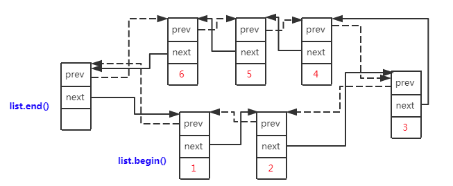

# list

参考文档

* CPP reference [std::list](https://en.cppreference.com/w/cpp/container/list)

定义在头文件`<list>`.

## 类原型

```CPP
template<
    class T,
    class Allocator = std::allocator<T>
> class list;
namespace pmr {
    template< class T >
    using list = std::list<T, std::pmr::polymorphic_allocator<T>>;
}
```

## 描述

`std::list`是一种可以在常数`O(1)`复杂度在任意位置进行插入和删除的容器。但是不支持快速的随机访问。

`list`底层实现通常为双向环状列表，提供双向迭代功能，和只提供前向迭代功能的`forward_list`相比更灵活，但空间利用效率更低。



## 迭代器类型

`vector`迭代器类型是`LegacyBidirectionalIterator`.

## 会使得迭代器失效的操作

任何读取操作都不会失效迭代器。

添加，移除，移动元素都不会失效迭代器，迭代器只有在它指向的对应的元素被删除后才失效。

## 常用成员函数

### 构建容器

* [list](https://en.cppreference.com/w/cpp/container/list/list)

* [assign](https://en.cppreference.com/w/cpp/container/list/assign)

  ```CPP
  void assign( size_type count, const T& value );
  template< class InputIt >
  void assign( InputIt first, InputIt last );
  void assign( std::initializer_list<T> ilist );
  ```

  替换容器的内容。

### 成员访问

* [front](https://en.cppreference.com/w/cpp/container/list/front)

  ```CPP
  reference front();
  const_reference front() const;
  ```

  返回`list`第一个元素的引用。

  如果容器为空，操作是未定义的。

* [back](https://en.cppreference.com/w/cpp/container/list/back)

  ```CPP
  reference back();
  const_reference back() const;
  ```

  返回`list`最后一个元素的引用。

  如果容器为空，操作是未定义的。

### 访问容量

* [empty](https://en.cppreference.com/w/cpp/container/list/empty)

  ```CPP
  bool empty() const noexcept;
  ```

  检查是否`list`为空。

* [size](https://en.cppreference.com/w/cpp/container/list/size)

  ```CPP
  size_type size() const noexcept;
  ```

  返回`list`所含元素的数量。

### 修改元素

* [clear](https://en.cppreference.com/w/cpp/container/list/clear)

  ```CPP
  void clear() noexcept;
  ```

  清除所有的元素。

  失效所有的迭代器，但是尾后迭代器不失效。

* [insert](https://en.cppreference.com/w/cpp/container/list/insert)

  ```CPP
  iterator insert( const_iterator pos, const T& value );
  iterator insert( const_iterator pos, T&& value );
  iterator insert( const_iterator pos, size_type count, const T& value );
  template< class InputIt >
  iterator insert( const_iterator pos, InputIt first, InputIt last );
  iterator insert( const_iterator pos, std::initializer_list<T> ilist );
  ```

  在`pos`前插入元素。

  不会失效所有的迭代器。

* [emplace](https://en.cppreference.com/w/cpp/container/list/emplace)

  ```CPP
  template< class... Args >
  iterator emplace( const_iterator pos, Args&&... args );
  ```

  在`pos`前插入元素，直接调用元素的构造函数进行构造，`args`就是传递给元素构造函数的参数。

* [erase](https://en.cppreference.com/w/cpp/container/list/erase)

  ```CPP
  iterator erase( const_iterator pos );
  iterator erase( const_iterator first, const_iterator last );
  ```

  擦除迭代器指向的元素。

  只会失效指向被删除元素的迭代器。

* [push_back](https://en.cppreference.com/w/cpp/container/list)

  ```CPP
  void push_back( const T& value );
  void push_back( T&& value );
  ```

  将`value`添加到`list`的后面。

  不会失效任何的迭代器。

* [emplace_back](https://en.cppreference.com/w/cpp/container/list/emplace_back)

  ```CPP
  template< class... Args >
  reference emplace_back( Args&&... args );
  ```

  在`list`后面构建元素并添加。

  返回构建元素的引用。

  不会失效任何的迭代器。

* [pop_back](https://en.cppreference.com/w/cpp/container/list/pop_back)

  ```CPP
  void pop_back();
  ```

  移除最后一个元素。

  移除一个空容器的元素是未定义行为。

  只会失效指向被删除元素的迭代器。

* [push_front](https://en.cppreference.com/w/cpp/container/list/push_front)

  ```CPP
  void push_front( const T& value );
  void push_front( T&& value );
  ```

  添加`value`到`list`前面。

* [emplace_front](https://en.cppreference.com/w/cpp/container/list/emplace_front)

  ```CPP
  template< class... Args >
  reference emplace_front( Args&&... args );
  ```

  构造一个元素并添加到`list`前面。

* [pop_front](https://en.cppreference.com/w/cpp/container/list/pop_front)

  ```CPP
  void pop_front();
  ```

  移除第一个元素。

  只会失效指向被删除元素的迭代器。

* [resize](https://en.cppreference.com/w/cpp/container/list/resize)

  ```CPP
  void resize( size_type count );
  void resize( size_type count, const value_type& value );
  ```

  修改`list`内的元素数目为`count`.

### 其他操作

* [merge](https://en.cppreference.com/w/cpp/container/list/merge)

  ```CPP
  void merge( list& other );
  void merge( list&& other );
  template< class Compare >
  void merge( list& other, Compare comp );
  template< class Compare >
  void merge( list&& other, Compare comp );
  ```

  将两个已经排序的`list`合并在一起。

  如果`other`和`*this`相等，函数不会做任何事。

  两个`list`必须已排序，排序方法是`operator<`或者是`comp`.不会复制任何元素，只是修改`list`中元素的指向。函数返回后，`other`变为空。

  这个操作是稳定的，不会改变相等元素的顺序，`*this`与`other`相等的元素，总是`*this`的元素在前。

  不会失效任何迭代器，但是操作完成后，所有的迭代器指向的元素已经转移到了`*this`内。

* [splice](https://en.cppreference.com/w/cpp/container/list/splice)

  ```CPP
  void splice( const_iterator pos, list& other );
  void splice( const_iterator pos, list&& other );
  void splice( const_iterator pos, list& other, const_iterator it );
  ```