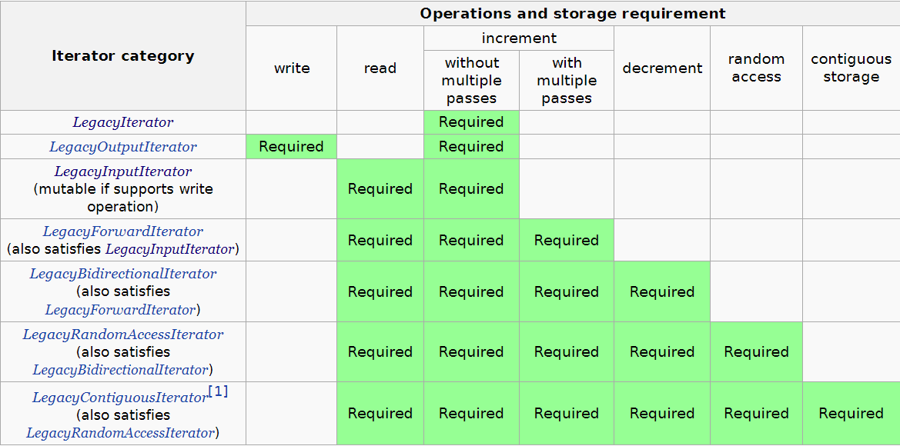

# 迭代器(Iterator)

迭代器是指针的泛化，迭代器允许对不同的数据结构使用一个通用的格式，大幅提高了函数的适用范围。

参考文档

* [Iterator library](https://en.cppreference.com/w/cpp/iterator#Dereferceability_and_validity)

## 迭代器类别

总共有六种类型的迭代器：传统输入迭代器(`LegacyInputIterator`)，传统输出迭代器(`LegacyOutputIterator`)，传统前向迭代器(`LegacyForwardIterator`)，传统双向迭代器(`LegacyBidirectionalIterator`)，传统随机访问迭代器(`LegacyRandomAccessIterator`)，传统连续迭代器(`LegacyContiguousIterator`)。

迭代器的类别是通过迭代器能够支持的操作定义的。这个定义也意味着只要符合迭代器能够支持的操作的任何类型**都可以**作为迭代器使用，比如指针就是传统随机访问迭代器。

迭代器的类型可以按照他们支持的操作来排序（除了传统输出迭代器），排在后面的迭代器支持排在前面的迭代器的所有操作。如果一个迭代器既满足某个迭代器的操作，又满足输出迭代器的操作，那么这个迭代器就叫做可变(`mutable`)迭代器。可变迭代器及支持输出也支持输入。非可变迭代器也叫做常迭代器(`constant iterators`).



满足以上条件不一定是对应的迭代器，迭代器还需要一些别的需求，但是都比较显然。

## 概念

### 类型与可写性(types and writability)

一个输入迭代器`i`支持操作`*i`,从而产生某种对象类型`T`的值，`T`就叫做迭代器的值类型。

一个输出迭代器`i`有一系列的类型可以写入给这个迭代器。也就是对于对象类型`T`,表达式`*i=o`是合法的，其中`o`的类型是`T`.

对于定义了相等性的迭代器，有一个对应的整型类型叫做迭代器的差分类型。

### 可解引用性与有效性(Dereferenceability and validity)

对于任何类型的迭代器，有一个迭代器的值指向特定容器最后一个元素的后面位置，这个值就叫做尾后(`past-the-end`)值。

定义了表达式`*i`的迭代器值叫做可解引用性，标准库从来不假设尾后值是可解引用的。

迭代器也可以拥有奇异值，也就是不与容器序列相关的值。绝大部分的包含奇异值的表达式都是未定义的，除了

* 将非奇异值赋值给含有奇异值的迭代器
* 销毁一个含有奇异值的迭代器
* 对于满足默认构造性的迭代器，使用一个值初始化的迭代器作为复制和移动的源。

以上的情况下，奇异值都会被覆写掉。可解引用的值都是非奇异的。但是不可解引用的值不意味着就是奇异值，比如尾后值。

无效迭代器指的就是可能为奇异值的迭代器。

### 迭代器失效(iterator invalidation)

对于一些容器的操作，会使得一些原先包含非奇异值的迭代器变为奇异值的迭代器，使用这种包含奇异值的迭代器会带来**严重的运行时错误**。

### 范围(ranges)

大部分的标准库的算法都使用范围。

对于迭代器`j`，如果它可以通过`i`的一系列有限的操作`++i`使得`i==j`，那么就叫做`j`是从`i`出发可达的。

范围就是一对迭代器组，表示开始与结束的位置，`[i,i)`是空的范围。`[i,j)`表示从`i`指向的元素开始到`j`指向的前一个元素结束，不包括`j`.

范围`[i,j)`是有效的，当且仅当`j`是从`i`出发可达的。

### 迭代器适配器(Iterator adaptors)

迭代器适配器是接受特定的迭代器，生成新的迭代器，可以实现一些特定的功能。

定义在头文件`<iterator>`中

#### 反向迭代器(reverse_iterator)

```CPP
template< class Iter >
class reverse_iterator;
```

反向迭代器反转给定的迭代器，迭代器必须满足传统双向迭代器的要求。换句话说，反向迭代器从容器的尾部到头部。

对于从迭代器`i`中生成的反向迭代器`r`两者满足关系，`&*r == &*(i-1)`,也就是说，如果给的迭代器`i`是尾后迭代器，那么`r`就是指向尾后迭代器的前一项。