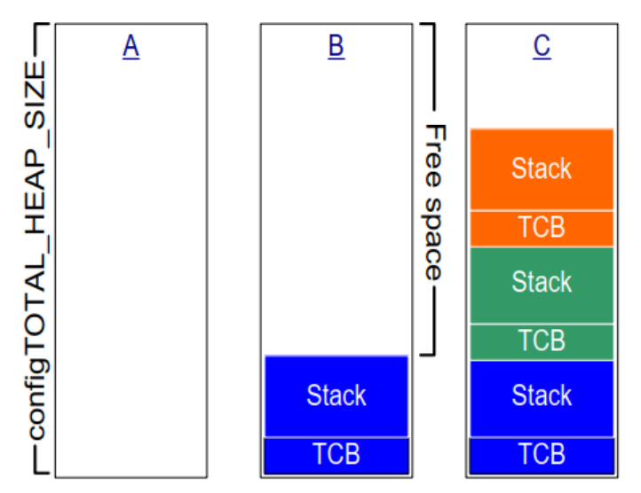
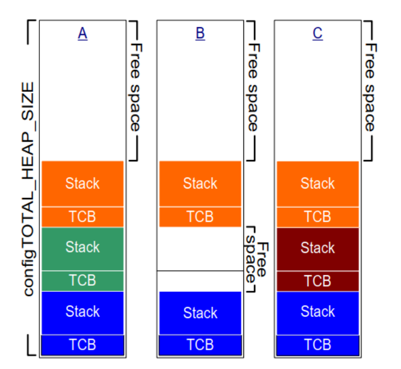
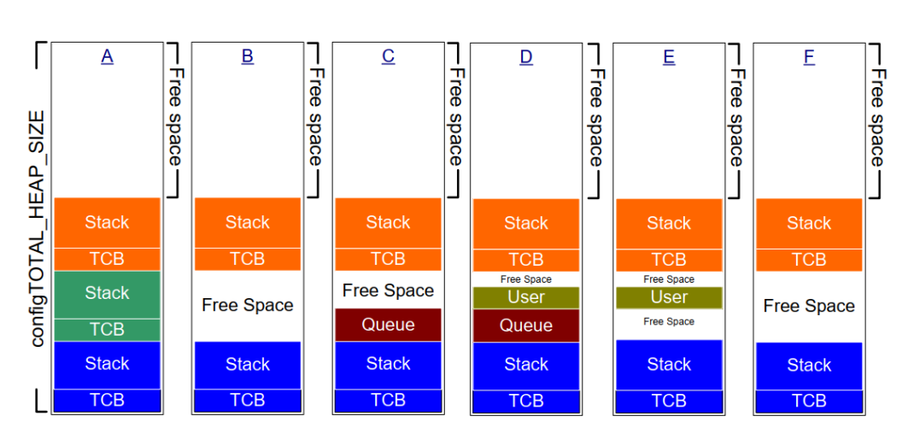

# heap

本文档介绍FreeRTOS中不同的内存管理方案。

## heap_1.c

只支持`pvPortMalloc()`,没有实现`vPortFree`。

* 代码量最少，占用 Flash 最小。

* 执行时间是确定性的（Deterministic），非常快。

* 绝对没有内存碎片。



## heap_2.c

`heap_2`是 heap_1 的升级版，支持`vPortFree`。它使用最佳匹配 (Best Fit) 算法来寻找空闲块。

但是没有合并相邻的空闲块，所以会产生内存碎片。



## heap_3.c

`heap_3`直接使用标准库的`malloc()`和`free()`函数来分配和释放内存。为`malloc()`和`free()`提供了线程安全的封装。

通过在函数中添加`vTaskSuspendAll`,`xTaskResumeAll`防止任务切换.

堆大小取决于链接器设置的堆大小。configTOTAL_HEAP_SIZE宏不起作用。

* 不确定性：执行时间取决于底层的`malloc()`和`free()`实现。

## heap_4.c

`heap_4`结合了`heap_2`和`heap_3`的优点。它支持`vPortFree`，并且通过合并相邻的空闲块来减少内存碎片。

维护了一个空闲块链表，使用首次适配 (First Fit) 算法来寻找空闲块。

当释放内存时，会检查相邻的块是否也是空闲的，如果是，则将它们合并成一个更大的块。



## heap_5.c

算法核心和 heap_4 一模一样（支持合并防碎片），但它支持不连续的内存区域。

heap_5 允许你把这些分散的物理内存“缝合”在一起，伪装成一个巨大的堆给`FreeRTOS`使用。

你需要定义一个`HeapRegion_t`数组，描述每个内存区域的起始地址和大小，然后调用`vPortDefineHeapRegions()`函数来注册这些区域。

```CPP
static HeapRegion_t xHeapRegions[] =
{
    { ( uint8_t * ) 0x18020000, 0x00010000 }, // 64KB
    { ( uint8_t * ) 0x2007C000, 0x00004000 }, // 16KB
    { ( uint8_t * ) 0x20080000, 0x00008000 }, // 32KB
    { NULL, 0 } // 终止标志
};
void main( void )
{
    // 注册堆区域
    vPortDefineHeapRegions( xHeapRegions );

    // 其他初始化代码...
}
```
