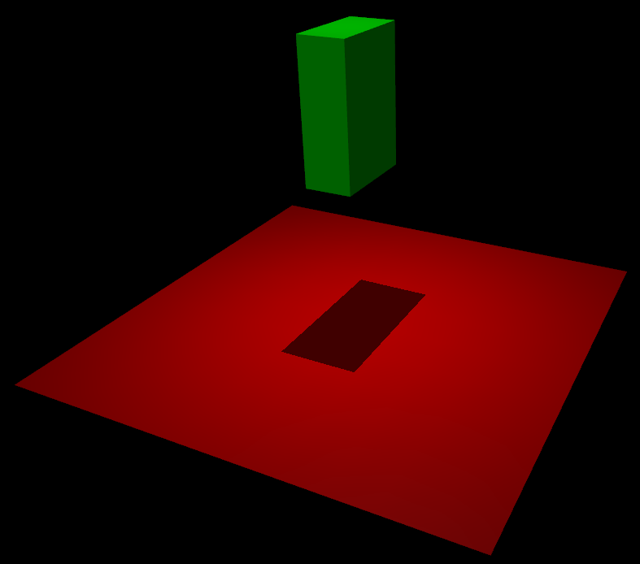

# mujoco

参考文档

* [官方参考文档](https://mujoco.readthedocs.io/en/stable/overview.html)
* [官方github库](https://github.com/google-deepmind/mujoco)

`mujoco`是强化学习中常用的仿真器，通常用于`sim-to-sim`.`MuJoCo`是一个`C/C++`库，带有`C API`，面向研究人员和开发人员。模型使用自定义的`MJCF`的`xml`语言,也可以使用`urdf`文件。

## 关键特性

* 广义坐标与现代接触动力学相结合
* 软性、凸性和解析可逆的接触动力学
* 肌腱几何结构
* 通用驱动模型
* 可重构计算管道
* 模型编译
* 模型与数据的分离
* 交互式模拟和可视化
* 功能强大且直观的建模语言
* 自动生成复合柔性对象

## 模型实例

模型`models`使用语法为`MJCF`或者是`URDF`的`xml`.之后`mujoco`可以使用这个文件创造多个结构，如下

|  |顶层| 地层 | 
|-------|-------|-------| 
| **文件** | MJCF/URDF (XML) | MJB (binary) |
| **内存** | mjSpec (C struct) | mjModel (C struct) |

所有的运行时计算使用`mjModel`进行，但是它过于复杂，由`xml`文件自动生成.

C语言结构体风格的`mjSpec`与`xml`文件一一对应.`xml`加载器将`xml`翻译为对应的`mjSpec`并最终编译为`mjModel`.

* (文本编辑器) → MJCF/URDF文件→ (MuJoCo parser → mjSpec → compiler) → mjModel

* (用户代码) → mjSpec → (MuJoCo compiler) → mjModel

* MJB文件 → (model loader) → mjModel

### 例子

```xml
<mujoco>
  <worldbody>
    <light diffuse=".5 .5 .5" pos="0 0 3" dir="0 0 -1"/>
    <geom type="plane" size="1 1 0.1" rgba=".9 0 0 1"/>
    <body pos="0 0 1">
      <joint type="free"/>
      <geom type="box" size=".1 .2 .3" rgba="0 .9 0 1"/>
    </body>
  </worldbody>
</mujoco>
```

这个例子定义了一个地平面，与一个漂浮起来的长方体，有`6`自由度(`joint`的类型是`free`).

<div style="text-align: center;">
    
</div>

如果开始仿真,这个长方体会掉落到地面上.

下面给出的是无渲染的被动动力学基本仿真代码。

```CPP
#include "mujoco.h"
#include "stdio.h"

char error[1000];
mjModel* m;
mjData* d;

int main(void) {
  // load model from file and check for errors
  m = mj_loadXML("hello.xml", NULL, error, 1000);
  if (!m) {
    printf("%s\n", error);
    return 1;
  }

  // make data corresponding to model
  d = mj_makeData(m);

  // run simulation for 10 seconds
  while (d->time < 10)
    mj_step(m, d);

  // free model and data
  mj_deleteData(d);
  mj_deleteModel(m);

  return 0;
}
```
