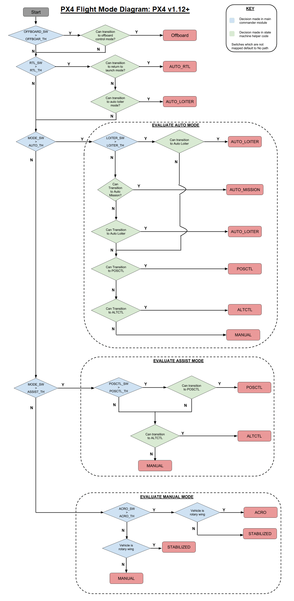

# Flight Mode

飞行模式(`Flight Mode`)定义了`PX4`如何**响应用户输入**并**控制无人机运动**。根据`PX4`提供的控制级别/类型，它们大致分为手动(`manual`)、辅助(`assisted`)和自动(`auto`)模式。飞行员使用遥控器上的开关或地面控制站在飞行模式之间进行转换。

**不是**所有的飞行模式都会在特定的无人机上有效，并且某些模式在不同无人机类型上的表现也有所**不同**。最后，某些飞行模式仅在**特定**的飞行前和飞行中条件下才有意义（例如 GPS 锁定），在满足条件前，系统不允许转换到这些模式。

本文专注于多旋翼无人机的飞行模式。

## 飞行模式总结

### 手动飞行模式`Manual Flight Modes`

手动飞行模式下，用户可以使用遥控器直接控制无人机，无人机会按照遥控器的输入(`rc_input`)运行，但是响应的级别与类型会根据下面的子模式而变化。

* 手动/稳定(`MANUAL/STABILIZED`),遥控器的输入作为横滚角和俯仰角命令以及偏航速率命令传递,油门直接传递给控制分配模块，`PX4`控制姿态，这意味着当遥控杆居中时，它将横滚角和俯仰角调节为零，从而使姿态保持水平。然而，在此模式下，无人机的位置不受`PX4`控制，因此位置可能会因风而漂移。
* ACRO，遥控器的输入作为横滚、俯仰和偏航速率命令传递给`PX4`。`PX4`控制角速率，但不控制姿态。因此，如果遥控器摇杆居中，无人机将不会保持水平。这使得多旋翼飞行器能够完全倒立。油门直接传递给控制分配模块。

### 辅助飞行模式`Assisted flight modes`

辅助飞行模式下，用户可以控制无人机，但是`PX4`在其中提供了辅助，比如，无人机自动地保持了位置或方向，抵抗风扰。

* 姿态控制`ALTCTL`,横滚、俯仰和偏航输入与稳定模式下相同,油门输入指示以预定的最大速率爬升或下沉.油门死区大。中心油门保持高度稳定。`PX4`仅控制高度，因此车辆的`x、y`位置可能会因风而漂移。
* 位置控制`POSCTL`，横滚控制左右速度，俯仰控制地面前后速度。与手动模式一样，偏航控制偏航速率,与 `ALTCTL`模式一样，油门控制爬升/下降速率。这意味着当横滚、俯仰和油门杆居中时，`PX4`可以保持车辆的`x、y、z`位置稳定，以应对任何风扰.

### 自动飞行模式

“自动”飞行模式是控制器几乎不需要用户输入的模式（例如起飞、着陆和飞行任务）。

* 自动悬停`AUTO_LOITER`,多旋翼飞行器在当前位置和高度悬停/徘徊。
* 自动返航`AUTO_RTL`,多旋翼飞行器直线返航。
* 自动任务`AUTO_MISSION`,飞机服从地面控制站（GCS）发送的预定任务。如果没有收到任务，飞机将在当前位置徘徊。
* 远程控制`OFFBOARD`,这种模式下，由远程电脑直接控制位置，速度，姿态`setpoint`.

## 实现

**无论**什么飞行模式，最终传递给控制器的都是位置，速度，姿态`setpoint`.

当前无人机的飞行模式由`vehicle_status`主题中的`nav_state`表示。

控制器发送控制输入，由`manual_control`模块读取并发送手动操作的`manual_control_setpoint`.

根据飞行模式的不同，在辅助飞行模式下，`fly_mode_manager`会接受控制器的`manual_control_setpoint`并转换为加速度发送给`trajectory_setpoint_s`。传递给位置控制器。

在手动飞行模式下，控制器的`manual_control_setpoint`直接传递给姿态控制器

在自动飞行模式下，远程电脑直接发送`trajectory_setpoint_s`，`fly_mode_manager`不做任何修改地传递给位置控制器。
