# 小直升机文档

* [NxtPX4v2飞控用户手册](https://micoair.cn/docs/NxtPX4v2-fei-kong-yong-hu-shou-ce)

## 打开源码工程与地面站

```shell
cd ~/PX4/PX4-LittleRover/PX4-threeServo
code .
```

```shell
cd ~/PX4
./QGroundControl.AppImage 
```

## 编译并下载源码

```shell
make hkust_nxt-dual_default
```

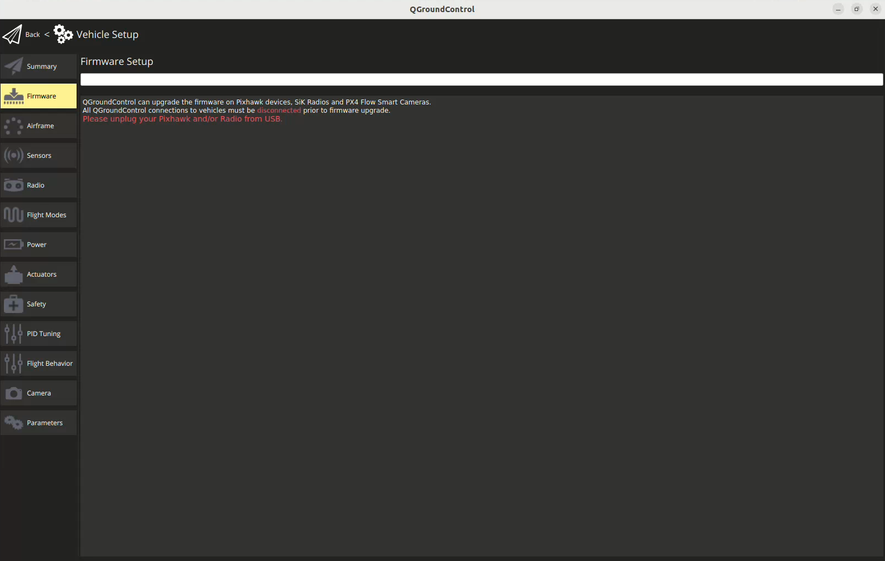

## 基础设置

选择直升机构型

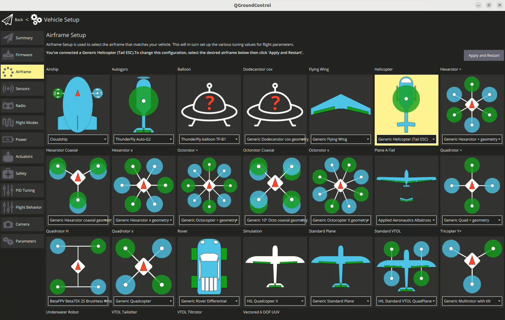

配置舵机数量与位置

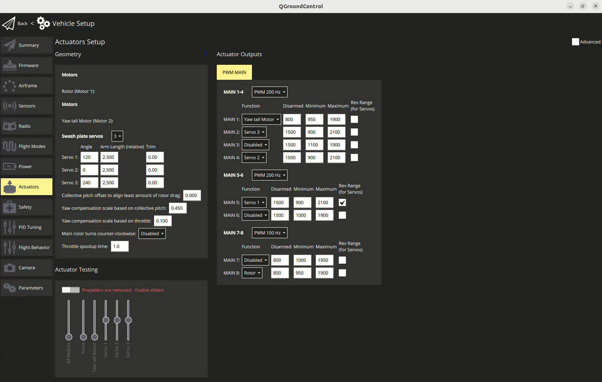


* 参数: `Angle`表示对应舵机在斜盘上的角度，从机头方向顺时针计算,范围`[0,360)`.比如对于经典的三舵机，例子如下

  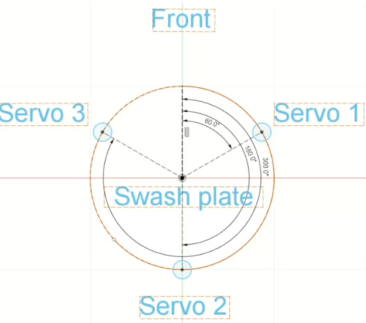

  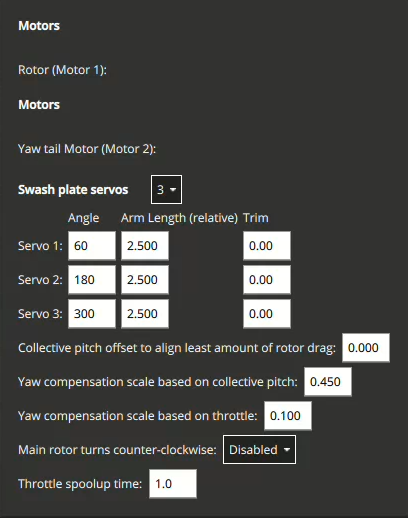

* 参数: `Arm Length`表示期望控制量的放大倍数，这个值越大，对应舵机移动幅度就越大。用于补偿舵机不一致性.源码如下

  ```CPP
  float roll_coeff = sinf(_geometry.swash_plate_servos[i].angle) * _geometry.swash_plate_servos[i].arm_length;
  float pitch_coeff = cosf(_geometry.swash_plate_servos[i].angle) * _geometry.swash_plate_servos[i].arm_length;
  actuator_sp(_first_swash_plate_servo_index + i) = collective_pitch
      + control_sp(ControlAxis::PITCH) * pitch_coeff
      - control_sp(ControlAxis::ROLL) * roll_coeff
      + _geometry.swash_plate_servos[i].trim;
  ```

* 参数: `Trim`表示舵机的偏移量，用来调节舵机的零点,通常不用设置.

* 参数: `Throttle spoolup time`电机启动时间，不能过大，否则不能起飞.

## 分配PWM通道

移去直升机桨叶.

给主浆电机，尾桨电机，三个舵机分配PWM通道，具体的PWM通道取决于**硬件连接**.

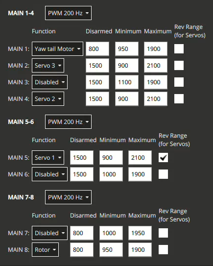

## 设置电机舵机参数

* 参数: `Disarmed`表示电机/舵机锁定时候的pwm值，通常电机为`800`(最小值)，舵机为`1500`(中位).
* 参数: `Minimum`最小值，表示电机/舵机解锁时的最小值，通常电机为`900`，避免pwm死区。舵机取决于最小能转到的位置.
* 参数: `Maximum`最大值，表示电机/舵机解锁时的最大值，通常电机为`1950`.舵机取决于最大能转到的位置.

上电，使用`Actuator Testing`测试舵机转向

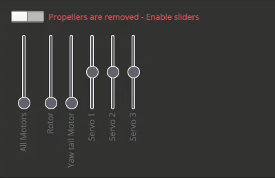

上拉滑块，对应的舵机向上移动，下拉滑块，对应的舵机向下移动，如果方向相反，勾选下列的参数.

* 参数: `Rev Range`舵机反向.

## 配置遥控器

将接收机与飞控连接，并对频.

* [对频视频教程](https://www.bilibili.com/video/BV1E5SzY6Ebn/?spm_id_from=333.999.0.0https://www.bilibili.com/video/BV1E5SzY6EYG/?spm_id_from=333.1387.search.video_card.click)

* 参数: `RC_INPUT_PROTO`表示接收机的协议.

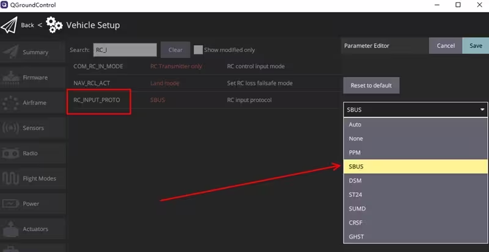

打开遥控器，如果成功，就会在`Radio`页面看到遥控器的数据

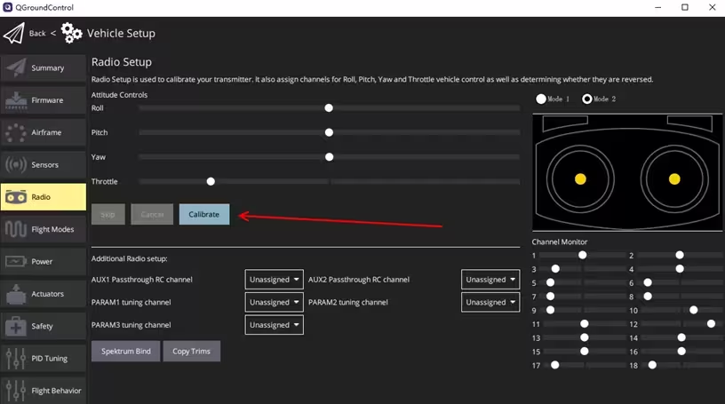

如果失败，在`MAVLINK Console`中反复输入

```shell
rc_input status
```

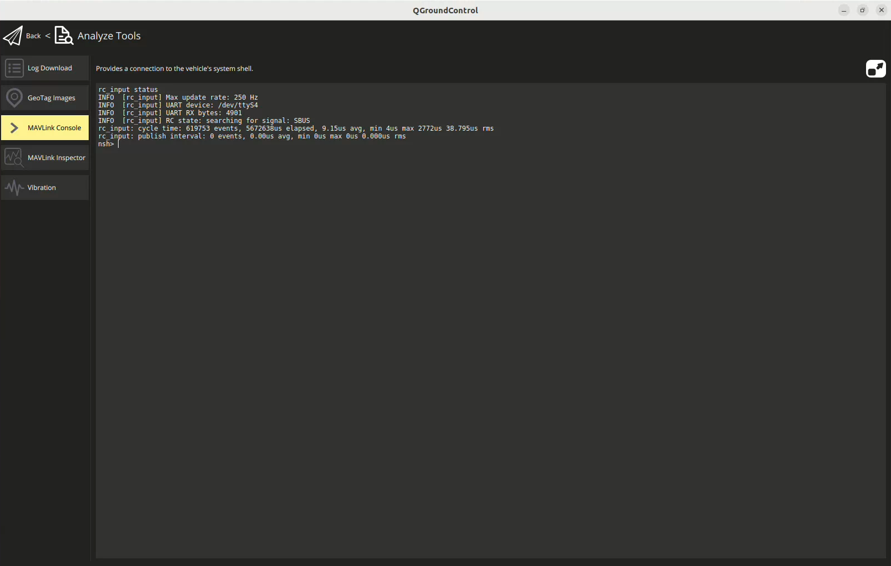

观察`UART RX bytes`是否有增加，如果

1. 增加缓慢，说明接收机没有给飞控发送信息
2. 增加快速，说明接收机给飞控发送信息，但是飞控没有正确读取，可能是协议没有设置正确.

校准遥控器，点击`Calibrate`.


设置`flight Modes`

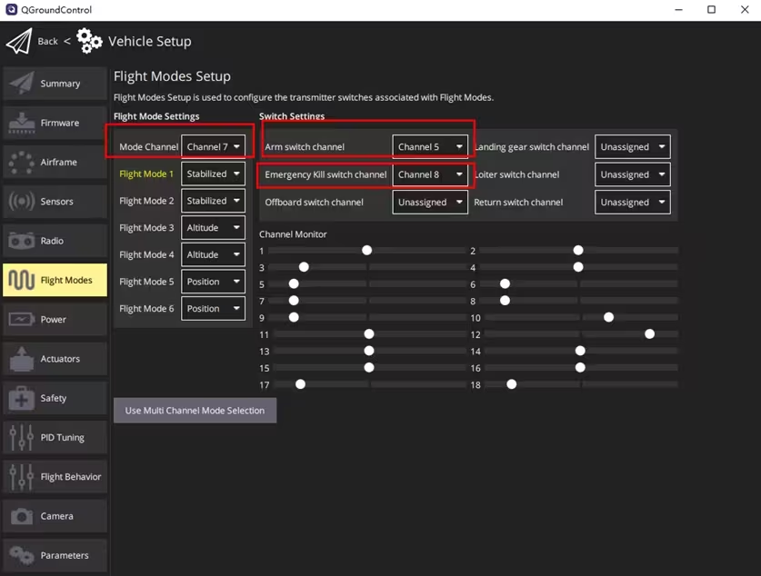

切换为`Stabilized`模式,并移动遥控器，观察斜盘的运动是否和预期相符.先不用管斜盘运动幅度，这个取决于PID参数以及遥控器参数.

## 陀螺仪与加速度计校准

进入`Sensors`选项栏,点击`Gyroscope`校准陀螺仪.

点击`Accelerometer`，设置旋转方向为`ROTATION_NONE`,按照提示进行校准.

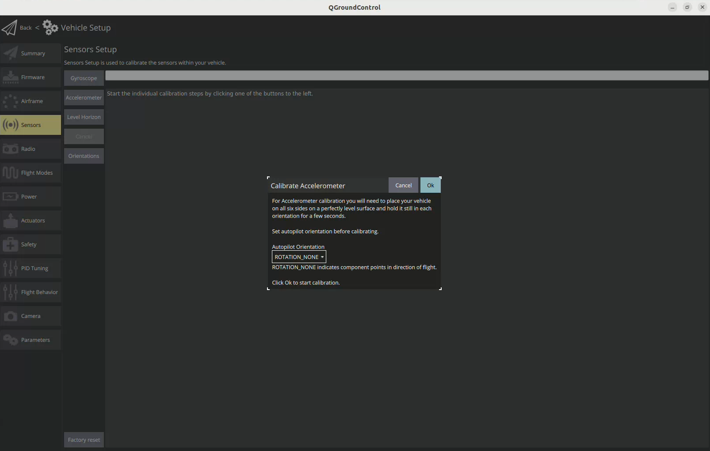

## 电压电流采样设置

进入`Power`选项栏,

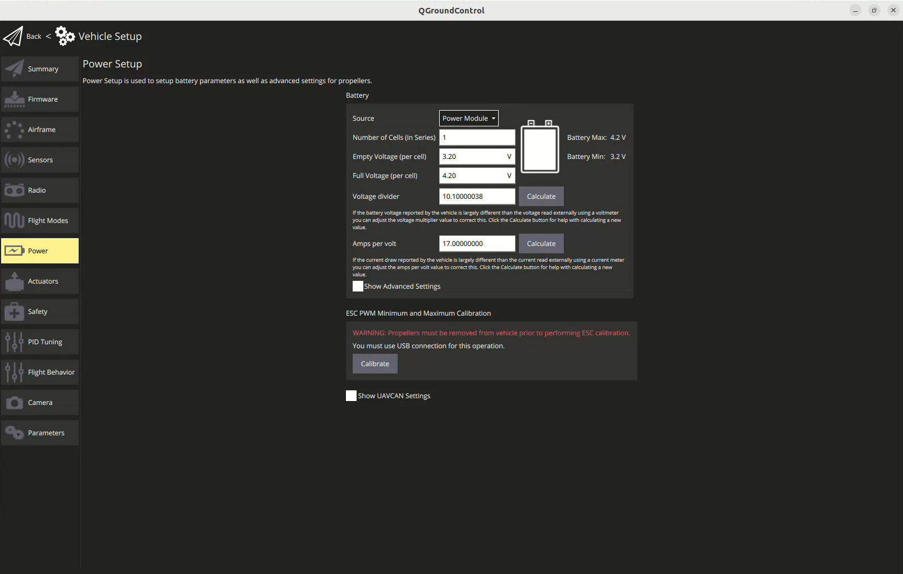

设置电池的`S`数为`2`.`Number of Cells = 2`.

## 配置总距曲线

* 参数`CA_HELI_PITCH_C0`,`CA_HELI_PITCH_C1`,`CA_HELI_PITCH_C2`,`CA_HELI_PITCH_C3`,`CA_HELI_PITCH_C4`表示控制器计算出的期望推力转换到的期望总距,期望推力范围是`[0,1]`，`CA_HELI_PITCH_C0`对应推力为`0`时的总距，`CA_HELI_PITCH_C1`对应推力为`0.25`时的总距，其余类推。采用分段线性拟合的方法拟合.参数越大，期望总距越大，同时用于调节姿态的舵机余量就越少.

源码如下

```CPP
float collective_pitch = math::interpolateN(-control_sp(ControlAxis::THRUST_Z), _geometry.pitch_curve);
```

装上桨，将直升机固定在电子秤上，上电,观察推力大小，修改总距参数.目标是总距曲线尽量小，留出更多余量控制姿态.

## 修改主浆转速

主浆转速直接影响直升机续航，转速过高耗电严重，转速过低陀螺效应不明显,推力不足

修改电机参数`Maximum`即可改变转速.

## 调节尾桨电机系数

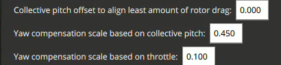

* 参数`CA_HELI_YAW_CP_O`表示尾桨电机相对于总距的零点偏移值，通常为零即可
* 参数`CA_HELI_YAW_CP_S`表示尾桨电机转速受到总距影响的比值.
* 参数`CA_HELI_YAW_TH_S`表示尾桨电机转速受到主浆转速影响的比值.

```CPP
actuator_sp(1) = control_sp(ControlAxis::YAW) * _geometry.yaw_sign
    + fabsf(collective_pitch - _geometry.yaw_collective_pitch_offset) * _geometry.yaw_collective_pitch_scale
    + _throttle_real * _geometry.yaw_throttle_scale;
```

由于偏航角存在闭环PID控制，所以只需要粗调节即可.

固定直升机在小架子上，锁定俯仰与滚转，只保留偏航自由度。推动直升机推力总距摇杆，调节`CA_HELI_YAW_CP_S`,`CA_HELI_YAW_TH_S`直到**所有的**摇杆范围均不存在偏航角明显移动，同时推动偏航摇杆可以改变直升机的偏航角（一开始偏航角的移动是可以接受的，这是因为控制器需要达到的偏航角零点）。

* 如果随着总距摇杆变化而偏航角变化，可以考虑修改`CA_HELI_YAW_CP_S`.此外，可以考虑修改`CA_HELI_YAW_TH_S`.

## 姿态PID整定

### 偏航轴PID整定

#### 偏航轴角速度环PID整定

* 参数: `MC_YAWRATE_P`,`MC_YAWRATE_I`,`MC_YAWRATE_D`偏航轴PID值.
* 参数: `MC_YAWRATE_FF`偏航轴角速度环前馈环节系数

调节偏航角PID值，推动偏航摇杆,观察响应

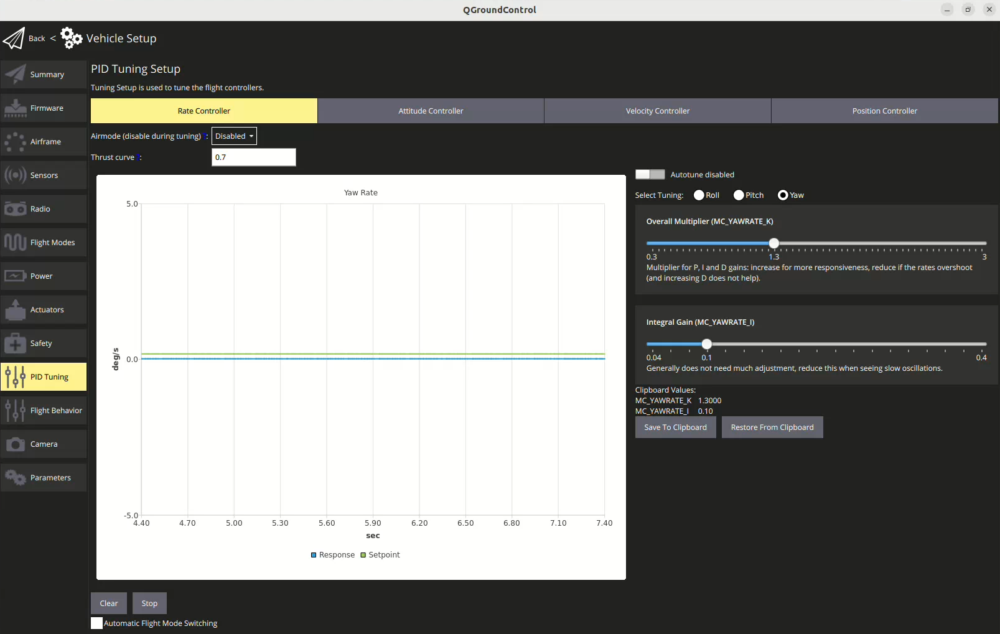

直到控制器可以跟踪输入信号

#### 偏航轴角度环PID整定

* 参数: `MC_YAW_P`偏航轴PID值
* 参数: `MC_YAW_WEIGHT`偏航轴衰减系数.

调节偏航角PID值，推动偏航摇杆，观察响应

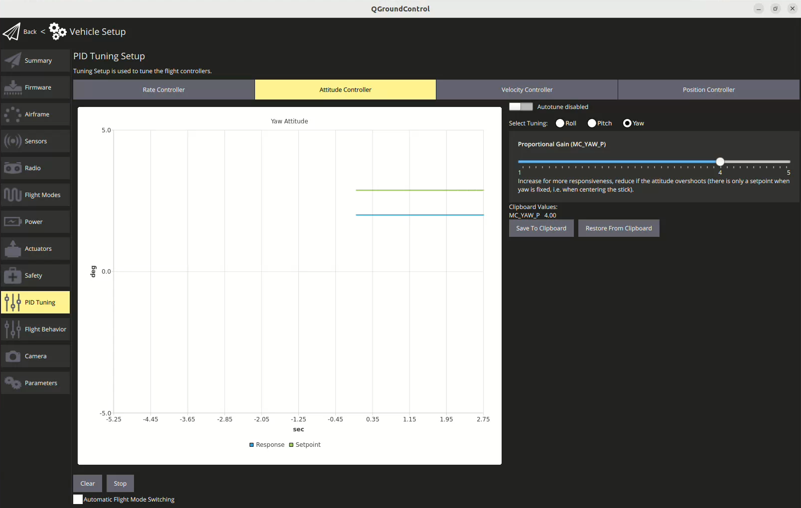

直到控制器可以跟踪输入信号

### 俯仰轴PID整定

#### 俯仰轴角速度环PID整定

* 参数: `MC_PITCHRATE_P`,`MC_PITCHRATE_I`,`MC_PITCHRATE_D`俯仰轴角速度PID值.
* 参数: `MC_PITCHRATE_FF`俯仰轴角速度环前馈环节系数.

直升机的俯仰轴的稳定最为重要，也最难调节，俯仰轴稳定了直升机几乎就可以保持稳定.

固定直升机在小架子上，锁定偏航与滚转，只保留俯仰自由度.

使用`PID Tunning`观察响应.


解锁起飞，推动俯仰轴摇杆，观察角速度环响应.

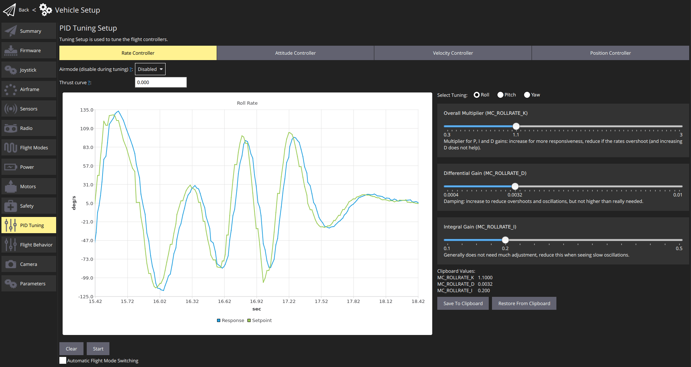

修改`MC_PITCHRATE_FF`,直到俯仰角速度响应跟踪阶跃输入.

保持当前的`MC_PITCHRATE_FF`,添加PID参数,从`MC_PITCHRATE_P = MC_PITCHRATE_FF / 4`,`MC_PITCHRATE_D = 0`,`MC_PITCHRATE_I = 0`开始，直到直升机可以保持俯仰轴稳定.

#### 俯仰轴角度环PID整定

* 参数: `MC_PITCH_P`俯仰轴角度环PID值

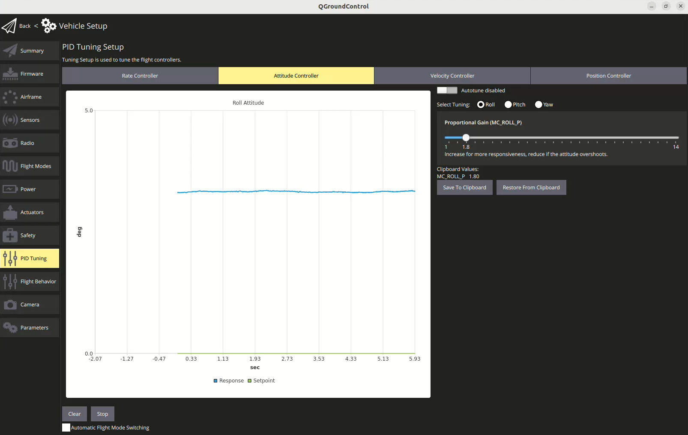

修改`MC_PITCH_P`直到获得好的操纵性能.

### 滚转轴PID整定

固定直升机在小架子上，锁定偏航与俯仰，只保留滚转自由度.

调整方法同俯仰轴.

* 参数: `MC_ROLLRATE_P`,`MC_ROLLRATE_I`,`MC_ROLLRATE_D`滚转轴角速度环PID值.
* 参数: `MC_ROLLRATE_FF`滚转轴角速度环前馈环节系数.
* 参数: `MC_ROLL_P`滚转轴角度环PID值

### 总体姿态整定

固定直升机在小架子上，锁定位置，保留三轴姿态自由度.

起飞，观察姿态是否稳定，如果姿态不稳定，首先适当降低角度环`PID`值，进一步观察，必要时再修改角速度环`PID`值.

推动遥控器摇杆，观察操纵性能,观察斜盘倾斜角度.

* 参数: `MPC_MAN_TILT_MAX`表示遥控器摇杆映射到期望的姿态角的系数，参数越大，相同的摇杆输入，斜盘倾斜角度就越大，直升机飞行越灵活，不会影响内部PID的控制.

## PX4串口映射表

* `TELEM1 -> UART2`
* `TELEM2 -> UART4`
* `TELEM3-> UART7 (ESC Telemetry)`
* `TELEM4 -> UART8`
* `GPS1 -> UART1`
* `GPS2 -> UART3`
* `RC -> UART5`

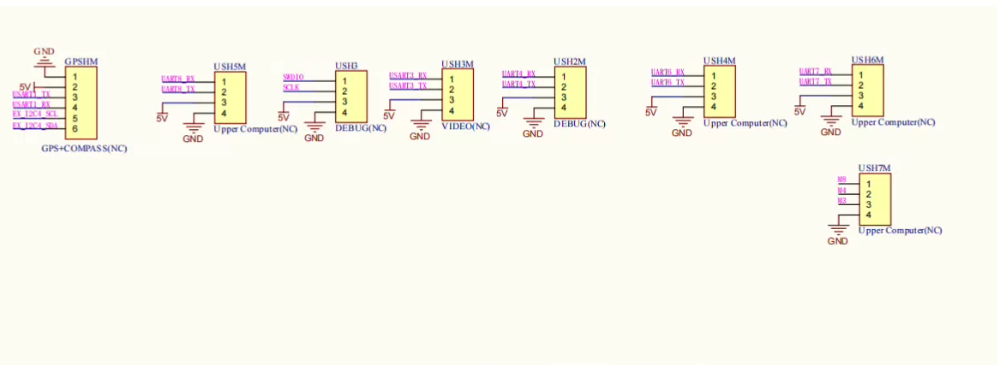

## 数传配置

数传配置比较简单，在`Parameters`中找到`MAVLink`选项

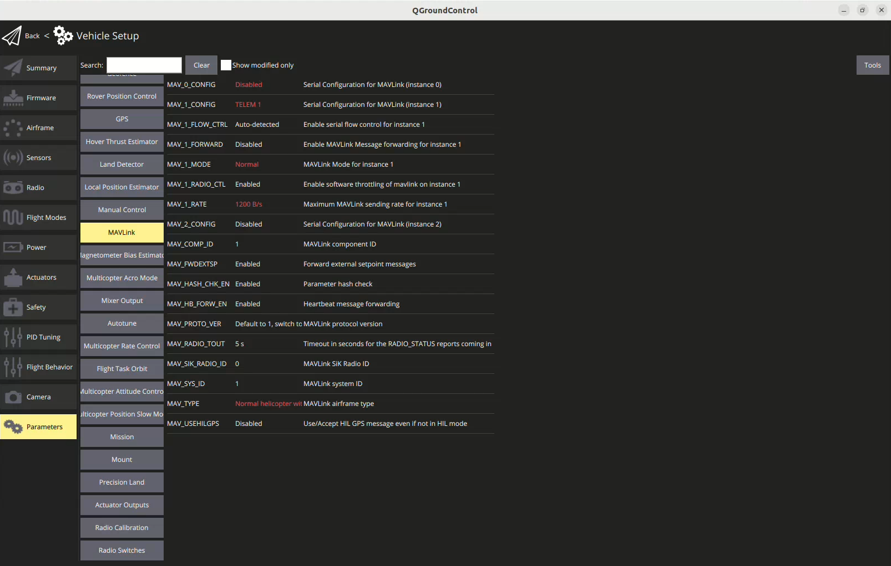

* 参数: `MAV_0_CONFIG`配置`MAVLink`实例`0`需要监听的串口号.

设置`MAV_0_CONFIG`为对应的串口号，重启飞控.

* 参数: `MAV_0_MODE`配置`MAVLink`实例`0`的模式
* 参数: `MAV_0_RATE`配置`MAVLink`实例`0`的最大传输速率，设置`0`即为不限制速率.通常设置为`0`即可.
* 参数: `MAV_0_FORWARD`配置`MAVLink`实例`0`是否转发接受到的消息给其它`MAVLink`实例.

设置`MAV_0_FORWARD = Disabled`,`MAV_0_MODE = Normal`,`MAV_0_RATE = 1200`.

重启飞控.

* 参数`SER_TEL1_BAUD`串口`TELEM1`的波特率.

设置对应的串口波特率参数.注意！不一定是`TELEM1`.

重启飞控,并测试数传是否成功连接.

## 光流超声雷达配置

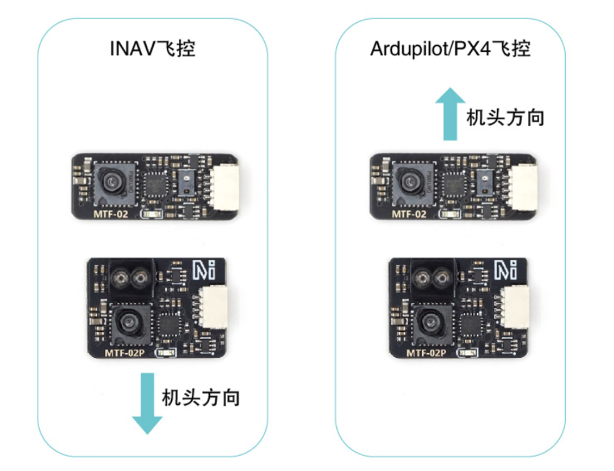

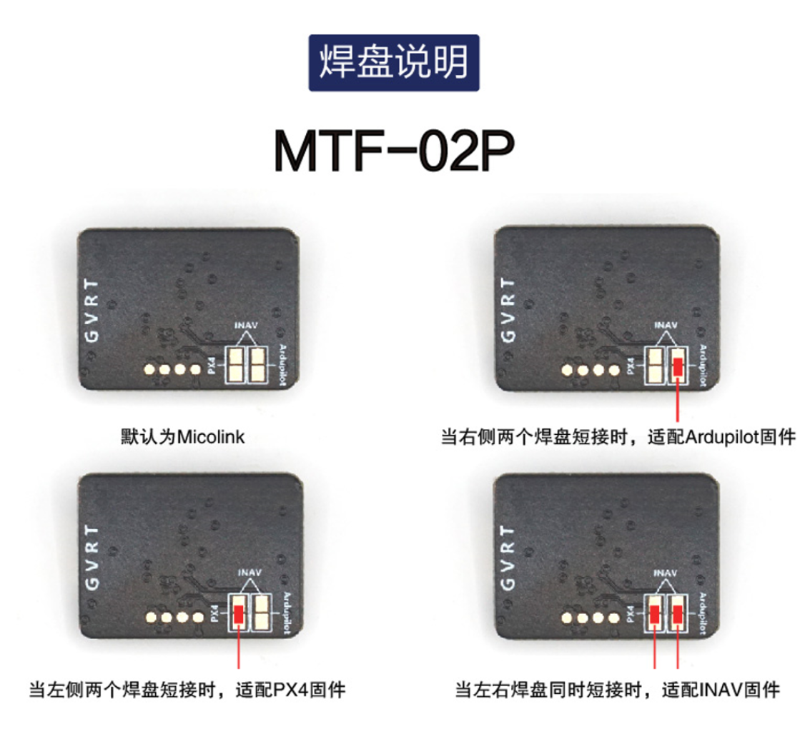

注意光流安装方向，焊盘选择`PX4`固件

光流与超声雷达是一体的,进入`Paramters`的`MAVLink`选项。

设置`MAV_1_CONFIG`为光流接入的串口号，重启飞控.

设置`MAV_1_MODE = Normal`,`MAV_1_FORWARD = Disabled`,`MAV_1_RATE = 0`,`SER_TELn_BAUD = 115200 8N1`

* 参数: `EKF2_OF_CTRL`,`EKF2_RNG_CTRL`,`EKF`模块使能光流超声雷达融合.
* 参数: `EKF2_HGT_REF`，`EKF`模块高度估计源.

设置`EKF2_RNG_CTRL = Enabled`,`EKF2_OF_CTRL = Enabled`,`EKF_HGT_REF = Range sensor`

重启飞控.

* 参数: `SENS_FLOW_ROT`，光流安装旋转方向.

设置`SENS_FLOW_ROT`为对应的安装方向.

重启飞控，如果在`QGC`的`MAVLink Inspector`页面中能看到`DISTANCE_SENSOR`和`OPTICAL_FLOW_RAD`消息说明成功配置光流超声雷达.

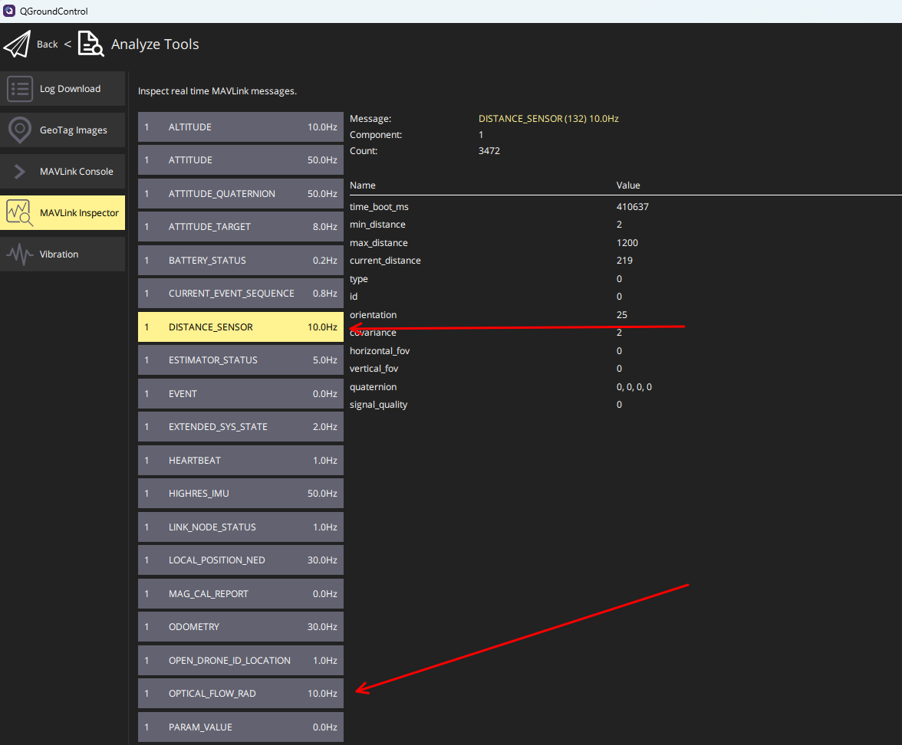

## GPS与罗盘配置

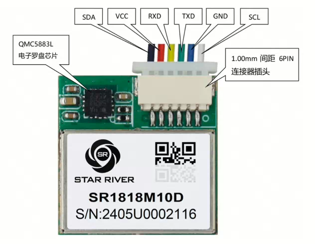

通常GPS会板载一个罗盘.

* 参数: `GPS_1_CONFIG`配置`GPS`实例`1`需要监听的串口号.
* 参数: `GPS_1_PROTOCOL`配置`GPS`协议.
* 参数: `SYS_HAS_GPS`表示是否使能`GPS`.
* 参数: `SYS_HAS_MAG`表示是否使能`MAG`.
* 参数: `EKF2_MAG_TYPE`表示磁罗盘类型

设置`GPS_1_CONFIG`为对应的串口号.

设置`GPS_1_PROTOCOL`为`GPS`对应的协议.

设置`SYS_HAS_GPS = Enabled`,`SYS_HAS_MAG = Enabled`,`EKF2_MAG_TYPE = Automatic`,`SER_GPS1_BAUD = Auto`.

在`QGC`的`Sensors`设置页面中，点击`Orientations`选项，这里可以设置飞控方向及外置罗盘方向参数（板载罗盘无法修改方向）。

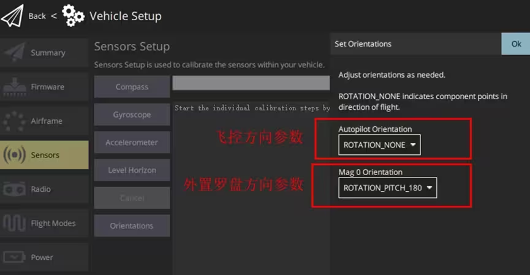

### 磁罗盘校准

磁罗盘需要到室外校准，室内飞行时必须关闭磁罗盘，`SYS_HAS_MAG = Disable`.

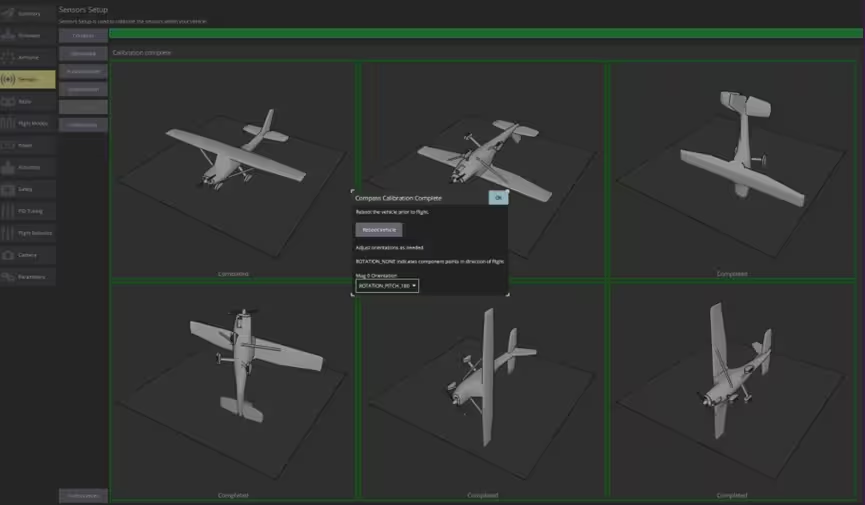

## 位置PID整定

### 定高飞行PID整定

切换飞行模式为`Altitude`进行定高飞行.缓慢推动摇杆直到起飞.

**注意**,此时左摇杆不再是期望推力摇杆，而是期望`Z`轴方向的速度.

* 参数: `MPC_Z_VEL_P_ACC`,`MPC_Z_VEL_I_ACC`,`MPC_Z_VEL_D_ACC`，`Z`轴速度环PID参数
* 参数: `MPC_Z_P`，`Z`轴位置环PID参数.

先调节速度环PID参数，推动摇杆，观察响应(使用飞行日志)，直到实际速度可以跟踪期望速度.

再调节位置环PID参数，推动摇杆，起飞直升机，保持摇杆归中(即期望保持当前飞行高度).观察实际高度是否可以跟踪期望高度，不会发生振荡.

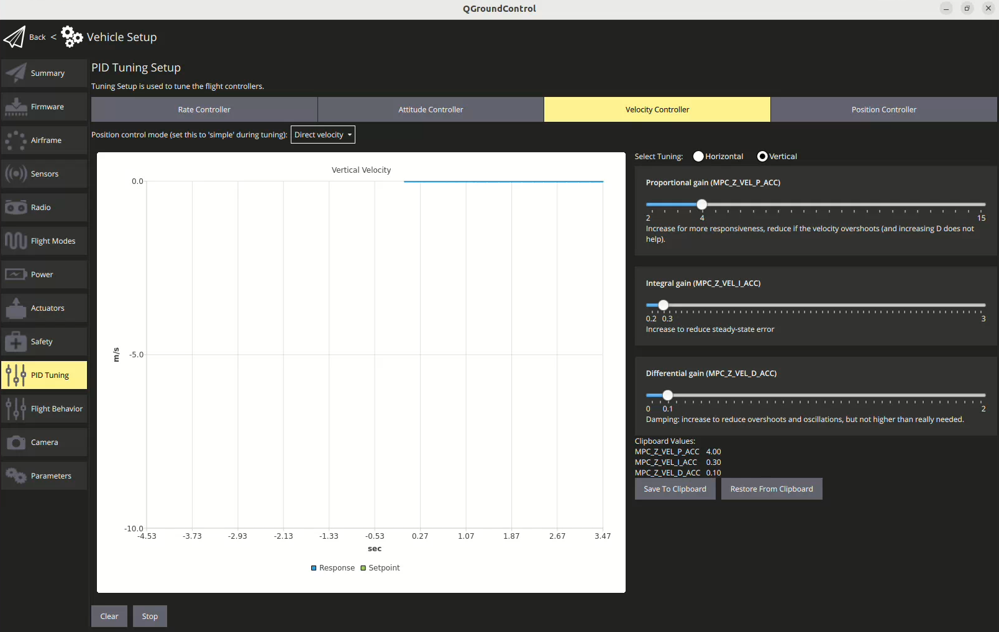

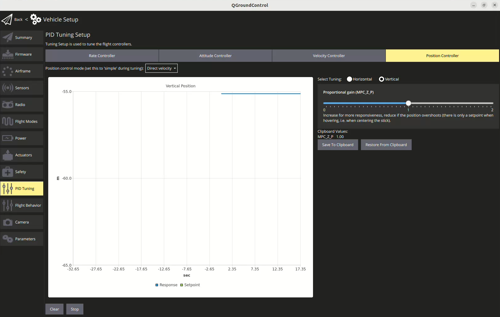

### 定点飞行PID整定

切换飞行模式为`Postion`进行定点飞行.

**注意**，此时右摇杆不再是期望姿态摇杆，而是期望`XY`轴方向的速度.

* 参数: `MPC_XY_VEL_P_ACC`,`MPC_XY_VEL_I_ACC`,`MPC_XY_VEL_D_ACC`，`XY`轴速度环PID参数
* 参数: `MPC_XY_P`，`Z`轴位置环PID参数.

调节方法类似定高飞行PID调节.
