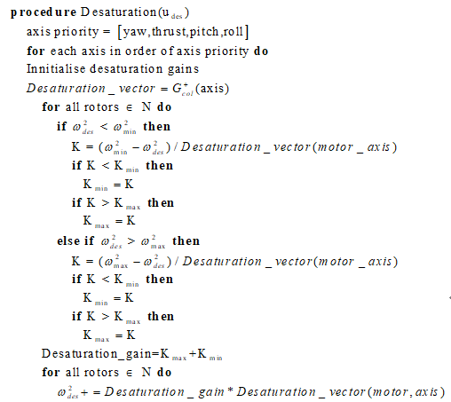

# control_allocator

`control_allocator`是`PX4`的控制分配器，它总是使能的，实现的功能如下

* 根据无人机构型参数，选择对应的电机效用类`ActuatorEffectiveness`，同时选择要使用的控制分配方法。
* 根据电机参数，计算电机效用矩阵`EffectivenessMatrix`,获取电机最大值，最小值，自然点。
* 接收其它模块发来的`vehicle_torque_setpoint`与`vehicle_thrust_setpoint`，获得推力`setpoint`,力矩`setpoint`.
* 计算电机效用矩阵的伪逆矩阵。
* 使用这个伪逆矩阵计算电机`setpoint`,注意这个电机`setpoint`也是标准化的,`[0,-1]`或者是`[-1,1]`，取决于电机类型，同时采取必要的降饱和操作。
* 发布电机`setpoint`给`pwm`控制器。

## 关键数据流

### 订阅

#### `vehicle_torque_setpoint`

是这个模块的驱动订阅，表示当前无人机的力矩`setpoint`，是一个标准化的量,范围为`[-1,1]`.

#### `vehicle_thrust_setpoint`

是这个模块的驱动订阅，表示当前无人机的推力`setpoint`,是一个标准化的量，范围为`[0,1]`.

#### `vehicle_status`

表示当前无人机的状态，该模块主要使用`vehicle_status.arming_state`字段，与``vehicle_status.vehicle_type`。

#### `vehicle_control_mode`

表示无人机控制器的使能状态，控制分配总是使能的，这个模块使用`vehicle_control_mode.flag_control_allocation_enabled`字段来决定是否发布计算出来的电机`setpoint`.

#### `failure_detector_status`

表示无人机的故障信息，这个模块使用`failure_detector_status.fd_motor`来得知无人机的电机是否有故障，有故障就去除故障电机，重新计算电机效用矩阵。

### 发布

#### `actuator_motors`

表示电机`setpoint`，发布给`PWM`控制器。

#### `actuator_servos`

表示伺服电机`setpoint`，发布给其它控制模块。

## ControlAllocator类

```CPP
class ControlAllocator : public ModuleBase<ControlAllocator>, public ModuleParams, public px4::ScheduledWorkItem
```

`ControlAllocator`类是在`rate_ctrl`里的模块。

### 关键成员变量

#### `EffectivenessSource`

```CPP
EffectivenessSource _effectiveness_source_id{EffectivenessSource::NONE};
```

```CPP
enum class EffectivenessSource {
  NONE = -1,
  MULTIROTOR = 0,
  FIXED_WING = 1,
  STANDARD_VTOL = 2,
  TILTROTOR_VTOL = 3,
  TAILSITTER_VTOL = 4,
  ROVER_ACKERMANN = 5,
  ROVER_DIFFERENTIAL = 6,
  MOTORS_6DOF = 7,
  MULTIROTOR_WITH_TILT = 8,
  CUSTOM = 9,
  HELICOPTER_TAIL_ESC = 10,
  HELICOPTER_TAIL_SERVO = 11,
  HELICOPTER_COAXIAL = 12,
};
```

存储了当前无人机构型类型，以及要使用的电机效用类，对于多旋翼无人机，则是`EffectivenessSource::MULTIROTOR`.

#### `_actuator_effectiveness`

```CPP
ActuatorEffectiveness *_actuator_effectiveness{nullptr}; ///< class providing actuator effectiveness
```

存储当前的电机效用类，这个模块使用`_actuator_effectiveness`计算电机效用矩阵。

#### `_control_allocation_selection_indexes`

```CPP
uint8_t _control_allocation_selection_indexes[NUM_ACTUATORS * ActuatorEffectiveness::MAX_NUM_MATRICES] {};
```

这是一个数组，每个数组元素表示一个对应的电机所选择的控制分配矩阵。

#### `_num_actuators`

```CPP
int _num_actuators[(int)ActuatorType::COUNT] {};
```

表示对应类型的电机的数量，目前只有两种电机，直流电机与伺服电机。

#### `_torque_sp,_thrust_sp`

```CPP
matrix::Vector3f _torque_sp;
matrix::Vector3f _thrust_sp;
```

表示当前的力矩`setpoint`,推力`setpoint`.

#### `_allocation_method_id`

```CPP
AllocationMethod _allocation_method_id{AllocationMethod::NONE};
```

```CPP
enum class AllocationMethod {
  NONE = -1,
  PSEUDO_INVERSE = 0,
  SEQUENTIAL_DESATURATION = 1,
  AUTO = 2,
};
```

表示当前使用的控制分配方法，通常是`AUTO`,让控制分配模块自动选择。

#### `_control_allocation`

```CPP
ControlAllocation *_control_allocation[ActuatorEffectiveness::MAX_NUM_MATRICES] {};   ///< class for control allocation calculations
```

指向当前使用的控制方法。

#### `_num_control_allocation`

表示当前有多少个控制分配实例，通常为`1`,但是可以转换多个构型的无人机可以有多个控制分配的实例。

### 关键参数

`control_allocator`的大部分参数都定义在了`module.yaml`里。

#### 电机参数

目前控制分配模块支持`12`个电机，电机参数指定了电机的数量，特性，位置，转动轴向，转动参量等。

#### `CA_AIRFRAME`

表示当前的无人机构型，`control_allocator`会使用这个参数选择合适的构型。

#### `CA_METHOD`

表示当前无人机的分配方法，`control_allocator`会使用这个参数选择分配方法。

## ActuatorEffectivenessRotors类

```CPP
class ActuatorEffectivenessRotors : public ModuleParams, public ActuatorEffectiveness
```

这个类用来从参数系统中读取电机参数，并用来计算电机效用矩阵。

这是`PX4`提供的接口类，用户自定义新的构型的无人机需要包含这个`ActuatorEffectivenessRotors`类。

### 关键成员变量

#### `_geometry{}`

```CPP
Geometry _geometry{};
```

在构造函数时读取电机参数保存到这个成员变量里。

## 代码分析

### 更新电机效用矩阵

```CPP
void
ControlAllocator::parameters_updated()
{
  _has_slew_rate = false;

  for (int i = 0; i < MAX_NUM_MOTORS; ++i) {
    param_get(_param_handles.slew_rate_motors[i], &_params.slew_rate_motors[i]);
    _has_slew_rate |= _params.slew_rate_motors[i] > FLT_EPSILON;
  }

  for (int i = 0; i < MAX_NUM_SERVOS; ++i) {
    param_get(_param_handles.slew_rate_servos[i], &_params.slew_rate_servos[i]);
    _has_slew_rate |= _params.slew_rate_servos[i] > FLT_EPSILON;
  }

  // Allocation method & effectiveness source
  // Do this first: in case a new method is loaded, it will be configured below
  bool updated = update_effectiveness_source();
  update_allocation_method(updated); // must be called after update_effectiveness_source()

  if (_num_control_allocation == 0) {
    return;
  }

  for (int i = 0; i < _num_control_allocation; ++i) {
    _control_allocation[i]->updateParameters();
  }

  update_effectiveness_matrix_if_needed(EffectivenessUpdateReason::CONFIGURATION_UPDATE);
}
```

* `update_effectiveness_source()`按照参数选择实例化的无人机构型
* `update_allocation_method()`按照参数选择控制分配方法
* `_control_allocation[i]->updateParameters();`是特定控制分配方法的自定义更新参数的函数，通常为空。
* `update_effectiveness_matrix_if_needed()`更新电机效用矩阵。

#### 选择构型与分配方法

```CPP
bool
ControlAllocator::update_effectiveness_source()
{
  const EffectivenessSource source = (EffectivenessSource)_param_ca_airframe.get();

  if (_effectiveness_source_id != source) {

    // try to instanciate new effectiveness source
    ActuatorEffectiveness *tmp = nullptr;

    switch (source) {
    case EffectivenessSource::NONE:
    case EffectivenessSource::MULTIROTOR:
      tmp = new ActuatorEffectivenessMultirotor(this);
      break;

    case EffectivenessSource::STANDARD_VTOL:
      tmp = new ActuatorEffectivenessStandardVTOL(this);
      break;

    case EffectivenessSource::TILTROTOR_VTOL:
      tmp = new ActuatorEffectivenessTiltrotorVTOL(this);
      break;

    case EffectivenessSource::TAILSITTER_VTOL:
      tmp = new ActuatorEffectivenessTailsitterVTOL(this);
      break;

    case EffectivenessSource::ROVER_ACKERMANN:
      tmp = new ActuatorEffectivenessRoverAckermann();
      break;

    case EffectivenessSource::ROVER_DIFFERENTIAL:
      // differential_drive_control does allocation and publishes directly to actuator_motors topic
      break;

    case EffectivenessSource::FIXED_WING:
      tmp = new ActuatorEffectivenessFixedWing(this);
      break;

    case EffectivenessSource::MOTORS_6DOF: // just a different UI from MULTIROTOR
      tmp = new ActuatorEffectivenessUUV(this);
      break;

    case EffectivenessSource::MULTIROTOR_WITH_TILT:
      tmp = new ActuatorEffectivenessMCTilt(this);
      break;

    case EffectivenessSource::CUSTOM:
      tmp = new ActuatorEffectivenessCustom(this);
      break;

    case EffectivenessSource::HELICOPTER_TAIL_ESC:
      tmp = new ActuatorEffectivenessHelicopter(this, ActuatorType::MOTORS);
      break;

    case EffectivenessSource::HELICOPTER_TAIL_SERVO:
      tmp = new ActuatorEffectivenessHelicopter(this, ActuatorType::SERVOS);
      break;

    case EffectivenessSource::HELICOPTER_COAXIAL:
      tmp = new ActuatorEffectivenessHelicopterCoaxial(this);
      break;

    default:
      PX4_ERR("Unknown airframe");
      break;
    }

    // Replace previous source with new one
    if (tmp == nullptr) {
      // It did not work, forget about it
      PX4_ERR("Actuator effectiveness init failed");
      _param_ca_airframe.set((int)_effectiveness_source_id);

    } else {
      // Swap effectiveness sources
      delete _actuator_effectiveness;
      _actuator_effectiveness = tmp;

      // Save source id
      _effectiveness_source_id = source;
    }

    return true;
  }

  return false;
}
```

按照`CA_AIRFRAME`参数实例化电机效用实例，对于多旋翼无人机,是`ActuatorEffectivenessMultirotor`.

把实例化出来的类地址保存在`_actuator_effectiveness`里，之后程序便通过这个类成员多态使用实例。

```CPP
void
ControlAllocator::update_allocation_method(bool force)
{
  AllocationMethod configured_method = (AllocationMethod)_param_ca_method.get();

  if (!_actuator_effectiveness) {
    PX4_ERR("_actuator_effectiveness null");
    return;
  }

  if (_allocation_method_id != configured_method || force) {

    matrix::Vector<float, NUM_ACTUATORS> actuator_sp[ActuatorEffectiveness::MAX_NUM_MATRICES];

    // Cleanup first
    for (int i = 0; i < ActuatorEffectiveness::MAX_NUM_MATRICES; ++i) {
      // Save current state
      if (_control_allocation[i] != nullptr) {
        actuator_sp[i] = _control_allocation[i]->getActuatorSetpoint();
      }

      delete _control_allocation[i];
      _control_allocation[i] = nullptr;
    }

    _num_control_allocation = _actuator_effectiveness->numMatrices();

    AllocationMethod desired_methods[ActuatorEffectiveness::MAX_NUM_MATRICES];
    _actuator_effectiveness->getDesiredAllocationMethod(desired_methods);

    bool normalize_rpy[ActuatorEffectiveness::MAX_NUM_MATRICES];
    _actuator_effectiveness->getNormalizeRPY(normalize_rpy);

    for (int i = 0; i < _num_control_allocation; ++i) {
      AllocationMethod method = configured_method;

      if (configured_method == AllocationMethod::AUTO) {
        method = desired_methods[i];
      }

      switch (method) {
      case AllocationMethod::PSEUDO_INVERSE:
        _control_allocation[i] = new ControlAllocationPseudoInverse();
        break;

      case AllocationMethod::SEQUENTIAL_DESATURATION:
        _control_allocation[i] = new ControlAllocationSequentialDesaturation();
        break;

      default:
        PX4_ERR("Unknown allocation method");
        break;
      }

      if (_control_allocation[i] == nullptr) {
        PX4_ERR("alloc failed");
        _num_control_allocation = 0;

      } else {
        _control_allocation[i]->setNormalizeRPY(normalize_rpy[i]);
        _control_allocation[i]->setActuatorSetpoint(actuator_sp[i]);
      }
    }

    _allocation_method_id = configured_method;
  }
}
```

按照`CA_METHOD`选择控制分配方法，对于多旋翼无人机，通常是`AUTO`，控制分配模块选择为`SEQUENTIAL_DESATURATION`.

`_actuator_effectiveness->numMatrices()`表示当前的实例有多少个控制分配，对于有多个构型，且构型会转换的无人机来说，可能会有多个控制分配。但通常为`1`,存储到成员变量`_num_control_allocation`中。

`normalize_rpy`决定电机效用矩阵的伪逆是否需要标准化，通常是`true`，存储到成员变量`_control_allocation[i]->_normalize_rpy`中。

按照`_num_control_allocation`实例化控制分配对象，存储在`_control_allocation[i]`中。

#### 计算电机效用矩阵

`update_effectiveness_matrix_if_needed()`更新效用矩阵，本节先讲述它所调用的函数。

```CPP
bool
ActuatorEffectivenessMultirotor::getEffectivenessMatrix(Configuration &configuration,
    EffectivenessUpdateReason external_update)
{
  if (external_update == EffectivenessUpdateReason::NO_EXTERNAL_UPDATE) {
    return false;
  }

  // Motors
  const bool rotors_added_successfully = _mc_rotors.addActuators(configuration);

  return rotors_added_successfully;
}
```

```CPP
struct Configuration {
  /**
  * Add an actuator to the selected matrix, returning the index, or -1 on error
   */
  int addActuator(ActuatorType type, const matrix::Vector3f &torque, const matrix::Vector3f &thrust);

  /**
   * Call this after manually adding N actuators to the selected matrix
   */
  void actuatorsAdded(ActuatorType type, int count);

  int totalNumActuators() const;

  /// Configured effectiveness matrix. Actuators are expected to be filled in order, motors first, then servos
  EffectivenessMatrix effectiveness_matrices[MAX_NUM_MATRICES];

  int num_actuators_matrix[MAX_NUM_MATRICES]; ///< current amount, and next actuator index to fill in to effectiveness_matrices
  ActuatorVector trim[MAX_NUM_MATRICES];

  ActuatorVector linearization_point[MAX_NUM_MATRICES];

  int selected_matrix;

  uint8_t matrix_selection_indexes[NUM_ACTUATORS * MAX_NUM_MATRICES];
  int num_actuators[(int)ActuatorType::COUNT];
};
```

这是`ActuatorEffectivenessMultirotor`类的成员函数，把电机效用矩阵与一些信息存储在`configuration`里。

这个类具有成员函数`ActuatorEffectivenessRotors _mc_rotors`,调用`_mc_rotors.addActuators()`读取参数，添加电机。

```CPP
bool
ActuatorEffectivenessRotors::addActuators(Configuration &configuration)
{
  if (configuration.num_actuators[(int)ActuatorType::SERVOS] > 0) {
    PX4_ERR("Wrong actuator ordering: servos need to be after motors");
    return false;
  }

  int num_actuators = computeEffectivenessMatrix(_geometry,
          configuration.effectiveness_matrices[configuration.selected_matrix],
          configuration.num_actuators_matrix[configuration.selected_matrix]);
  configuration.actuatorsAdded(ActuatorType::MOTORS, num_actuators);
  return true;
}
```

`_geometry`存储了电机的参数。

调用`computeEffectivenessMatrix`计算效用矩阵

```CPP
int
ActuatorEffectivenessRotors::computeEffectivenessMatrix(const Geometry &geometry,
    EffectivenessMatrix &effectiveness, int actuator_start_index)
{
  int num_actuators = 0;

  for (int i = 0; i < geometry.num_rotors; i++) {

    if (i + actuator_start_index >= NUM_ACTUATORS) {
      break;
    }

    ++num_actuators;

    // Get rotor axis
    Vector3f axis = geometry.rotors[i].axis;

    // Normalize axis
    float axis_norm = axis.norm();

    if (axis_norm > FLT_EPSILON) {
      axis /= axis_norm;

    } else {
      // Bad axis definition, ignore this rotor
      continue;
    }

    // Get rotor position
    const Vector3f &position = geometry.rotors[i].position;

    // Get coefficients
    float ct = geometry.rotors[i].thrust_coef;
    float km = geometry.rotors[i].moment_ratio;

    if (geometry.propeller_torque_disabled) {
      km = 0.f;
    }

    if (geometry.propeller_torque_disabled_non_upwards) {
      bool upwards = fabsf(axis(0)) < 0.1f && fabsf(axis(1)) < 0.1f && axis(2) < -0.5f;

      if (!upwards) {
        km = 0.f;
      }
    }

    if (fabsf(ct) < FLT_EPSILON) {
      continue;
    }

    // Compute thrust generated by this rotor
    matrix::Vector3f thrust = ct * axis;

    // Compute moment generated by this rotor
    matrix::Vector3f moment = ct * position.cross(axis) - ct * km * axis;

    // Fill corresponding items in effectiveness matrix
    for (size_t j = 0; j < 3; j++) {
      effectiveness(j, i + actuator_start_index) = moment(j);
      effectiveness(j + 3, i + actuator_start_index) = thrust(j);
    }

    if (geometry.yaw_by_differential_thrust_disabled) {
      // set yaw effectiveness to 0 if yaw is controlled by other means (e.g. tilts)
      effectiveness(2, i + actuator_start_index) = 0.f;
    }

    if (geometry.three_dimensional_thrust_disabled) {
      // Special case tiltrotor: instead of passing a 3D thrust vector (that would mostly have a x-component in FW, and z in MC),
      // pass the vector magnitude as z-component, plus the collective tilt. Passing 3D thrust plus tilt is not feasible as they
      // can't be allocated independently, and with the current controller it's not possible to have collective tilt calculated
      // by the allocator directly.

      effectiveness(0 + 3, i + actuator_start_index) = 0.f;
      effectiveness(1 + 3, i + actuator_start_index) = 0.f;
      effectiveness(2 + 3, i + actuator_start_index) = -ct;
    }
  }

  return num_actuators;
}
```

利用电机参数计算效用矩阵，效用矩阵是一个`6`行`num_rotors`列的矩阵。

`PX4`假设电机模型为

$$
F_T = C_Tu^2\\
M_P = C_TK_Mu^2
$$

其中， $F_T$ 是电机产生的推力，$C_T$ 是比例常数， $u$ 是电机的转速， $M_P$ 是由于桨叶旋转而加之在旋转轴上的力矩, $K_m$ 为比例常数，有正有负。

注意， $u^2$ 是标准化的量，大小为`[0,1]`, $F_T$ , $M_P$ 也是经过标准化的量,方法和在控制器里的处理一样

$$
F_{Tnormalize} = \frac{F_{Treal}F_{hover}}{mg}\\
M_{Pnormalize} = \frac{M_{Preal}F_{hover}}{mg}\\
$$

通过修改 $C_T$ 就可以解决,为方便，以下均使用 $F_T$ 与 $M_P$ .

根据电机位置，电机轴向

$$
\mathbf{P} = \begin{pmatrix}
  P_x & P_y & P_z
\end{pmatrix}^T\\
\mathbf{A} = \begin{pmatrix}
  A_x & A_y & A_z
\end{pmatrix}^T
$$

该电机产生的力矩与推力

$$
\begin{align}
  \mathbf{M} &= P \times F_T - M_P\\
  &= (C_T\mathbf{P}\times\mathbf{A} - C_TK_M)u^2\\
  \mathbf{F} &= C_T\mathbf{A}u^2
\end{align}
$$

假设无人机构型为四旋翼无人机，最终的电机效用矩阵就是

$$
\begin{bmatrix}
  \mathbf{M} \\
  \mathbf{F}
\end{bmatrix}
= \mathbf{G}
\begin{bmatrix}
  u_1^2 \\ u_2^2 \\ u_3^2 \\ u_4^2
\end{bmatrix}
$$

计算得出电机效用矩阵，返回`num_actuators`也就是电机效用矩阵中电机的数量。

```CPP
void ActuatorEffectiveness::Configuration::actuatorsAdded(ActuatorType type, int count)
{
  int total_count = totalNumActuators();

  for (int i = 0; i < count; ++i) {
    matrix_selection_indexes[i + total_count] = selected_matrix;
  }

  num_actuators[(int)type] += count;
  num_actuators_matrix[selected_matrix] += count;
}
```

把电机的类型与电机的数量记录在`configuration`里。

```CPP
void
ControlAllocator::update_effectiveness_matrix_if_needed(EffectivenessUpdateReason reason)
{
  ActuatorEffectiveness::Configuration config{};

  if (reason == EffectivenessUpdateReason::NO_EXTERNAL_UPDATE
      && hrt_elapsed_time(&_last_effectiveness_update) < 100_ms) { // rate-limit updates
    return;
  }

  if (_actuator_effectiveness->getEffectivenessMatrix(config, reason)) {
    _last_effectiveness_update = hrt_absolute_time();

    memcpy(_control_allocation_selection_indexes, config.matrix_selection_indexes,
           sizeof(_control_allocation_selection_indexes));

    // Get the minimum and maximum depending on type and configuration
    ActuatorEffectiveness::ActuatorVector minimum[ActuatorEffectiveness::MAX_NUM_MATRICES];
    ActuatorEffectiveness::ActuatorVector maximum[ActuatorEffectiveness::MAX_NUM_MATRICES];
    ActuatorEffectiveness::ActuatorVector slew_rate[ActuatorEffectiveness::MAX_NUM_MATRICES];
    int actuator_idx = 0;
    int actuator_idx_matrix[ActuatorEffectiveness::MAX_NUM_MATRICES] {};

    actuator_servos_trim_s trims{};
    static_assert(actuator_servos_trim_s::NUM_CONTROLS == actuator_servos_s::NUM_CONTROLS, "size mismatch");

    for (int actuator_type = 0; actuator_type < (int)ActuatorType::COUNT; ++actuator_type) {
      _num_actuators[actuator_type] = config.num_actuators[actuator_type];

      for (int actuator_type_idx = 0; actuator_type_idx < config.num_actuators[actuator_type]; ++actuator_type_idx) {
        if (actuator_idx >= NUM_ACTUATORS) {
          _num_actuators[actuator_type] = 0;
          PX4_ERR("Too many actuators");
          break;
        }

        int selected_matrix = _control_allocation_selection_indexes[actuator_idx];

        if ((ActuatorType)actuator_type == ActuatorType::MOTORS) {
          if (actuator_type_idx >= MAX_NUM_MOTORS) {
            PX4_ERR("Too many motors");
            _num_actuators[actuator_type] = 0;
            break;
          }

          if (_param_r_rev.get() & (1u << actuator_type_idx)) {
            minimum[selected_matrix](actuator_idx_matrix[selected_matrix]) = -1.f;

          } else {
            minimum[selected_matrix](actuator_idx_matrix[selected_matrix]) = 0.f;
          }

          slew_rate[selected_matrix](actuator_idx_matrix[selected_matrix]) = _params.slew_rate_motors[actuator_type_idx];

        } else if ((ActuatorType)actuator_type == ActuatorType::SERVOS) {
          if (actuator_type_idx >= MAX_NUM_SERVOS) {
            PX4_ERR("Too many servos");
            _num_actuators[actuator_type] = 0;
            break;
          }

          minimum[selected_matrix](actuator_idx_matrix[selected_matrix]) = -1.f;
          slew_rate[selected_matrix](actuator_idx_matrix[selected_matrix]) = _params.slew_rate_servos[actuator_type_idx];
          trims.trim[actuator_type_idx] = config.trim[selected_matrix](actuator_idx_matrix[selected_matrix]);

        } else {
          minimum[selected_matrix](actuator_idx_matrix[selected_matrix]) = -1.f;
        }

        maximum[selected_matrix](actuator_idx_matrix[selected_matrix]) = 1.f;

        ++actuator_idx_matrix[selected_matrix];
        ++actuator_idx;
      }
    }

    // Handle failed actuators
    if (_handled_motor_failure_bitmask) {
      actuator_idx = 0;
      memset(&actuator_idx_matrix, 0, sizeof(actuator_idx_matrix));

      for (int motors_idx = 0; motors_idx < _num_actuators[0] && motors_idx < actuator_motors_s::NUM_CONTROLS; motors_idx++) {
        int selected_matrix = _control_allocation_selection_indexes[actuator_idx];

        if (_handled_motor_failure_bitmask & (1 << motors_idx)) {
          ActuatorEffectiveness::EffectivenessMatrix &matrix = config.effectiveness_matrices[selected_matrix];

          for (int i = 0; i < NUM_AXES; i++) {
            matrix(i, actuator_idx_matrix[selected_matrix]) = 0.0f;
          }
        }

        ++actuator_idx_matrix[selected_matrix];
        ++actuator_idx;
      }
    }

    for (int i = 0; i < _num_control_allocation; ++i) {
      _control_allocation[i]->setActuatorMin(minimum[i]);
      _control_allocation[i]->setActuatorMax(maximum[i]);
      _control_allocation[i]->setSlewRateLimit(slew_rate[i]);

      // Set all the elements of a row to 0 if that row has weak authority.
      // That ensures that the algorithm doesn't try to control axes with only marginal control authority,
      // which in turn would degrade the control of the main axes that actually should and can be controlled.

      ActuatorEffectiveness::EffectivenessMatrix &matrix = config.effectiveness_matrices[i];

      for (int n = 0; n < NUM_AXES; n++) {
        bool all_entries_small = true;

        for (int m = 0; m < config.num_actuators_matrix[i]; m++) {
          if (fabsf(matrix(n, m)) > 0.05f) {
            all_entries_small = false;
          }
        }

        if (all_entries_small) {
          matrix.row(n) = 0.f;
        }
      }

      // Assign control effectiveness matrix
      int total_num_actuators = config.num_actuators_matrix[i];
      _control_allocation[i]->setEffectivenessMatrix(config.effectiveness_matrices[i], config.trim[i],
          config.linearization_point[i], total_num_actuators, reason == EffectivenessUpdateReason::CONFIGURATION_UPDATE);
    }

    trims.timestamp = hrt_absolute_time();
    _actuator_servos_trim_pub.publish(trims);
  }
}
```

接收参数`reason`表示调用这个函数时的原因。

这个函数主要是设置各个电机的最大值，最小值，斜率，最大值都是`1`，最小值取决于电机是否支持反转，如果支持，则为`-1`,否则为`1`，斜率则是接收参数。

这个函数假设了所有电机都是有一个顺序排列的，每个电机都有属于的`selected_matrix`也就是控制分配矩阵,这些循环的任务就是把电机顺序取出，按照之前设定的`selected_matrix`添加到对应的`minimum`，`maximum`,`slew_rate`中。

之后按照电机的故障信息，清空了效用矩阵中故障电机的对应行。

`_control_allocation[i]->setEffectivenessMatrix(config.effectiveness_matrices[i], config.trim[i],config.linearization_point[i], total_num_actuators, reason == EffectivenessUpdateReason::CONFIGURATION_UPDATE);`函数设置了对应的控制分配的电机效用矩阵。

### 控制分配

```CPP
_control_allocation[i]->allocate();
```

通常选用的控制分配方法为`ControlAllocationSequentialDesaturation`

```CPP
void
ControlAllocationSequentialDesaturation::allocate()
{
  //Compute new gains if needed
  updatePseudoInverse();

  _prev_actuator_sp = _actuator_sp;

  switch (_param_mc_airmode.get()) {
  case 1:
    mixAirmodeRP();
    break;

  case 2:
    mixAirmodeRPY();
    break;

  default:
    mixAirmodeDisabled();
    break;
  }
}
```

#### 计算伪逆

```CPP
void
ControlAllocationPseudoInverse::updatePseudoInverse()
{
  if (_mix_update_needed) {
    matrix::geninv(_effectiveness, _mix);

    if (_normalization_needs_update && !_had_actuator_failure) {
      updateControlAllocationMatrixScale();
      _normalization_needs_update = false;
    }

    normalizeControlAllocationMatrix();
    _mix_update_needed = false;
  }
}
```

计算伪逆，并计算系数。

```CPP
void
ControlAllocationPseudoInverse::updateControlAllocationMatrixScale()
{
  // Same scale on roll and pitch
  if (_normalize_rpy) {

    int num_non_zero_roll_torque = 0;
    int num_non_zero_pitch_torque = 0;

    for (int i = 0; i < _num_actuators; i++) {

      if (fabsf(_mix(i, 0)) > 1e-3f) {
        ++num_non_zero_roll_torque;
      }

      if (fabsf(_mix(i, 1)) > 1e-3f) {
        ++num_non_zero_pitch_torque;
      }
    }

    float roll_norm_scale = 1.f;

    if (num_non_zero_roll_torque > 0) {
      roll_norm_scale = sqrtf(_mix.col(0).norm_squared() / (num_non_zero_roll_torque / 2.f));
    }

    float pitch_norm_scale = 1.f;

    if (num_non_zero_pitch_torque > 0) {
      pitch_norm_scale = sqrtf(_mix.col(1).norm_squared() / (num_non_zero_pitch_torque / 2.f));
    }

    _control_allocation_scale(0) = fmaxf(roll_norm_scale, pitch_norm_scale);
    _control_allocation_scale(1) = _control_allocation_scale(0);

    // Scale yaw separately
    _control_allocation_scale(2) = _mix.col(2).max();

  } else {
    _control_allocation_scale(0) = 1.f;
    _control_allocation_scale(1) = 1.f;
    _control_allocation_scale(2) = 1.f;
  }

  // Scale thrust by the sum of the individual thrust axes, and use the scaling for the Z axis if there's no actuators
  // (for tilted actuators)
  _control_allocation_scale(THRUST_Z) = 1.f;

  for (int axis_idx = 2; axis_idx >= 0; --axis_idx) {
    int num_non_zero_thrust = 0;
    float norm_sum = 0.f;

    for (int i = 0; i < _num_actuators; i++) {
      float norm = fabsf(_mix(i, 3 + axis_idx));
      norm_sum += norm;

      if (norm > FLT_EPSILON) {
        ++num_non_zero_thrust;
      }
    }

    if (num_non_zero_thrust > 0) {
      _control_allocation_scale(3 + axis_idx) = norm_sum / num_non_zero_thrust;

    } else {
      _control_allocation_scale(3 + axis_idx) = _control_allocation_scale(THRUST_Z);
    }
  }
}
```

计算系数的目标就是，对于四旋翼无人机来说，得到的伪逆矩阵接近

$$
\begin{bmatrix}
  \sqrt{2} & \sqrt{2} & \sqrt{2} & 0 & 0 &1 \\
  -\sqrt{2} & -\sqrt{2} & \sqrt{2} & 0 & 0 &1 \\
  -\sqrt{2} & \sqrt{2} & -\sqrt{2} & 0 & 0 &1 \\
  \sqrt{2} & -\sqrt{2} & -\sqrt{2} & 0 & 0 &1
\end{bmatrix}
$$

也就是标准化伪逆矩阵，但是加大姿态角的控制信息。

#### 降饱和

```CPP
void
ControlAllocationSequentialDesaturation::mixAirmodeRP()
{
  // Airmode for roll and pitch, but not yaw

  // Mix without yaw
  ActuatorVector thrust_z;

  for (int i = 0; i < _num_actuators; i++) {
    _actuator_sp(i) = _actuator_trim(i) +
          _mix(i, ControlAxis::ROLL) * (_control_sp(ControlAxis::ROLL) - _control_trim(ControlAxis::ROLL)) +
          _mix(i, ControlAxis::PITCH) * (_control_sp(ControlAxis::PITCH) - _control_trim(ControlAxis::PITCH)) +
          _mix(i, ControlAxis::THRUST_X) * (_control_sp(ControlAxis::THRUST_X) - _control_trim(ControlAxis::THRUST_X)) +
          _mix(i, ControlAxis::THRUST_Y) * (_control_sp(ControlAxis::THRUST_Y) - _control_trim(ControlAxis::THRUST_Y)) +
          _mix(i, ControlAxis::THRUST_Z) * (_control_sp(ControlAxis::THRUST_Z) - _control_trim(ControlAxis::THRUST_Z));
    thrust_z(i) = _mix(i, ControlAxis::THRUST_Z);
  }

  desaturateActuators(_actuator_sp, thrust_z);

  // Mix yaw independently
  mixYaw();
}
```

降饱和流程，是为了防止执行器饱和从而引起控制失真的过程，当计算的期望执行器输出超过了最大值，要对执行器降饱和，由于四个电机的耦合，一个电机饱和时不能单独降低该电机，否则姿态角控制量会发生大的变化，造成无人机失稳。而且，不同的控制量控制的优先级不同，比如滚转偏航角的控制就要优于推力的控制，也要优于偏航角的控制。这样启发我们可以使用具有优先级的降饱和策略，优先保持高优先级的状态的控制量，削减低优先级的控制量来降低饱和。

伪逆的每一列就代表着不同电机对于相同期望控制量的转速输出，这样，使用低优先级的控制量，降低一个电机的饱和时，应该利用矩阵的这一列，同时修改别的所有电机转速，这样就可以保证电机的其余控制量没有发生大的改变。当然，这个操作假设了电机是线性的，同时整个无人机也工作在线性区间（悬停状态）。



### 应用电机斜率

```CPP
_control_allocation[i]->applySlewRateLimit(dt);
```

```CPP
void ControlAllocation::applySlewRateLimit(float dt)
{
  for (int i = 0; i < _num_actuators; i++) {
    if (_actuator_slew_rate_limit(i) > FLT_EPSILON) {
      float delta_sp_max = dt * (_actuator_max(i) - _actuator_min(i)) / _actuator_slew_rate_limit(i);
      float delta_sp = _actuator_sp(i) - _prev_actuator_sp(i);

      if (delta_sp > delta_sp_max) {
        _actuator_sp(i) = _prev_actuator_sp(i) + delta_sp_max;

      } else if (delta_sp < -delta_sp_max) {
        _actuator_sp(i) = _prev_actuator_sp(i) - delta_sp_max;
      }
    }
  }
}
```

如果电机存在最大斜率限制，那么应用电机斜率。

### 发布电机`setpoint`

```CPP
void
ControlAllocator::publish_actuator_controls()
{
  if (!_publish_controls) {
    return;
  }

  actuator_motors_s actuator_motors;
  actuator_motors.timestamp = hrt_absolute_time();
  actuator_motors.timestamp_sample = _timestamp_sample;

  actuator_servos_s actuator_servos;
  actuator_servos.timestamp = actuator_motors.timestamp;
  actuator_servos.timestamp_sample = _timestamp_sample;

  actuator_motors.reversible_flags = _param_r_rev.get();

  int actuator_idx = 0;
  int actuator_idx_matrix[ActuatorEffectiveness::MAX_NUM_MATRICES] {};

  uint32_t stopped_motors = _actuator_effectiveness->getStoppedMotors() | _handled_motor_failure_bitmask;

  // motors
  int motors_idx;

  for (motors_idx = 0; motors_idx < _num_actuators[0] && motors_idx < actuator_motors_s::NUM_CONTROLS; motors_idx++) {
    int selected_matrix = _control_allocation_selection_indexes[actuator_idx];
    float actuator_sp = _control_allocation[selected_matrix]->getActuatorSetpoint()(actuator_idx_matrix[selected_matrix]);
    actuator_motors.control[motors_idx] = PX4_ISFINITE(actuator_sp) ? actuator_sp : NAN;

    if (stopped_motors & (1u << motors_idx)) {
      actuator_motors.control[motors_idx] = NAN;
    }

    ++actuator_idx_matrix[selected_matrix];
    ++actuator_idx;
  }

  for (int i = motors_idx; i < actuator_motors_s::NUM_CONTROLS; i++) {
    actuator_motors.control[i] = NAN;
  }

  _actuator_motors_pub.publish(actuator_motors);

  // servos
  if (_num_actuators[1] > 0) {
    int servos_idx;

    for (servos_idx = 0; servos_idx < _num_actuators[1] && servos_idx < actuator_servos_s::NUM_CONTROLS; servos_idx++) {
      int selected_matrix = _control_allocation_selection_indexes[actuator_idx];
      float actuator_sp = _control_allocation[selected_matrix]->getActuatorSetpoint()(actuator_idx_matrix[selected_matrix]);
      actuator_servos.control[servos_idx] = PX4_ISFINITE(actuator_sp) ? actuator_sp : NAN;
      ++actuator_idx_matrix[selected_matrix];
      ++actuator_idx;
    }

    for (int i = servos_idx; i < actuator_servos_s::NUM_CONTROLS; i++) {
      actuator_servos.control[i] = NAN;
    }

    _actuator_servos_pub.publish(actuator_servos);
  }
}
```

获取并发布`actuator_motors`与`actuator_servos`主题，给`PWM`控制器。
