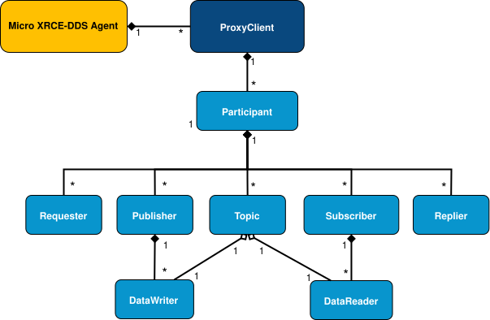

# micro-xrce-dds-client

`micro-xrce-dds-client`是`ROS2`的通信中间件，可以使得单片机如同在`ROS2`节点里一般收发数据。

## 概念

### 通信抽象

客户端与服务器的通讯基于操作(operation)与应答(response).客户端向服务器请求操作，服务器处理请求并返回应答。客户端收到服务器的应答后，可以继续请求操作。

### 事务session

通信开始于服务端与客户端的握手，通过握手，服务器认识到了当前客户端的存在.这是通过`Create session`操作实现的.创建事务操作必须是客户端与服务器通信的开始，其它任何的操作都会被服务器拒绝。成功创建事务后，客户端可以进一步请求`create entities`等操作.

在代码中，所有的其它操作都与特定的`session`关联，接受`session`作为参数。

### 操作operation

操作是客户端可能向服务器请求的动作，操作围绕实体展开.服务器会对所有操作请求做出成功或失败的应答.

客户可以进行的操作有

| **操作** | **描述** |
|:--------:|:--------:|
|     创建事务`Create session`     |     向服务器请求创建事务     |
|     删除事务`Delete session`     |     向服务器请求删除事务，并释放所有与之关联的实体。     |
|     创建实体`Create entity`     |     向服务器请求创建实体，指定实体的ID号与类型.     |
|     删除实体`Delete entity`     |     向服务器请求删除特定ID号与类型的实体     |
|     请求数据`Request Data`     |      向服务器请求数据，服务器会监听主机上的DDS消息，并把客户端请求的数据返回.这个过程是异步的，使用`data delivery control`类型，通过`DataReader`实体控制.    |

### 实体Entity

具体与服务器通信是通过实体管理的，通过`Create entity`操作可以创建实体，一个实体与一个DDS对象一一对应.

每个实体都有特定的类型与ID号，用于与其它实体区分，相同类型的实体不能拥有相同的ID号。

|   **实体**  | **描述** |
|:-----------:|:--------:|
| `Participant` |      `Participant`可以包含任意数量的`Publisher`与`Subscriber`.   |
|  `Publisher`  |      `Publisher`可以包含任意数量的`DataWriter`.    |
|  `Subscriber` |      `Subscriber`可以包含任意数量的`DataReader`.    |
|    `Topic`    |      `Topic`是通信的基础，具有名字与类型.    |
|  `DataWriter` |      `DataWriter`是向`Topic`写入数据的端点   |
|  `DataReader` |      `DataReader`是向`Topic`读取数据的端点    |
|  `Requester`  |      `Requester`可以写入请求并读取应答    |
|   `Replier`   |      `Replier`可以读取请求并写入应答    |

同`ROS2`概念一致，只不过添加了新的一层`DataWriter`,`DataReader`.数据使用`DataWriter`实体写入到`Publisher`.使用`DataReader`实体从`Subscriber`实体读取.



由图可知,一个`topic`与一个`DataWriter`,`DataReader`一一对应，一个`Publisher`可以有多个`DataWriter`,但一个`DataWriter`只能对应一个`Publisher`.

所有的实体都使用`xml`格式进行描述.

`topic`里发送的数据类型使用`xml`格式描述，使用工具把`.idl`格式的文件生成为`.h`头文件。使用数据的双方必须使用匹配的数据类型.

### 流Streams

客户端与服务器的通信都是经过抽象的数据流结构，数据流可以被看作是通信管道.有两种类型的流，`best-effort`与`reliable`.

## 使用方法

* [github repositories](https://github.com/eProsima/Micro-XRCE-DDS-Client)

### 从IDL文件中生成`.h`,`.c`文件

以下图的`IDL`文件为例

```idl
struct HelloWorld
{
    unsigned long index;
    string message;
};
```

使用给定的工具[Micro XRCE-DDS Gen tool](https://micro-xrce-dds.docs.eprosima.com/en/stable/installation.html#install-gen)就可以生成`.h`,`.c`文件

```shell
microxrceddsgen HelloWorld.idl
```

### 初始化自定义协议

```CPP
uxr_set_custom_transport_callbacks(
    &transport,
    true,
    my_custom_transport_open,
    my_custom_transport_close,
    my_custom_transport_write,
    my_custom_transport_read);
```

初始化自定义协议，只需要实现`open`,`close`,`write`,`read`回调函数即可。

### 初始化事务

```CPP
uxrSession session;
uxr_init_session(&session, &transport.comm, 0x08ABCDEF);
uxr_set_topic_callback(&session, on_topic, 0);
if (!uxr_create_session(&session))
{
  printf("uxr_create_session failed.\r\n");
  while (1)
  ;
}
```

`uxr_init_session`初始化`session`结构体.

从服务器传来的消息被分为两类，一类是`Request Data`请求后发送而来的主题消息，另一类是所有请求返回的状态消息，它们有各自的回调函数.

`uxr_set_topic_callback`设置了当事务接收到主题消息时触发的回调函数.`uxr_set_status_callback`设置了当事务接收到状态消息时触发的回调函数.

`uxr_create_session`函数尝试与服务器建立通信，发送`Create session`并等待服务器应答.

```CPP
reliable_out = uxr_create_output_reliable_stream(&session, output_reliable_stream_buffer, BUFFER_SIZE, STREAM_HISTORY);

reliable_in = uxr_create_input_reliable_stream(&session, input_reliable_stream_buffer, BUFFER_SIZE, STREAM_HISTORY);
```

成功建立事务后，便可以建立输出输入流，这不是`DDS`的实体，所以是由客户端管理的.

### 建立`Participant`

```CPP
uxrObjectId participant_id = uxr_object_id(0x01, UXR_PARTICIPANT_ID);
const char* participant_xml = "<dds>"
                                  "<participant>"
                                      "<rtps>"
                                          "<name>default_xrce_participant</name>"
                                      "</rtps>"
                                  "</participant>"
                              "</dds>";
uint16_t participant_req = uxr_buffer_create_participant_xml(&session, reliable_out, participant_id, 0,
                                                              participant_xml, UXR_REPLACE);;
```

创建`Participant`实体，这个函数接收`xml`描述字符串，在`reliable_out`输出流中缓存对应的`Create entity`并在随后的`run_session`实际发送.

### 创建`topic`

```CPP
uxrObjectId topic_id = uxr_object_id(0x01, UXR_TOPIC_ID);
const char* topic_xml = "<dds>"
                            "<topic>"
                                "<name>HelloWorldTopic</name>"
                                "<dataType>HelloWorld</dataType>"
                            "</topic>"
                        "</dds>";
uint16_t topic_req = uxr_buffer_create_topic_xml(&session, reliable_out, topic_id, participant_id, topic_xml, UXR_REPLACE);
```

创建`topic`，名字和数据类型由`xml`指定.`participant_id`就是`topic`对应的`Participant`实体.`topic_id`为这个`topic`的id.

### 创建`Publishers`与`Subscribers`

```CPP
uxrObjectId publisher_id = uxr_object_id(0x01, UXR_PUBLISHER_ID);
const char* publisher_xml = "";
uint16_t publisher_req = uxr_buffer_create_publisher_xml(&session, reliable_out, publisher_id, participant_id, publisher_xml, UXR_REPLACE);

uxrObjectId subscriber_id = uxr_object_id(0x01, UXR_SUBSCRIBER_ID);
const char* subscriber_xml = "";
uint16_t subscriber_req = uxr_buffer_create_subscriber_xml(&session, reliable_out, subscriber_id, participant_id, subscriber_xml, UXR_REPLACE);
```

创建`Publishers`与`Subscribers`,通常不需要特别的`xml`.

### 创建`DataWriters`与`DataReaders`

```CPP
uxrObjectId datawriter_id = uxr_object_id(0x01, UXR_DATAWRITER_ID);
const char* datawriter_xml = "<dds>"
                                 "<data_writer>"
                                     "<topic>"
                                         "<kind>NO_KEY</kind>"
                                         "<name>HelloWorldTopic</name>"
                                         "<dataType>HelloWorld</dataType>"
                                     "</topic>"
                                 "</data_writer>"
                             "</dds>";
uint16_t datawriter_req = uxr_buffer_create_datawriter_xml(&session, reliable_out, datawriter_id, publisher_id, datawriter_xml, UXR_REPLACE);

uxrObjectId datareader_id = uxr_object_id(0x01, UXR_DATAREADER_ID);
const char* datareader_xml = "<dds>"
                                 "<data_reader>"
                                     "<topic>"
                                         "<kind>NO_KEY</kind>"
                                         "<name>HelloWorldTopic</name>"
                                         "<dataType>HelloWorld</dataType>"
                                     "</topic>"
                                 "</data_reader>"
                             "</dds>";
uint16_t datareader_req = uxr_buffer_create_datareader_xml(&session, reliable_out, datareader_id, subscriber_id, datareader_xml, UXR_REPLACE);
```

创建`DataWriters`与`DataReaders`,这两个实体实际管理数据的收发，使用`xml`描述它们属于的`topic`,使用`publisher_id`/`subscriber_id`描述它们属于的`Publishers`与`Subscribers`.

### 服务器应答

客户端向服务器发送的请求服务器都会返回应答，这些被分类为状态消息.

对于`Create session`与`Delete session`操作，状态信息存储在`session.info.last_request_status`.对于剩余的操作，状态信息存储在第一个被创建的`reliable_in`流中.

在`uxr/client/core/session/session_info.h`中定义了服务器返回的消息类型.

```CPP
UXR_STATUS_OK
UXR_STATUS_OK_MATCHED
UXR_STATUS_ERR_DDS_ERROR
UXR_STATUS_ERR_MISMATCH
UXR_STATUS_ERR_ALREADY_EXISTS
UXR_STATUS_ERR_DENIED
UXR_STATUS_ERR_UNKNOWN_REFERENCE
UXR_STATUS_ERR_INVALID_DATA
UXR_STATUS_ERR_INCOMPATIBLE
UXR_STATUS_ERR_RESOURCES
UXR_STATUS_NONE (never send, only used when the status is known)
```

状态可以使用`on_status_callback`回调函数异步处理，也可以使用`run_session_until_all_status`同步处理.

```CPP
uint8_t status[6]; // we have 6 request to check.
uint16_t requests[6] = {participant_req, topic_req, publisher_req, subscriber_req, datawriter_req, datareader_req};
if(!uxr_run_session_until_all_status(&session, 1000, requests, status, 6))
{
    printf("Error at create entities\n");
    return 1;
}
```

`run_session`函数是客户端最重要的函数，它发送缓存的输出流消息，从服务器接收消息，调用回调函数，管理`reliable`流.由五种`run_session`各自实现不同的功能.

`uxr_run_session_time` - `uxr_run_session_until_timeout` - `uxr_run_session_until_confirmed_delivery` - `uxr_run_session_until_all_status` - `uxr_run_session_until_one_status`.

`uxr_run_session_until_all_status`等待服务器返回`UXR_STATUS_OK`消息。

### 写数据

```CPP
HelloWorld topic = {count++, "Hello DDS world!"};

ucdrBuffer ub;
uint32_t topic_size = HelloWorld_size_of_topic(&topic, 0);
(void) uxr_prepare_output_stream(&session, reliable_out, datawriter_id, &ub, topic_size);
(void) HelloWorld_serialize_topic(&ub, &topic);

uxr_run_session_until_confirmed_delivery(&session, 1000);
```

`HelloWorld_size_of_topic`,`HelloWorld_serialize_topic`由生成工具自动生成.

`uxr_prepare_output_stream`准备在`reliable_out`流中写入`topic_size`大小的`topic`数据，但是还没有进行，实际的写入是通过`HelloWorld_serialize_topic`函数进行的.`HelloWorld_serialize_topic`函数运行完毕后，主题消息便被缓存到了`reliable_out`流中的缓存区里.`ub`便没有必要存在了.

`uxr_run_session_until_confirmed_delivery`实际发送`topic`数据.

### 读数据

```CPP
uxrDeliveryControl delivery_control = {0};
delivery_control.max_samples = UXR_MAX_SAMPLES_UNLIMITED;

uint16_t read_data_req = uxr_buffer_request_data(&session, reliable_out, datareader_id, reliable_in, &delivery_control);
```

`delivery_control`用于控制接收消息的个数.

`uxr_buffer_request_data`向`reliable_out`流缓存`Request Data`操作，接受到这个操作后，服务器(如果正确运行)就会开始倾听`DDS`数据，并把新收到的数据发送到`reliable_in`流中.`datareader_id`表示接受的`DataDeader`实体。

```CPP
void on_topic(uxrSession* session, uxrObjectId object_id, uint16_t request_id, uxrStreamId stream_id, struct ucdrBuffer* ub, uint16_t length, void* args)
{
    (void) session; (void) object_id; (void) request_id; (void) stream_id; (void) length; (void) args;

    HelloWorld topic;
    HelloWorld_deserialize_topic(ub, &topic);
}
```

如果想要区分接收到的具体接收到的`topic`，可以使用`object_id`，它包含了对应的`DataDeader`实体`ID`.

### 关闭

```CPP
uxr_delete_session(&session);
uxr_close_custom_transport(&transport);
```

删除`session`并关闭.

## ROS2支持

为了可以使得在服务器直接使用`ROS2`接受与发送主题消息给客户端，需要如下的操作.

### 在主机上运行服务器

首先编译代码

```shell
git clone https://github.com/eProsima/Micro-XRCE-DDS-Agent.git
cd Micro-XRCE-DDS-Agent
mkdir build && cd build
cmake ../
cmake --build .
```

便会在当前文件夹编译生成`MicroXRCEAgent`可执行文件.

运行并指定服务器监听的串口

```shell
./MicroXRCEAgent serial --dev /dev/ttyACM0
```

### 在ROS2创建要接收或发送的消息

以`pubsub/msg/HelloWorld.msg`为例

```msg
uint32 index
string message
```

按照`ROS2`官方文档讲解的把`msg`文件安装,便会在`install/pubsub/share/pubsub/msg`文件夹中出现

```shell
HelloWorld.idl  HelloWorld.msg
```

这便是我们需要的`idl`文件.

### 生成idl文件

使用工具把`idl`文件生成`.c`,`.h`文件.

```shell
./scripts/microxrceddsgen HelloWorld.idl
```

把`.c`,`.h`文件复制到代码目录中.

本例中，会生成如下的消息类型

```CPP
typedef struct pubsub_msg_HelloWorld
{
    uint32_t index;
    char message[255];

} pubsub_msg_HelloWorld;
```

### 修改xml描述文件

修改`Topic`,`DataWriter`,`DataReader`的与`topic`有关的xml描述文件.

在主题名前面添加`rt/`，主题才能被`ROS2`发现。

把主题类型修改为`pubsub::msg::dds_::HelloWorld_`,也就是说，和主机上使用的消息`pubsub::msg::HelloWorld`对应.

## 例子

本例实现了`ROS2`从主题`SubHelloWorldTopic`读取消息，并通过主题`PubHelloWorldTopic`发布回去.

```CPP
uint8_t output_reliable_stream_buffer[BUFFER_SIZE];
uint8_t input_reliable_stream_buffer[BUFFER_SIZE];
const char *participant_xml = "<dds>"
                              "<participant>"
                              "<rtps>"
                              "<name>publish_subscribe_participant</name>"
                              "</rtps>"
                              "</participant>"
                              "</dds>";
const char *pub_topic_xml = "<dds>"
                            "<topic>"
                            "<name>rt/PubHelloWorldTopic</name>"
                            "<dataType>pubsub::msg::dds_::HelloWorld_</dataType>"
                            "</topic>"
                            "</dds>";
const char *sub_topic_xml = "<dds>"
                            "<topic>"
                            "<name>rt/SubHelloWorldTopic</name>"
                            "<dataType>pubsub::msg::dds_::HelloWorld_</dataType>"
                            "</topic>"
                            "</dds>";
const char *datawriter_xml = "<dds>"
                             "<data_writer>"
                             "<topic>"
                             "<kind>NO_KEY</kind>"
                             "<name>rt/PubHelloWorldTopic</name>"
                             "<dataType>pubsub::msg::dds_::HelloWorld_</dataType>"
                             "</topic>"
                             "</data_writer>"
                             "</dds>";
const char *datareader_xml = "<dds>"
                             "<data_reader>"
                             "<topic>"
                             "<kind>NO_KEY</kind>"
                             "<name>rt/SubHelloWorldTopic</name>"
                             "<dataType>pubsub::msg::dds_::HelloWorld_</dataType>"
                             "</topic>"
                             "</data_reader>"
                             "</dds>";
uxrStreamId reliable_out;
uxrStreamId reliable_in;
uxrObjectId participant_id;
uxrObjectId pub_topic_id;
uxrObjectId sub_topic_id;
uxrObjectId publisher_id;
uxrObjectId subscriber_id;
uxrObjectId datawriter_id;
uxrObjectId datareader_id;

void on_topic(
    uxrSession *session,
    uxrObjectId object_id,
    uint16_t request_id,
    uxrStreamId stream_id,
    struct ucdrBuffer *ub,
    uint16_t length,
    void *args)
{
  (void)session;

  (void)request_id;
  (void)stream_id;
  (void)length;
  (void)args;

  if (object_id.id == datareader_id.id)
  {
    pubsub_msg_HelloWorld topic;
    pubsub_msg_HelloWorld_deserialize_topic(ub, &topic);

    ucdrBuffer pub_ub;
    uint32_t topic_size = pubsub_msg_HelloWorld_size_of_topic(&topic, 0);
    uxr_prepare_output_stream(session, reliable_out, datawriter_id, &pub_ub, topic_size);
    pubsub_msg_HelloWorld_serialize_topic(&pub_ub, &topic);
  }
}

void PublishSubscribeTask(void const *argument)
{
  uxrCustomTransport transport;

  uxr_set_custom_transport_callbacks(
      &transport,
      true,
      my_custom_transport_open,
      my_custom_transport_close,
      my_custom_transport_write,
      my_custom_transport_read);

  if (!uxr_init_custom_transport(&transport, NULL))
  {
    printf("uxr_init_custom_transport failed.\r\n");
    while (1)
      ;
  }

  uxrSession session;
  uxr_init_session(&session, &transport.comm, 0x08ABCDEF);
  uxr_set_topic_callback(&session, on_topic, 0);
  if (!uxr_create_session(&session))
  {
    printf("uxr_create_session failed.\r\n");
    while (1)
      ;
  }
  // Streams

  reliable_out = uxr_create_output_reliable_stream(&session, output_reliable_stream_buffer, BUFFER_SIZE,
                                                   STREAM_HISTORY);

  reliable_in = uxr_create_input_reliable_stream(&session, input_reliable_stream_buffer, BUFFER_SIZE, STREAM_HISTORY);

  // Create entities
  participant_id = uxr_object_id(0x01, UXR_PARTICIPANT_ID);

  uint16_t participant_req = uxr_buffer_create_participant_xml(&session, reliable_out, participant_id, 0,
                                                               participant_xml, UXR_REPLACE);

  pub_topic_id = uxr_object_id(0x01, UXR_TOPIC_ID);
  sub_topic_id = uxr_object_id(0x02, UXR_TOPIC_ID);

  uint16_t pub_topic_req = uxr_buffer_create_topic_xml(&session, reliable_out, pub_topic_id, participant_id, pub_topic_xml,
                                                       UXR_REPLACE);
  uint16_t sub_topic_req = uxr_buffer_create_topic_xml(&session, reliable_out, sub_topic_id, participant_id, sub_topic_xml,
                                                       UXR_REPLACE);

  publisher_id = uxr_object_id(0x01, UXR_PUBLISHER_ID);
  subscriber_id = uxr_object_id(0x01, UXR_SUBSCRIBER_ID);

  const char *publisher_xml = "";
  uint16_t publisher_req = uxr_buffer_create_publisher_xml(&session, reliable_out, publisher_id, participant_id,
                                                           publisher_xml, UXR_REPLACE);
  const char *subscriber_xml = "";
  uint16_t subscriber_req = uxr_buffer_create_subscriber_xml(&session, reliable_out, subscriber_id, participant_id,
                                                             subscriber_xml, UXR_REPLACE);

  datawriter_id = uxr_object_id(0x01, UXR_DATAWRITER_ID);
  datareader_id = uxr_object_id(0x01, UXR_DATAREADER_ID);

  uint16_t datawriter_req = uxr_buffer_create_datawriter_xml(&session, reliable_out, datawriter_id, publisher_id,
                                                             datawriter_xml, UXR_REPLACE);
  uint16_t datareader_req = uxr_buffer_create_datareader_xml(&session, reliable_out, datareader_id, subscriber_id,
                                                             datareader_xml, UXR_REPLACE);

  // Send create entities message and wait its status
  uint8_t status[7];
  uint16_t requests[7] = {
      participant_req, pub_topic_req, sub_topic_req, publisher_req, subscriber_req, datawriter_req, datareader_req};
  if (!uxr_run_session_until_all_status(&session, 2000, requests, status, 7))
  {
    printf("Error at create entities: participant: %i topic: %i publisher: %i darawriter: %i\n", status[0],
           status[1], status[2], status[3]);
  }

  // Request topics
  uxrDeliveryControl delivery_control = {
      0};
  delivery_control.max_samples = UXR_MAX_SAMPLES_UNLIMITED;
  uxr_buffer_request_data(&session, reliable_out, datareader_id, reliable_in, &delivery_control);

  /* Infinite loop */
  for (;;)
  {
    uxr_run_session_until_data(&session, 500);
  }
  uxr_delete_session(&session);
  uxr_close_custom_transport(&transport);
}
```
