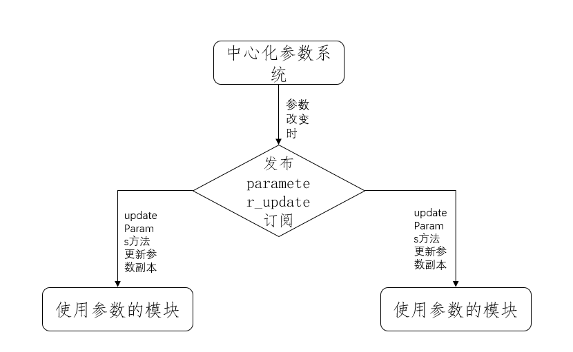

# Parameters

`PX4`使用参数`Parameters`来配置一系列的无人机行为，从PID参数到飞行模式等等一系列的参数都可以配置。

参数有默认值，可以在飞行中改变，可以从文件中读取参数。

* [参数大全](https://docs.px4.io/v1.14/en/advanced_config/parameter_reference.html)

## 结构

`PX4`参数子系统是中心化的系统，但是每个使用特定参数的模块类都会创造一个特定的副本，只在每个`updateParams`类方法下才会从中心参数系统中读取参数的更新，`updateParams`通常是在特定的`parameter_update`订阅发生后才调用的。

模块不需要自己实现`updateParams`方法，只需要调用`ModuleParams::updateParams();`即可自动地更新参数副本。



## 定义参数

参数都是在各个模块中的`*_params.c`文件或者`module.yaml`中定义的，比如`mc_pos_control`模块下的`MPC_VEL_MANUAL`参数

```C
/**
 * Maximum horizontal velocity setpoint in Position mode
 *
 * Must be smaller than MPC_XY_VEL_MAX.
 *
 * The maximum sideways and backward speed can be set differently
 * using MPC_VEL_MAN_SIDE and MPC_VEL_MAN_BACK, respectively.
 *
 * @unit m/s
 * @min 3
 * @max 20
 * @increment 1
 * @decimal 1
 * @group Multicopter Position Control
 */
PARAM_DEFINE_FLOAT(MPC_VEL_MANUAL, 10.f);
```

* `PARAM_DEFINE_FLOAT`定义了一个`float`类型的参数.类似的`PARAM_DEFINE_INT32`定义了一个`int32`类型的参数。
* 通常有注释，描述这个参数的功能与必要的信息。

`px4`会自动地生成一个文件`px4_parameters.hpp`包含所有定义的参数，所有的参数都在一个枚举类`params`里，所有参数名以及初始值会放在一个`constexpr`的`param_info_s`的类里，顺序和枚举类里的顺序一致。

在`module.yaml`中定义的参数可以使用通配符，可以一次性定义一类参数,比如`control_allocator`模块下的电机参数.

```yaml
CA_ROTOR${i}_PX:
    description:
        short: Position of rotor ${i} along X body axis relative to center of gravity
    type: float
    decimal: 2
    increment: 0.1
    unit: m
    num_instances: *max_num_mc_motors
    min: -100
    max: 100
    default: 0.0
```

## 使用参数

要使用参数的类必须公有继承`ModuleParams`类，获得更新参数的方法。

```CPP
class A : public ModuleParams
```

以参数`MPC_POS_MODE`为例，在要使用它的类里添加

```CPP
  DEFINE_PARAMETERS(
    (ParamInt<px4::params::MPC_POS_MODE>) _param_mpc_pos_mode
  );
```

这里定义了一个`MPC_POS_MODE`参数的副本`_param_mpc_pos_mode`,它的类型是`ParamInt<px4::params::MPC_POS_MODE>`.

这样，使用`_param_mpc_pos_mode.get()`就可以获取参数的当前值。

## 更新参数

订阅`parameter_update`主题.

```CPP
uORB::SubscriptionInterval _parameter_update_sub{ORB_ID(parameter_update), 1_s};
```

在模块的`run`函数中，添加以下代码检测参数是否改变

```CPP
  // Check if parameters have changed
  if (_parameter_update_sub.updated()) {
    // clear update
    parameter_update_s param_update;
    _parameter_update_sub.copy(&param_update);
    updateParams();
  }
```

同时，实现`updateParams()`函数

```CPP
void FlightModeManager::updateParams()
{
  ModuleParams::updateParams();

  if (isAnyTaskActive()) {
    _current_task.task->handleParameterUpdate();
  }
}
```

通常，只需要调用基类的`ModuleParams::updateParams()`就可以了。也可以在参数改变时添加自己的逻辑。

## 使用外部参数

可以使用一个参数引用外部的变量，保持了参数的API

在`DEFINE_PARAMETERS`里添加新的一行

```CPP
(ParamExtFloat<px4::params::EKF2_DELAY_MAX>) _param_ekf2_delay_max,
```

注意，此时参数的类型是`ParamExtFloat`,它是一个`float`变量的引用。

需要在构造函数处初始化这个参数

```CPP
_param_ekf2_delay_max(_params->delay_max_ms),
```
