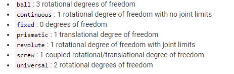
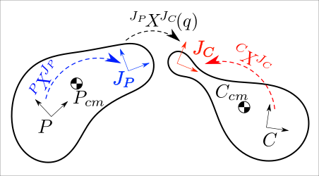
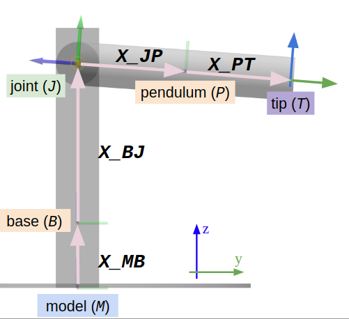
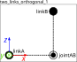
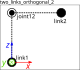
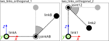

# SDFormat

参考文档

* [SDFormat 官方文档](http://sdformat.org/tutorials?)

`SDF`是用于`gazebo`仿真的文件格式，与`ROS2`的`URDF`不同的是，`SDF`描述单个机器人的构型，`URDF`描述整个仿真世界与多个机器人构型的问题。

## 描述惯例

```xml
<model name="model_name">
  <pose>0 0 0.5 0 0 0</pose>
  <link name="link">
  </link>
  <joint type="revolute" name="my_joint">
  </joint>
</model>
```

`sdf`通常使用`XPath`来描述元素与属性。比如`<model>`标签可以写成`//model`，`<model>`下的`name`属性可以写成`//model/@name`.`<link>`和`<joint>`子元素可以分别写出`//model/link`,`//model/joint`.

## 指明姿态

参考文档

* [Specifying pose in SDFormat](http://sdformat.org/tutorials?tut=specify_pose&cat=specification&)

```xml
<pose>x y z roll pitch yaw</pose>
```

`SDF`使用`<pose>`元素来描述坐标系间的姿态转换矩阵。相对于父坐标系，子坐标系需要进行的变换。使用`extrinsic`旋转，转序`xyz`.

`<pose>`元素就相当于`URDF`中的元素`<origin>`.只是相对坐标系可能有所不同。

## 声明模型运动学

参考文档

* [Specifying model kinematics in SDFormat](http://sdformat.org/tutorials?tut=spec_model_kinematics&cat=specification&)

### `<model>`

参考文档

* [详细结构](http://sdformat.org/spec?ver=1.7&elem=model)

`<model>`标签包含一组`<link>`和`<joint>`的集合。

```xml
<model name="model_with_pose">
  <pose>{xyz_WM} {rpy_WM}</pose>
</model>
```

### `<link>`

参考文档

* [详细结构](http://sdformat.org/spec?ver=1.7&elem=link)

`<model>`的子元素，`<link>`表示了一个刚体。

同一类型的所有同级元素必须具有唯一的名称,以下的`UDF`不合法。

```xml
<model name="invalid_two_links_same_name">
  <link name="link"/>
  <link name="link"/> <!-- INVALID: Same name as sibling "link"! -->
</model>
```

每个`<link>`都具有一个本地坐标系，使用`<pose>`指定初始的姿态,相对于模型参考系。

```xml
<model name="model_and_link_pose">
  <pose>{xyz_WM} {rpy_WM}</pose>
  <link name="link">
    <pose>{xyz_ML} {rpy_ML}</pose>
  </link>
</model>
```

### `<joint>`

参考文档

* [详细结构](http://sdformat.org/spec?ver=1.7&elem=joint)

`<joint>`表示刚体`<link>`之间的运动学关系，它限制这些链接之间的自由度.

使用`type`属性声明`<joint>`的类型。



使用`<parent>`声明父`<link>`，使用`child`声明子`<link>`.使用名字指定`<link>`

```xml
<model name="two_links_fixed">
  <link name="link1"/>
  <link name="link2"/>
  <joint name="joint" type="fixed">
    <parent>link1</parent>
    <child>link2</child>
  </joint>
</model>
```

#### `<joint><axis>`

使用`<axis>`、`<axis2>`子元素来声明`<joint>`旋转或平移的轴。

`<xyz>`单位向量表示`<axis>`轴，相对于`joint`本地坐标系。

```xml
<model name="joint_axis">
  <link name="A"/>
  <link name="B"/>
  <link name="C"/>
  <joint name="J1" type="revolute">
    <pose>0 0 0 1.57 0 0</pose>
    <parent>A</parent>
    <child>B</child>
    <axis>
      <xyz>0 0 1</xyz> <!-- The xyz unit vector is expressed in the joint frame -->
    </axis>
  </joint>
  <joint name="J2" type="revolute">
    <parent>B</parent>
    <child>C</child>
    <axis>
      <xyz>0 0 1</xyz> <!-- The xyz unit vector is expressed in the parent link's model frame. Thus, this axis is orthogonal to the axis of J1 -->
      <use_parent_model_frame>true</use_parent_model_frame>
    </axis>
  </joint>
</model>
```

#### `<joint><pose>`

`<pose>`描述了`Jc`坐标系相对于子`<link>`的位姿。`Jc`是固连在子`<link>`上的坐标系，`Jp`是固连在父`<link>`上的坐标系。



`Jp`的位姿并没有明确指出，而是根据关节零点配置以及`P`和`C`的位姿计算出来。

注意，这个的定义与`URDF`的不同。`URDF`中的`Jc`,`Jp`重合，默认无关节零点。

### 指明位姿的相对坐标系

参考文档

* [Pose Frame Semantics Tutorial](http://sdformat.org/tutorials?tut=pose_frame_semantics&cat=specification&)

新版本的`SDF`文件支持指明位姿的相对坐标系。使用`relative_to`属性便可以指明相对的坐标系，这个属性只是影响构型的初始状态，对后续的移动没有影响。

```xml
<sdf version="1.7">
  <model name="pendulum_with_base">
    <link name="base">
      <pose>0 0 0.3   0 0 0</pose>
    </link>
    <link name="pendulum">
      <pose relative_to="joint">
        0 0 -0.5 0 0 0
      </pose>
    </link>
    <joint name="joint" type="revolute">
      <parent>base</parent>
      <child>pendulum</child>
      <pose relative_to="base">
        0 0 0.73 1.57 0 0
      </pose>
      <axis>
        <xyz>1 0 0</xyz>
      </axis>
    </joint>
  </model>
</sdf>
```



### 声明一个命名坐标系

可以使用`<frame>`声明一个命名坐标系。它需要包含

* `//frame/@name`
* `//frame/@attached_to`
* `//frame/pose`可以使用`//frame/pose/@relative_to`指明相对坐标系，如果没有指明，则相对于`//frame/@attached_to`.

对于上一节的模型，创建了一个命名坐标系`tip`,它固定在`pendulum`的最远端.还创建了这个命名坐标系的可视化

递归地查找`//frame/@attached_to`指定地坐标系必须最终落到一个`<link>`中。

### 声明模型坐标系

`<model>`使用`//model/@canonical_link`指定模型坐标系固定在的`<link>`名，如果未指定，那么便使用第一个出现的`<link>`作为模型坐标系固定的`<link>`.

```xml
<sdf version="1.7">
  <model name="pendulum_with_base" canonical_link="base">
    <link name="pendulum">
      <pose relative_to="joint">
        0 0 -0.5 0 0 0
      </pose>
    </link>
    <link name="base">
      <pose>0 0 0.3   0 0 0</pose>
    </link>
    <joint name="joint" type="revolute">
      <parent>base</parent>
      <child>pendulum</child>
      <pose relative_to="__model__">
        0 0 1.03 1.57 0 0
      </pose>
      <axis>
        <xyz>1 0 0</xyz>
      </axis>
    </joint>
  </model>
</sdf>
```

### 例子

```xml
<model name="two_links_orthogonal_1">
  <link name="linkA">
    <pose>0 0 0 0 0 0</pose>
  </link>
  <link name="linkB">
    <pose>0.1 0 0.1 0 0 0</pose>
  </link>
  <joint name="jointAB" type="revolute">
    <pose>0 0 -0.1 0 0 0</pose>
    <parent>linkA</parent>
    <child>linkB</child>
    <axis>
      <xyz>0 1 0</xyz>
    </axis>
  </joint>
  <joint name="joint_world" type="fixed">
    <parent>world</parent>
    <child>linkA</child>
  </joint>
</model>
```



```xml
<model name="two_links_orthogonal_2">
  <link name="link1">
    <pose>0 0 0 0 0 0</pose>
  </link>
  <link name="link2">
    <pose>0.1 0 0.1 0 0 0</pose>
  </link>
  <joint name="joint12" type="revolute">
    <pose>-0.1 0 0.0 0 0 0</pose>
    <parent>link1</parent>
    <child>link2</child>
    <axis>
      <xyz>0 1 0</xyz>
    </axis>
  </joint>
  <joint name="joint_world" type="fixed">
    <parent>world</parent>
    <child>link1</child>
  </joint>
</model>
```



在旋转时，如下



## 碰撞与视觉

`SDF`中使用`<visual>`和`<collision>`描述`<link>`的碰撞属性与视觉属性。

可以使用`<pose>`子元素，相对于所在`<link>`的参考坐标系。

参考文档

* [Adding shapes to a model with collisions and visuals in SDFormat](http://sdformat.org/tutorials?tut=spec_shapes&cat=specification&)
* [visual 详细结构](http://sdformat.org/spec?ver=1.4&elem=visual)
* [collision 详细结构](http://sdformat.org/tutorials?tut=spec_shapes&cat=specification&)

### `<geometry>`

描述集合体的标签。

参考文档

* [geometry 详细结构](http://sdformat.org/spec?ver=1.7&elem=geometry)

```xml
<link name="link">
  <collision name="collision">
    <geometry>
      <sphere>
        <radius>0.5</radius>
      </sphere>
    </geometry>
  </collision>
  <visual name="visual">
    <geometry>
      <sphere>
        <radius>0.5</radius>
      </sphere>
    </geometry>
  </visual>
</link>
```

### 组成复杂的形状

```xml
<link name="link1">
  <pose>0 0 0.5 0 0 0</pose>
  <visual name="vis1">
    <pose>0 0 0 0 0 0</pose>
    <geometry>
      <cylinder>
        <radius>1</radius>
        <length>1</length>
      </cylinder>
    </geometry>
  </visual>
  <visual name="vis2">
    <pose>0 0 0.5 0 0 0</pose>
    <geometry>
      <sphere>
        <radius>1</radius>
      </sphere>
    </geometry>
  </visual>
</link>
```

## 创建世界`<world>`

参考文档

* [Creating Worlds in SDFormat](http://sdformat.org/tutorials?tut=spec_world&cat=specification&)
* [详细信息](http://sdformat.org/spec?ver=1.4&elem=world)

世界`World`就是一个仿真环境，模型可以在这里实例化并使用物理模型仿真。使用`<world>`创建仿真世界。

最重要的属性就是，`world`定义了世界坐标系，这是一个惯性坐标系，当模型作为直接子类插入到`world`中时，它的位姿便是相对于世界坐标系而定义的。

### 指定物理引擎属性`<physics>`

```xml
<physics name="1ms" type="ignored">
  <max_step_size>0.001</max_step_size>
  <real_time_factor>1.0</real_time_factor>
</physics>
```

* `<max_step_size>`仿真器的最大步长
* `<real_time_factor>`仿真时间与实际时间的比值，大于一则加速，小于一则减速。

### 内联定义模型

```xml
<?xml version="1.0" ?>
<sdf version="1.4">
  <world name="simple_world">
    <model name="ground">
      <link name="body">
        ...
      </link>
    </model>
    <model name="box">
      <pose>0 0 1 0 0 0</pose>
      <link name="body">
        ...
      </link>
    </model>
    <model name="sphere">
      <pose>10 0 2 0 0 0</pose>
      <link name="body">
        ...
      </link>
    </model>
  </world>
</sdf>
```

其中一个方法便是直接在`world`中定义模型。这是最简单的方法，因为它只需要一个文件来描述世界。然而，它有一些缺点。

1. 如果需要同一模型但处于不同位姿的多个实例，则必须复制`<model>`标记的整个文本。
2. 在`world`标签中定义的模型不能在其他`world`或其他`SDF`文件中使用。

## 集成

参考文档

* [Composition](http://sdformat.org/tutorials?tut=composition&cat=specification&)

`<model>`是SDF世界的基础组成部分，`SDF`支持在`<model>`里包含`<model>`的集成方法。

### 直接在模型里定义模型

```xml
<model name="Pm">
  <link name="body"/>
  <model name="sphere">
    <pose>0 0 0.5 0 0 0</pose>
    <link name="body"/>
  </model>
</model>
```

### 在其它文件里定义模型

可以在其它文件里定义模型，此时需要遵循特定的目录结构。要求每个模型都有自己独立的目录，并包含至少一个`model.config`描述模型的配置,比如对于`sphere`模型

```xml
.
├── sphere
    ├── model.config
    └── model.sdf
```

```xml
<!-- Metadata file: sphere/model.config -->
<?xml version="1.0" ?>
<model>
  <sdf version="1.5">model.sdf</sdf>
</model>
```

```xml
<!-- Model definition: sphere/model.sdf -->
<?xml version="1.0" ?>
<sdf version="1.5">
  <model name="sphere">
    <link name="body">
      <visual name="v1">
        <geometry>
          <sphere>
            <radius>0.1</radius>
          </sphere>
        </geometry>
      </visual>
    </link>
  </model>
</sdf>
```

### 包含模型

使用`<include>`标签把定义的模型加入到父模型中。还可以指定以下的属性

* `<uri>`用于指示要包含的模型目录的位置的字符串，可以是本地也可以是服务器资源
* `<name>`覆盖嵌套模型的名称。
* `<pose>`覆盖嵌套模型的位姿。
* `<static>`覆盖所包含模型的静态值。
* `<plugin>`要添加到与所包含模型关联的插件列表中的插件元素

```xml
<model name="Pm">
  <include>
    <uri>/path/to/sphere</uri>
    <pose>0 0 0.5 0 0 0</pose>
  </include>
  <include>
    <uri>/path/to/sphere</uri>
    <name>sphere1</name>
    <pose>0 0 1 0 0 0</pose>
  </include>
  <include>
    <uri>/path/to/sphere</uri>
    <name>sphere2</name>
    <pose>1 0 1 0 0 0</pose>
  </include>
</model>
```

这个路径要不就是当前工作目录或者就是`GZ_SIM_RESOURCE_PATH`指定的目录。

在[Gazebo Fuel website](https://app.gazebosim.org/fuel/models?page=2&per_page=20)有许多的模型可供使用

```xml
<include>
    <uri>
    https://fuel.gazebosim.org/1.0/OpenRobotics/models/Coke
    </uri>
</include>
```

这个会在运行时从服务器下载模型

### `<include>`原理

目前`libsdformat`实现`<include>`的方式是把要包含模型的所有`joint`和`link`复制到包含位置，同时修改`<pose>`相对于父`<model>`坐标系。为了避免名称冲突，还会给被包含模型的`<joint>`和`<link>`添加上`::`名称空间。

```xml
<model name="ChildModel">
  <link name="L1">
    <pose>0 1 0 0 0 0</pose>
    <visual name="v1">
      <geometry>
        <sphere>
          <radius>0.1</radius>
        </sphere>
      </geometry>
    </visual>
  </link>
  <link name="L2"/>
  <joint name="J1" type="revolute">
    <parent>L1</parent>
    <child>L2</child>
  </joint>
</model>
```

```xml
<model name="ParentModel">
  <include>
    <uri>/path/to/ChildModel</uri>
    <pose>1 0 1 0 0 0</pose>
  </include>
</model>
```

经过处理后，变为

```xml
<model name="ParentModel">
  <frame name="ChildModel::__model__" attached_to="ChildModel::L1">
    <pose relative_to="__model__">1 0 1 0 0 0</pose>
  </frame>
  <link name="ChildModel::L1">
    <pose relative_to="ChildModel::__model__">0 1 0 0 0 0</pose>
    <visual name="v1">
      <geometry>
        <sphere>
          <radius>0.1</radius>
        </sphere>
      </geometry>
    </visual>
  </link>
  <link name="ChildModel::L2">
    <pose relative_to="ChildModel::__model__">0 0 0 0 0 0</pose>
  </link>
  <joint name="ChildModel::J1" type="revolute">
    <parent>ChildModel::L1</parent>
    <child>ChildModel::L2</child>
  </joint>
</model>
```

也就是说，如果想要指定`include`模型的`link`需要加上名称空间。

```xml
<model name="spheres">
  <link name="body"/>
  <include>
    <uri>/path/to/sphere</uri>
    <pose>0 0 0.5 0 0 0</pose>
    <name>sphere1</name>
  </include>
  <include>
    <uri>/path/to/sphere</uri>
    <pose>1 0 0.5 0 0 0</pose>
    <name>sphere2</name>
  </include>
  <joint name='j1' type='fixed'>
    <parent>sphere1::body</parent> <!-- Link contained in model sphere1 -->
    <child>sphere2::body</child> <!-- Link contained in model sphere2 -->
  </joint>
</model>
```

## URDF支持

参考文档

* [SDFormat extensions to URDF](http://sdformat.org/tutorials?tut=sdformat_urdf_extensions&cat=specification&)

当加载`URDF`文件时，`gazebo`首先把它转化为`SDF`格式的文件。用户如果想要在`URDF`中添加`SDF`文件的属性，可以在`URDF`文件中添加标签`<gazebo>`。

`URDF`到`SDF`的转换是自动发生的，但是可以使用

```shell
gz sdf -p <path to urdf file>
```

比如

```shell
xacro my_quad.urdf.xacro > my_quad.urdf
gz sdf my_quad.urdf > my_quad.sdf
```

把`xacro`文件转化为`urdf`文件，之后再使用`gz sdf`将其转化为`sdf`文件.

### `<gazebo>`用于`<robot>`

`URDF`中的`<robot>`下不带`reference`的`<gazebo>`标签会应用在`<model>`标签下。

```xml
<?xml version='1.0' encoding='UTF-8'?>
<!--URDF-->
<robot name='no_ref_example'>
  <link name='world'/>
  <gazebo>
    <static>true</static>
    <plugin name='testPlugin' filename='testFileName'/>
  </gazebo>
</robot>
```

```xml
<!--SDFormat-->
<sdf version='1.9'>
  <model name='no_ref_example'>
    <static>true</static>
    <plugin name='testPlugin' filename='testFileName'/>
  </model>
</sdf>
```

### `<gazebo>`用于`<link>`

`URDF`中带`reference`属性的`<gazebo>`标签会应用在对应的`<link>`下。

有的元素是直接插入的，而有的元素则需要修改，比如修改插入位置或结构。

```xml
<?xml version='1.0' encoding='UTF-8'?>
<!--URDF-->
<robot name='friction_example'>
  <link name='base_link'>
    <inertial>
      <mass value='0.12' />
      <inertia ixx='0.01' ixy='0' ixz='0' iyy='0.01' iyz='0' izz='0.01' />
    </inertial>
    <collision>
      <geometry>
        <sphere radius="2"/>
      </geometry>
    </collision>
    <collision>
      <geometry>
        <cylinder radius="1" length="2"/>
      </geometry>
    </collision>
  </link>
  <gazebo reference='base_link'>
    <mu1>0.25</mu1>
  </gazebo>
</robot>
```

`<mu1>`标签会转换为`collision`标签下的`//surface/friction/ode/mu`

```xml
<!--SDFormat-->
<sdf version='1.9'>
  <model name='friction_example'>
    <link name='base_link'>
      <inertial>
        <pose>0 0 0 0 0 0</pose>
        <mass>0.12</mass>
        <inertia>
          <ixx>0.01</ixx>
          <ixy>0</ixy>
          <ixz>0</ixz>
          <iyy>0.01</iyy>
          <iyz>0</iyz>
          <izz>0.01</izz>
        </inertia>
      </inertial>
      <collision name='base_link_collision'>
        <pose>0 0 0 0 0 0</pose>
        <geometry>
          <sphere>
            <radius>2</radius>
          </sphere>
        </geometry>
        <surface>
          <contact>
            <ode/>
          </contact>
          <friction>
            <ode>
              <mu>0.25</mu>
            </ode>
          </friction>
        </surface>
      </collision>
      <collision name='base_link_collision_1'>
        <pose>0 0 0 0 0 0</pose>
        <geometry>
          <cylinder>
            <length>2</length>
            <radius>1</radius>
          </cylinder>
        </geometry>
        <surface>
          <contact>
            <ode/>
          </contact>
          <friction>
            <ode>
              <mu>0.25</mu>
            </ode>
          </friction>
        </surface>
      </collision>
    </link>
  </model>
</sdf>
```

### `<gazebo>`标签下的`<visual>`,`<collision>`,`<material>`

在`<gazebo>`标签下使用`<visual>`,`<collision>`,`<material>`意味着在转换成`SDF`文件时更新对应的属性，注意，这个会影响`<link>`下所有的`<visual>`(或是其它两个).

### `<gazebo>`用于`<joint>`

和`<link>`类似，也是需要使用`reference`属性指定`<joint>`，也是有的标签直接插入但是有的标签需要修改。

```xml
<?xml version='1.0' encoding='UTF-8'?>
<!--URDF-->
<robot name='joint_example'>
  <link name='base_link'>
    <inertial>
      <mass value='0.12' />
      <inertia ixx='0.01' ixy='0' ixz='0' iyy='0.01' iyz='0' izz='0.01' />
    </inertial>
  </link>
  <joint name='j1' type='continuous'>
    <parent link='base_link'/>
    <child link='end_effector'/>
    <origin xyz='0 0 1' rpy='0 0 0'/>
  </joint>
  <link name='end_effector'>
    <inertial>
      <mass value='0.12' />
      <inertia ixx='0.01' ixy='0' ixz='0' iyy='0.01' iyz='0' izz='0.01' />
    </inertial>
  </link>
  <gazebo reference='j1'>
    <springReference>0.5</springReference>
    <springStiffness>0.25</springStiffness>
  </gazebo>
</robot>
```

生成的`UDF`文件为

```xml
<!--SDFormat-->
<sdf version='1.9'>
  <model name='joint_example'>
    <link name='base_link'>
      <inertial>
        <pose>0 0 0 0 0 0</pose>
        <mass>0.12</mass>
        <inertia>
          <ixx>0.01</ixx>
          <ixy>0</ixy>
          <ixz>0</ixz>
          <iyy>0.01</iyy>
          <iyz>0</iyz>
          <izz>0.01</izz>
        </inertia>
      </inertial>
    </link>
    <joint name='j1' type='revolute'>
      <pose relative_to='base_link'>0 0 1 0 0 0</pose>
      <parent>base_link</parent>
      <child>end_effector</child>
      <axis>
        <xyz>1 0 0</xyz>
        <limit>
          <lower>-10000000000000000</lower>
          <upper>10000000000000000</upper>
        </limit>
        <dynamics>
          <spring_reference>0.5</spring_reference>
          <spring_stiffness>0.25</spring_stiffness>
        </dynamics>
      </axis>
      <physics>
        <ode>
          <limit>
            <cfm>0</cfm>
            <erp>0.20000000000000001</erp>
          </limit>
        </ode>
      </physics>
    </joint>
    <link name='end_effector'>
      <pose relative_to='j1'>0 0 0 0 0 0</pose>
      <inertial>
        <pose>0 0 0 0 0 0</pose>
        <mass>0.12</mass>
        <inertia>
          <ixx>0.01</ixx>
          <ixy>0</ixy>
          <ixz>0</ixz>
          <iyy>0.01</iyy>
          <iyz>0</iyz>
          <izz>0.01</izz>
        </inertia>
      </inertial>
    </link>
  </model>
</sdf>
```

## plugin

* [plugin](./Plugin.md)

`UDF`格式支持`<plugin>`标签。

`<plugin>`标签包含两个必须的属性

* `filename`是库文件的名字
* `name`是插件的名字

还有许多特定包需要的属性

```xml
<plugin
    filename="gz-sim-diff-drive-system"
    name="gz::sim::systems::DiffDrive">
    <left_joint>left_wheel_joint</left_joint>
    <right_joint>right_wheel_joint</right_joint>
    <wheel_separation>1.2</wheel_separation>
    <wheel_radius>0.4</wheel_radius>
    <odom_publish_frequency>1</odom_publish_frequency>
    <topic>cmd_vel</topic>
</plugin>
```

## 传感器

只能使用`gazebo`支持的传感器类型

* [sensor](http://sdformat.org/spec?elem=sensor&ver=1.10)
