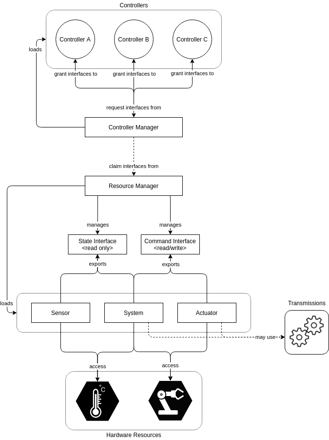

# ros2_control

参考文档

* [ros2 control官方文档](https://control.ros.org/humble/doc/getting_started/getting_started.html)

`ros2_control`是一个使用`ROS 2`实时控制机器人的框架。

## 关键概念

### Controller Manager

控制器管理器(CM),连接控制器与硬件抽象层.它还可以用户接口的`ROS`服务的入口点.`CM`实现了一个没有执行器的节点，以便它可以集成到自定义设置中。

一方面，`CM`通过`LifecycleNode`管理控制器以及它们所需的接口.另一方面，它通过资源管理器`Resource Manager`管理硬件部分。`CM`拥有需求和提供的接口，在启用时授予控制器对硬件的访问权限，或者在存在访问冲突时报告错误。

控制回路的执行通过`CM`的`update()`成员函数进行管理，函数从硬件部分读取数据，更新控制器的输出，把结果写入硬件部分。

### Resource Manager

资源管理器(RM)抽象物理硬件层以及它们的驱动，物理硬件层与硬件驱动统称为硬件部分(hardware components).`RM`使用`pluginlib`加载硬件部分，管理它们的生命周期，状态接口(state interfaces)与命令接口(command interfaces)。`RM`抽象层使得硬件部分的重用成为可能。

在控制回路中，`RM`的`read()`与`write()`成员函数处理与硬件部分的通信。

### Controllers

控制器(Controllers)是基于控制理论的，它把当前状态与期望状态进行比较，计算控制输出。控制器都是`ControllerInterface`类的子类，同时使用`pluginlib`包生成为`plugin`.控制器的生命周期是基于`LifecycleNode`的。

### User Interfaces

用户接口(User Interfaces)使用`CM`的服务。具体支持的服务可以查看`controller_manager_msgs`包的`srv`文件夹。

### Hardware Components

硬件部分包含实际的物理层通信与它在`ROS2 Control`中的抽象。硬件部分也使用`pluginlib`生成`plugin`,以便在运行时随时添加与删除。

硬件部分负责实际的与硬件通信，读取`URDF`，导出状态接口与命令接口给`RM`.接受`RM`的`read()`，`write()`,请求.

主要有三种硬件部分。

#### 系统System

复杂的，多自由度的机器人硬件，例如工业机器人。执行器组件之间的主要区别是可以使用复杂的传动装置，例如人形机器人的手所需的传动装置。这个类型的硬件部分支持写与读，当只有一个到硬件的逻辑通信通道时使用它。

#### 传感器Sensor

用于感知环境的硬件部分，传感器组件与关节（例如编码器）或连杆（例如力扭矩传感器）相关。这个类型的硬件部分只支持读。

#### 执行器Actuator

简单的，一自由度的机器人硬件，如电机、阀门等。执行器实现仅与一个关节相关。这个类型的硬件部分支持写与读，读是可选的，

#### 在URDF中

`ROS2 Control`在`URDF`中使用`<ros2_control>`来描述硬件部分。

参考文档

* [ROS 2 Control Components URDF Examples design document](https://github.com/ros-controls/roadmap/blob/master/design_drafts/components_architecture_and_urdf_examples.md)
* [ROS2 Control URDF](../../URDF/ros2_control.md)

## 使用方法

使用`ros2_control`框架的方法如下

* 创建一个`YAML`配置文件，用来配置控制器与控制器管理器。
* 扩展机器人的`URDF`文件，使用`<ros2_control>`来描述硬件部分。
* 创建一个`launch`文件启动具有`CM`的节点，可以使用一个默认的`ros2_control node`节点或者是把`CM`集成到自己的软件栈上。

## 更新频率

`ros2 control`控制器更新的频率就是`update`函数调用的频率，在这个函数里在调用`read`与`write`来向硬件获取信息.目前`ros2`只支持一个更新速率.