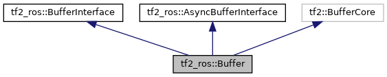

# tf2

参考文档

* [tf2](https://docs.ros.org/en/humble/Tutorials/Intermediate/Tf2/Tf2-Main.html)

一个机器人系统通常包括许多三维坐标系，这些坐标系通常是时变的，比如世界坐标系，基座坐标系，抓手坐标系，头部坐标系等等。`tf2`会跟踪这些在坐标系，并允许用户询问

* `5`秒前，头部坐标系相对于世界坐标系在哪里？
* 抓手坐标系相对于基座坐标系的姿态是什么？
* 在地图坐标系下，当前基座坐标系的姿态是什么？

## 主要概念

### 广播

`tf2`采用广播`broadcaster`来发布指定坐标系的信息，在某一时刻，广播指定的坐标系`id`，子坐标系`id`，它相对于父坐标系的姿态。

### 静态广播

有的坐标系相对于其父坐标系是恒定不变的，比如固连在机体上的摄像头坐标系，`tf2`支持发布静态坐标系广播。

### 动态广播

有的坐标系随着时间改变，那么便需要在坐标系改变时发布`tf2`广播，只有发布了广播，此时的坐标系才会被`tf2`获取到，从而用于后续的坐标系转换。

### tf2树

`tf2`给管理的坐标系构建了树形结构，且不允许闭环的树。


`tf2`树使得`tf2`可以很方便地管理许多坐标系，并在需要获取某一坐标系的时候沿着树回溯，最终获取到当前某一坐标系相对于其它任何坐标系的姿态。

注意，`tf2`获取的坐标系信息依赖于`tf2`广播，如果一个坐标系实际改变了，但是没有使用`tf2`进行广播，`tf2`不会获取到这个改变的信息，从而使用之前的信息计算相对姿态。

很显然，如果一个坐标系的任意上游坐标系发生改变并广播，这个坐标系的绝对位置也会改变，并自动地由`tf2`计算出来。

### 查找转换`lookupTransform`

`tf2`坐标系转换会推迟到用户显示询问坐标系转换的时候，也就是用户查找转换的时候。查找转换时，还需指定查找的坐标系的时间，`tf2`会查找`tf2`树，寻找`tf2`树中时间晚于指定时间的坐标系信息，只有这个查找构成了一条从源坐标系到目标坐标系的完整的链时，转换才能成功。

```CPP
rclcpp::Time now = this->get_clock()->now();
transformStamped = tf_buffer_->lookupTransform(
   toFrameRel,
   fromFrameRel,
   now);
```

报错

```shell
[INFO] [1629873136.345688064] [listener]: Could not transform turtle2 to turtle1: Lookup would
require extrapolation into the future.  Requested time 1629873136.345539 but the latest data
is at time 1629873136.338804, when looking up transform from frame [turtle1] to frame [turtle2]
```

它告诉您该坐标系不存在或数据是未来的。

### 收听广播信息

获取`tf2`广播就是获取`tf2`树。

### 分布存储与集中存储

`tf2`坐标系信息可以是分布存储也可以是集中存储，本质上是监听`tf2`消息的节点自动订阅发布坐标系的主题，并把它存储在`Buffer`中，同时还有一个与之对应的服务。

## tf2_ros

参考文档

* [tf2_ros](https://docs.ros2.org/foxy/api/tf2_ros/index.html)

`tf2_ros`是`C++`包，提供了`C++ API`来使用`tf2`包。

### 广播坐标系

广播坐标系的方法如下

* 构建一个`tf2_ros::TransformBroadcaster`实例
* 使用`tf2_ros::TransformBroadcaster::sendTransform()`发送一个或多个`geometry_msgs::TransformStamped`.
* 或者使用`tf2_ros::StaticTransformBroadcaster`类来发送静态广播。

### 接受广播消息

接受广播消息的方法如下

* 构建下面任意一个继承了`tf2_ros::BufferInterface`的实例
  * `tf2_ros::Buffer`是标准实现，它提供了`tf2_frames`服务,该服务可以使用`tf2_msgs::FrameGraph`响应请求。
  * `tf2_ros::BufferClient`使用`actionlib::SimpleActionClient`等待请求的转换变得可用.
    * 它应该与`tf2_ros::BufferServer`一起使用，`tf2_ros::BufferServer`提供相应的`actionlib::ActionSErver`。
* 把上一步构建的`tf2_ros::Buffer`传递给`tf2_ros::TransformListener`的构建函数。
  * 可选地，传递节点引用，表示这个节点在接受广播消息，否则，`TransformListener`将连接到该进程的节点
  * 可选地，指定`TransformListener`是否在其自己的线程中运行。
* 使用`tf2_ros::BufferInterface::transform()`变换坐标系，
  * 或者，使用`tf2_ros::BufferInterface::canTransform()`检查是否变换可行。
  * 之后，使用`tf2_ros::BufferInterface::lookupTransform()`获取两个坐标系的变换关系。
* 构造`tf2_ros::MessageFilter`来把这个变换应用在输入的坐标系。
  * 这在传输传感器数据时特别有用。

### 广播消息`TransformStamped`定义

`geometry_msgs::msg::TransformStamped`的定义如下

```msg
std_msgs/Header header
string child_frame_id
Transform transform
```

其中`std_msgs/Header header`是

```msg
builtin_interfaces/Time stamp
string frame_id
```

其中`Transform transform`是

```msg
Vector3 translation
Quaternion rotation
```

* `stamp`指的是这个坐标系的广播时间.
* `frame_id`指的是发布坐标系的`id`，比如`robot`.
* `child_frame_id`指的是该坐标系的子坐标系的`id`
* `translation`平移变换
* `rotation`旋转变换

### TransformBroadcaster类

定义在`tf2_ros/transform_broadcaster.h`中.

#### 构造

```CPP
template<class NodeT, class AllocatorT = std::allocator<void>>
TransformBroadcaster(
  NodeT && node,
  const rclcpp::QoS & qos = DynamicBroadcasterQoS(),
  const rclcpp::PublisherOptionsWithAllocator<AllocatorT> & options = [] () {
    rclcpp::PublisherOptionsWithAllocator<AllocatorT> options;
    options.qos_overriding_options = rclcpp::QosOverridingOptions{
      rclcpp::QosPolicyKind::Depth,
      rclcpp::QosPolicyKind::Durability,
      rclcpp::QosPolicyKind::History,
      rclcpp::QosPolicyKind::Reliability};
    return options;
  } ())
{
  publisher_ = rclcpp::create_publisher<tf2_msgs::msg::TFMessage>(
    node, "/tf", qos, options);
}
```

构造函数，实际上是创建了一个发布到`/tf`主题的发布者。

* `node`表示这个节点广播消息。

#### 广播

```CPP
TF2_ROS_PUBLIC void sendTransform(const geometry_msgs::msg::TransformStamped & transform);
TF2_ROS_PUBLIC void sendTransform(const std::vector<geometry_msgs::msg::TransformStamped> & transforms);
```

广播坐标系信息,也就是从`frame_id`转换到`child_frame_id`，坐标系原点需要加上`translation`,坐标系需要旋转`rotation`.

* `transform`可以是一个也可以是一系列的坐标系信息。

### StaticTransformBroadcaster类

定义在`tf2_ros/static_transform_broadcaster.h`

这个类和`TransformBroadcaster`很相似，也是广播坐标系，只不过这个类用于广播那些固定(`child_frame_id`坐标系相对于`frame_id`保持不变)的坐标系。

```CPP
template<class NodeT, class AllocatorT = std::allocator<void>>
StaticTransformBroadcaster(
  NodeT && node,
  const rclcpp::QoS & qos = StaticBroadcasterQoS(),
  const rclcpp::PublisherOptionsWithAllocator<AllocatorT> & options = [] () {
    rclcpp::PublisherOptionsWithAllocator<AllocatorT> options;
    options.qos_overriding_options = rclcpp::QosOverridingOptions{
      rclcpp::QosPolicyKind::Depth,
      rclcpp::QosPolicyKind::History,
      rclcpp::QosPolicyKind::Reliability};
    /*
      This flag disables intra-process communication while publishing to
      /tf_static topic, when the StaticTransformBroadcaster is constructed
      using an existing node handle which happens to be a component
      (in rclcpp terminology).
      Required until rclcpp intra-process communication supports
      transient_local QoS durability.
    */
    options.use_intra_process_comm = rclcpp::IntraProcessSetting::Disable;
    return options;
  } ())
{
   publisher_ = rclcpp::create_publisher<tf2_msgs::msg::TFMessage>(
    node, "/tf_static", qos, options);
}
```

实际上是创建了发布到`/tf_static`主题的发布者。

### Buffer类

定义在`tf2_ros/buffer.h`中



存储已知的坐标系，并提供`ROS`服务，`tf_frames`,它使用包含表示已知坐标系关系的`tf2_msgs::FrameGraph`的响应来响应客户端请求。

#### 构造

```CPP
TF2_ROS_PUBLIC Buffer(
  rclcpp::Clock::SharedPtr clock,
  tf2::Duration cache_time = tf2::Duration(tf2::BUFFER_CORE_DEFAULT_CACHE_TIME),
  rclcpp::Node::SharedPtr node = rclcpp::Node::SharedPtr());
```

构造一个`Buffer`对象。

* `clock`这个对象所参考的时钟。
* `cache_time`保留转换历史记录的最长时间
* `node`如果传递，则这个节点发布`view_frames`服务，这个服务用于发布`Buffer`的调试信息。

#### 查找转换

```CPP
TF2_ROS_PUBLIC
geometry_msgs::msg::TransformStamped
lookupTransform(
  const std::string & target_frame, const std::string & source_frame,
  const tf2::TimePoint & time, const tf2::Duration timeout) const override;
```

```CPP
TF2_ROS_PUBLIC
geometry_msgs::msg::TransformStamped
lookupTransform(
  const std::string & target_frame, const std::string & source_frame,
  const rclcpp::Time & time,
  const rclcpp::Duration timeout = rclcpp::Duration::from_nanoseconds(0)) const
{
  return lookupTransform(target_frame, source_frame, fromRclcpp(time), fromRclcpp(timeout));
}
```

查找从`source_frame`到`target_frame`的指定时间`time`的转换，并带有超时机制。

* `target_frame`目标坐标系。
* `source_frame`源坐标系。
* `time`指定的时间，只有坐标系的时间戳首先晚于`time`，才会纳入考虑，`0`意味着选取最晚的坐标系。
* `timeout`超时时间，如果当前查找失败，会阻塞的最长时间。`0`意味着不阻塞。

```CPP
TF2_ROS_PUBLIC
geometry_msgs::msg::TransformStamped
lookupTransform(
  const std::string & target_frame, const tf2::TimePoint & target_time,
  const std::string & source_frame, const tf2::TimePoint & source_time,
  const std::string & fixed_frame, const tf2::Duration timeout) const 
```

```CPP
TF2_ROS_PUBLIC
geometry_msgs::msg::TransformStamped
lookupTransform(
  const std::string & target_frame, const rclcpp::Time & target_time,
  const std::string & source_frame, const rclcpp::Time & source_time,
  const std::string & fixed_frame,
  const rclcpp::Duration timeout = rclcpp::Duration::from_nanoseconds(0)) const
```

查找指定时间`source_time`下`source_frame`到指定时间`target_time`下`target_frame`的转换，使用恒定坐标系`fixed_frame`，并带有超时机制。

这个函数可以用于这个情况，`source_frame`想要跟踪`5s`前的`target_frame`，此时便需要一个恒定坐标系`fixed_frame`，首先查找`source_frame`相对于`fixed_frame`的转换，之后查找`fixed_frame`相对于`5s`前`target_frame`的转换，由于`fixed_frame`时不变，这个转换符合逻辑。

* `target_frame`目标坐标系。
* `source_frame`源坐标系。
* `target_time`目标坐标系指定的时间
* `source_time`源坐标系指定的时间
* `fixed_frame`恒定坐标系，不随时间变化，两个坐标系便是使用了这个恒定坐标系作为桥梁联系时间。
* `timeout`超时时间

#### 测试转换

```CPP
bool canTransform(...)
```

`canTransform`具有和`lookupTransform`相似的重载，并不会实际查找转换，而是测试指定转换是否可行。还会接受参数`std::string * errstr = NULL`表示不可行时的错误信息。

#### 异步查找转换

```CPP
TF2_ROS_PUBLIC
TransformStampedFuture
waitForTransform(
  const std::string & target_frame, const std::string & source_frame,
  const tf2::TimePoint & time, const tf2::Duration & timeout,
  TransformReadyCallback callback) 

TF2_ROS_PUBLIC
TransformStampedFuture
waitForTransform(
  const std::string & target_frame, const std::string & source_frame,
  const rclcpp::Time & time,
  const rclcpp::Duration & timeout, TransformReadyCallback callback)

```

异步查找转换，转换成功或者超时时调用回调函数`callback`.

调用这个函数前，首先需要注册`tf2_ros::CreateTimerInterface`,通过调用`setCreateTimerInterface`成员函数。

`TransformReadyCallback`类型是

```CPP
using TransformReadyCallback = std::function<void (const TransformStampedFuture &)>;
```

返回值是继承了`std::shared_future<geometry_msgs::msg::TransformStamped>`的`TransformStampedFuture`.

如果超时,则返回值存储异常`tf2::LookupException`.

```CPP
TF2_ROS_PUBLIC
void
cancel(const TransformStampedFuture & ts_future) override;
```

取消`future`。

```CPP
TF2_ROS_PUBLIC
inline void
setCreateTimerInterface(CreateTimerInterface::SharedPtr create_timer_interface)
{
  timer_interface_ = create_timer_interface;
}
```

设置`CreateTimerInterface`

#### 转换信息

```CPP
template<class T>
T transform(
  const T & in,
  const std::string & target_frame, tf2::Duration timeout = tf2::durationFromSec(0.0)) const

template<class T>
T & transform(
  const T & in, T & out,
  const std::string & target_frame, tf2::Duration timeout = tf2::durationFromSec(0.0)) const
```

把输入`in`转换到指定坐标系。

这个函数可以接受任何`tf2`知道如何转换的类型，比如平移矩阵，姿态，向量或者是四元数消息类型，正如`geometry_msgs`消息里定义的一样。

注意，这个消息类型具有头信息，表示它是在的哪个坐标系里测量的，所以不必显式传递`source_frame`.

* `in`要转换的对象
* `out`转换完毕的对象，由调用者进行内存分配
* `target_frame`要转换到的坐标系
* `timeout`超时时间。

```CPP
template<class A, class B>
B & transform(
  const A & in, B & out,
  const std::string & target_frame, tf2::Duration timeout = tf2::durationFromSec(0.0)) const
```

把输入`in`转换到指定坐标系，同时转换为指定类型`B`.

* `in`要转换的对象
* `out`转换完毕的对象，由调用者进行内存分配
* `target_frame`要转换到的坐标系
* `timeout`超时时间。

```CPP
template<class T>
T & transform(
  const T & in, T & out,
  const std::string & target_frame, const tf2::TimePoint & target_time,
  const std::string & fixed_frame, tf2::Duration timeout = tf2::durationFromSec(0.0)) const
```

使用`target_time`，指定特定时间下的目标坐标系，使用`fixed_frame`作为时不变坐标系。

* `in`要转换的对象
* `out`转换完毕的对象，由调用者进行内存分配
* `target_frame`要转换到的坐标系
* `target_time`指定特定时间
* `fixed_frame`时不变坐标系
* `timeout`超时时间。

#### 转换信息内部实现

`transform`函数内部等价于调用

```CPP
tf2::doTransform(
  in, out, lookupTransform(target_frame, tf2::getFrameId(in), tf2::getTimestamp(in), timeout));
```

`lookupTransform`查找从`in.frame_id`到`target_frame`转换，并调用`doTransform`.

`doTransform`的实现不是`tf2`定义的，它是由`tf2_*`包定义的，比如对于`tf2`包，定义了

```CPP
template<>
inline
void doTransform(
  const geometry_msgs::msg::Quaternion & t_in,
  geometry_msgs::msg::Quaternion & t_out,
  const geometry_msgs::msg::TransformStamped & transform)
{
  tf2::Quaternion q_out = tf2::Quaternion(
    transform.transform.rotation.x, transform.transform.rotation.y,
    transform.transform.rotation.z, transform.transform.rotation.w) *
    tf2::Quaternion(t_in.x, t_in.y, t_in.z, t_in.w);
  t_out = toMsg(q_out);
}
```

它返回一个源到目标的四元数与原四元数的乘积。也就是最后得出坐标系`0`到坐标系`1`的四元数。

又比如

```CPP
template<>
inline
void doTransform(
  const geometry_msgs::msg::Vector3 & t_in,
  geometry_msgs::msg::Vector3 & t_out,
  const geometry_msgs::msg::TransformStamped & transform)
{
  KDL::Vector v_out = gmTransformToKDL(transform).M * KDL::Vector(t_in.x, t_in.y, t_in.z);
  t_out.x = v_out[0];
  t_out.y = v_out[1];
  t_out.z = v_out[2];
}
```

把在`in`坐标系下的三维向量转化为在`target_frame`下的表示。

具体的代码行为取决于包的实现，但是大致都是相同的。

### TransformListener类

定义在`tf2_ros/transform_listener.h`中.

提供了一个接受坐标系信息的方法。

#### 构造

```CPP
explicit TransformListener(tf2::BufferCore & buffer, bool spin_thread = true);

template<class NodeT, class AllocatorT = std::allocator<void>>
TransformListener(
  tf2::BufferCore & buffer,
  NodeT && node,
  bool spin_thread = true,
  const rclcpp::QoS & qos = DynamicListenerQoS(),
  const rclcpp::QoS & static_qos = StaticListenerQoS(),
  const rclcpp::SubscriptionOptionsWithAllocator<AllocatorT> & options =
  detail::get_default_transform_listener_sub_options<AllocatorT>(),
  const rclcpp::SubscriptionOptionsWithAllocator<AllocatorT> & static_options =
  detail::get_default_transform_listener_static_sub_options<AllocatorT>())
```

构建`TransformListener`类，实际上就是创建了两个订阅者，一个订阅`/tf`另一个订阅`/tf_static`,并把这些信息存储在`buffer`中。

* `buffer`用来存储收到的坐标系消息的`Buffer`.
* `node`指定订阅这个的节点，如果不指定，则会创建一个新的节点专门用于接收坐标系信息。
* `spin_thread`是否创建一个新的线程，这个线程专门用于接收坐标系信息。

### 转换函数

定义在`tf2/convert.h`中

`tf2`提供了丰富的转换函数，可以把一种类型转化为另一种类型，同时是非侵入式的。

```CPP
template<typename A, typename B>
B toMsg(const A & a);
template<typename A, typename B>
void fromMsg(const A &, B & b);
```

在`tf2_*`类型的包中会定义这些转换函数，比如`tf2_Eigen`，可以把`Eigen`数据类型转换为`tf2`数据类型。

```CPP
template<class A, class B>
void convert(const A & a, B & b)
```

模板函数`convert`会使用`toMsg`与`fromMsg`进行转换。如果用户想要自定义转换，给这个函数添加一个特例就行。

### CreateTimerROS类

定义在`tf2_ros/create_timer_ros.h`中，线程安全。

用于创建并管理`ROS`时钟，在调用`waitForTransform`前，必须注册这个时钟。

```CPP
TF2_ROS_PUBLIC
CreateTimerROS(
  rclcpp::node_interfaces::NodeBaseInterface::SharedPtr node_base,
  rclcpp::node_interfaces::NodeTimersInterface::SharedPtr node_timers,
  rclcpp::CallbackGroup::SharedPtr callback_group = nullptr)
```

构造函数，传递节点与节点时钟。

* `node_base`指向节点的共享指针
* `node_timers`指向节点时钟的共享指针
* `callback_group`时钟的回调函数组

### MessageFilter类

定义在`tf2_ros/message_filter.h`中，可以方便地处理消息流。

这个类依赖于`MessageFilter`包，这个包实现了许多方便的消息流处理类。

这个类会自动地接收消息，缓存，并调用之前注册的回调函数。

```CPP
template<class M, class BufferT = tf2_ros::Buffer>
class MessageFilter : public MessageFilterBase, public message_filters::SimpleFilter<M>
```

#### 构造

```CPP
template<typename TimeRepT = int64_t, typename TimeT = std::nano>
MessageFilter(
  BufferT & buffer, const std::string & target_frame, uint32_t queue_size,
  const rclcpp::Node::SharedPtr & node,
  std::chrono::duration<TimeRepT, TimeT> buffer_timeout =
  std::chrono::duration<TimeRepT, TimeT>::max())

template<typename TimeRepT = int64_t, typename TimeT = std::nano>
MessageFilter(
  BufferT & buffer, const std::string & target_frame, uint32_t queue_size,
  const rclcpp::node_interfaces::NodeLoggingInterface::SharedPtr & node_logging,
  const rclcpp::node_interfaces::NodeClockInterface::SharedPtr & node_clock,
  std::chrono::duration<TimeRepT, TimeT> buffer_timeout =
  std::chrono::duration<TimeRepT, TimeT>::max())

template<class F, typename TimeRepT = int64_t, typename TimeT = std::nano>
MessageFilter(
  F & f, BufferT & buffer, const std::string & target_frame, uint32_t queue_size,
  const rclcpp::Node::SharedPtr & node,
  std::chrono::duration<TimeRepT, TimeT> buffer_timeout =
  std::chrono::duration<TimeRepT, TimeT>::max())
```

* `f`连接到`MessageFilter`的输入，通常是`message_filters::Subscriber`
* `buffer`是`tf2_ros`的`Buffer`类
* `queue_size`是缓存的最大消息数。
