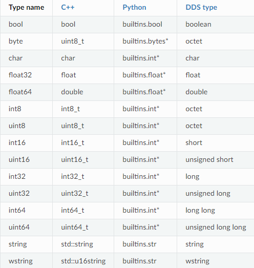
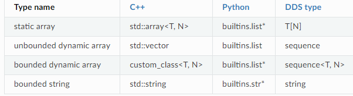

# ROS Note

本文介绍ROS系统以及它的关键概念与关键部件。

## 关键概念

参考文档

* [Concepts](https://docs.ros.org/en/jazzy/Concepts.html)

### Domain ID

参考文档

* [The ROS_DOMAIN_ID](https://docs.ros.org/en/jazzy/Concepts/Intermediate/About-Domain-ID.html)

DDS通信中间件使用域ID(Domain ID)把一个共享的物理网络分成几个逻辑上的网络域。在同一个域内的ROS2节点可以自由地发现彼此并发送消息，而不同域上的节点则不能。默认所有的节点都使用域ID 0.域ID可以避免在同一个网络上的不同组之间的干扰。

DDS是网络端口，协议为UDP进行通信的，域ID用于计算同一个域中的节点通信应该使用的端口号，由于端口号为`32768-60999`是临时端口号，进程不应该持续地占用它，所以域ID`0-101`和`215-232`可以安全地使用。

每当一个ROS2进程创建时，都会有一个DDS参与者(participant)被创建。每个DDS参与者会占据两个端口，所以如果在同一个域中创建多于120个ROS2进程，进程占据的端口号可能超出了域限定的范围，占据到了下一个域的端口号，是否会破坏程序的运行取决于是否另一个域有进程。

ROS2通信中间件本质上是网络通信，所以也会使用网络通信，默认传输层协议是`UDP`，监听的地址是`0.0.0.0`.

域`1`使用`7650`,`7651`作为组播端口，域`2`使用`7900`,`7901`.

在域`1`中创建第`1`个进程（第`0`个参与者）时，端口`7660`和`7661`用于单播,在域`1`中创建第`120`个进程（第`119`个参与者）时，端口`7898`和`7899`用于单播。在域`1`中创建第`121`个进程（第`120`个参与者）时，端口`7900`和`7901`用于单播并与域`2`重叠。

设置进程域ID的方法就是设置环境变量`ROS_DOMAIN_ID`

```shell
export ROS_DOMAIN_ID=<your_domain_id>
```

### Node

节点(Node)是ROS2抽象概念，每个节点实现单一的模块化的功能，比如控制车轮或者从传感器接收数据并发送。每个节点都可以通过主题(topics)、服务(services)、操作(actions)或参数(parameters)从其他节点发送和接收数据。

一个完全的机器人控制系统是由许多节点组成。在`ROS2`中，一个可执行文件可以包含一个或者多个节点。


### Discovery

节点的发现通过`ROS2`的底层中间件自动发生的，不需要用户参与。总结如下：

1. 当一个节点启动时，它会向网络上具有相同`ROS`域（使用`ROS_DOMAIN_ID`环境变量设置）的其它节点通告其存在。其它节点使用有关其自身的信息响应这个通告，从而可以建立起合适的连接，节点间可以互相通信。
2. 节点会定期通告其存在，以便即使在初始发现期之后也可以与新发现的节点建立连接。
3. 当节点离线时会向其他节点通告。

仅当节点具有兼容的`Quality of Service`时，它们才会与其他节点建立连接。

### Interfaces

ROS进程通常使用以下三种接口进行互相通信：主题(topic),服务(service)，动作(action).ROS2使用简化的描述语言——接口定义语言(IDL)来描述这些接口。这种描述使得ROS工具可以自动生成多种目标语言的接口类型的源代码。

三种接口都有独特的扩展名：

* `.msg`文件是简单的文本文件，包含描述`ROS`消息的字段，它用于生成不同语言的消息的源代码。
* `.srv`文件描述了一个服务，由两个部分组成:请求(request)与响应(response)。每个部分本身就是一个消息声明.
* `.action`文件描述了一个动作，由三个部分组成：目标(goal)，结果(result)，反馈(feedback).每个部分本身就是一个消息声明.

### Messages

消息(Messages)是ROS2节点通过网络发送数据给另一个节点的方法，不会返回响应。比如，如果`ROS2`的一个节点读取了温度传感器，那么它就可以使用`Temperature`消息发布数据，其他节点可以订阅这个数据从而接收到`Temperature`消息。

消息使用`.msg`文件描述并定义，这些文件统一存放在`ROS`包中的`msg/`文件夹里，`.msg`文件由两个区域组成，域(`fields`)与常数(`constants`).

### message fields

每一个域由一个类型与名字组成，使用空格分隔，格式如下

```msg
fieldtype1 fieldname1
fieldtype2 fieldname2
fieldtype3 fieldname3
```

比如

```msg
int32 my_int
string my_string
```

还可以引用已定义好的消息类型,只需要把消息类型当作域类型声明即可，如果是其它包的消息定义，还需要加上包名。

```msg
another_pkg/AnotherMessage msg
CustomMessageDefinedInThisPackage value
```

#### 域类型

域类型可以是

* 内置类型
* 自己定义的消息描述的名称，例如“geometry_msgs/PoseStamped”



每个内置类型都可以用来定义数组.



#### 域名

域名由小写字母和下划线组成，且下划线不能出现在域名头部与尾部，也不能有两个连续的下划线。

#### 域默认值

可以给域设置默认值，但目前不支持字符串数组与复合类型的域默认值。

格式如下

```msg
fieldtype fieldname fielddefaultvalue
```

比如

```msg
uint8 x 42
int16 y -2000
string full_name "John Doe"
int32[] samples [-200, -100, 0, 100, 200]
```

### message constants

消息里的常量指的就是程序无法改变的数字，格式为，常量必须使用大写字母定义

```msg
constanttype CONSTANTNAME=constantvalue
```

比如

```msg
int32 X=123
int32 Y=-123
string FOO="foo"
string EXAMPLE='bar'
```

### Topic

主题(Topic)是ROS2抽象通信概念，主题是ROS系统中关键的元素，用于在节点中交换信息。


向主题发送讯息(messages)的节点叫做发布者(Publisher),从主题接收讯息(messages)的节点叫做订阅者(Subscriber),一个节点可以同时是任意多的主题的发布者与任意多的主题的订阅者。一个主题也可以有任意多的发布者与任意多的订阅者。

整个过程是匿名性的，这意味着当订阅者从主题接受数据时，它通常不会知道或在意发送数据的具体发布者，这种架构的好处是发布者和订阅者可以随意交换，而不影响系统的其余部分。

### Service

服务(Topic)是ROS2抽象通信概念，实现类似于网络服务器般的功能,用于在节点中交换信息。


服务是基于请求(call)-响应(response)模型的。发送请求的叫做客户端(client)，发送响应的叫做服务器(server),同一个服务可以有多个客户端，但是只能有一个服务器。只有当客户端发送请求后，服务器才会发送响应（也有可能不发送响应），并且请求响应是一个节点对一个节点的，也就是说，其它客户端收不到这个响应。

请求和响应可能会带有负载数据，但也可能不带有，由具体的服务类型定义。

服务是通过`.srv`文件描述并定义的，统一保存在ROS包中的`srv/`目录中。

一个`.srv`文件由请求与响应两个部分组成，每个部分都是一个`msg`类型，使用`---`分隔。任意两个以`---`连接的`.msg`文件都是合法的服务描述.空的`msg`部分则表示没有对应的请求与响应数据负载。格式如下

```srv
string str
---
string str
```

```srv
# request constants
int8 FOO=1
int8 BAR=2
# request fields
int8 foobar
another_pkg/AnotherMessage msg
---
# response constants
uint32 SECRET=123456
# response fields
another_pkg/YetAnotherMessage val
CustomMessageDefinedInThisPackage value
uint32 an_integer
```

### Action

动作(Actions)是ROS2抽象通信概念，适用于长时间运行的通信任务，用于在节点中交换信息。它由三个部分组成，目标(goal),反馈(feedback),结果(result).


动作是建立在主题和服务上的。它的功能类似于服务，但是动作可以被取消.动作可以提供持续的反馈，而服务只有一次的响应。

动作使用客户端-服务器(client-server)服务器，动作客户端节点发送一个目标给动作服务器，动作服务器接收到这个目标并返回了一个持续的反馈和一个结果。

动作服务器会接受请求并处理，同时还会在运行时提供反馈，且可以接受取消/抢占请求。动作客户端发送请求，并接受反馈与结果。

`.action`文件描述了一个动作，由三个部分组成：目标(goal)，结果(result)，反馈(feedback).每个部分本身就是一个消息声明.空的`msg`部分则表示没有对应的数据负载。格式如下

```act
<request_type> <request_fieldname>
---
<response_type> <response_fieldname>
---
<feedback_type> <feedback_fieldname>
```

比如`Fibonacci`动作定义如下

```act
int32 order
---
int32[] sequence
---
int32[] sequence
```

这是一个动作定义，当动作客户端发送一个`int32`的包含斐波那契数列阶数的请求，并期望服务器返回一个数组，包含每一步的计算结果，同时还实时反馈回中间的计算数组。

### parameters

参数(parameters)是节点可配置的属性，节点可以支持整数，浮点数，布尔数，字符串和列表类型的参数。参数用于非侵入式节点配置的修改，它的生命周期与节点的生命周期相关（尽管节点可以实现某种持久性以在重新启动后重新加载值）。

参数通过节点名称(node name)、节点名称空间(node namespace)、参数名称(parameter name)和参数名称空间(parameter namespace)来定位,其中参数名称空间是可选的。

参数由关键字(key),值(value)与描述符(descriptor)组成。关键字的类型是字符串，值的类型是以下之一：`bool`,`int64`,`float64`,`string`,`byte[]`,`bool[]`,`int64[]`,`float64[]`,`string[]`.默认描述符为空，但是它可以包含参数描述，值范围，类型信息与额外的限制。

#### 声明参数

默认情况下，节点需要预先声明它所能接受的参数。但是，有的节点参数不能预先知道。此时，可以在实例化节点时将`allow_undeclared_pa​​rameters`设置为`true`.

#### 参数类型

节点参数的类型是预先定义的。默认情况下，尝试运行时修改节点类型会报错，比如把布尔值赋值给整型参数。

如果参数需要运行时多态类型，并且使用参数的代码可以处理这种情况，可以在声明参数时把参数描述符的`dynamic_typing`成员变量为`true`.

#### 参数回调函数

节点可以声明三种类型的回调函数，当参数发生改变后调用这些回调函数。

第一个回调函数是`pre set parameter`回调函数，通过节点API函数`add_pre_set_parameters_callback`设置。这个回调函数接受包含正在改变的参数的列表的引用，没有返回值。这个回调函数可以修改，增加或删除这个列表的列表项。比如，如果`parameter2`需要在`parameter1`改变时也改变，就可以在这个回调函数中实现。

第二个回调函数是`set parameter`回调函数，通过节点API函数`add_on_set_parameters_callback`设置。这个回调函数接受包含正在改变的参数的列表的不可变的引用，返回`rcl_interfaces/msg/SetParametersResult`。此回调的主要目的是使用户能够检查即将发生的参数更改并明确拒绝更改。最重要的是，这个回调函数不能有任何副作用，因为可能会调用这个回调函数多次。例如，如果单个回调要对其所在的类进行更改，则它可能与实际参数不同步。

第三个回调函数是`post set parameter`回调函数，通过节点API函数`add_post_set_parameters_callback`设置。这个回调函数接受包含已经改变的参数的列表的不可变的引用，没有返回值。此回调的主要目的是使用户能够对已成功接受的参数的更改做出反应。

#### 与参数交互

节点可以通过节点API进行参数的修改。而对于外部进程，可以通过有关参数的服务与参数交互，在节点初始化会默认创建这些服务。

* `/node_name/describe_parameters`:服务的类型为`rcl_interfaces/srv/DescribeParameters`,传递一个包含参数名的列表，返回一个对应的参数描述符的列表。
* `/node_name/get_parameter_types`:服务的类型为`rcl_interfaces/srv/GetParameterTypes`,传递一个包含参数名的列表，返回一个对应的参数类型的列表。
* `/node_name/get_parameters`:服务的类型为`rcl_interfaces/srv/GetParameters`,传递一个包含参数名的列表，返回一个对应的参数值的列表。
* `/node_name/list_parameters`:服务的类型为`rcl_interfaces/srv/ListParameters`,传递一个可选的包含参数前缀的列表，返回一个满足参数前缀的参数的列表。
* `/node_name/set_parameters`:服务的类型为`rcl_interfaces/srv/SetParameters`,传递一个包含参数名与参数值的列表，返回一个设置参数的结果列表（参数设置可能失败）。
* `/node_name/set_parameters_atomically`：服务的类型为`rcl_interfaces/srv/SetParametersAtomically`,传递一个包含参数名与参数值的列表，返回一个设置参数的结果（全部成功才算成功）。
