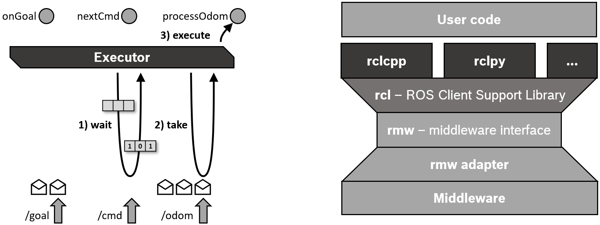

# ROS Note

本文介绍ROS系统以及它的关键概念与关键部件。

## 关键概念

参考文档

* [Concepts](https://docs.ros.org/en/jazzy/Concepts.html)

### Domain ID

参考文档

* [The ROS_DOMAIN_ID](https://docs.ros.org/en/jazzy/Concepts/Intermediate/About-Domain-ID.html)

DDS通信中间件使用域ID(Domain ID)把一个共享的物理网络分成几个逻辑上的网络域。在同一个域内的ROS2节点可以自由地发现彼此并发送消息，而不同域上的节点则不能。默认所有的节点都使用域ID 0.域ID可以避免在同一个网络上的不同组之间的干扰。

DDS是网络端口，协议为UDP进行通信的，域ID用于计算同一个域中的节点通信应该使用的端口号，由于端口号为`32768-60999`是临时端口号，进程不应该持续地占用它，所以域ID`0-101`和`215-232`可以安全地使用。

每当一个ROS2进程创建时，都会有一个DDS参与者(participant)被创建。每个DDS参与者会占据两个端口，所以如果在同一个域中创建多于120个ROS2进程，进程占据的端口号可能超出了域限定的范围，占据到了下一个域的端口号，是否会破坏程序的运行取决于是否另一个域有进程。

ROS2通信中间件本质上是网络通信，所以也会使用网络通信，默认传输层协议是`UDP`，监听的地址是`0.0.0.0`.

域`1`使用`7650`,`7651`作为组播端口，域`2`使用`7900`,`7901`.

在域`1`中创建第`1`个进程（第`0`个参与者）时，端口`7660`和`7661`用于单播,在域`1`中创建第`120`个进程（第`119`个参与者）时，端口`7898`和`7899`用于单播。在域`1`中创建第`121`个进程（第`120`个参与者）时，端口`7900`和`7901`用于单播并与域`2`重叠。

设置进程域ID的方法就是设置环境变量`ROS_DOMAIN_ID`

```shell
export ROS_DOMAIN_ID=<your_domain_id>
```

### Node

节点(Node)是ROS2抽象概念，每个节点实现单一的模块化的功能，比如控制车轮或者从传感器接收数据并发送。每个节点都可以通过主题(topics)、服务(services)、操作(actions)或参数(parameters)从其他节点发送和接收数据。

一个完全的机器人控制系统是由许多节点组成。在`ROS2`中，一个可执行文件可以包含一个或者多个节点。


### Discovery

节点的发现通过`ROS2`的底层中间件自动发生的，不需要用户参与。总结如下：

1. 当一个节点启动时，它会向网络上具有相同`ROS`域（使用`ROS_DOMAIN_ID`环境变量设置）的其它节点通告其存在。其它节点使用有关其自身的信息响应这个通告，从而可以建立起合适的连接，节点间可以互相通信。
2. 节点会定期通告其存在，以便即使在初始发现期之后也可以与新发现的节点建立连接。
3. 当节点离线时会向其他节点通告。

仅当节点具有兼容的`Quality of Service`时，它们才会与其他节点建立连接。

### Interfaces

ROS进程通常使用以下三种接口进行互相通信：主题(topic),服务(service)，动作(action).ROS2使用简化的描述语言——接口定义语言(IDL)来描述这些接口。这种描述使得ROS工具可以自动生成多种目标语言的接口类型的源代码。

三种接口都有独特的扩展名：

* `.msg`文件是简单的文本文件，包含描述`ROS`消息的字段，它用于生成不同语言的消息的源代码。
* `.srv`文件描述了一个服务，由两个部分组成:请求(request)与响应(response)。每个部分本身就是一个消息声明.
* `.action`文件描述了一个动作，由三个部分组成：目标(goal)，结果(result)，反馈(feedback).每个部分本身就是一个消息声明.

### Messages

消息(Messages)是ROS2节点通过网络发送数据给另一个节点的方法，不会返回响应。比如，如果`ROS2`的一个节点读取了温度传感器，那么它就可以使用`Temperature`消息发布数据，其他节点可以订阅这个数据从而接收到`Temperature`消息。

消息使用`.msg`文件描述并定义，这些文件统一存放在`ROS`包中的`msg/`文件夹里，`.msg`文件由两个区域组成，域(`fields`)与常数(`constants`).

### message fields

每一个域由一个类型与名字组成，使用空格分隔，格式如下

```msg
fieldtype1 fieldname1
fieldtype2 fieldname2
fieldtype3 fieldname3
```

比如

```msg
int32 my_int
string my_string
```

还可以引用已定义好的消息类型,只需要把消息类型当作域类型声明即可，如果是其它包的消息定义，还需要加上包名。

```msg
another_pkg/AnotherMessage msg
CustomMessageDefinedInThisPackage value
```

#### 域类型

域类型可以是

* 内置类型
* 自己定义的消息描述的名称，例如“geometry_msgs/PoseStamped”


每个内置类型都可以用来定义数组.


#### 域名

域名由小写字母和下划线组成，且下划线不能出现在域名头部与尾部，也不能有两个连续的下划线。

#### 域默认值

可以给域设置默认值，但目前不支持字符串数组与复合类型的域默认值。

格式如下

```msg
fieldtype fieldname fielddefaultvalue
```

比如

```msg
uint8 x 42
int16 y -2000
string full_name "John Doe"
int32[] samples [-200, -100, 0, 100, 200]
```

### message constants

消息里的常量指的就是程序无法改变的数字，格式为，常量必须使用大写字母定义

```msg
constanttype CONSTANTNAME=constantvalue
```

比如

```msg
int32 X=123
int32 Y=-123
string FOO="foo"
string EXAMPLE='bar'
```

### Topic

主题(Topic)是ROS2抽象通信概念，主题是ROS系统中关键的元素，用于在节点中交换信息。


向主题发送讯息(messages)的节点叫做发布者(Publisher),从主题接收讯息(messages)的节点叫做订阅者(Subscriber),一个节点可以同时是任意多的主题的发布者与任意多的主题的订阅者。一个主题也可以有任意多的发布者与任意多的订阅者。

整个过程是匿名性的，这意味着当订阅者从主题接受数据时，它通常不会知道或在意发送数据的具体发布者，这种架构的好处是发布者和订阅者可以随意交换，而不影响系统的其余部分。

### Service

服务(Topic)是ROS2抽象通信概念，实现类似于网络服务器般的功能,用于在节点中交换信息。


服务是基于请求(call)-响应(response)模型的。发送请求的叫做客户端(client)，发送响应的叫做服务器(server),同一个服务可以有多个客户端，但是只能有一个服务器。只有当客户端发送请求后，服务器才会发送响应（也有可能不发送响应），并且请求响应是一个节点对一个节点的，也就是说，其它客户端收不到这个响应。

请求和响应可能会带有负载数据，但也可能不带有，由具体的服务类型定义。

服务是通过`.srv`文件描述并定义的，统一保存在ROS包中的`srv/`目录中。

一个`.srv`文件由请求与响应两个部分组成，每个部分都是一个`msg`类型，使用`---`分隔。任意两个以`---`连接的`.msg`文件都是合法的服务描述.空的`msg`部分则表示没有对应的请求与响应数据负载。格式如下

```srv
string str
---
string str
```

```srv
# request constants
int8 FOO=1
int8 BAR=2
# request fields
int8 foobar
another_pkg/AnotherMessage msg
---
# response constants
uint32 SECRET=123456
# response fields
another_pkg/YetAnotherMessage val
CustomMessageDefinedInThisPackage value
uint32 an_integer
```

### Action

动作(Actions)是ROS2抽象通信概念，适用于长时间运行的通信任务，用于在节点中交换信息。它由三个部分组成，目标(goal),反馈(feedback),结果(result).


动作是建立在主题和服务上的。它的功能类似于服务，但是动作可以被取消.动作可以提供持续的反馈，而服务只有一次的响应。

动作使用客户端-服务器(client-server)服务器，动作客户端节点发送一个目标给动作服务器，动作服务器接收到这个目标并返回了一个持续的反馈和一个结果。

动作服务器会接受请求并处理，同时还会在运行时提供反馈，且可以接受取消/抢占请求。动作客户端发送请求，并接受反馈与结果。

`.action`文件描述了一个动作，由三个部分组成：目标(goal)，结果(result)，反馈(feedback).每个部分本身就是一个消息声明.空的`msg`部分则表示没有对应的数据负载。格式如下

```act
<request_type> <request_fieldname>
---
<response_type> <response_fieldname>
---
<feedback_type> <feedback_fieldname>
```

比如`Fibonacci`动作定义如下

```act
int32 order
---
int32[] sequence
---
int32[] sequence
```

这是一个动作定义，当动作客户端发送一个`int32`的包含斐波那契数列阶数的请求，并期望服务器返回一个数组，包含每一步的计算结果，同时还实时反馈回中间的计算数组。

### parameters

参数(parameters)是节点可配置的属性，节点可以支持整数，浮点数，布尔数，字符串和列表类型的参数。参数用于非侵入式节点配置的修改，它的生命周期与节点的生命周期相关（尽管节点可以实现某种持久性以在重新启动后重新加载值）。

参数通过节点名称(node name)、节点名称空间(node namespace)、参数名称(parameter name)和参数名称空间(parameter namespace)来定位,其中参数名称空间是可选的。

参数由关键字(key),值(value)与描述符(descriptor)组成。关键字的类型是字符串，值的类型是以下之一：`bool`,`int64`,`float64`,`string`,`byte[]`,`bool[]`,`int64[]`,`float64[]`,`string[]`.默认描述符为空，但是它可以包含参数描述，值范围，类型信息与额外的限制。

#### 声明参数

默认情况下，节点需要预先声明它所能接受的参数。但是，有的节点参数不能预先知道。此时，可以在实例化节点时将`allow_undeclared_pa​​rameters`设置为`true`.

#### 参数类型

节点参数的类型是预先定义的。默认情况下，尝试运行时修改节点类型会报错，比如把布尔值赋值给整型参数。

如果参数需要运行时多态类型，并且使用参数的代码可以处理这种情况，可以在声明参数时把参数描述符的`dynamic_typing`成员变量为`true`.

#### 参数回调函数

节点可以声明三种类型的回调函数，当参数发生改变后调用这些回调函数。

第一个回调函数是`pre set parameter`回调函数，通过节点API函数`add_pre_set_parameters_callback`设置。这个回调函数接受包含正在改变的参数的列表的引用，没有返回值。这个回调函数可以修改，增加或删除这个列表的列表项。比如，如果`parameter2`需要在`parameter1`改变时也改变，就可以在这个回调函数中实现。

第二个回调函数是`set parameter`回调函数，通过节点API函数`add_on_set_parameters_callback`设置。这个回调函数接受包含正在改变的参数的列表的不可变的引用，返回`rcl_interfaces/msg/SetParametersResult`。此回调的主要目的是使用户能够检查即将发生的参数更改并明确拒绝更改。最重要的是，这个回调函数不能有任何副作用，因为可能会调用这个回调函数多次。例如，如果单个回调要对其所在的类进行更改，则它可能与实际参数不同步。

第三个回调函数是`post set parameter`回调函数，通过节点API函数`add_post_set_parameters_callback`设置。这个回调函数接受包含已经改变的参数的列表的不可变的引用，没有返回值。此回调的主要目的是使用户能够对已成功接受的参数的更改做出反应。

#### 与参数交互

节点可以通过节点API进行参数的修改。而对于外部进程，可以通过有关参数的服务与参数交互，在节点初始化会默认创建这些服务。

* `/node_name/describe_parameters`:服务的类型为`rcl_interfaces/srv/DescribeParameters`,传递一个包含参数名的列表，返回一个对应的参数描述符的列表。
* `/node_name/get_parameter_types`:服务的类型为`rcl_interfaces/srv/GetParameterTypes`,传递一个包含参数名的列表，返回一个对应的参数类型的列表。
* `/node_name/get_parameters`:服务的类型为`rcl_interfaces/srv/GetParameters`,传递一个包含参数名的列表，返回一个对应的参数值的列表。
* `/node_name/list_parameters`:服务的类型为`rcl_interfaces/srv/ListParameters`,传递一个可选的包含参数前缀的列表，返回一个满足参数前缀的参数的列表。
* `/node_name/set_parameters`:服务的类型为`rcl_interfaces/srv/SetParameters`,传递一个包含参数名与参数值的列表，返回一个设置参数的结果列表（参数设置可能失败）。
* `/node_name/set_parameters_atomically`：服务的类型为`rcl_interfaces/srv/SetParametersAtomically`,传递一个包含参数名与参数值的列表，返回一个设置参数的结果（全部成功才算成功）。

### Client libraries

客户端库(Client libraries)是ROS系统的API库，用户可以使用客户端库与ROS2其它部分，比如节点，主题，服务等交互。客户端库支持多种开发语言，常见的两种是`C++`和`Python`.且不同开发语言开发的内容可以相互通信。

`C++`客户端库的名称是`rclcpp`包，`Python`客户端库名称是`rclpy`包，它们都是封装了底层的`rcl`库。

底层`rcl`库为所有开发语言提供了一致性，提高了通用性。

### workspace

工作区(workspace)是包含ROS2包的目录。在使用ROS2前，需要`source`ROS2在`install`目录下生成的`setup.bash`,会设置对应的环境变量使得ROS2包可用。

通常设置工作区是使用叫做覆盖`overlay`的方法的，把新的工作区覆盖在底层(underlay)工作区上。在新的工作区上添加包不会修改已经存在的底层工作区。底层工作区必须包含了新工作区的所有包的依赖，新的工作区的包会覆盖掉相同的底层工作区的包。可以有多层覆盖，每个工作区相互堆叠。

* 可以修改覆盖层的工作区内容而不影响底层工作区，底层工作区也不需要重新编译。
* 覆盖层工作区优先于底层工作区

### `setup.bash` vs `local_setup.bash`

当使用覆盖方法时，`setup.bash`会`source`覆盖工作区与底层工作区，但是`local_setup.bash`只会`source`覆盖工作区，`setup.bash`就好像是从底层工作区开始一步步地`source`对应的`locak_setup.bash`.

推荐是在主`ROS2`安装处使用`setup.bash`,覆盖工作区使用`local_setup.bash`.

### package

ROS2包(package)是ROS2代码的组织单元。如果想要把代码安装或者分享给别人，就需要把代码打包成一个包。

在ROS2中，包的创建是使用`ament`工具，而包的构建则是使用`colcon`.官方支持使用`CMake`或`Python`创建的包。

对于`CMake`创建的包，在包的目录里至少要包含

* `CMakeLists.txt`，用于描述如何构建代码的文件。
* `include/<package_name>`，用于存放包的公共头文件的目录。
* `package.xml`，用于存储包的元信息的文件。
* `src`，用于存放包的源文件的目录。

比如对于名为`my_package`的包，至少要包含

```tree
my_package/
     CMakeLists.txt
     include/my_package/
     package.xml
     src/
```

对于`Python`创建的包，在包的目录里至少要包含

* `package.xml`,用于存储包的元信息的文件。
* `resource/<package_name>`,包的标记文件。
* `setup.cfg`用于当包执行时。
* `setup.py`包含如何安装包的信息。
* `<package_name>`用于ROS2工具发现包的目录，包含`__init__.py`

比如对于名为`my_package`的包，至少要包含

```tree
my_package/
      package.xml
      resource/my_package
      setup.cfg
      setup.py
      my_package/
```

### package and workspace

一个简单的工作区可以包含任意多的包，分别在其各自的文件夹里。可以在一个工作区里有不同的构建类型的相同的包。但是包之间不能嵌套。

最佳实践方法是创建一个`src`文件夹，并把所有的包放置于其中，这个方法保证了顶层工作区的干净。

```tree
workspace_folder/
    src/
      cpp_package_1/
          CMakeLists.txt
          include/cpp_package_1/
          package.xml
          src/

      py_package_1/
          package.xml
          resource/py_package_1
          setup.cfg
          setup.py
          py_package_1/
      ...
      cpp_package_n/
          CMakeLists.txt
          include/cpp_package_n/
          package.xml
          src/
```

### Build Tool

这是用于控制一个单独的包的编译和测试的工具。通常在`ROS2`中使用`CMake`作为`C++`的构建工具。使用`setuptools`作为`Python`的构建工具。

### Build Helper

这是与构建工具挂钩的辅助函数，以提高开发人员的体验。`ROS 2`软件包通常依赖于`ament`系列软件包来实现此目的.

### Meta-build tool

这是一个软件，它知道如何对一组包进行拓扑排序，并以正确的依赖顺序构建或测试。在`ROS2`中使用`colcon`作为构建工具。

### 节点名称空间

节点名称空间不是`C++`名称空间，是为了防止各个包的节点名称产生冲突而引入的概念，通过设置节点名称空间，

### Quality of Service settings

参考文档

* [Quality of Service settings](https://docs.ros.org/en/jazzy/Concepts/Intermediate/About-Quality-of-Service-Settings.html)

`ROS2`提供了丰富的服务质量`QoS`策略用于调整节点间的通信。通过正确地设置服务质量策略，`ROS2`可以如同`TCP`连接一样可靠或者是如同`UDP`连接一样尽力而为，在这两种状态间还有很多中间状态取舍。不同于`ROS1`只提供`TCP`连接，`ROS2`利用灵活的底层`DDS`传输性，在特定环境下，使用尽力而为的传输。

一系列的`QoS`策略(policies)构成了一个`QoS`配置文件(profile),考虑到为给定场景选择正确的`QoS`策略的复杂性，`ROS2`为常见用例（例如传感器数据）提供了一组预定义的`QoS`配置文件。同时，开发人员也可以灵活地控制`QoS`配置文件。

`QoS`配置文件可以用于发布者(publishers),订阅(subscriptions),服务的服务端(servers)与用户端(clients).`QoS`配置文件可以独自应用在上述实体的每个实例中，但是不同的配置文件可能不兼容，从而阻止消息的传播。

#### QoS policies

一个基础的QoS配置文件包含以下内容

* `History`
  * `Keep last`:只保留至多`N`个历史记录，可通过队列深度进行配置.
  * `Keep all`:保留所有历史记录，最大值取决于中间件的实现。
* `Depth`
  * `Queue size`:队列大小，只有在选择了`Keep last`时才有效。
* `Reliability`
  * `Best effort`:尽力而为，尝试交付消息，但如果网络不稳定，可能会丢失消息。
  * `Reliable`:保证消息的交付，可能会重复发送数次，直至成功。
* `Durability`是否要将历史资料提供给`late-joiner`
  * `Transient local`:本地保持，发布者负责保存晚加入(late-joining)的订阅者的消息。
  * `Volatile`:发布者不会尝试保存消息。
* `Deadline`
  * `Duration`:预计的两个消息发送到主题的最大时间间隔
* `Lifespan`
  * `Duration`:消息发布和接收之间的最长时间（消息不被视为陈旧或过期）.过期的消息会被悄悄丢弃，并且实际上永远不会被接收。
* `Liveliness`
  * `Automatic`:当任何一个发布者发布消息时，系统将认为该节点的所有发布者在另一个“租赁期限”(lease duration)内都处于活动状态。
  * `Manual by topic`:如果系统手动断言`publisher`仍处于活动`active`状态（通过调用`publisher`的API），则系统将认为发布者在另一个“租赁期限”内处于活动状态。
* `Lease Duration`
  * `Duration`:发布者须在这个最大的时间间隔内指明它为`active`，否则系统认为这个发布者已经失去了活力`Liveliness`.失去活力可能意味着失败.

#### 预定义的一系列QoS profiles

`QoS`配置文件允许开发者专注于应用而不是担心每个`QoS`设置是否生效。从而提供了一个一系列预定义的配置文件。

* 用于发布者与订阅的默认设置
  默认设置下，`ROS2`的发布者与订阅`Keep last`10个历史记录，`Reliable`,`Volatile`,对于`Liveliness`,`Deadline`,`lifespan`,`lease durations`是系统默认值，
* 用于`Services`的设置
  和发布者与订阅的默认设置一样，是`Reliable`的。服务使用`volatile`是合理的，否则重启的服务端可能会受到过时的信息。虽然客户端可以避免收到多个响应，但服务器无法避免收到过时请求的副作用。
* 用于传感器数据`Sensor data`的设置。
  对于传感器，发送的速度很关键。也就是说，开发者通常是需要最新的消息，并可以容忍丢失一些数据。所有使用`best effort`与小的队列大小。
* 用于`Parameters`的设置
  `Parameters`在`ROS2`中是基于服务的，和服务具有相似的配置。不同的是它有更深的队列深度，所以当客户端某时刻无法访问服务端时，它的`request`更难丢失。
* 系统默认设置
  对所有策略使用`RMW`实现的默认值。

* [默认配置文件](https://github.com/ros2/rmw/blob/jazzy/rmw/include/rmw/qos_profiles.h)

#### QoS兼容性

本节涉及发布者和订阅者，但内容以相同的方式适用于服务服务器和客户端。

`QoS`可以独立地给发布者和订阅者配置。仅当发布者和订阅者具有兼容的`QoS`配置文件时，才会在发布者和订阅者之间建立连接。

`QoS`的兼容性通过`Request vs Offered`请求与提供的模型描述。订阅请求的`QoS`配置文件是其愿意接受的“最低质量”，而发布者提供的`QoS`配置文件是其能够提供的“最高质量”。只有在请求的每个策略都不比提供的相应策略要更严格时才能建立连接。多个订阅可以同时连接到单个发布者，即使它们请求的`QoS`配置文件不同。一对发布者与订阅者的兼容性不会影响其它部分的兼容性判断。

参考文档显示了各个策略的组合与对应的兼容性与结果。

主要关注的是`durability`这个策略，它决定了新加入到这个主题的节点是否会获取到这个主题的旧信息。

#### QoS事件

一些`QoS`策略会提供可能的事件。开发者可以给每个发布者与订阅者设置这些事件发生时的回调函数，并以他们认为合适的方式处理它们，类似于处理在主题上收到的消息的方式。

开发者可以收到有关发布者的`QoS`事件如下:

* `Offered deadline missed`
  提供方的`Deadline`超时，发布者尚未在`QoS Deadline`策略规定的预期持续时间内发布消息。
* `Liveliness lost`
  失去活力，发布者未能在`lease durations`时间内表明其活跃度。
* `Offered incompatible QoS`
  提供的`QoS`不兼容，发布者在相同的主题上遇到了一个需求的`QoS`等级比其要高的订阅者，导致无法在两者间建立连接。

开发者可以收到有关订阅者的`QoS`事件如下:

* `Requested deadline missed`
  需求方的`Deadline`超时，订阅在`QoS Deadline`策略规定的预期持续时间内未收到消息。
* `Liveliness changed`
  活力改变，订阅注意到所订阅主题的一个或多个发布者未能在`lease durations`期限内表明其活跃度。
* `Requested incompatible QoS`
  需求的`QoS`不兼容，订阅者在相同的主题上遇到了一个提供`QoS`等级比起要低的发布者，导致无法在两者间建立连接。

#### 匹配事件

除了上述提到的事件以外，当任何发布者和订阅者间建立连接或者断开连接时，也会产生匹配事件(Matched events).开发者可以提供回调函数，在事件发生时运行并以合适方式处理，类似于处理在主题上收到的消息的方式。

开发者可以收到有关发布者的事件如下：

* `publisher`
  这个事件发生在当发布者发现了同一主题内的订阅者且具有兼容的`QoS`配置，或者是与已经建立连接的订阅者断开连接。

开发者可以收到有关订阅者的事件如下：

* `subscription`
  这个事件发生在当订阅者发现了同一主题内的发布者且具有兼容的`QoS`配置，或者是与已经建立连接的发布者断开连接。

* [事件实例](https://github.com/ros2/demos/blob/jazzy/demo_nodes_cpp/src/events/matched_event_detect.cpp)

### Executors

参考文档

* [Executors](https://docs.ros.org/en/jazzy/Concepts/Intermediate/About-Executors.html)

`ROS 2`中的执行管理由`Executors`处理.一个执行器使用一个或者多个线程，在传入的消息和事件上调用订阅、计时器、服务的服务端，动作的服务端的回调函数。执行器由一个`Executor`类实现，提供了对执行过程更多的控制，可以显式创建这个类，`ROS2`也提供了简便的函数来隐式创建这个类。

#### 简单用法

最简单地使用执行器的方法便是调用公有函数`rclcpp::spin(..)`.

```CPP
int main(int argc, char* argv[])
{
   // Some initialization.
   rclcpp::init(argc, argv);
   ...

   // Instantiate a node.
   rclcpp::Node::SharedPtr node = ...

   // Run the executor.
   rclcpp::spin(node);

   // Shutdown and exit.
   ...
   return 0;
}
```

`rclcpp::spin(node);`隐式地创建一个单线程执行器并自旋。

```CPP
rclcpp::executors::SingleThreadedExecutor executor;
executor.add_node(node);
executor.spin();
```

通过调用`executor.spin();`,当前线程开始查询`rcl`和中间件层以获取传入消息和其他事件，直到节点关闭。为了不影响中间件的`QoS`设置，传入消息的不会存储在客户端库层的队列中，而是保留在中间件中，直到由回调函数进行处理.一个等待队列(wait set)用于通知执行器中间件层上的可用消息，具体实现是一个标志集合。等待队列还可以用来判断超时情况。



#### 执行器类型

目前有三种执行器类型。


多线程执行器(Multi-Threaded Executor)会创建可配置的数量的多个线程，允许多个消息或者事件并行处理。静态单线程执行器(Static Single-Threaded Executor)优化了执行器扫描订阅，定时器，服务的服务端，动作的服务端的节点结构的运行时时间开销，它只会在`add_node`时扫描一次这些内容，其它的两个执行器类型都会周期性的搜索这些结构。也就是说静态单线程执行器无法在加入节点后发现新设置的订阅，定时器这些结构，必须在加入节点前设置好所有的结构。

三种执行器类型都可以添加复数节点，只需要多次调用`add_node(..)`即可。

```CPP
rclcpp::Node::SharedPtr node1 = ...
rclcpp::Node::SharedPtr node2 = ...
rclcpp::Node::SharedPtr node3 = ...

rclcpp::executors::StaticSingleThreadedExecutor executor;
executor.add_node(node1);
executor.add_node(node2);
executor.add_node(node3);
executor.spin();
```

在上述的代码中，一个静态单线程执行器用于三个节点。而在多线程执行器中，实际的并行化取决于回调函数组(Callback groups)。

#### 回调函数组Callback groups

`ROS2`把节点的回调函数整合成一个组。在`rclcpp`中，回调函数组可以通过`create_callback_group`创建，回调函数组必须在节点的整个执行过程中存储（例如作为类成员），否则执行器将无法触发回调。然后，可以在创建订阅、计时器等时指定此回调组。

```CPP
my_callback_group = create_callback_group(rclcpp::CallbackGroupType::MutuallyExclusive);

rclcpp::SubscriptionOptions options;
options.callback_group = my_callback_group;

my_subscription = create_subscription<Int32>("/topic", rclcpp::SensorDataQoS(),
                                             callback, options);
```

上面的代码片段生成了一个回调函数组，并把订阅的回调函数放在了这个回调函数组中。

所有的订阅者，定时器等，如果在创建时没有指定所在的回调函数组，则会分配到默认回调函数组(default callback group).默认回调函数组可以通过`NodeBaseInterface::get_default_callback_group()`查询。

有两种类型的回调组，必须在实例化时指定类型：

* 互斥(Mutually exclusive):这个组的回调函数不能并行执行。
* 可重入(Reentrant):这个组的回调函数可以并行执行。

不同回调函数组的回调函数可能会并行执行。多线程执行器使用线程池尽可能多的并行执行回调函数。

`Executor`类也有成员函数`add_callback_group(..)`,将回调函数组添加给这个类。通过使用底层的操作系统调度器可以配置线程，使得特定线程优先执行。比如控制回路的订阅与定时器可以优先于其它订阅或定时器执行。

#### 调用语义Scheduling semantics

如果回调的处理时间短于消息和事件发生的时间，`Executor`基本上按照`FIFO`顺序处理它们。但是，如果某些回调的处理时间较长，消息和事件将在堆栈的较低层排队.等待队列只会给执行器提供极为有限的有关这些排队信息。具体来说，它仅报告特定的主题是否有消息。执行器使用此信息以循环方式处理消息（包括服务和操作），但不是按照 `FIFO`顺序。


#### 缺陷

这个执行器具有一定的缺陷，使其可能无法在实时应用中使用。

* 复杂且混杂的调用语义。无法进行确切的时间分析
* 回调函数可能遇到优先级反转事件，高的优先级的回调函数会被低优先级的回调函数阻塞。
* 无法直接控制回调函数处理顺序
* 没有内置的用于特定主题的控制

此外，执行器在`CPU`和内存使用方面的开销相当大.使用静态单线程执行器可以显著降低这方面的开销，但是也可能还是不足以用于特定应用。

## 设计哲学

* 所有创建节点新的结构（比如发布者，订阅者）的函数都会返回一个共享指针，这些新的结构只有在这些共享指针有效时才有效。如果离开了共享指针的作用域，则这些结构自动被删除。