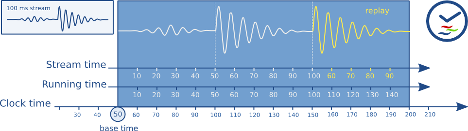

# Advanced Application

本文讲解gstreamer的高级应用。

## Querying

`Query`是一种同步请请求/响应机制，用于获取元素的信息，比如播放位置、缓冲区大小、帧率等。

可以直接对元素进行查询,也可以对pipeline或bin进行查询，此时query会从`sink`开始逆流而上，直到某个元素可以响应`query`的信息.这个能力是由元素的`query handler`决定的.

### 查询播放位置

```CPP
#include <gst/gst.h>

static gboolean
cb_print_position (GstElement *pipeline)
{
  gint64 pos, len;

  if (gst_element_query_position (pipeline, GST_FORMAT_TIME, &pos)
    && gst_element_query_duration (pipeline, GST_FORMAT_TIME, &len)) {
    g_print ("Time: %" GST_TIME_FORMAT " / %" GST_TIME_FORMAT "\r",
         GST_TIME_ARGS (pos), GST_TIME_ARGS (len));
  }

  /* call me again */
  return TRUE;
}

gint
main (gint   argc,
      gchar *argv[])
{
  GstElement *pipeline;

[..]

  /* run pipeline */
  g_timeout_add (200, (GSourceFunc) cb_print_position, pipeline);
  g_main_loop_run (loop);

[..]

}
```

## Events

`Event`是`GStreamer`里的一种控制消息，用于在`pipeline`内部传递“命令”或“状态变化通知”。

`Event`与`Query`类似，都是在pipeline内部按pad拓扑传播的控制机制；但`Event`有方向：如`seek`属于upstream event，通常向上游传播；而`EOS`、`caps`、`segment`等属于downstream event，向下游传播。具体是否能处理，由元素的`event handler`决定。

### 跳跃播放位置seeking

```CPP
static void
seek_to_time (GstElement *pipeline,
          gint64      time_nanoseconds)
{
  if (!gst_element_seek (pipeline, 1.0, GST_FORMAT_TIME, GST_SEEK_FLAG_FLUSH,
                         GST_SEEK_TYPE_SET, time_nanoseconds,
                         GST_SEEK_TYPE_NONE, GST_CLOCK_TIME_NONE)) {
    g_print ("Seek failed!\n");
  }
}
```

* 带`GST_SEEK_FLAG_FLUSH`的`seek`适合在`PAUSED`或`PLAYING`状态执行。
* `flushing seek`会清空旧`buffer`，让`pipeline`从新位置重新`preroll`；完成后回到seek前的状态（`PAUSED`或`PLAYING`）。
* 可用`gst_element_get_state()`阻塞等待`seek`完成，也可监听bus上的`ASYNC_DONE`消息。
* 不带`GST_SEEK_FLAG_FLUSH`的`seek`只建议在`PLAYING`状态执行；在`PAUSED`状态下可能因`streaming thread`阻塞在`sink`而死锁。
* `gst_element_seek()`返回只表示`seek`请求已发出/被接受，不代表新位置的数据已经到达`sink`。实际`seek`通常在`streaming thread`中异步完成，尤其是`non-flushing seek`，新数据到达下游可能更慢。
* 可以短时间连续`seek`（例如拖动进度条）；`pipeline`会重设位置，`demuxer/decoder`从新位置开始处理，`sink`重新拿到数据后恢复原状态。

## MetaData

`gstreamer`中有两种，一类是`Stream tags`，它们以非技术性的方式描述流的内容；另一类是`Stream-info`，它们以相对技术性的方式描述流的属性。

`Stream tags`的例子包括：歌曲作者、歌曲标题、所属专辑等。
`Stream-info`的例子包括：视频尺寸、音频采样率、使用的编解码器等。

`Stream tags`使用·GStreamer`的`tagging system`处理。
`Stream-info`可以通过从`GstPad`获取当前的、已经协商完成的`GstCaps`来取得。

### 读取元数据

```CPP
/* compile with:
 * gcc -o tags tags.c `pkg-config --cflags --libs gstreamer-1.0` */
#include <gst/gst.h>

static void
print_one_tag (const GstTagList * list, const gchar * tag, gpointer user_data)
{
  int i, num;

  num = gst_tag_list_get_tag_size (list, tag);
  for (i = 0; i < num; ++i) {
    const GValue *val;

    /* Note: when looking for specific tags, use the gst_tag_list_get_xyz() API,
     * we only use the GValue approach here because it is more generic */
    val = gst_tag_list_get_value_index (list, tag, i);
    if (G_VALUE_HOLDS_STRING (val)) {
      g_print ("\t%20s : %s\n", tag, g_value_get_string (val));
    } else if (G_VALUE_HOLDS_UINT (val)) {
      g_print ("\t%20s : %u\n", tag, g_value_get_uint (val));
    } else if (G_VALUE_HOLDS_DOUBLE (val)) {
      g_print ("\t%20s : %g\n", tag, g_value_get_double (val));
    } else if (G_VALUE_HOLDS_BOOLEAN (val)) {
      g_print ("\t%20s : %s\n", tag,
          (g_value_get_boolean (val)) ? "true" : "false");
    } else if (GST_VALUE_HOLDS_BUFFER (val)) {
      GstBuffer *buf = gst_value_get_buffer (val);
      guint buffer_size = gst_buffer_get_size (buf);

      g_print ("\t%20s : buffer of size %u\n", tag, buffer_size);
    } else if (GST_VALUE_HOLDS_DATE_TIME (val)) {
      GstDateTime *dt = g_value_get_boxed (val);
      gchar *dt_str = gst_date_time_to_iso8601_string (dt);

      g_print ("\t%20s : %s\n", tag, dt_str);
      g_free (dt_str);
    } else {
      g_print ("\t%20s : tag of type '%s'\n", tag, G_VALUE_TYPE_NAME (val));
    }
  }
}

static void
on_new_pad (GstElement * dec, GstPad * pad, GstElement * fakesink)
{
  GstPad *sinkpad;

  sinkpad = gst_element_get_static_pad (fakesink, "sink");
  if (!gst_pad_is_linked (sinkpad)) {
    if (gst_pad_link (pad, sinkpad) != GST_PAD_LINK_OK)
      g_error ("Failed to link pads!");
  }
  gst_object_unref (sinkpad);
}

int
main (int argc, char ** argv)
{
  GstElement *pipe, *dec, *sink;
  GstMessage *msg;
  gchar *uri;

  gst_init (&argc, &argv);

  if (argc < 2)
    g_error ("Usage: %s FILE or URI", argv[0]);

  if (gst_uri_is_valid (argv[1])) {
    uri = g_strdup (argv[1]);
  } else {
    uri = gst_filename_to_uri (argv[1], NULL);
  }

  pipe = gst_pipeline_new ("pipeline");

  dec = gst_element_factory_make ("uridecodebin", NULL);
  g_object_set (dec, "uri", uri, NULL);
  gst_bin_add (GST_BIN (pipe), dec);

  sink = gst_element_factory_make ("fakesink", NULL);
  gst_bin_add (GST_BIN (pipe), sink);

  g_signal_connect (dec, "pad-added", G_CALLBACK (on_new_pad), sink);

  gst_element_set_state (pipe, GST_STATE_PAUSED);

  while (TRUE) {
    GstTagList *tags = NULL;

    msg = gst_bus_timed_pop_filtered (GST_ELEMENT_BUS (pipe),
        GST_CLOCK_TIME_NONE,
        GST_MESSAGE_ASYNC_DONE | GST_MESSAGE_TAG | GST_MESSAGE_ERROR);

    if (GST_MESSAGE_TYPE (msg) != GST_MESSAGE_TAG) /* error or async_done */
      break;

    gst_message_parse_tag (msg, &tags);

    g_print ("Got tags from element %s:\n", GST_OBJECT_NAME (msg->src));
    gst_tag_list_foreach (tags, print_one_tag, NULL);
    g_print ("\n");
    gst_tag_list_unref (tags);

    gst_message_unref (msg);
  }

  if (GST_MESSAGE_TYPE (msg) == GST_MESSAGE_ERROR) {
    GError *err = NULL;

    gst_message_parse_error (msg, &err, NULL);
    g_printerr ("Got error: %s\n", err->message);
    g_error_free (err);
  }

  gst_message_unref (msg);
  gst_element_set_state (pipe, GST_STATE_NULL);
  gst_object_unref (pipe);
  g_free (uri);
  return 0;
}
```

这段代码读取`Stream tags`,使用等待`Bus Message`中的`GST_MESSAGE_TAG`消息，同时使用`gst_message_parse_tag`和`gst_tag_list_foreach`读取`Stream tags`。

注意，`GST_MESSAGE_TAG`消息可能会被发送多次，用户需要自行聚合并正确处理。

## 时钟与同步Clocks and synchronization

播放复杂媒体时，音频、视频、字幕等数据不能“到达就立即播放”，而是必须按照统一时间线，在正确的时间点输出。为此，GStreamer 提供了一套同步机制。

常见同步场景：

* 非`live source`播放：例如从本地文件读取媒体。文件读取速度通常快于播放速度，因此需要按时间戳同步音频、视频和字幕。
* 多`live source`同步采集：例如同时从麦克风和摄像头采集音视频，并同步`mux/mix`后写入文件。
* 网络流播放与`buffering`：例如通过`HTTP`播放较慢或不稳定的网络流，需要缓冲后按时间线播放。
* `live source`低延迟处理与播放：例如摄像头采集后加特效再显示，或通过`UDP` 做低延迟传输，需要在延迟与同步之间做平衡。
* 预录内容播放 + `live`录制：例如播放已有音轨的同时录制新音频，并要求新录音与旧音轨精确对齐。

`GStreamer`使用`GstClock`对象、`buffer`时间戳和`SEGMENT` event 来同步`pipeline`中的各个流。

`GstClock`可以通过`gst_clock_get_time()`返回该`clock`下的`absolute-time`。`clock`的`absolute-time`（也叫`clock time`）是单调递增的。

### running-time

`running-time`是某个之前记录下来的`absolute-time`快照（称为`base-time`）与另一个`absolute-time`之间的差值：

\[
running-time = absolute-time - base-time
\]

`GstPipeline`对象在进入`PLAYING`状态时，会维护一个`GstClock`对象和一个 `base-time`。`pipeline`会把选中的`GstClock`句柄和选中的`base-time`传给 `pipeline`中的每个`element`。

`pipeline`会选择一个合适的`base-time`，使得`running-time`能反映`pipeline`总共处于`PLAYING`状态的时间。因此，当`pipeline`处于`PAUSED`状态时，`running-time`会停止不动。

因为`pipeline`中所有对象都使用相同的`clock`和`base-time`，所以它们都可以根据`pipeline clock`计算出同一个`running-time`。

### buffer running-time

`buffer running-time`表示该`buffer`在`pipeline`统一播放时间轴上的位置。同步时，`sink`会比较`buffer running-time`与当前`pipeline running-time`，并结合`pipeline latency`决定等待、播放或丢弃。

要计算一个`buffer`的`running-time`，需要`buffer`的`timestamp`，以及该 `buffer`之前收到的`SEGMENT event`。首先可以把`SEGMENT event`转换成一个 `GstSegment`对象，然后使用`gst_segment_to_running_time()`函数来计算 `buffer`的`running-time`。

同步的核心目标是：让某个`buffer`在`pipeline clock`到达对应`running-time`时被播放。这个调度通常由`sink`元素完成；`sink`会结合`buffer running-time`、当前`pipeline running-time`以及`pipeline latency`，决定等待、立即播放或丢弃。

非`live source`会给`buffer`打上从`0`开始的`running-time`时间戳。一次 `flushing seek`之后，它们会再次从`running-time 0`开始产生`buffer`。

`live source`需要给`buffer`打上与`pipeline running-time`匹配的时间戳，该`running-time`对应`buffer`第一个字节被采集到的时刻。

### buffer stream-time

`buffer stream-time`也叫“流中的位置”，表示该`buffer`在媒体内容时间线中的位置，通常位于`0`到媒体总时长之间。它由`buffer timestamp`和之前的`SEGMENT event`计算得到。

`stream-time`回答的是“当前在媒体内容里的哪个位置”，因此常用于：

* `POSITION query`返回当前播放位置。
* `seek event/query`指定目标位置。
* `controlled values`根据媒体位置取值。

注意：`stream-time`不用于音视频同步。同步使用的是`running-time`，也就是`pipeline`统一运行时间轴上的位置，由`sink`拿来对齐`pipeline clock`。

例子：一个10分钟视频，播放到2分钟后seek到第5分钟。

```text
stream-time：00:05:00   // 媒体内容中的位置，适合显示到进度条
running-time：按pipeline运行时间轴继续计算，用于音视频同步调度
```

简单记：UI进度条看`stream-time`，音视频同步看`running-time`。

### 时间总览



这张图展示了`GStreamer`中的时间概念。在播放一段 100 毫秒的采样并重复其中 50 毫秒至 100 毫秒片段时，处理流水线中各个阶段的时间点。

### 时钟提供者

`Clock provider`是`pipeline`中能够提供`GstClock`对象的元素。这个`clock` 对象需要在元素处于`PLAYING`状态时报告一个单调递增的`absolute-time`。元素处于`PAUSED`状态时，允许暂停这个`clock`。

之所以需要`clock provider`，是因为某些元素以自己的速率播放/采集媒体，而这个速率不一定和系统时钟完全一致。例如，声卡可能以`44.1 kHz`播放，但这并不意味着系统时钟精确经过`1`秒后，声卡就一定播放了`44100`个 sample。这只是近似成立。实际上，音频设备有一个基于已播放`sample`数的内部时钟，可以把它暴露出来。

如果一个有内部时钟的元素需要同步，而`pipeline clock`不是它自己的内部时钟，那么它必须估算`pipeline clock`的某个时间点对应到内部时钟是什么时候。为此，它需要让自己的时钟从属同步到`pipeline clock`。

当`pipeline`进入`PLAYING`状态时，它会从`sink`到`source`遍历`pipeline`中的所有元素，并询问每个元素是否能提供`clock`。最后一个能提供`clock`的元素会被选为`pipeline`的`clock provider`。这个算法在典型播放`pipeline`中倾向于选择`audio sink`的`clock`，在典型采集`pipeline`中倾向于选择`source`元素的`clock`。

有一些`bus message`可以告诉用户`pipeline`中`clock`和`clock provider`的变化。你可以通过 bus 上的`NEW_CLOCK`消息看到`pipeline`选中了哪个`clock`。当某个`clock provider`被从`pipeline`中移除时，会发布`CLOCK_LOST`消息；此时应用应该把`pipeline`切到`PAUSED`，再切回`PLAYING`，以重新选择新的`clock`。

### 延迟Latency

`latency`表示一个在时间戳`X`被采集到的`sample`，到达`sink`所花费的时间。这个时间以`pipeline clock`为基准衡量。

对于普通文件播放，如果只有`sink`按时钟同步，通常不需要额外延迟补偿，latency可以认为是`0`。

对于`live source`，latency通常不可避免。例如音频源以`44100Hz`采集，每次输出`44100`个sample，那么它需要约`1`秒才能收集满一个buffer。这个buffer的timestamp可能是`0`，但它到达`sink`时`pipeline clock`已经接近或超过`1`秒。如果没有延迟补偿，`sink`会认为该buffer太晚并丢弃。

### 延迟补偿Latency compensation

在`pipeline`进入`PLAYING`前，除了选择`clock`和计算`base-time`，还会计算整条`pipeline`的`latency`。它通常通过对所有`sink`执行`LATENCY query`来完成。

`pipeline`会选择各`sink`路径中总`latency`最大的`latency`，并通过`LATENCY event`分发给相关元素。`sink`收到后会把播放整体延后对应时间：

```text
实际播放目标时间 = buffer running-time + latency
```

这样所有`sink`延迟相同的时间，仍能保持相对同步，也避免把正常晚到的`live buffer`误判为迟到。

### 动态延迟Dynamic Latency

添加/移除元素，或修改元素属性，都可能改变`pipeline`的`latency`。

当元素发现`latency`需要变化时，可以在`bus`上发送`LATENCY message`。应用收到后可以决定是否重新查询并重新分发`latency`。

注意：改变`latency`可能造成短暂音频或画面异常，因此应只在应用允许的时机执行。

## 缓冲Buffering

`Buffering`（缓冲） 的目的是在`pipeline`中积累足够的数据，使播放能够平滑进行，不发生中断。

`GStreamer`支持以下几种使用场景：

* `Stream buffering`播放前先在内存中缓冲到一定数据量，以降低网络波动带来的影响。
* `Download buffering`把网络文件下载到本地磁盘，并支持在已下载数据中快速 `seek`。这类似`QuickTime` / `YouTube`播放器的行为。
* `Timeshift buffering`把半`live` / `live`流缓存到本地磁盘上的环形缓冲区，并允许在缓存区域内`seek`。这类似`TiVo`的时移播放。

`GStreamer`可以向应用报告当前`buffering`状态的进度，也允许应用决定如何缓冲，以及什么时候停止缓冲。

最简单的情况是：应用监听`bus`上的`BUFFERING message`。
如果`BUFFERING`消息里的百分比小于`100`，说明`pipeline`正在`buffering`。
当收到`100%`的消息时，表示`buffering`完成。

在`buffering`状态下，应用应该保持`pipeline`在`PAUSED`状态。

当`buffering`完成后，可以把`pipeline`切回`PLAYING`状态。

```CPP
  switch (GST_MESSAGE_TYPE (message)) {
    case GST_MESSAGE_BUFFERING:{
      gint percent;

      /* no state management needed for live pipelines */
      if (is_live)
        break;

      gst_message_parse_buffering (message, &percent);

      if (percent == 100) {
        /* a 100% message means buffering is done */
        buffering = FALSE;
        /* if the desired state is playing, go back */
        if (target_state == GST_STATE_PLAYING) {
          gst_element_set_state (pipeline, GST_STATE_PLAYING);
        }
      } else {
        /* buffering busy */
        if (!buffering && target_state == GST_STATE_PLAYING) {
          /* we were not buffering but PLAYING, PAUSE  the pipeline. */
          gst_element_set_state (pipeline, GST_STATE_PAUSED);
        }
        buffering = TRUE;
      }
      break;
    }
    case ...
```

### 流式缓冲Stream buffering

`Stream buffering`常用于较慢或不稳定的网络源。典型结构是在网络源和后续解析元素之间插入一个缓冲元素，例如`queue2`：

```text
httpsrc -> queue2(buffer) -> demux -> ...
```

缓冲元素通常通过低水位线（`low watermark`）和高水位线（`high watermark`）控制播放：

* 缓冲未达到高水位线时，元素持续发送`BUFFERING`消息，应用应保持pipeline在`PAUSED`状态。
* 达到高水位线后，发送`BUFFERING 100%`，应用可恢复`PLAYING`。
* 播放过程中如果缓存降到低水位线，会再次发送`BUFFERING`消息，应用重新暂停pipeline，这称为`rebuffering`。
* 正常播放时，queue level会在高/低水位线之间波动，用来吸收网络抖动。

这种方式适合：

* demuxer以`push mode`工作。
* 总时长未知的流，例如直播或类直播。
* 不需要高效seek，或seek必须由网络source完成。

水位线配置是关键：

* 可根据网络带宽估算，使缓冲耗时稳定。
* `queue2`可配合`max-size-time`和`use-rate-estimate`按时间控制缓冲。
* `playbin`的`buffer-duration`也会使用速率估计来调整缓冲量。
* 也可根据codec bitrate估算需要缓存多少数据。
* 如果频繁`rebuffering`，可以逐步增大queue大小，直到卡顿间隔满足应用要求。

缓冲元素不一定只能放在source之后，也可以放在decoder之前等后续位置。越靠后，数据越接近已解析媒体，越容易按时间设置缓冲；某些场景还能让demuxer使用`pull mode`。

### 下载缓冲Download buffering

`Download buffering`适用于服务器提供固定长度文件的场景。应用可以选择把网络文件逐步下载到本地磁盘，同时让后续元素从已下载的数据中读取。

典型结构：

```text
httpsrc -> buffer(queue2) -> demux -> ...
                  |
                  v
                 file
```

特点：

* 数据不仅缓存在内存中，还会逐步写入本地文件。
* `buffer`元素可向`demuxer`提供`push`或`pull`形式的`srcpad`。
* `demuxer`可以在已下载区域中导航，因此更接近“边下边播”的本地文件体验。
* 适合固定长度文件，例如类似视频点播的网络文件。

限制：

* 客户端必须能确定服务器端文件总长度。
* 如果seek目标不在“已下载区域 + buffer size”内，仍会触发`BUFFERING`消息。

与`Stream buffering`相比：

* `Stream buffering`主要用内存水位线吸收网络抖动，适合live或总时长未知的流。
* `Download buffering`会下载到磁盘，适合固定长度文件，并支持在已下载区域内更高效地seek。

`BUFFERING`消息中还可能携带“正在增量下载（incremental download）”的标志。应用可以根据这个标志区分普通缓冲和边下边播，并结合`BUFFERING query`做更智能的UI和控制策略。

### 时移缓冲Timeshift buffering

`Timeshift buffering`用于`live stream`的时移播放。它会把服务器内容写入一个固定大小的磁盘环形缓冲区（`file-ringbuffer`）。

典型结构：

```text
httpsrc -> buffer(queue2) -> demux -> ...
                  |
                  v
           file-ringbuffer
```

特点：

* 缓冲区大小固定，新数据会覆盖最旧的数据。
* 可以在已缓存的数据范围内seek。
* ringbuffer越大，能向过去seek的时间越长。
* 适合直播、网络电台、IPTV等没有固定结束点的流。

例子：

```text
直播当前时间：10:00
ringbuffer保存最近30分钟
可seek范围：09:30 ~ 10:00
```

与`Download buffering`的区别：

* `Download buffering`面向固定长度文件，目标是边下载边播放。
* `Timeshift buffering`面向live stream，只保留最近一段内容，旧数据会被覆盖。

和增量下载类似，`BUFFERING`消息中也可能带有标志，表示当前正在进行`timeshifting download`。应用可以据此显示可回看范围，或限制用户seek到缓存之外的位置。

### 缓冲管理

缓冲策略可以基于`BUFFERING message`和`BUFFERING query`实现。`message`用于通知应用当前缓冲状态，`query`用于主动获取更详细的缓冲范围、下载进度等信息。

#### No-rebuffer strategy

`No-rebuffer strategy`的目标是：播放一旦开始，就尽量不再因为网络跟不上而重新缓冲。

核心判断是比较两个时间：

```text
剩余播放时间 vs 剩余下载时间
```

如果剩余下载时间小于剩余播放时间，说明边播边下仍然来得及，可以恢复播放，并期望后续不再卡顿。

实现该策略通常需要：

* `DURATION query`：获取媒体总时长。
* `POSITION query`：获取当前播放位置。
* `BUFFERING query`：周期性获取当前缓冲/下载状态。

这种策略通常需要较大的缓冲空间，最坏情况下可能要保存完整文件，因此更适合配合`Download buffering`使用。

```CPP

#include <gst/gst.h>

GstState target_state;
static gboolean is_live;
static gboolean is_buffering;

static gboolean
buffer_timeout (gpointer data)
{
  GstElement *pipeline = data;
  GstQuery *query;
  gboolean busy;
  gint percent;
  gint64 estimated_total;
  gint64 position, duration;
  guint64 play_left;

  query = gst_query_new_buffering (GST_FORMAT_TIME);

  if (!gst_element_query (pipeline, query))
    return TRUE;

  gst_query_parse_buffering_percent (query, &busy, &percent);
  gst_query_parse_buffering_range (query, NULL, NULL, NULL, &estimated_total);

  if (estimated_total == -1)
    estimated_total = 0;

  /* calculate the remaining playback time */
  if (!gst_element_query_position (pipeline, GST_FORMAT_TIME, &position))
    position = -1;
  if (!gst_element_query_duration (pipeline, GST_FORMAT_TIME, &duration))
    duration = -1;

  if (duration != -1 && position != -1)
    play_left = GST_TIME_AS_MSECONDS (duration - position);
  else
    play_left = 0;

  g_message ("play_left %" G_GUINT64_FORMAT", estimated_total %" G_GUINT64_FORMAT
      ", percent %d", play_left, estimated_total, percent);

  /* we are buffering or the estimated download time is bigger than the
   * remaining playback time. We keep buffering. */
  is_buffering = (busy || estimated_total * 1.1 > play_left);

  if (!is_buffering)
    gst_element_set_state (pipeline, target_state);

  return is_buffering;
}

static void
on_message_buffering (GstBus *bus, GstMessage *message, gpointer user_data)
{
  GstElement *pipeline = user_data;
  gint percent;

  /* no state management needed for live pipelines */
  if (is_live)
    return;

  gst_message_parse_buffering (message, &percent);

  if (percent < 100) {
    /* buffering busy */
    if (!is_buffering) {
      is_buffering = TRUE;
      if (target_state == GST_STATE_PLAYING) {
        /* we were not buffering but PLAYING, PAUSE  the pipeline. */
        gst_element_set_state (pipeline, GST_STATE_PAUSED);
      }
    }
  }
}

static void
on_message_async_done (GstBus *bus, GstMessage *message, gpointer user_data)
{
  GstElement *pipeline = user_data;

  if (!is_buffering)
    gst_element_set_state (pipeline, target_state);
  else
    g_timeout_add (500, buffer_timeout, pipeline);
}

gint
main (gint   argc,
      gchar *argv[])
{
  GstElement *pipeline;
  GMainLoop *loop;
  GstBus *bus;
  GstStateChangeReturn ret;

  /* init GStreamer */
  gst_init (&amp;argc, &amp;argv);
  loop = g_main_loop_new (NULL, FALSE);

  /* make sure we have a URI */
  if (argc != 2) {
    g_print ("Usage: %s &lt;URI&gt;\n", argv[0]);
    return -1;
  }

  /* set up */
  pipeline = gst_element_factory_make ("playbin", "pipeline");
  g_object_set (G_OBJECT (pipeline), "uri", argv[1], NULL);
  g_object_set (G_OBJECT (pipeline), "flags", 0x697 , NULL);

  bus = gst_pipeline_get_bus (GST_PIPELINE (pipeline));
  gst_bus_add_signal_watch (bus);

  g_signal_connect (bus, "message::buffering",
    (GCallback) on_message_buffering, pipeline);
  g_signal_connect (bus, "message::async-done",
    (GCallback) on_message_async_done, pipeline);
  gst_object_unref (bus);

  is_buffering = FALSE;
  target_state = GST_STATE_PLAYING;
  ret = gst_element_set_state (pipeline, GST_STATE_PAUSED);

  switch (ret) {
    case GST_STATE_CHANGE_SUCCESS:
      is_live = FALSE;
      break;

    case GST_STATE_CHANGE_FAILURE:
      g_warning ("failed to PAUSE");
      return -1;

    case GST_STATE_CHANGE_NO_PREROLL:
      is_live = TRUE;
      break;

    default:
      break;
  }

  /* now run */
  g_main_loop_run (loop);

  /* also clean up */
  gst_element_set_state (pipeline, GST_STATE_NULL);
  gst_object_unref (GST_OBJECT (pipeline));
  g_main_loop_unref (loop);

  return 0;
}
```

## 动态可控参数Dynamic Controllable Parameters

GStreamer属性通常可以用`g_object_set()`设置，但这种方式只是在调用瞬间修改属性，很难保证变化精确作用在某个`stream-time`上。

`controller`子系统用于按媒体时间线动态控制`GObject`属性，适合实现音量淡入淡出、滤镜参数变化、透明度动画等效果。

基本思路：

```text
stream-time -> GstControlSource -> control-value -> control-binding -> GObject property
```

核心概念：

* `GstControlSource`：根据给定时间戳产生控制值，通常范围为`0.0 ~ 1.0`。
* `control-binding`：把控制值绑定到某个`GObject`属性，并负责类型转换与数值范围映射。
* 运行时元素会根据当前`stream-time`持续拉取控制值，并更新对应属性。

与手动`g_object_set()`相比：

* `g_object_set()`适合普通参数设置。
* `controller`适合按媒体时间精确变化的参数。

总结来说，`controller`是用`stream-time`驱动元素属性自动变化的机制。

## 线程

GStreamer 本身就是多线程的，并且是完全线程安全的。大多数线程内部细节都对应用隐藏，这能让应用开发更简单。不过在某些情况下，应用可能希望影响其中一部分线程行为。GStreamer 允许应用在 pipeline 的某些部分强制使用多个线程。

GStreamer 也可以在线程创建时通知用户，这样用户就可以配置线程优先级、要使用的线程池等。

## 操作pipeline

本章介绍如何从应用程序中操作 pipeline。将涵盖以下主题：

* 如何将应用中的数据插入`pipeline`。
* 如何从`pipeline`中读取数据。
* 如何操控`pipeline`的播放速度、总长度和起始位置。
* 如何监听`pipeline`的数据处理过程。

### 使用probe

`probe`用于在`pad`上监听或修改数据。通过`gst_pad_add_probe()`挂到`pad`上；反过来，用`gst_pad_remove_probe()`可以移除。挂上去之后，只要`pad`上有活动，`probe`就会通知你。注册`probe`时可以指定关心哪类通知。

常见probe类型：

* 数据类：
  * `GST_PAD_PROBE_TYPE_BUFFER`：监听经过pad的`buffer`，可检查、修改或丢弃。
  * `GST_PAD_PROBE_TYPE_BUFFER_LIST`：监听经过pad的`buffer list`。
  * 可组合`GST_PAD_PROBE_TYPE_PUSH`或`GST_PAD_PROBE_TYPE_PULL`，限定只监听对应调度模式。
* Event类：
  * `GST_PAD_PROBE_TYPE_EVENT_DOWNSTREAM`：监听下游event。
  * `GST_PAD_PROBE_TYPE_EVENT_UPSTREAM`：监听上游event。
  * `GST_PAD_PROBE_TYPE_EVENT_BOTH`：同时监听两个方向。
  * flush event默认不会触发回调，如需监听需额外加`GST_PAD_PROBE_TYPE_EVENT_FLUSH`。
  * event probe可用于检查、修改或丢弃event。
* Query类：
  * `GST_PAD_PROBE_TYPE_QUERY_DOWNSTREAM` / `GST_PAD_PROBE_TYPE_QUERY_UPSTREAM`：监听对应方向的query。
  * `GST_PAD_PROBE_TYPE_QUERY_BOTH`：同时监听两个方向。
  * query probe可能触发两次：query发出时，以及query结果返回时。
  * 可以在probe中直接回答query：写入结果后返回`GST_PAD_PROBE_DROP`，阻止query继续传播。

阻塞类probe：

* `GST_PAD_PROBE_TYPE_BLOCK`：阻塞`pad`上的数据流，可与其他类型组合，只在特定活动上阻塞。
* 移除probe或回调返回`GST_PAD_PROBE_REMOVE`时，`pad`解除阻塞。
* 返回`GST_PAD_PROBE_PASS`时，只放行当前被阻塞的这一项，下一项到来时会再次阻塞。
* 常用于动态`unlink/relink`前先挡住数据，避免数据继续推到未连接`pad`导致`pipeline`出错。

空闲probe：

* `GST_PAD_PROBE_TYPE_IDLE`：当pad上没有活动时触发。
* `IDLE probe`也是`blocking probe`；只要还挂着，`pad`就不会继续放行数据。
* 适合动态重连`pad`或运行时替换`pipeline`中的元素。

#### 数据probe

`Data probe`会在数据经过`pad`时触发。创建时向`gst_pad_add_probe()`传入：

* `GST_PAD_PROBE_TYPE_BUFFER`：监听单个`buffer`。
* `GST_PAD_PROBE_TYPE_BUFFER_LIST`：监听`buffer list`。

在`Data probe`回调中，可以完成许多元素`_chain()`函数中常见的buffer处理操作，例如检查、修改或丢弃数据。

需要注意：`Data probe`运行在`pipeline`的`streaming thread`上下文中，因此回调必须尽量轻量，避免阻塞或执行复杂逻辑，否则可能影响`pipeline`性能，甚至造成死锁。

实践建议：

* 不要在probe回调中直接调用GUI相关函数。
* 不要在probe回调中直接改变`pipeline`状态。
* 如果需要通知主线程，可向`pipeline`的`bus`发送`custom message`，再由主线程处理停止、切状态等操作。

```CPP
#include <gst/gst.h>

static GstPadProbeReturn
cb_have_data (GstPad          *pad,
              GstPadProbeInfo *info,
              gpointer         user_data)
{
  gint x, y;
  GstMapInfo map;
  guint16 *ptr, t;
  GstBuffer *buffer;

  buffer = GST_PAD_PROBE_INFO_BUFFER (info);

  buffer = gst_buffer_make_writable (buffer);

  /* Making a buffer writable can fail (for example if it
   * cannot be copied and is used more than once)
   */
  if (buffer == NULL)
    return GST_PAD_PROBE_OK;

  /* Mapping a buffer can fail (non-writable) */
  if (gst_buffer_map (buffer, &map, GST_MAP_WRITE)) {
    ptr = (guint16 *) map.data;
    /* invert data */
    for (y = 0; y < 288; y++) {
      for (x = 0; x < 384 / 2; x++) {
        t = ptr[384 - 1 - x];
        ptr[384 - 1 - x] = ptr[x];
        ptr[x] = t;
      }
      ptr += 384;
    }
    gst_buffer_unmap (buffer, &map);
  }

  GST_PAD_PROBE_INFO_DATA (info) = buffer;

  return GST_PAD_PROBE_OK;
}

gint
main (gint   argc,
      gchar *argv[])
{
  GMainLoop *loop;
  GstElement *pipeline, *src, *sink, *filter, *csp;
  GstCaps *filtercaps;
  GstPad *pad;

  /* init GStreamer */
  gst_init (&argc, &argv);
  loop = g_main_loop_new (NULL, FALSE);

  /* build */
  pipeline = gst_pipeline_new ("my-pipeline");
  src = gst_element_factory_make ("videotestsrc", "src");
  if (src == NULL)
    g_error ("Could not create 'videotestsrc' element");

  filter = gst_element_factory_make ("capsfilter", "filter");
  g_assert (filter != NULL); /* should always exist */

  csp = gst_element_factory_make ("videoconvert", "csp");
  if (csp == NULL)
    g_error ("Could not create 'videoconvert' element");

  sink = gst_element_factory_make ("xvimagesink", "sink");
  if (sink == NULL) {
    sink = gst_element_factory_make ("ximagesink", "sink");
    if (sink == NULL)
      g_error ("Could not create neither 'xvimagesink' nor 'ximagesink' element");
  }

  gst_bin_add_many (GST_BIN (pipeline), src, filter, csp, sink, NULL);
  gst_element_link_many (src, filter, csp, sink, NULL);
  filtercaps = gst_caps_new_simple ("video/x-raw",
               "format", G_TYPE_STRING, "RGB16",
               "width", G_TYPE_INT, 384,
               "height", G_TYPE_INT, 288,
               "framerate", GST_TYPE_FRACTION, 25, 1,
               NULL);
  g_object_set (G_OBJECT (filter), "caps", filtercaps, NULL);
  gst_caps_unref (filtercaps);

  pad = gst_element_get_static_pad (src, "src");
  gst_pad_add_probe (pad, GST_PAD_PROBE_TYPE_BUFFER,
      (GstPadProbeCallback) cb_have_data, NULL, NULL);
  gst_object_unref (pad);

  /* run */
  gst_element_set_state (pipeline, GST_STATE_PLAYING);

  /* wait until it's up and running or failed */
  if (gst_element_get_state (pipeline, NULL, NULL, -1) == GST_STATE_CHANGE_FAILURE) {
    g_error ("Failed to go into PLAYING state");
  }

  g_print ("Running ...\n");
  g_main_loop_run (loop);

  /* exit */
  gst_element_set_state (pipeline, GST_STATE_NULL);
  gst_object_unref (pipeline);

  return 0;
}
```

在`videotestsrc`的`src pad`上安装一个`data probe`，拦截每个视频`buffer`，并直接修改像素数据，实现画面水平翻转。

#### 播放媒体文件的某一段

```CPP
#include <gst/gst.h>

static GMainLoop *loop;
static gint counter;
static GstBus *bus;
static gboolean prerolled = FALSE;
static GstPad *sinkpad;

static void
dec_counter (GstElement * pipeline)
{
  if (prerolled)
    return;

  if (g_atomic_int_dec_and_test (&counter)) {
    /* all probes blocked and no-more-pads signaled, post
     * message on the bus. */
    prerolled = TRUE;

    gst_bus_post (bus, gst_message_new_application (
          GST_OBJECT_CAST (pipeline),
          gst_structure_new_empty ("ExPrerolled")));
  }
}

/* called when a source pad of uridecodebin is blocked */
static GstPadProbeReturn
cb_blocked (GstPad          *pad,
            GstPadProbeInfo *info,
            gpointer         user_data)
{
  GstElement *pipeline = GST_ELEMENT (user_data);

  if (prerolled)
    return GST_PAD_PROBE_REMOVE;

  dec_counter (pipeline);

  return GST_PAD_PROBE_OK;
}

/* called when uridecodebin has a new pad */
static void
cb_pad_added (GstElement *element,
              GstPad     *pad,
              gpointer    user_data)
{
  GstElement *pipeline = GST_ELEMENT (user_data);

  if (prerolled)
    return;

  g_atomic_int_inc (&counter);

  gst_pad_add_probe (pad, GST_PAD_PROBE_TYPE_BLOCK_DOWNSTREAM,
      (GstPadProbeCallback) cb_blocked, pipeline, NULL);

  /* try to link to the video pad */
  gst_pad_link (pad, sinkpad);
}

/* called when uridecodebin has created all pads */
static void
cb_no_more_pads (GstElement *element,
                 gpointer    user_data)
{
  GstElement *pipeline = GST_ELEMENT (user_data);

  if (prerolled)
    return;

  dec_counter (pipeline);
}

/* called when a new message is posted on the bus */
static void
cb_message (GstBus     *bus,
            GstMessage *message,
            gpointer    user_data)
{
  GstElement *pipeline = GST_ELEMENT (user_data);

  switch (GST_MESSAGE_TYPE (message)) {
    case GST_MESSAGE_ERROR:
      g_print ("we received an error!\n");
      g_main_loop_quit (loop);
      break;
    case GST_MESSAGE_EOS:
      g_print ("we reached EOS\n");
      g_main_loop_quit (loop);
      break;
    case GST_MESSAGE_APPLICATION:
    {
      if (gst_message_has_name (message, "ExPrerolled")) {
        /* it's our message */
        g_print ("we are all prerolled, do seek\n");
        gst_element_seek (pipeline,
            1.0, GST_FORMAT_TIME,
            GST_SEEK_FLAG_FLUSH | GST_SEEK_FLAG_ACCURATE,
            GST_SEEK_TYPE_SET, 2 * GST_SECOND,
            GST_SEEK_TYPE_SET, 5 * GST_SECOND);

        gst_element_set_state (pipeline, GST_STATE_PLAYING);
      }
      break;
    }
    default:
      break;
  }
}

gint
main (gint   argc,
      gchar *argv[])
{
  GstElement *pipeline, *src, *csp, *vs, *sink;

  /* init GStreamer */
  gst_init (&argc, &argv);
  loop = g_main_loop_new (NULL, FALSE);

  if (argc < 2) {
    g_print ("usage: %s <uri>", argv[0]);
    return -1;
  }

  /* build */
  pipeline = gst_pipeline_new ("my-pipeline");

  bus = gst_pipeline_get_bus (GST_PIPELINE (pipeline));
  gst_bus_add_signal_watch (bus);
  g_signal_connect (bus, "message", (GCallback) cb_message,
      pipeline);

  src = gst_element_factory_make ("uridecodebin", "src");
  if (src == NULL)
    g_error ("Could not create 'uridecodebin' element");

  g_object_set (src, "uri", argv[1], NULL);

  csp = gst_element_factory_make ("videoconvert", "csp");
  if (csp == NULL)
    g_error ("Could not create 'videoconvert' element");

  vs = gst_element_factory_make ("videoscale", "vs");
  if (vs == NULL)
    g_error ("Could not create 'videoscale' element");

  sink = gst_element_factory_make ("autovideosink", "sink");
  if (sink == NULL)
    g_error ("Could not create 'autovideosink' element");

  gst_bin_add_many (GST_BIN (pipeline), src, csp, vs, sink, NULL);

  /* can't link src yet, it has no pads */
  gst_element_link_many (csp, vs, sink, NULL);

  sinkpad = gst_element_get_static_pad (csp, "sink");

  /* for each pad block that is installed, we will increment
   * the counter. for each pad block that is signaled, we
   * decrement the counter. When the counter is 0 we post
   * an app message to tell the app that all pads are
   * blocked. Start with 1 that is decremented when no-more-pads
   * is signaled to make sure that we only post the message
   * after no-more-pads */
  g_atomic_int_set (&counter, 1);

  g_signal_connect (src, "pad-added",
      (GCallback) cb_pad_added, pipeline);
  g_signal_connect (src, "no-more-pads",
      (GCallback) cb_no_more_pads, pipeline);

  gst_element_set_state (pipeline, GST_STATE_PAUSED);

  g_main_loop_run (loop);

  gst_element_set_state (pipeline, GST_STATE_NULL);

  gst_object_unref (sinkpad);
  gst_object_unref (bus);
  gst_object_unref (pipeline);
  g_main_loop_unref (loop);

  return 0;
}
```

本示例演示如何只播放媒体文件中的一小段：从第`2`秒播放到第`5`秒，然后在该片段结束时退出。

整体思路分两步：

* 先让`uridecodebin`进入`PAUSED`并完成`preroll`。为避免数据提前流向下游，需要阻塞它动态创建的所有`source pad`。当每条流的`source pad`都已出现并被阻塞时，说明各流已经准备好数据。
* 在`preroll`完成后，对`pipeline`执行`seek`，指定播放区间为`2s ~ 5s`。随后连接下游`sink`，移除`pad`阻塞，并把`pipeline`切到`PLAYING`。

这样数据只会从`seek`后的片段区间开始向下游流动；播放到`5s`边界后，`pipeline`会收到`EOS`并结束。

### 强制指定格式

有时应用需要限制某段`pipeline`中允许通过的媒体格式，这可以通过`capsfilter`元素实现。

典型场景包括：指定视频分辨率、像素格式、帧率，或指定音频采样率、声道数、采样格式等。

使用方式是在两个元素之间插入`capsfilter`，并通过它的`caps`属性设置期望的`GstCaps`。这样参与协商的格式会被限制在这些`caps`范围内；不兼容的格式将无法通过协商。

#### 在 PLAYING 状态下动态改变格式

在`pipeline`处于`PLAYING`时，也可以尝试动态修改格式：直接更新`capsfilter`的`caps`属性。

更新后，`capsfilter`会向上游发送`RECONFIGURE event`，请求上游重新进行`caps negotiation`，并重新选择可能需要的`allocator`。

需要注意：

* 只有上游仍能重新协商时才有效。
* 如果上游`source pad`已经使用固定caps（`fixed caps`），或者元素不支持运行时变更格式，重新协商可能失败。
* 动态改格式可能造成短暂卡顿或重配置开销，实际应用中应处理协商失败的情况。

```CPP
#include <stdlib.h>

#include <gst/gst.h>

#define MAX_ROUND 100

int
main (int argc, char **argv)
{
  GstElement *pipe, *filter;
  GstCaps *caps;
  gint width, height;
  gint xdir, ydir;
  gint round;
  GstMessage *message;

  gst_init (&argc, &argv);

  pipe = gst_parse_launch_full ("videotestsrc ! capsfilter name=filter ! "
             "ximagesink", NULL, GST_PARSE_FLAG_NONE, NULL);
  g_assert (pipe != NULL);

  filter = gst_bin_get_by_name (GST_BIN (pipe), "filter");
  g_assert (filter);

  width = 320;
  height = 240;
  xdir = ydir = -10;

  for (round = 0; round < MAX_ROUND; round++) {
    gchar *capsstr;
    g_print ("resize to %dx%d (%d/%d)   \r", width, height, round, MAX_ROUND);

    /* we prefer our fixed width and height but allow other dimensions to pass
     * as well */
    capsstr = g_strdup_printf ("video/x-raw, width=(int)%d, height=(int)%d",
        width, height);

    caps = gst_caps_from_string (capsstr);
    g_free (capsstr);
    g_object_set (filter, "caps", caps, NULL);
    gst_caps_unref (caps);

    if (round == 0)
      gst_element_set_state (pipe, GST_STATE_PLAYING);

    width += xdir;
    if (width >= 320)
      xdir = -10;
    else if (width < 200)
      xdir = 10;

    height += ydir;
    if (height >= 240)
      ydir = -10;
    else if (height < 150)
      ydir = 10;

    message =
        gst_bus_poll (GST_ELEMENT_BUS (pipe), GST_MESSAGE_ERROR,
        50 * GST_MSECOND);
    if (message) {
      g_print ("got error           \n");

      gst_message_unref (message);
    }
  }
  g_print ("done                    \n");

  gst_object_unref (filter);
  gst_element_set_state (pipe, GST_STATE_NULL);
  gst_object_unref (pipe);

  return 0;
}
```

### 动态修改pipeline

本节介绍在pipeline运行过程中动态修改拓扑的注意事项，重点是在`PLAYING`状态下安全增删元素，并尽量减少数据中断。

常见策略：

* 优先考虑专用元素，例如`insertbin`、`switchbin`。某些动态插入、切换场景不需要手动改拓扑。
* 移除元素前必须确保相关pad上没有数据继续流动。push模式通常阻塞`source pad`，pull模式通常阻塞`sink pad`，否则数据可能被推到已断开的pad上并导致错误。
* 添加元素后，在允许数据进入之前，应先把新元素同步到正确状态，通常使用`gst_element_sync_state_with_parent()`。新元素默认是`NULL`状态，若直接收到数据会出错。

移除上游链时还要处理缓存数据：

* 对被移除元素的`sink pad`发送`EOS event`，让内部队列、encoder、muxer等把缓存数据正常输出。
* 可用event probe等待`EOS`离开该元素后再unlink。
* 如果不flush，轻则丢几帧视频或几毫秒音频，重则导致muxer未写完header、index、seek table等元数据，从而损坏文件。

时间同步相关：

* 新加入pipeline的元素会继承当前pipeline的`clock`和`base-time`，因此能使用同一条`pipeline running-time`。
* `sink`会按同一running-time同步buffer；`source`也应产生与pipeline running-time一致的时间戳。
* `live source`产生的buffer running-time通常对应当前pipeline running-time。
* 非live source的buffer running-time通常从`0`开始；`flushing seek`后也会重新从`0`开始。
* 必要时可以用`gst_pad_set_offset()`调整running-time，但前提是清楚各分支的时间关系。

动态增删元素可能影响pipeline状态：

* 添加尚未preroll的`sink`，可能让pipeline重新进入prerolling。
* 移除尚未preroll的`sink`，可能引发`PAUSED`/`PLAYING`状态变化。
* 添加`live source`可能取消preroll，并影响pipeline进入`PLAYING`的行为。
* 添加任何live元素都可能改变pipeline latency。

动态增删元素也可能影响clock和协商：

* 新元素如果能提供clock，pipeline可能改用它。
* 如果当前clock provider被移除，pipeline需要重新选择clock。
* 拓扑变化可能触发caps和allocator重新协商。
* 协商失败时，常见处理是在合适位置插入converter元素，例如`videoconvert`、`audioconvert`、`videoscale`等。
