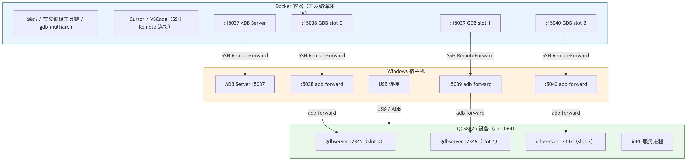

# 嵌入式开发gdb调试

## 经典开发流程

经典的嵌入是开发流程如下：

* `docker`容器:包含开发编译环境，交叉编译器，代码库等。
* `Windows`宿主机：使用`ssh`与`docker`容器进行通信。使用`adb`与设备进行通信。
* 嵌入式设备：运行被调试的程序，等待调试器连接。



## 配置gdb调试

### Windows宿主机配置

* 启动ADB server

```bash
# 确认 ADB 可用
adb version

# 启动 ADB server (默认监听 5037 端口)
adb start-server

# 列出连接的设备，确认设备已连接
adb devices
```

* 配置端口转发，通过`VSCODE`进行配置

```txt
Host MyDocker
    HostName 10.0.205.19
    Port 20045
    User root
    IdentityFile ~/.ssh/id_rsa
    RemoteForward 15037 localhost:5037
    RemoteForward 15038 localhost:5038
    RemoteForward 15039 localhost:5039
    RemoteForward 15040 localhost:5040
    ServerAliveInterval 60
    ServerAliveCountMax 3
```

这个配置将宿主机的`5037-5040`端口转发到`docker`容器的`15037-15040`端口，允许我们在`docker`容器内使用这些端口与设备进行通信。

### 设备配置

* 在设备上启动`gdbserver`

```bash
# 启动 gdbserver，监听 2345 端口，并运行被调试的程序
gdbserver :2345 /path/to/your/program
```

这个命令会在设备上启动`gdbserver`，它会监听`2345`端口，并等待来自调试器的连接。一旦连接成功，`gdbserver`将运行指定的程序，并允许调试器进行调试操作。

### Docker容器配置

* docker内配置ADB端口
  
```bash
export ADB_SERVER_SOCKET=tcp:localhost:15037

# 实际上是在windows宿主机上执行了以下命令，因为ADB_SERVER_SOCKET环境变量让docker内的adb命令认为ADB服务器在localhost:15037上运行
adb forward tcp:5038 tcp:2345
```

这个环境变量告诉`ADB`命令，让它以为`ADB`服务器正在`localhost:15037`上运行，从而通过转发的端口传到`WIndows`宿主机，而`Windows`宿主机上的`ADB`服务器监听`5037`端口,与设备进行通信。

* 在`docker`容器内使用`gdb`连接到设备上的`gdbserver`

```bash
# 连接到设备上的 gdbserver
gdb /path/to/your/program
(gdb) target remote localhost:15038
```

此时`gdb`会连接`15038`,经过ssh转发到Windows宿主机的`5038`,再经过`adb`转发到设备的`2345`端口，最终连接到设备上的`gdbserver`。

## 常见嵌入式gdb命令

```bash
# 设置根文件系统,让gdb能够找到正确的符号文件和源代码路径
set sysroot /path/to/sysroot

# 设置自动加载安全路径，防止gdb加载不受信任的文件，这里关掉了安全路径检查
set auto-load safe-path /

# 配置源代码路径
set substitute-path /buildroot/output/host/aarch64-buildroot-linux-gnu/sysroot/usr/src/debug/your-package-version /path/to/your/source/code
```
