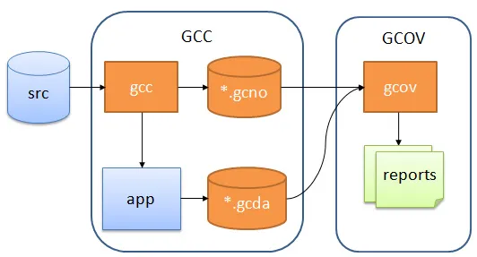

# gcov

`gcov`是一个测试`C++`代码覆盖率的工具，使用这个程序来分析程序，以创建更高效、运行速度更快的代码并发现程序中未经测试的部分。这意味着，我们可以使用`gcov`作为优化工具（通常与`gprof`结合），也可以使用`gcov`作为测试代码覆盖率工具。

参考文档

* GNU 官方文档[gcov—a Test Coverage Program](https://gcc.gnu.org/onlinedocs/gcc/Gcov.html)
* [Code coverage testing of C/C++ projects using Gcov and LCOV](https://medium.com/@xianpeng.shen/use-gcov-and-lcov-to-perform-code-coverage-testing-for-c-c-projects-c85708b91c78)
* Wiki百科[Gcov](https://en.wikipedia.org/wiki/Gcov)

## 工作原理



在编译时，`gcc`就会为每个源文件创建`.gcno`文件，当`.o`连接成可执行文件并运行时，就会为每个`.o`文件创建`*.gcda`文件。这两个文件通过`gcov`结合,就可以生成测试报告`.gcov`文件。

由于`gcov`的工作原理，在重新编译源文件时，应该删除`*.gcno`文件。

## 用法

使用`gcov`时，我们需要给编译选项加上`--coverage`.在运行编译出的可执行文件后，就会自动创建后缀名为`.da`的文件。使用`gcov`分析后，就可以查看代码覆盖率和每行代码运行次数。

## 例子

使用如下的代码片段作为例子。

```CPP
#include <stdio.h>

int
main (void)
{
  int i;

  for (i = 1; i < 10; i++)
  {
    if (i % 3 == 0)
      printf ("%d is divisible by 3\n", i);
    if (i % 11 == 0)
      printf ("%d is divisible by 11\n", i);
  }

  return 0;
}
```

使用`g++`编译

```shell
g++ -Wall -fprofile-arcs -ftest-coverage cov.c
```

运行`gcov`后

```shell
gcov cov.c 
```

输出为

```test
 88.89% of 9 source lines executed in file cov.c
Creating cov.c.gcov
```

此时会创建`.gcov`文件，文件内容为

```CPP
        #include <stdio.h>

        int
        main (void)
        {
     1    int i;

    10    for (i = 1; i < 10; i++)
          {
     9      if (i % 3 == 0)
     3        printf ("%d is divisible by 3\n", i);
     9      if (i % 11 == 0)
######        printf ("%d is divisible by 11\n", i);
     9    }

     1    return 0;
     1  }
```

## 常用命令行参数

* `-b`(`--branch-probabilities`),输出分支可能性。

## 注意点

通常结合`lcov`使用，可以输出更加方便阅读的测试数据。`lcov`是`gcov`的图像前端，它从多个源文件中收集`gcov`的数据，然后创建包含覆盖数据的`HTML`页面。
