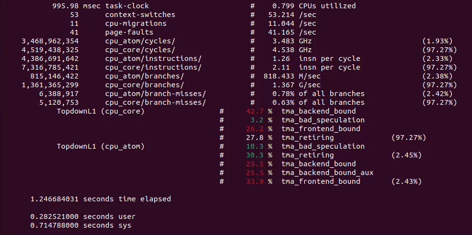
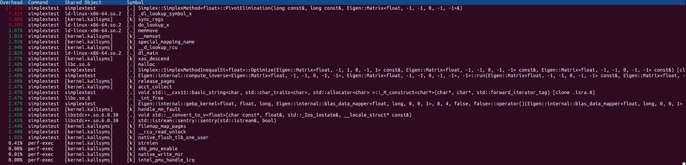
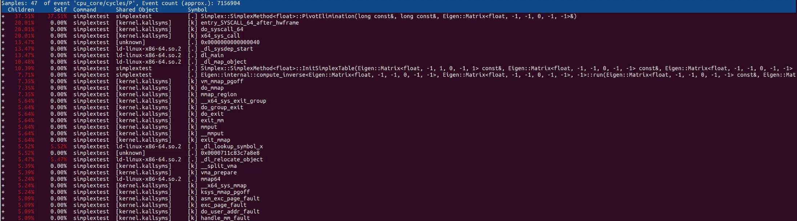
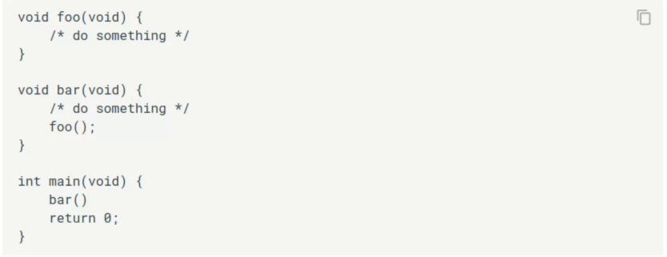
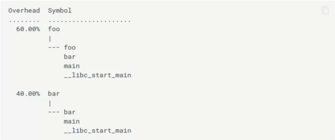
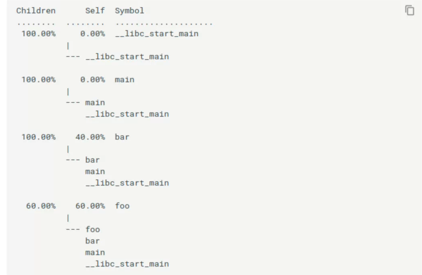
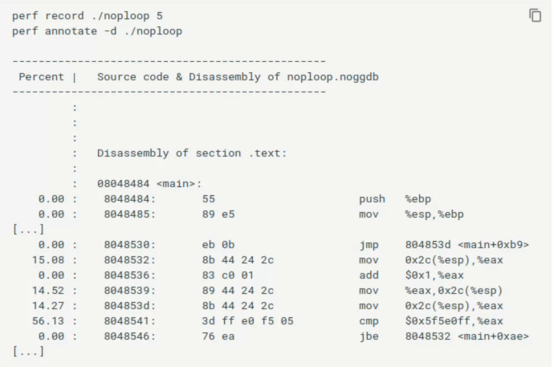
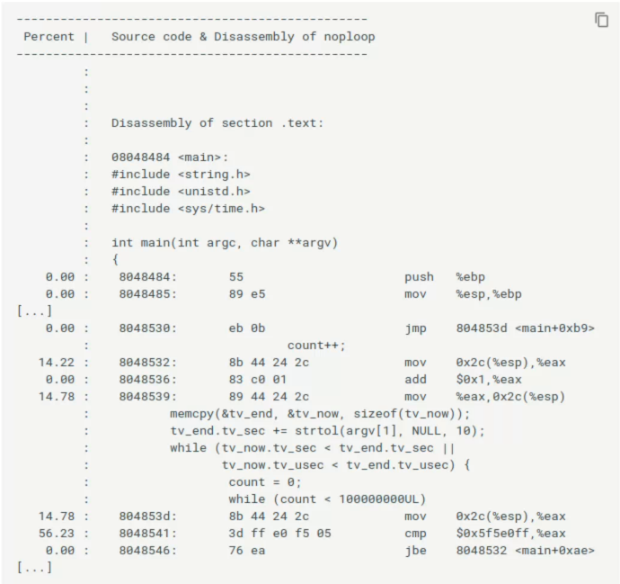

# perf

`perf`是`Linux`的代码性能分析工具。

参考文档

* [perf wiki](https://perfwiki.github.io/main/)
* [Perf – Linux下的系統性能調優工具](https://jasonblog.github.io/note/linux_tools/perf_--_linuxxia_de_xi_tong_xing_neng_diao_you_gon.html)

## 重要概念

### performance monitor unit

PMU单元是现代处理器的硬件设施,PMU允许软件对某种硬件事件设置计数器,此后处理器就开始统计事件的发生次数,当超过指定的计数器值后,便产生中断.通过捕获这些中断,便可以考察对程序对这些硬件的利用效率.

### Tracepoints

`Tracepoints`是内核代码里的hook,一旦使能,它们便可以在特定的代码被运行到时被触发,`perf`便利用了这个特性.

### Event

`perf`事件是可以触发`perf`采样的事件.主要分为三类.

* `Hardware Event`是由硬件`PMU`产生的事件.比如`Cache`未命中.
* `Software Event`是内核软件产生的事件,比如进程切换,`tick`数等.
* `Tracepoint Event`是内核`Tracepoints`产生的事件.

### Event-based sampling

`perf`是基于事件的采样方法，当事件发生时，就会递增一个计数器，计数器溢出时触发中断,`perf`就会进行一次采样.`perf`记录当前程序信息.

### CPU bound与IO bound

`CPU bound`型程序大部分时间都在利用`CPU`进行计算,`IO bound`程序大部分时间都耗费在了`IO`上.区分这两种程序有助于针对程序的特点进行调优.

### environment selection

`perf`可以在`per-thread`,`per-process`,`per-cpu`,`system-wide`模式下采集信息.

`per-thread`模式下,`perf`仅监视指定线程的执行。

`per-process`模式下,`perf`会监视指定的进程所有线程.

`per-cpu`模式下,`perf`会监视指定cpu.

## perf list

`perf list`列出所有`perf`可以捕获的事件.

## perf stat

`perf stat`以精简概括被调试程序运行的整体情况与总体数据.

以下是一个实例程序的结果输出.



* `Task-clock-msecs`表示`CPU`的利用率,这个占总时间的比值越大,意味着程序花费了更多的CPU计算.这个比值就是0.994.
* `Context-switches`上下文切换次数,记录了程序发生了多少次上下文切换,频繁的上下文切换应该被避免.
* `Cache-misses`记录了程序运行中`Cache`的使用情况.如果该值过高,说明程序对`Cache`的利用率不好.
* `CPU-migrations`记录了程序运行过程中发生了多少次CPU迁移.
* `Cycles`记录了处理器时钟,实际运行的CPU频率.注意`cpu_atom`是`intel`的低功耗小核,`cpu_core`是`intel`的高性能大核.
* `Instructions`处理器指令数目.
* `IPC`即`insn per cycle`每个处理器时钟执行的指令数目.
* `Cache-references`,`Cache`命中次数.
* `Cache-misses`,`Cache`未命中次数.
* `branches`处理器的分支数目.
* `branches-missed`分支预测失败数目,以及相对于所有分支的比值.

下方还有总用时,用户态用时,系统调用用时。

使用`-e`可以改变`perf stat`显示的事件.

使用`-r`可以重复运行同一个程序多次，获取平均值,以及标准差.

## perf record

`perf record`用于记录程序更细粒度的信息.它会生成一个叫做`perf.data`的文件，用于之后的分析.

### 基于事件的采样

`perf record`是基于事件进行采样.周期`period`表示事件发生的次数。记录采样`sample`会发生在内部的事件计数器溢出时.

计数器溢出时会产生中断，内核会记录的有关程序运行的信息，具体记录的信息取决于具体的设定.但是关键的记录信息是`instruction pointer`,表示程序中断的位置.但由于现代处理器的架构，位置会有几个指令的区别.

### 记录事件

默认情况下`perf`使用`cycles`事件作为采样事件，这是一个由硬件`PMU`产生的事件。在`CPU`频率发生变化的情况下，这个事件不能绝对地表示时间.

可以使用`-e`选择要记录的事件，可以同时记录多个事件.

```shell
perf record -F max -e cycles -e cache-misses ./simplextest 
```

### 周期与速率

* 周期，表示记录事件发生的次数.
* 速率，表示记录事件的平均速率(Hz)

通常情况下，`perf`记录采样的速率是`1000 sample/sec`.

### 收集信息

```shell
perf record ./program
```

收集`program`运行的信息.

使用`-g`选项会收集更详细的信息，比如函数堆栈，调用关系等.

### per-cpu模式

```shell
perf record -a sleep 5
```

`perf`会监视所有cpu，收集信息`5`秒.

使用`-c`可以指定CPU.

## perf report

`perf report`读取`perf.data`文件,生成性能分析.默认情况下，`perf`按照采样出现次数的有高到低排序函数.使用`--sort`可以指定排序。

```shell
perf report
```



`Overhead`表示在相应函数中的采样占总体样本的比值.

`Command`表示采样收集的进程.在`per-thread`或`per-process`模式里，表示监控命令的名称.在`per-cpu`模式里，会有不同.

`Shared Object`表示里采样来自的`ELF`映像名，对于动态连接库，就是动态连接库名，对于可执行文件，就是可执行文件名.

`[.],[k],[g],[u]`表示特权等级，`[.]`用户等级，`[k]`内核等级。

`Symbol`表示符号名.

### 报告调用堆栈

如果是使用了`perf record -g`记录了调用堆栈,那么使用`perf report`会显示更详细的信息.



`Self`表示对应符号的采样占总体样本的比值，就是普通的`Overhead`.所有的`Self`相加为`100%`.

`Children`是通过把所有的子函数的采样相加获取的,也就是表示当前函数所有子函数的消耗。`Children`指的是被其它函数(`Parent`)所调用的函数。所有的`Children`相加可能会大于`100%`.这个可以帮助发现那些子函数消耗很高的程序.

考虑如下的例子



例子中，`foo`是`bar`的`child`，`bar`是`main`的`child`,所以，`foo`也是`main`的`child`.

假定所有的采样都在`foo`和`bar`中记录.同时使用了`perf record -g`记录了函数调用栈.





## perf annotate

`perf annotate`是源码级别的性能分析命令.所有带有样本的函数都将被反汇编，并且每条指令都会报告其相对样本百分比.



如果是使用了`-g`编译的文件，那么还会显示源代码.



## 可视化

可以转换为json格式使用浏览器打开

```bash
# 采集 perf 数据
perf record -e cycles:u -F 2000 --call-graph fp \
  -o /tmp/thrust_vector_perf.data \
  ./out/build/gcc-release/Tests/ThrustVectorPerfTest

# 导出 perf script
perf script -i /tmp/thrust_vector_perf.data > /tmp/perf.script

# 安装 speedscope
npm install -g speedscope

# 转换成 speedscope JSON
speedscope --format perf-script /tmp/perf.script --out /tmp/
```
