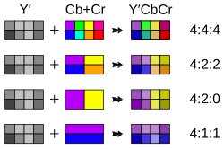

# 音视频笔记

## 音频基础

* PCM(Pulse Code Modulation)： 脉冲编码调制，是一种无损的音频编码方式，直接对模拟信号进行采样和量化。
* 采样率(Sample Rate)： 每秒钟采集的样本数，常见的采样率有44.1kHz（CD质量）、48kHz（专业音频）等。
* 位深(Bit Depth)： 每个样本使用的比特数，常见的有16位、24位等，位深越高，音频质量越好。
* 通道数(Channels)： 单声道（Mono）、立体声（Stereo）等.

## 视频基础

* 分辨率(Resolution)： 视频图像的宽度和高度，以像素为单位表示，如1920x1080（Full HD）。
* 帧率(Frame Rate)： 每秒钟显示的帧数，常见的有24fps、30fps、60fps等，帧率越高，视频越流畅。
* 编码格式(Video Codec)： 用于压缩和解压视频数据的算法，如H.264、H.265、VP9等。
* 色彩空间(Color Space)：
  * RGB： 红绿蓝三原色，用于显示设备。
  * YUV： 亮度和色度分量，常用于视频压缩
* 比特率(Bit Rate)： 每秒钟传输的数据量，通常以kbps或Mbps为单位，影响视频质量和文件大小。

### YUV颜色空间

* Y：亮度分量，表示图像的明暗信息。
* U和V：色度分量，表示图像的颜色信息。
  * U：表示蓝色差分量（B-Y）。
  * V：表示红色差分量（R-Y）。

#### 色度抽样

* YUV 4:4:4： 每个像素都有独立的Y、U、V分量，最高质量，数据量和RGB相当。
* YUV 4:2:2： 每两个像素共享一个U和V分量，常用于专业视频设备。
* YUV 4:2:0： 每四个像素共享一个U和V分量，常用于数字视频压缩格式，如H.264。



#### NV12格式

NV12 (Semi-Planar)：它是 2 个平面。

* Plane 0: YYYYYYY... (亮度分量)
* Plane 1: UVUVUV... (交错的色度分量)

#### RGB565格式

GGB565是一种16位的RGB颜色表示方法，其中：

* R（红色）占5位，范围0-31
* G（绿色）占6位，范围0-63
* B（蓝色）占5位，范围0-31

#### RGB888格式

RGB888是一种24位的RGB颜色表示方法，其中：

* R（红色）占8位，范围0-255
* G（绿色）占8位，范围0-255
* B（蓝色）占8位，范围0-255

### 内存布局

分为打包（Packed）和平面（Planar）两种方式：

* 打包格式(Packed Format)： Y、U、V分量交错存储，如YUY2、UYVY等。
* 平面格式(Planar Format)： Y、U、V分量分别存储，如YUV420P、YUV422P等。

## h.264/AVC

`H.264`是一种压缩标准(Codec),核心目标是去除冗余,它利用了视频信号在空间和时间上的相关性。

### 主要技术

#### 帧内预测(Intra Prediction)

* **原理**: H.264 把图像切成宏块（Macroblock，通常 16x16）。编码器不直接存储原始像素，而是根据周围已编码的块来“猜测”当前块的像素，只存储残差值（Residual）。
* **数学**: 原始数据 - 预测数据 = 残差。残差经过变换（DCT的整数近似）和量化后，数据量极小.

#### 帧间预测(Inter Prediction)

* **运动估计**(Motion Estimation): 寻找当前块在上一帧中的位置，计算出运动矢量(Motion Vector)
* **运动补偿**(Motion Compensation): 只记录物体移动的“方向”和移动后的“差异”，而不是重新画一遍物体

### 帧的分类

* I帧(Intra Frame / IDR Frame):关键帧.
  * 它是一张完整的图片（类似 JPG），不参考其他帧，独立解码.
  * 作用:解码器的“刷新点”。如果直播流中断，必须等到下一个I帧才能恢复画面.
* P帧(Predicted Frame):前向预测帧.
  * 参考之前的I帧或P帧，只存储与参考帧的差异.
  * 压缩率：高。
* B帧(Bi-directional Predicted Frame):双向预测帧.
  * 参考前后的I帧或P帧，存储与两者的差异.
  * 压缩率:最高，但解码复杂度也最高.
  * 副作用:增加延迟。因为要解码B帧，必须先要把后面的P帧解出来，这意味着播放器必须“等待”未来的帧。

### GOP(Group of Pictures)

GOP是视频编码中的一个重要概念，指一组连续的图像帧的集合，通常由一个I帧和若干个P帧、B帧组成。GOP的结构直接影响视频的压缩效率和解码复杂度。

### NAL Unit

NAL（Network Abstraction Layer）单元是H.264视频编码中的基本数据单元。每个NAL单元包含一个`NALU Header`和负载数据，负载数据可以是编码的视频数据、参数集等。NAL单元使得H.264视频流能够适应不同的传输协议和存储格式。

H.264码流 = NAL单元1 + NAL单元2 + NAL单元3 + ...

NAL单元 = `Start Code` + `NALU Header` + `Payload Data`

#### Start Code

表示NAL单元的开始，通常为3字节（0x000001）或4字节（0x00000001）。

作用是定位NALU的边界

通常`SPS`,`PPS`,`IDR`使用4字节起始码，其他使用3字节起始码。

#### NALU Header

`NALU Header`是NAL单元的头部信息大小为1字节，包含以下字段：

* `NALU Type`：表示NAL单元的类型，如SPS、PPS、IDR帧等。
* `NALU NRI`：表示NAL单元的优先级，用于网络传输中的优先级控制。
* `NALU Forbidden`：表示NAL单元是否被禁止，通常为0。

常见的NALU类型：

* 1-5：非IDR和IDR图像数据
* 6：SEI（Supplemental Enhancement Information，补充增强信息）
* 7：SPS（Sequence Parameter Set，序列参数集），包含分辨率、帧率
* 8：PPS（Picture Parameter Set，图像参数集），包含熵编码类型

#### Payload Data

负载数据是NAL单元的实际内容，包含编码的视频数据或参数集信息。

需要注意的是，NAL单元中的编码数据通常经过了`防止起始码前缀出现`的处理（如`字节填充`），以确保NAL单元的完整性和正确解析。

* 遇到 `00 00 00` -> 修改为 `00 00 03 00`
* 遇到 `00 00 01` -> 修改为 `00 00 03 01`
* 遇到 `00 00 02` -> 修改为 `00 00 03 02`
* 遇到 `00 00 03` -> 修改为 `00 00 03 03`

## AAC

AAC（Advanced Audio Coding，高级音频编码）是一种有损音频压缩格式，旨在提供比MP3更高的音质和更好的压缩效率。AAC广泛应用于各种数字音频应用中，如流媒体、广播和存储。

### 压缩原理

AAC的压缩利用了心理声学模型(Psychoacoustics).

1. 频域掩蔽 (Frequency Masking)，如果在一个频率（比如 1000Hz）上有一个很大的声音，人耳就听不见在这个频率附近（如 1050Hz）的小声音。
2. 时间掩蔽 (Temporal Masking)，一个很响的声音会掩盖它前后很短时间内的较小声音。

### Profiles

* `AAC-LC` (Low Complexity) —— 最常用的AAC配置文件，适用于大多数应用场景。
* `HE-AAC` (High Efficiency AAC) —— 适用于低比特率应用，如流媒体和广播。
* `HE-AAC v2`——在`HE-AAC`的基础上增加了参数立体声编码，进一步提高低比特率下的音质。

### ADTS

ADTS是AAC音频流的一种封装格式，全称为`Audio Data Transport Stream`。ADTS封装了AAC编码的音频数据，使其能够在流媒体传输中被正确解析和播放。

每个ADTS帧由两个部分组成：ADTS头部和AAC音频数据。

`[ADTS Header] + [AAC Data] | [ADTS Header] + [AAC Data] ...`

ADTS头部包含以下关键信息：

* 同步字(Sync Word)：12位，固定为0xFFF，用于标识ADTS帧的开始。
* MPEG版本(MPEG Version)：1位，表示MPEG-4或MPEG-2。
* Profile(Profile)：2位，表示AAC的配置文件类型，如AAC-LC、HE-AAC等。
* 采样率索引(Sampling Frequency Index)：4位，表示音频的采样率。
* 声道配置(Channel Configuration)：3位，表示音频的声道数。
* 帧长度(Frame Length)：13位，表示整个ADTS帧的长度，包括头部和音频数据。

## WAV格式

`WAV`（Waveform Audio File Format）是一种用于存储音频数据的文件格式，存储的是原始的PCM数据+文件头。WAV文件由多个块（Chunk）组成，每个块包含特定类型的信息。

### WAV Chunk

WAV文件由三个核心块组成:

1. RIFF Header Chunk文件头
    * Chunk ID: 固定为字符串"RIFF" (4 bytes)
    * Chunk Size: 文件大小减去8字节 (4 bytes)
    * Format: 固定为字符串"WAVE" (4 bytes)
2. fmt Chunk格式块
    * Chunk ID: 固定为字符串"fmt " (4 bytes)注意有空格.
    * Chunk Size: 格式块的大小，通常为16或18或40 (4 bytes)
    * Audio Format: 音频格式代码，1表示PCM无压缩 (2 bytes)
    * Num Channels: 声道数，1表示单声道，2表示立体声 (2 bytes)
    * Sample Rate: 采样率，如44100Hz (4 bytes)
    * Byte Rate: 每秒数据字节数 = SampleRate \* NumChannels \* BitsPerSample/8 (4 bytes)
    * Block Align: 每个采样块的字节数 = NumChannels * BitsPerSample/8 (2 bytes)
    * Bits Per Sample: 每个样本的位数，如16位 (2 bytes)
3. data Chunk数据块
    * Chunk ID: 固定为字符串"data" (4 bytes)
    * Chunk Size: 音频数据的大小字节数 (4 bytes)
    * Audio Data: 实际的音频样本数据 (variable size)

由于WAV格式限制，只能存储小于4GB的音频数据。如果需要存储更大的音频文件，可以使用`RF64`格式，它是WAV格式的扩展，支持超过4GB的文件大小。

### WAV文件头C++结构体

```CPP
#include <cstdint>

// 强制 1 字节对齐，防止编译器自动填充导致读取错位
#pragma pack(push, 1)

struct WAVHeader {
    // --- RIFF Chunk ---
    char     riff_tag[4];        // "RIFF"
    uint32_t riff_length;        // 文件大小 - 8
    char     wave_tag[4];        // "WAVE"

    // --- fmt Chunk ---
    char     fmt_tag[4];         // "fmt "
    uint32_t fmt_length;         // 通常是 16
    uint16_t audio_format;       // 1 = PCM
    uint16_t num_channels;       // 通道数
    uint32_t sample_rate;        // 采样率
    uint32_t byte_rate;          // 每秒字节数
    uint16_t block_align;        // 每次采样的大小 (Channels * Bits/8)
    uint16_t bits_per_sample;    // 位深 (8, 16, 32)

    // --- data Chunk ---
    char     data_tag[4];        // "data"
    uint32_t data_length;        // 音频数据总字节数
};

#pragma pack(pop)
```
