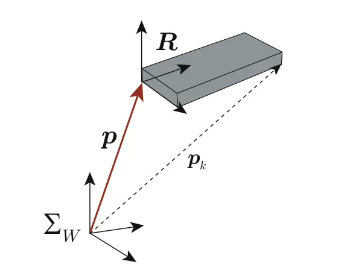
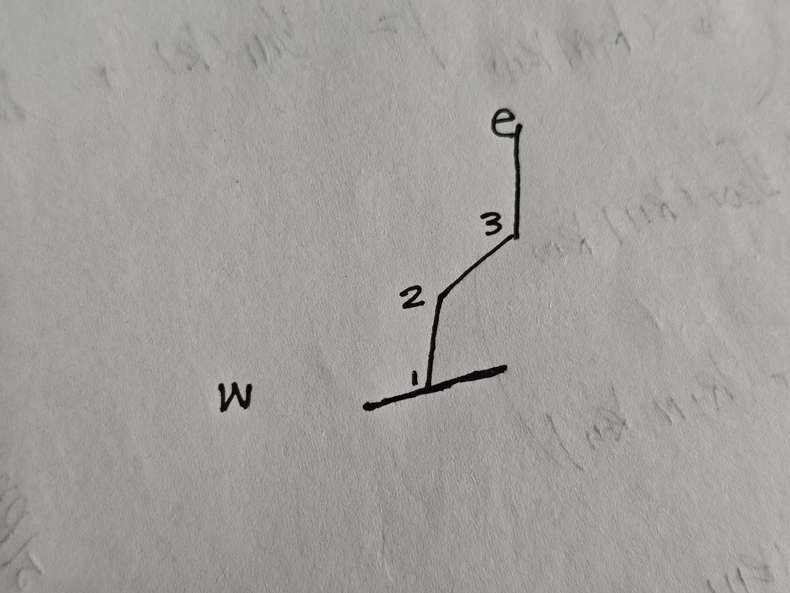

# 正运动学

本文总结连杆机构的机器人的正向运动学.正运动学就是给定机器人各个关节的角度(旋转矩阵)，求机器人上某一点的位置的方法.

以下的推导均假设全局惯性坐标系`w`到关节坐标系`1`的位置不变，也就是，关节`1`固连在全局坐标系.如果不满足，可以将全局惯性坐标系`w`修改为机体瞬时惯性坐标系`b`.

## 符号规定

* $_2^1R$表示从坐标系`1`旋转到坐标系`2`的旋转矩阵.
* $_2^1T$仿射矩阵，是一个$4\times4$的矩阵.表示从坐标系`1`到坐标系`2`的旋转平移关系.
* $p_{b2}^b$表示从`b`点到`2`点的向量，在$b$坐标系下的表示.
* $e_{2x}^1$,$e_{2y}^1$,$e_{2z}^1$坐标系`2`的`xyz`轴标准向量，在坐标系`1`表示.

## 常用结论

### 旋转矩阵

$$
_2^1R =
\begin{pmatrix}
e_{2x}^1 & e_{2y}^1 & e_{2z}^1
\end{pmatrix}
$$

使用三轴转为旋转矩阵.

### 仿射矩阵

$$
_2^1T = \begin{pmatrix}
_2^1R & p_{12}^1 \\
\bf0 & 1
\end{pmatrix}
$$

$$
\begin{pmatrix}
p_{1e}^1 \\ 1
\end{pmatrix}
=
{_2^1T}
\begin{pmatrix}
p_{2e}^2 \\
1
\end{pmatrix}
$$

也就是说，在坐标系`1`中的`1e`向量可以由坐标系`2`中的`2e`向量和仿射矩阵表示.

### 角速度

角速度可以表示为

$$
\omega = {\bf{a}}q
$$

$\bf{a}$是旋转方向的单位向量.

### 角速度与旋转矩阵的关系

假设有一个固连在旋转物体上的坐标系`r`.全局惯性坐标系`w`和`r`原点重合,对于物体上的任一点`1`.有

$$
\begin{align*}
p^w_{w1} &= {^w_rR} \ p^r_{w1} \\
\dot{p}^w_{w1} &= {^w_r\dot{R}} \ p^r_{w1} \\
\omega \times p^w_{w1} &=  {^w_r\dot{R}}{R^T}p^w_{w1}
\end{align*} \\
\hat\omega = \dot{R}R^T
$$

求解这个微分方程

$$
\begin{align*}
\dot{R} &= \hat\omega R^T \\
R(t) &= e^{\hat\omega t} \\
R(t) &= {\bf{I}} + \hat{a}sin(\omega t) + \hat{a}^2(1-cos(\omega t))
\end{align*}
$$

若

$$
\theta = \omega t
$$

则

$$
R(t) = {\bf{I}} + \hat{a}sin(\theta) + \hat{a}^2(1-cos(\theta))
$$

这就是轴角法转旋转矩阵的公式.

### 刚体速度

对于一个在空间中任意运动的刚体，它任意一个点的速度可以通过固连在刚体上的坐标系原点速度与不变的结构参数计算得出.

设全局惯性坐标系`w`，本地坐标系`b`.

$$
\begin{align*}
p^w_{we} &= p^w_{wb} + {^w_b}Rp{^b_{be}} \\
\dot{p}{^w_{we}} &= v_b + \omega \times ({^w_b}Rp^b_{be})
\end{align*}
$$

也就是

$$
p_k = v + \omega \times (p_k - p)
$$

### 相对速度，相对角速度

对于两个分别在运动的坐标系`1`,`2`,对于全局坐标系`w`

$$
p^w_{w2} = p^w_{w1} + {^w_1}Rp{^1_{w2}} \\
{^w_2R} = {^w_1R}{^1_2R}
$$

求导

$$
\dot{p}{^w_{w2}} = \dot{p}{^w_{w1}} + {^w_1}R\dot{p}{^1_{w2}} + \omega_1 \times (p^w_{w2} - p^w_{w1}) \\
v_2 = v_1 + Rv_d + \omega \times (p_2 - p_1)  \\
\omega_2 = \omega_1 + {^w_1}R\omega_{12}
$$

## 推导

构建全局坐标系`w`,固连在关节上的本地坐标系`1`,`2`,`3`，原点分别在对应的关节处.

求点`e`在全局惯性坐标系下的坐标向量,给定$p_{w1}^w$.

$$
\begin{align*}
p_{w2}^w &= p_{w1}^w + {_1^wR} p_{12}^1 \\
\begin{pmatrix}
p_{w2}^w \\ 1
\end{pmatrix}
&=
{_1^wT}
\begin{pmatrix}
p_{12}^1 \\
1
\end{pmatrix}
\end{align*}
$$

`p_{12}^1`在坐标系`1`下是一个不变的量，是机械臂的长度向量.

$$
\begin{align*}
p_{w3}^w &= p_{w2}^w + {^w_1R}{^1_2R} p_{23}^2 \\
&= p_{w1}^w + {_1^wR} p_{12}^1 + {^w_1R}{^1_2R} p_{23}^2 \\
\begin{pmatrix}
p_{w3}^w \\ 1
\end{pmatrix}
&=
{_1^wT}{_2^1T}
\begin{pmatrix}
p_{23}^2 \\
1
\end{pmatrix}
\end{align*}
$$

同理可以得出`n`连杆下，尾端的长度向量.

$$
\begin{pmatrix}
p_{we}^w \\ 1
\end{pmatrix}
=
{_1^wT}{_2^1T}...{_n^{n-1}T}
\begin{pmatrix}
p_{ne}^n \\
1
\end{pmatrix}
$$

$$
p_{we}^w = p_{w1}^w + {_1^wR} p_{12}^1 + {^w_1R}{^1_2R} p_{23}^2 + ... + {^w_1R}{^1_2R}...{^{n-1}_{n}R}p^n_{ne}
$$

## 雅可比矩阵

计算最后一个关节的本地坐标系相对于全局坐标系的速度与角速度,便可以得出当前构型下，末端执行器与各关节速度的关系.

$$
\begin{pmatrix}
\bf{\dot{p}^w_{wn}} \\
\omega_n
\end{pmatrix} =
\bf{J}
\begin{pmatrix}
\dot\theta_1 & \dot\theta_2 & ... & \dot\theta_n
\end{pmatrix}^T
$$

雅可比矩阵可以通过当前构型下，求偏导数得出.

$$
\bf{J} = \begin{pmatrix}
\frac{\partial{\bf{p^w_{wn}}}}{\partial{\bf{\theta}}^T} \\ \\
\omega_n
\end{pmatrix}
$$

其中

$$
p^w_{wn} = p_{w1}^w + {_1^wR} p_{12}^1 + {^w_1R}{^1_2R} p_{23}^2 + ... + {^w_1R}{^1_2R}...{^{n-2}_{n-1}R}p^{n-1}_{(n-1)n}
$$

$$
\hat\omega_n = {\dot{R}}{R^T}
$$

其中

$$
R = {^w_1R}{^1_2R}{^{n-2}_{n-1}R}...{^{n-1}_{n-2}R} \\ \\
^{k-1}_kR = e^{\hat{a}^{k-1}_k（\theta_k+\theta_{kinit}）}
$$

$\hat{a}^{k-1}$是坐标系`k`的旋转轴在`k-1`坐标系下的表示，所以是常量.

所以

$$
\frac{\partial{^{k-1}_kR}}{\partial\theta_k} = \hat{a}^{k-1}_k \ {^{k-1}_kR} \\
\begin{align*}
\frac{\partial{\bf{p^w_{wn}}}}{\partial{\bf{\theta}_k}} &= {^w_{k-1}R}\hat{a}^{k-1}_kp^{k-1}_{k(k+1)} + {^w_{k-1}R}\hat{a}^{k-1}_kp^{k-1}_{(k+1)(k+2)} + ... + {^w_{k-1}R}\hat{a}^{k-1}_kp^{k-1}_{(n-1)n} \\ &=
{^w_{k-1}R}\hat{a}^{k-1}_kp^{k-1}_{kn} \\ &=
a^w_k \times p^w_{kn} \\ &=
a^w_k \times (p^w_n - p^w_k) \\
\end{align*}
$$

角速度

$$
\hat{w}_n = \sum_{k=1}^n({^w_{k-1}R\hat{a}^{k-1}_k{^{k-1}_wR}}\frac{d\theta_k}{dt})
$$

对于任意的$p^w$

$$
\begin{align*}
\hat{w}_np^w &= \sum_{k=1}^n({^w_{k-1}R\hat{a}^{k-1}_k{^{k-1}_wR}}{p^w}\frac{d\theta_k}{dt}) \\
&= \sum_{k=1}^n({^w_{k-1}R\hat{a}^{k-1}_kp^{k-1}}\frac{d\theta_k}{dt}) \\ &=
\sum_{k=1}^n({\hat{a}^{w}_kp^{w}}\frac{d\theta_k}{dt})
\end{align*}
$$

所以

$$
w_n =
\begin{pmatrix}
a^w_1 & a^w_2 & ... & a^w_n
\end{pmatrix}
\begin{pmatrix}
\frac{d\theta_1}{dt} & \frac{d\theta_2}{dt} & ... & \frac{d\theta_n}{dt}
\end{pmatrix}^T
$$

所以，雅可比矩阵为

$$
J = \begin{pmatrix}
a^w_1 \times (p^w_n - p^w_1) & a^w_2 \times (p^w_n - p^w_2) & ... & a^w_{n-1} \times (p^w_n - p^w_{n-1}) & 0 \\
a^w_1 & a^w_2 & ... & a^w_{n-1} & a^w_n
\end{pmatrix}
$$
