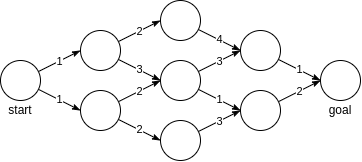
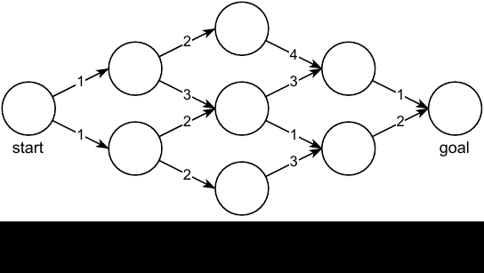
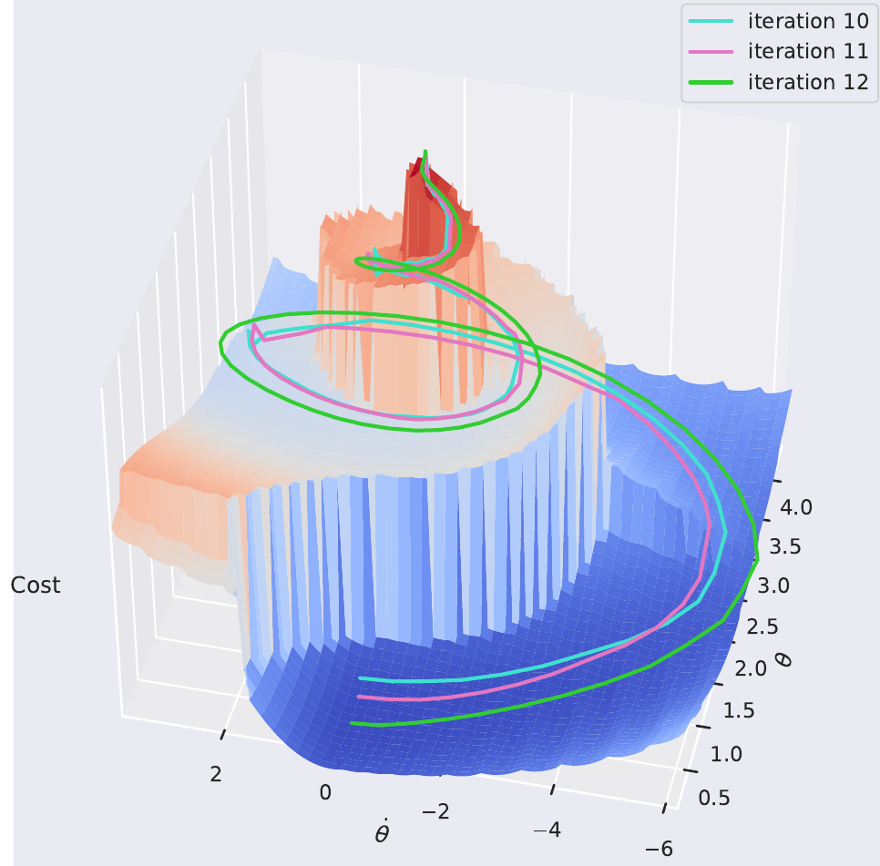
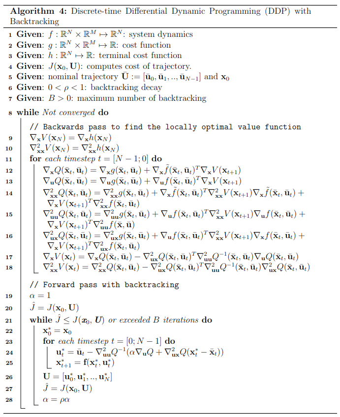

# 微分动态规划Differential Dynamic Programming

微分动态规划(DDP)是求解非线性MPC问题的高效率求解器，它利用非线性函数的一阶或二阶展开，结合动态规划思想，可以高效率地求解。

参考文档

* [Deriving Differential Dynamic Programming](https://www.imgeorgiev.com/2023-02-01-ddp/#eq:u*)

## 最优控制问题

给定离散系统动态

$$
\textbf{x}_{i+1} = \textbf{f}(\textbf{x}_i,\textbf{u}_i)
$$

最小化成本函数

$$
\begin{aligned}
%  \label{eq:discrete-cost}
    J(\textbf{x}_0, \pi) = h(\textbf{x}_N) + \sum_{k=0}^{N-1} g(\textbf{x}_k, \textbf{u}_k)\end{aligned}
$$

这可以理解为从状态$\textbf{x}(t_0)$开始遵循策略$\pi$的累积成本，我们现在的目标是找到最优策略$\pi^*$，以最小化成本

$$
\begin{aligned}
%  \label{eq:optimal-control-problem}
    \pi^* = \arg \min_\pi J(\textbf{x}(t_0), \pi)\end{aligned}
$$

## 动态规划Dynamic Programming

考虑一个离散图，每个节点就是一个状态，状态转换需要代价(cost),我们希望以最小的成本从起始节点遍历到目标节点，如下图所示。将每个节点视为一个状态$x$,其值$V(x)$表示从该状态到达目标的剩余成本.从节点出发的每条边可以被视为一个离散动作，具有相关的到达成本$g(x,u)$,设目标状态将具有终端成本$h(\bf{x}_{goal}) = 0$

通过图找到最优路径的一种方法是利用贝尔曼最优性原理，该原理指出，一个状态的最优值是最小化的“到达成本”与后续状态值$\bf{x}^\prime$的组合

$$
V^*({\bf{x}}) = \underset{{\bf{u}}}{min}[g({\bf{x}},{\bf{u}}) + V^\ast(\bf{x}^\prime)]
$$

这个式子的意思是，在当前状态$\bf{x}$下，到达最终状态的${\bf{x}}_N$的代价函数`cast function`的最优值，是选择的一步操作输入$\textbf{u}$，与在这个输入下到达的下一个状态$\textbf{x}^\prime$的的最优值$V^\ast(\textbf{x}^\prime)$的最小值。

可以看出，贝尔曼最优性定理在计算$V^\ast({\bf{x}})$前就需要得出所有的后续状态值$\textbf{x}^\prime$的最优值$V^\ast(\textbf{x}^\prime)$.这样才能计算出当前状态值的最优值，这意味着贝尔曼公式需要从终点向起点反向计算。

在终端

$$
\begin{aligned}
    V^*(\textbf{x}_{\text{goal}}) = \min_\textbf{u}[ h(\textbf{x}_{\text{goal}}) ] = \min_\textbf{u}[0] = 0\end{aligned}
$$

现在，我们继续回溯时间，利用贝尔曼方程，可以估计每个状态的价值

结合最优控制系统动态方程，动态规划的变为

$$
\begin{aligned}
%  \label{eq:bellman-discrete}
    V^\pi(\textbf{x}_n, t_n) & = \min_\textbf{u}\bigg[ J(\textbf{x}_n, \pi) \bigg] = \min_\textbf{u}\bigg[ \sum_{k=n}^{N-1} g(\textbf{x}_k, \textbf{u}_k) + h(\textbf{x}_N) \bigg]  \\
    & = \min_\textbf{u}\bigg[ g(\textbf{x}_n, \textbf{u}_n) + \underbrace{\sum_{k=n+1}^{N-1} g(\textbf{x}_k, \textbf{u}_k) + h(\textbf{x}_N)}_{V^\pi(\textbf{x}_{n+1}, n+1)} \bigg]  \\
    & = \min_\textbf{u}\bigg[ g(\textbf{x}_n, \textbf{u}_n) + V^\pi (\textbf{x}_{n+1}, n+1) \bigg]\end{aligned}
$$

其中$\textbf{x}_{n+1} = f(\textbf{x}_n, \textbf{u}_n)$

动态规划性能强大，可以解出全局最优解，但是，求解难度随着问题维数上升而大幅增加。

## 微分动态规划DDP

微分动态规划通过泰勒级数展开，将问题转换为求取局部最优化问题。

除了离散时间不变动态和成本外，我们现在还定义了一个固定时间范围的控制序列，该序列进而定义了我们的轨迹（状态序列）。

$$
\begin{aligned}
    \text{given }\textbf{x}_0,  \textbf{U} := [\textbf{u}_0, \textbf{u}_1, .. , \textbf{u}_{N-1}] \implies
    \textbf{X} := [\textbf{x}_1, \textbf{x}_2, .. , \textbf{x}_{N}]\end{aligned}
$$

那么我们的最优控制问题可以重新定义为

$$
\begin{aligned}
    \textbf{U}^* &= \arg \min_{\textbf{U}} J(\textbf{x}_0, \textbf{U}) \\
    &= \arg \min_{\textbf{U}} \left[ h(\textbf{x}_N) + \sum_{n=0}^{N-1} g(\textbf{x}_n, \textbf{u}_n) \right]\end{aligned}
$$

其中，后续状态由系统动态与当前输入给出

$$
\textbf{x}_{n+1} = f(\textbf{x}_n, \textbf{u}_n)
$$

### 系统动态的泰勒级数展开

对系统动态函数$f: \mathbb{R}^N \times \mathbb{R}^M \mapsto \mathbb{R}^N$,它的二阶泰勒展开为

$$
\begin{aligned}
    f(\textbf{x}, \textbf{u})
    =&     f(\bar{\textbf{x}}, \bar{\textbf{u}}) +
    \begin{bmatrix}
        \nabla_\textbf{x}f(\bar{\textbf{x}}, \bar{\textbf{u}})\\
        \nabla_\textbf{u}f(\bar{\textbf{x}}, \bar{\textbf{u}})
    \end{bmatrix}^T
    \begin{bmatrix}
        \textbf{x}- \bar{\textbf{x}}\\
        \textbf{u}- \bar{\textbf{u}}
    \end{bmatrix} +
    \dfrac{1}{2} \begin{bmatrix}
        \textbf{x}- \bar{\textbf{x}}\\
        \textbf{u}- \bar{\textbf{u}}
    \end{bmatrix}^T
    \begin{bmatrix}
        \nabla_\textbf{xx}^2 f(\bar{\textbf{x}}, \bar{\textbf{u}}) & \nabla_\textbf{xu}^2 f(\bar{\textbf{x}}, \bar{\textbf{u}})\\
        \nabla_\textbf{ux}^2 f(\bar{\textbf{x}}, \bar{\textbf{u}}) & \nabla_\textbf{uu}^2 f(\bar{\textbf{x}}, \bar{\textbf{u}})
    \end{bmatrix}
    \begin{bmatrix}
        \textbf{x}- \bar{\textbf{x}}\\
        \textbf{u}- \bar{\textbf{u}}
    \end{bmatrix}\end{aligned}
$$

其中$\nabla_\textbf{x}f(\bar{\textbf{x}}, \bar{\textbf{u}})$表示函数$f(\textbf{x},\textbf{u})$关于$\textbf{x}$的梯度函数在$(\bar{\textbf{x}}, \bar{\textbf{u}})$的值，其它的同理。

### 贝尔曼方程的泰勒级数展开

定义状态-动作函数$Q$

$$
\begin{aligned}
%  \label{eq:state-action-value}
    Q(\textbf{x}_n, \textbf{u}_n, t_n) &= g(\textbf{x}_n, \textbf{u}_n) + V(\textbf{x}_{n+1}, t_{n+1}) \\
    &= g(\textbf{x}_n, \textbf{u}_n) +  V(f(\textbf{x}_n, \textbf{u}_n), t_{n+1})
\end{aligned}
$$

显然

$$
\begin{aligned}
    V(\textbf{x}_n, t_n) = \min_{\textbf{u}_n}  Q(\textbf{x}_n, \textbf{u}_n, t_n)
    \end{aligned}
$$

将状态动作函数在$(\bar{\textbf{x}}_n, \bar{\textbf{u}}_n)$进行泰勒级数展开为

$$
\begin{aligned}
Q(\textbf{x},\textbf{u}, t_n) &=
Q(\bar{\textbf{x}}_n + \delta\textbf{x}_n, \bar{\textbf{u}}_n + \delta\textbf{u}_n, t_n) \\&\approx Q(\bar{\textbf{x}}_n, \bar{\textbf{u}}_n,t_n) + \begin{bmatrix}
        \nabla_\textbf{x}Q(\bar{\textbf{x}}_n, \bar{\textbf{u}}_n, t_n)\\
        \nabla_\textbf{u}Q(\bar{\textbf{x}}_n, \bar{\textbf{u}}_n, t_n)
    \end{bmatrix}^T
    \begin{bmatrix}
        \delta \textbf{x}_n \\
        \delta \textbf{u}_n
    \end{bmatrix} +
    \dfrac{1}{2} \begin{bmatrix}
        \delta \textbf{x}_n \\
        \delta \textbf{u}_n
    \end{bmatrix}^T
    \begin{bmatrix}
        \nabla_\textbf{xx}^2 Q(\bar{\textbf{x}}_n, \bar{\textbf{u}}_n, t_n) & \nabla_\textbf{xu}^2 Q(\bar{\textbf{x}}_n, \bar{\textbf{u}}_n, t_n)\\
        \nabla_\textbf{ux}^2 Q(\bar{\textbf{x}}_n, \bar{\textbf{u}}_n, t_n) & \nabla_\textbf{uu}^2 Q(\bar{\textbf{x}}_n, \bar{\textbf{u}}_n, t_n)
    \end{bmatrix}
    \begin{bmatrix}
        \delta \textbf{x}_n \\
        \delta \textbf{u}_n
    \end{bmatrix}
\end{aligned}
$$

其中

$$
\begin{aligned}
%  \label{eq:ddp-derivatives}
% \begin{split} % not supported by katex
    \nabla_\textbf{x}Q(\bar{\textbf{x}}_n, \bar{\textbf{u}}_n, t_n) &= \nabla_\textbf{x}g(\bar{\textbf{x}}_n, \bar{\textbf{u}}_n) + \nabla_\textbf{x}\tilde{f}^T \nabla_{\textbf{x}} V(\bar{\textbf{x}}_{n+1}, t_{n+1}) \\
    \nabla_\textbf{u}Q(\bar{\textbf{x}}_n, \bar{\textbf{u}}_n, t_n) &= \nabla_\textbf{u}g(\bar{\textbf{x}}_n, \bar{\textbf{u}}_n) + \nabla_\textbf{u}f^T \nabla_{\textbf{x}} V(\bar{\textbf{x}}_{n+1}, t_{n+1}) \\
    \nabla_\textbf{xx}^2 Q(\bar{\textbf{x}}_n, \bar{\textbf{u}}_n, t_n) &= \nabla_\textbf{xx}^2 g(\bar{\textbf{x}}_n, \bar{\textbf{u}}_n) + \nabla_\textbf{x}\tilde{f}^T \nabla_{\textbf{x}\textbf{x}}^2 V(\bar{\textbf{x}}_{n+1}, t_{n+1}) \nabla_\textbf{x}\tilde{f} + \nabla_{\textbf{x}} V(\bar{\textbf{x}}_{n+1}, t_{n+1})^T \nabla_\textbf{xx}^2 \tilde{f} \\
    \nabla_\textbf{uu}^2 Q(\bar{\textbf{x}}_n, \bar{\textbf{u}}_n, t_n) &= \nabla_\textbf{uu}^2 g(\bar{\textbf{x}}_n, \bar{\textbf{u}}_n) + \nabla_\textbf{u}f^T \nabla_{\textbf{x}\textbf{x}}^2 V(\bar{\textbf{x}}_{n+1}, t_{n+1}) \nabla_\textbf{u}f + \nabla_{\textbf{x}} V(\bar{\textbf{x}}_{n+1}, t_{n+1})^T \nabla_\textbf{uu}^2 f \\
    \nabla_\textbf{ux}^2 Q(\bar{\textbf{x}}_n, \bar{\textbf{u}}_n, t_n) &= \nabla_\textbf{ux}^2 g(\bar{\textbf{x}}_n, \bar{\textbf{u}}_n) + \nabla_\textbf{u}f^T \nabla_{\textbf{x}\textbf{x}}^2 V(\bar{\textbf{x}}_{n+1}, t_{n+1}) \nabla_\textbf{x}\tilde{f} + \nabla_{\textbf{x}} V(\bar{\textbf{x}}_{n+1}, t_{n+1})^T \nabla_\textbf{ux}^2 f
% \end{split} % not supported by katex
\end{aligned}
$$

$\nabla_\textbf{x}\tilde{f}^T$就是系统动态函数$f(\textbf{x}_n, \textbf{u}_n)$在关于$\textbf{x}$的梯度在$(\bar{\textbf{x}}_n, \bar{\textbf{u}}_n)$的值。

$\bar{\textbf{x}}_{n+1}$是先验设定的，当给定$\bar{\textbf{x}}_n$与$\bar{\textbf{u}}_n$后通过系统动态方程自然可以得出。

注意值函数$V(\textbf{x}_n, t_n)$是会随着$n$变化的，也就是说，每次$n$变化时，值函数也都会变化。可以理解为，在每个特定的$n$下，都是一个独特的值函数，表示从当前$\textbf{x}_n$到达目标点的最小值函数。

最优值变为

$$
\begin{aligned}
%  \label{eq:bellman-approx-with-q}
% \begin{split} % not supported by katex
    V(\textbf{x}_n, t_n) &= \min_{\delta \textbf{u}_n} \big[ g(\textbf{x}_n, \textbf{u}_n) + V(\textbf{x}_{n+1}, t_{n+1}) \big]
    \\
    & = \min_{\delta \textbf{u}_n} \big[ Q(\textbf{x}_n, \textbf{u}_n, t_n) \big] \\
    & \approx \min_{\delta \textbf{u}_n} \big[ Q(\bar{\textbf{x}}_n, \bar{\textbf{u}}_n, t_n) + Q(\delta \textbf{x}_n, \delta \textbf{u}_n, t_n) \big] \\
    & = \min_{\delta \textbf{u}_n} \big[ Q(\delta \textbf{x}_n, \delta \textbf{u}_n, t_n) \big] + Q(\bar{\textbf{x}}_n, \bar{\textbf{u}}_n, t_n)
% \end{split} % not supported by katex
\end{aligned}
$$

问题变成了求二次型函数最小值问题，使用牛顿法可以很方便地得出结果

$$
\begin{aligned}
%  \label{eq:u*}
    &\delta \textbf{u}^* = \arg \min_{\delta \textbf{u}} Q(\delta \textbf{x}, \delta \textbf{u}) \\
    &\delta \textbf{u}^* = -\nabla_\textbf{uu}^2 Q(\bar{\textbf{x}}, \bar{\textbf{u}})^{-1} (\nabla_\textbf{u}Q(\bar{\textbf{x}}, \bar{\textbf{u}}) + \nabla_\textbf{ux}^2 Q(\bar{\textbf{x}}, \bar{\textbf{u}}) \delta \textbf{x}) \\
    &\delta \textbf{u}^* = \underbrace{- \nabla_\textbf{uu}^2 Q(\bar{\textbf{x}}, \bar{\textbf{u}})^{-1} \nabla_\textbf{u}Q(\bar{\textbf{x}}, \bar{\textbf{u}})}_{\text{feed-forward term}} - \underbrace{\nabla_\textbf{uu}^2 Q^{-1}(\bar{\textbf{x}}, \bar{\textbf{u}}) \nabla_\textbf{ux}^2 Q(\bar{\textbf{x}}, \bar{\textbf{u}}) \delta \textbf{x}}_{\text{feedback term}}\end{aligned}
$$

将$\delta u^*$代入并消元，得到$V(\textbf{x}_n, t_n)$,

$$
\begin{aligned}
    &V(\textbf{x}, t_n) = Q(\delta \textbf{x}, \delta \textbf{u}^*, t_n) + Q(\bar{\textbf{x}}, \bar{\textbf{u}}, t_n) \\
    &= \nabla_\textbf{x}Q(\bar{\textbf{x}}, \bar{\textbf{u}}, t_n)^T \delta \textbf{x}+ \nabla_\textbf{u}Q(\bar{\textbf{x}}, \bar{\textbf{u}}, t_n)^T \delta \textbf{u}^* + \dfrac{1}{2} \delta \textbf{x}^T \nabla_\textbf{xx}^2 Q(\bar{\textbf{x}}, \bar{\textbf{u}}, t_n)^T \delta \textbf{x}+ \dfrac{1}{2} \delta \textbf{x}^T \nabla_\textbf{xu}^2 Q(\bar{\textbf{x}}, \bar{\textbf{u}}, t_n)^T \delta \textbf{u}^* \\& \hspace{1cm} + \dfrac{1}{2} \delta \textbf{u}^{*T} \nabla_\textbf{ux}^2 Q(\bar{\textbf{x}}, \bar{\textbf{u}}, t_n)^T \delta \textbf{x}+ \dfrac{1}{2} \delta \textbf{u}^{*T} \nabla_\textbf{uu}^2 Q(\bar{\textbf{x}}, \bar{\textbf{u}}, t_n)^T \delta \textbf{u}^* + Q(\bar{\textbf{x}}, \bar{\textbf{u}}, t_n) \\
    
    &= \nabla_\textbf{x}Q(\bar{\textbf{x}}, \bar{\textbf{u}}, t_n)^T \delta \textbf{x}- \dfrac{1}{2} \nabla_\textbf{u}Q(\bar{\textbf{x}}, \bar{\textbf{u}}, t_n)^T \nabla_\textbf{uu}^2 Q(\bar{\textbf{x}}, \bar{\textbf{u}}, t_n)^{-1} \nabla_\textbf{u}Q(\bar{\textbf{x}}, \bar{\textbf{u}}, t_n) \\& \hspace{1cm} - \nabla_\textbf{u}Q(\bar{\textbf{x}}, \bar{\textbf{u}}, t_n)^T \nabla_\textbf{uu}^2 Q(\bar{\textbf{x}}, \bar{\textbf{u}}, t_n)^{-1} \nabla_\textbf{ux}^2 Q(\bar{\textbf{x}}, \bar{\textbf{u}}, t_n) \delta \textbf{x}+ \dfrac{1}{2} \delta \textbf{x}^T \nabla_\textbf{xx}^2 Q(\bar{\textbf{x}}, \bar{\textbf{u}}, t_n)^T \delta \textbf{x}\\& \hspace{1cm} - \dfrac{1}{2} \delta \textbf{x}^T \nabla_\textbf{xu}^2 Q(\bar{\textbf{x}}, \bar{\textbf{u}}, t_n) \nabla_\textbf{uu}^2 Q(\bar{\textbf{x}}, \bar{\textbf{u}}, t_n)^{-1} \nabla_\textbf{ux}^2 Q(\bar{\textbf{x}}, \bar{\textbf{u}}, t_n) \delta \textbf{x}+ Q(\bar{\textbf{x}}, \bar{\textbf{u}}, t_n)\\ 
    \end{aligned}
$$

其中除了$\delta \textbf{x}=\textbf{x}-\bar{\textbf{x}}_n$以外均为定值，求导得到

$$
\begin{aligned}
%  \label{eq:ddp-updates}
% \begin{split}W
    \nabla_{\textbf{x}} V (\textbf{x}, t_n) &= \nabla_\textbf{x}Q(\bar{\textbf{x}}, \bar{\textbf{u}}, t_n) - \nabla_\textbf{ux}^2 Q(\bar{\textbf{x}}, \bar{\textbf{u}}, t_n)^T \nabla_\textbf{uu}^2 Q(\bar{\textbf{x}}, \bar{\textbf{u}}, t_n)^{-1} \nabla_\textbf{u}Q(\bar{\textbf{x}}, \bar{\textbf{u}}, t_n) \\
    \nabla_{\textbf{xx}}^2 V(\textbf{x}, t_n) &= \nabla_\textbf{xx}^2 Q(\bar{\textbf{x}}, \bar{\textbf{u}}, t_n) - \nabla_\textbf{xu}^2 Q(\bar{\textbf{x}}, \bar{\textbf{u}}, t_n) \nabla_\textbf{uu}^2 Q(\bar{\textbf{x}}, \bar{\textbf{u}}, t_n)^{-1} \nabla_\textbf{ux}^2 Q(\bar{\textbf{x}}, \bar{\textbf{u}}, t_n)
% \end{split}
\end{aligned}
$$

这样就得出了在第$n$步中，值函数$V(\textbf{x}, t_n)$的表达式。

### 算法大致流程

#### 后向过程

给定初始状态与初始输入序列$\textbf{x}_0$,$\bar{\textbf{U}} = [\bar{\textbf{u}}_0, \bar{\textbf{u}}_1, .., \bar{\textbf{u}}_{N-1}]$,从后向前迭代，每次使用上述公式计算出$\delta u^*$，称为后向过程(backwards pass).线性化点$\bar{\textbf{x}}_n$通过系统动态得出.

$$
\begin{aligned}
    t=N \hspace{1cm} &\text{Approx. }Q(\delta \textbf{x}_{N-1}, \delta \textbf{u}_{N-1}, t_{N-1}) \text{ and } V(\textbf{x}_N, t_N) \\
        &\text{Compute }\delta \textbf{u}^*_{N-1}\\
        &\text{Find an approx. of }V(\textbf{x}_{N-1}, t_{N-1}) \\[10pt]
    t=N-1 \hspace{1cm} &\text{Approx. }Q(\delta \textbf{x}_{N-2}, \delta \textbf{u}_{N-2}, t_{N-2}) \text{ and }V(\textbf{x}_{N-1}, t_{N-1}) \\
        &\text{Compute }\delta \textbf{u}_{N-2}^* \\
        &\text{Find an approx. of }V(\textbf{x}_{N-2}, t_{N-2}) \\[10pt]
    \vdots \\[10pt]
    t=0 \hspace{1cm} &\text{Approx. }Q(\delta \textbf{x}_{0}, \delta \textbf{u}_{0}, t_{0}) \text{ and }V(\textbf{x}_{1}, t_1)\\
        &\text{Compute }\delta \textbf{u}_{0}^* \\\end{aligned}
$$

#### 前向过程

后向过程获得了最优的控制序列增量 $\delta \textbf{U}^* = [\delta \textbf{u}^*_0, \delta \textbf{u}^*_1, .., \delta \textbf{u}^*_{N-1}]$,需要转换为最优控制序列 $\textbf{U}^* = [\textbf{u}^*_0, \textbf{u}^*_1, .., \textbf{u}^*_{N-1}]$

$$
\begin{aligned}
    \delta \textbf{u}^*_n &= - \nabla_\textbf{uu}^2 Q(\bar{\textbf{x}}_n, \bar{\textbf{u}}_n, t_n)^{-1} \big( \nabla_\textbf{u}Q(\bar{\textbf{x}}_n, \bar{\textbf{u}}_n, t_n) + \nabla_\textbf{ux}^2 Q(\bar{\textbf{x}}_n, \bar{\textbf{u}}_n, t_n) \delta \textbf{x}^*_n \big) \\
    \textbf{u}_n^* - \bar{\textbf{u}}_n &= - \nabla_\textbf{uu}^2 Q(\bar{\textbf{x}}_n, \bar{\textbf{u}}_n, t_n)^{-1} \big( \nabla_\textbf{u}Q(\bar{\textbf{x}}_n, \bar{\textbf{u}}_n, t_n) + \nabla_\textbf{ux}^2 Q(\bar{\textbf{x}}_n, \bar{\textbf{u}}_n, t_n) (\textbf{x}^*_n - \bar{\textbf{x}}_n) \big) \\
    \textbf{u}^*_n &= \bar{\textbf{u}}_n - \nabla_\textbf{uu}^2 Q(\bar{\textbf{x}}_n, \bar{\textbf{u}}_n, t_n)^{-1} \big( \nabla_\textbf{u}Q(\bar{\textbf{x}}_n, \bar{\textbf{u}}_n, t_n) + \nabla_\textbf{ux}^2 Q(\bar{\textbf{x}}_n, \bar{\textbf{u}}_n, t_n) (\textbf{x}^*_n - \bar{\textbf{x}}_n) \big)\end{aligned}
$$

最优系统状态可以通过系统动态得出,前向过程如下

$$
\begin{aligned}
    \textbf{x}^*_0 &= \bar{\textbf{x}}_0 \\
    \textbf{u}^*_n &= \bar{\textbf{u}}_n - \nabla_\textbf{uu}^2 Q(\bar{\textbf{x}}_n, \bar{\textbf{u}}_n, t_n)^{-1}( \nabla_\textbf{u}Q(\bar{\textbf{x}}_n, \bar{\textbf{u}}_n, t_n) + \nabla_\textbf{ux}^2 Q(\bar{\textbf{x}}_n, \bar{\textbf{u}}_n, t_n) (\textbf{x}^*_n - \bar{\textbf{x}}_n)) \\
    \textbf{x}^*_{n+1} &= f(\textbf{x}^*_n, \textbf{u}^*_n)\end{aligned}
$$

### 算法伪代码

通过添加线搜索方法，可以防止解在最优解附近跳跃，

## iLQR

`iLQR`就是使用一阶泰勒展开估计系统动态与代价函数的微分动态规划.
