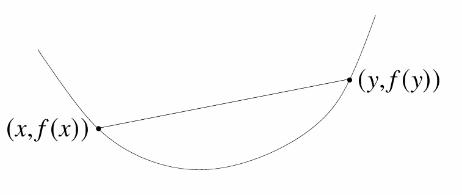
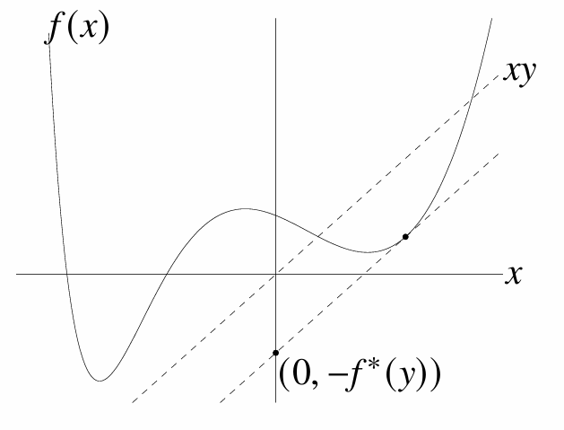
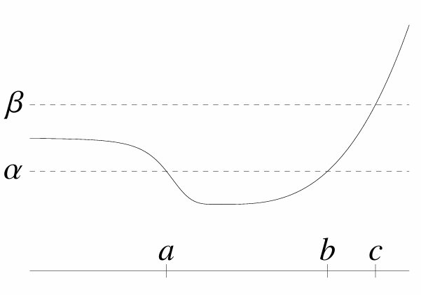

# Convex Optimization

本文是凸优化的学习笔记，基于Boyd的ConvexOptimization.

## 仿射集Affine Set

通过点$x_1$和点$x_2$的直线为

$$
x = \theta x_1 + (1-\theta) x_2
$$

仿射集就是包含通过指定点的所有直线的集。

仿射集就是$\{x| Ax=b\}$，也就是线性方程组的解空间.

## 线段Line Segment

位于点$x_1$和点$x_2$的线段可以表示为

$$
x = \theta x_1 + (1-\theta) x_2 \quad 0\leq\theta\leq 1
$$

## 凸集Convex Set

包含任意两个点之间的线段的集合

$$
x_1, x_2  \in C, \quad 0\leq\theta\leq 1 \quad \Rightarrow \quad \theta x_1 + (1-\theta) x_2 \in C
$$

## 凸组合Convex

点$x_1,x_2...x_k$的凸组合为

$$
x = \theta_1x_1 + \theta_2x_2 + ... + \theta_kx_k \quad \theta_1 + \theta_2 + ... + \theta_k = 1, \quad \theta_i \geq 0
$$

## 凸包Convex Hull

集合$C$中所有点的凸组合的集合为凸包，记为$\bf{conv}C$

$$
\bf{conv}C = \{\theta_1x_1 + \theta_2x_2 + ... + \theta_kx_k | \quad \theta_1 + \theta_2 + ... + \theta_k = 1, \quad \theta_i \geq 0 \quad x \in C\}
$$

## 凸锥Convex Cone

点$x_1,x_2$的凸锥为

$$
x = \theta_1x_1 + \theta_2x_2 \quad \theta_1 \geq 0, \theta_2 \geq 0
$$

图像上相当于一个锥。

## 超平面Hyperplane

超平面指的是集合

$$
\{x \; | \; a^Tx = b \quad a \neq 0\}
$$

显然，如果是三维空间中，它就是平面，二维空间中，它就是线段，更高维就是超平面。

## 半平面Halfplane

半平面指的是集合

$$
\{x \; | \; a^Tx \leq b \quad a \neq 0\}
$$

超平面，半平面都是凸集。

## 欧几里得球体与椭球体Euclidean balls and ellipsoids

使用中心$x_c$与半径$r$参数化的欧几里得球体

$$
B(x_c,r) = \{x \; | \Vert x-x_c \Vert _2 \leq r \; \} = \{ x_c + ru \;\vert\; \Vert u \Vert _2 \leq 1 \}
$$

椭球体可以表示为集合

$$
\{ x \; | \; (x-x_c)^TP^{-1}(x-x_c) \leq 1\}
$$

其中$P$是对称正定矩阵.

## 范数球与范数锥Norm balls and norm cones

范数球

$$
\{x \; | \Vert x-x_c \Vert  \leq r \; \} = \{ x_c + ru \;\vert\; \Vert u \Vert  \leq 1 \}
$$

范数锥

$$
\{(x,t) \; | \; \Vert x \Vert \leq t \}
$$

注意，范数锥实际上是$R^{n+1}$维的向量集合

## 多面体Polyhedra

多面体是线性矩阵不等式与等式的解集

$$
\{ x \; | \; Ax \leq b, \; Cx = d\}
$$

实际上是一系列半空间(一个线性不等式)，超平面（一个线性等式）的交集。

## 正半定锥Positive semidefinite cone

$S^n$指的是$n$维对称实矩阵的集合

$S^n_+$指的是$n$维正半定（对称）矩阵的集合,S^n_{++}$指的是$n$维正定（对称）矩阵的集合

可以证明，$S^n_+$是凸锥,称为正半定锥.

## 保凸性的操作Operations that preserve convexity

### 交集

任意数量（包括无穷）的凸集的交集也是凸集。

### 仿射变换

对凸集进行仿射变换的集合也是凸集

### 投影变换

$$
P(x,t) = x/t \quad {\bf{dom}}P=\{(x,t) \; | \; t > 0\}
$$

### 线性分式函数

$$
f(x) = \frac{Ax+b}{c^Tx+d} \quad {\bf{dom}}f=\{x \; | \; c^Tx+d>0 \}
$$

## 正常锥Proper cones

如果一个凸锥$K \subseteq \bf{R}^n$满足以下条件

* $K$封闭。
* $K$是实的，即具有非空的内部。
* $K$是尖的，也就是不包含任何直线。

则称为正常锥.

比如

* 非负象限$K=R^n_+ = \{x \in R^n \; | \; x_i \geq 0, i=1,2...n \}$
* 正半定锥$K=S^n_+$
* 非负多项式$K=\{x \in R^n \; | \; x_1 + x_2t+x_3t^2+...+x_nt^{n-1} \geq 0 \quad for\; t \in [0,1]\}$

## 广义不等式Generalized inequalities

正常锥可以用来定义广义不等式,也就是$R^n$上的偏序关系

$$
x \preceq_K y \iff y - x \in K
$$

$$
x \prec_K y \iff y - x \in {\bf{int}} K
$$

比如

* $K=R^n_+$非负象限，$x\preceq_{K} y \iff x_i \leq y_i, \quad i=1,2,...,n$
* $K=S^n_+$矩阵不等式，$X\preceq_{K} Y \iff  Y-X \in K$也就是$Y-X$是正半定的。

## 分离超平面定理Separating hyperplane theorem

如果$C$和$D$是两个不相交的凸集，即$C\cap D = \emptyset$,那么存在$a \neq 0$和$b$使得对于所有的$x \in C$有$a^Tx \leq b$,对于所有的$x\in D$有$a^Tx \geq b$.也就是说，超平面$a^Tx=b$把两个凸集分离开来。

## 支撑超平面定理Supporting hyperplane theorem

支撑超平面指的是对于一个集合$C \subset R$中的一个点$x_0$，存在一个$a \neq 0$使得超平面$a^Tx=a^Tx_0$对于任意$x\in C$有$a^Tx \leq a^Tx_0$.

支撑超平面定理指的是，对于凸集，凸集边界上任意的点都存在这个凸集的支撑超平面.

支撑超平面定理也有一个不完全的逆定理:如果一个集合是闭的,具有非空内部,并且其边界上每个点均存在支撑超平面，那么它是凸的.

## 凸函数Convex functions

函数$f: R^n \to R$如果${\bf{dom}}f$是凸集，且对于任意$x,y \in {\bf{dom}}f, \; 0 \leq \theta \leq 1$有

$$
f(\theta x + (1-\theta)y) \leq \theta f(x) + (1-\theta)f(y)
$$

则称函数是凸函数

图像上看，凸函数表示，任意函数点上的连线线段都高于函数值。

* 如果$f$是凸函数，那么$-f$就是凹函数
* 如果上述不等式严格小于，那么成为严格凸的

### $R$中常见凸函数

* 仿射函数,$ax+b$
* 指数函数,$e^{ax}$
* 次数函数，$x^\alpha$,在$R_{++}$中，$\alpha \geq 1$或$\alpha \leq 0$
* 绝对值次数函数， $|x|^p$,在$R$中，$p \geq 1$
* $max\{0,x\}$

### $R$中常见凹函数

* 放射函数,$ax+b$
* 次数函数，$x^\alpha$,在$R_{++}$中，$ 0 \leq \alpha \leq 1$。
* 对数函数,$logx$，在$R_{++}$中
* 熵,$-xlogx$
* $min\{0,x\}$

### $R^n$中常见凸函数

* 仿射函数$f(x) = a^Tx+b$
* 任意范数
* 最大值函数,$f(x) = max\{x_1,x_2,x_3...,x_n\}$
* softmax函数,$f(x) = log(e^{x_1}+e^{x_2}+...e^{x_n})$

### $R^{m\times n}$中常见凸函数

* 广义仿射函数$f(X)={\bf{tr}}(A^TX)+b=\sum_{i=1}^m\sum_{i=1}^nA_{ij}X_{ij}+b$
* 矩阵诱导范数,如$f(X)=\Vert X \Vert_2=\sigma_{max}(X)$
* 对数行列式是凹函数，$f(X) = log{\tt{det}}X \quad X \in S^n_{++}$

### 定义域延展

通常可以将凸函数在定义域外的值定义为$\infty$,这样就不用每次说明凸函数的定义域。

$$
\hat f(x)=\begin{cases}
f(x) & x\in {\bf{dom}}f \\
\infty & x \notin {\bf{dom}}f
\end{cases}
$$

### 将凸函数限制在直线上

$f: R^n \to R$是凸函数的充分必要条件是，函数$g: R\to R$

$$
g(t) = f(x+tv) \quad {\bf{dom}}g=\{t \; | \; x + tv \in {\bf{dom}}f\}
$$

对于任意的$x$,$v$都为凸函数.

### 一阶条件First-order conditio

如果$f$是可微，即梯度在开集${\bf dom}f$内处处存在，则函数是凸函数的充要条件为

$$
f(y) \geq f(x) + \nabla f(x)^T(y-x)
$$

这个表示，凸函数位于任一点切线上方。

也表示，局部信息($\nabla f(x)$)可以估计全局信息，给了凸优化可行性.

### 二阶条件Second-order conditions

$$
\nabla^2f(x)_{ij} = \frac{\partial^2f(x)}{x_ix_j}
$$

如果$f$二阶可微，即对于开集${\bf dom}f$内的任意一点，它的$\tt Hessian$矩阵均存在，则函数是凸函数的充要条件为

$$
\nabla^2f(x) \succeq 0
$$

如果是严格凸的，则$\tt Hessian$矩阵是正定的.

### 下水平集Sublevel Set

函数$f: R^n \to R$的$\alpha$下水平集定义为

$$
C_\alpha = \{x \in {\bf dom}f \; | \; f(x) \leq \alpha \}
$$

凸函数的下水平集是凸集，反之不成立。

### 上镜图Epigraph

函数$f: R^n \to R$的上镜图定义为

$$
{\bf epi}f= \{(x,t) \; | \; x \in {\bf dom}f,f(x) \leq t\}
$$

凸集和凸函数的联系可以通过上境图来建立: 一个函数是凸函数，当且仅当其
上境图是凸集。

### 保凸性的函数运算

对于凸函数$f$，以下函数运算保持了函数的凸性

* 非负数乘$\alpha f ,\quad \alpha \geq 0$
* 和$f_1 + f_2$,推广到无穷和也成立
* 仿射变换复合，$f(Ax+b)$
* 逐点最大值，$f(x) = max\{f_1(x),f_2(x),...,f_n(x)\}$
* 逐点上确界，如果$f(x,y)$对于每个固定的$y \in A$都是凸的，那么$g(x) = sup_{y \in A} f(x,y)$也是凸的
* 函数复合，$g: R^n \to R^k$,$h: R^k \to R$,$f(x) = h(g(x))=h(g_1(x),g_2(x),...,g_k(x))$,$h$是凸函数，且
  * $g_i$是凸函数，$\hat h$对于$i$变量单调不减
  * $g_i$是凹函数，$\hat h$对于$i$变量单调不增
  * $g_i$是仿射函数s
  
  ss则函数复合也是凸函数,$\hat h$是定义域延展的函数.

* 透视函数，$g(x,t) = tf(x/t), \quad {\bf dom}g=\{(x,t)\;|\; x/t \in {\bf dom}f, \; t \gt 0\}$

### 共轭函数Conjugate function

函数$f$的共轭函数定义为

$$
f^\ast(y) = {\tt sup}_{x \in {\bf dom}f} (y^Tx-f(x))
$$

共轭函数总是凸的，凸函数共轭的共轭是其本身

### 拟凸函数Quasiconvex functions

函数$f: R^n \to R$如果满足${\bf dom}f$是凸集，且函数的任意下水平集

$$
S_\alpha=\{x \in {\bf dom}f \; | \; f(x) \leq \alpha\}
$$

也是凸的，则称函数是拟凸函数.

* 如果$-f$是拟凸函数，则$f$成为拟凹函数
* 如果$f$同时是拟凸函数和拟凹函数，则成为拟线性函数

拟凸函数满足

$$
0 \leq \theta \leq 1 \Rightarrow f(\theta x + (1-\theta)y) \leq  
max\{f(x),f(y)\}
$$

#### 拟凸函数一阶条件

${\bf dom}f$是凸集，且对于任意的$x,y \in {\bf dom}f$有

$$
f(y) \leq f(x) \Rightarrow \nabla f(x)^T(y-x)
$$

从图像上看，$\nabla f(x)$在点$x$处定义了下水平集$\{y \;|\; f(y) \leq f(x)\}$的支撑超平面。

## 优化问题标准形式

$$
\begin{align*}
minimize \quad &f_0(x)\\
subject \; to \quad &f_i(x) \leq 0 ,\quad i=1,2...,m\\
& h_i(x) = 0, \quad i=1,2...,p
\end{align*}
$$

### 可行域与最优点Feasible and optimal points

* $x \in R^n$如果满足$x \in {\bf dom}f$且满足约束条件成为可行点.
* $p^\star = {\tt inf} \{ f_0(x) \; | \; f_i(x) \leq 0, \quad i=1,2,...,m, \quad h_i(x) =0, \quad i=1,2,...,p\}$称为最优值
* $p^\star  = \infty$则问题不可行
* $p^\star = -\infty$则问题无界
* 如果可行点$x$满足$f_0(x) = p^\star$则成为最优点
* $X_{opt}$是最优点的集合

### 局部最优点Locally optimal points

如果存在$R \gt 0$使得$x$是以下问题的最优点，则称$x$是局部最优点

$$
\begin{align*}
minimize \quad &f_0(z)\\
subject \; to \quad &f_i(z) \leq 0 ,\quad i=1,2...,m\\
& h_i(z) = 0, \quad i=1,2...,p\\
& \Vert z-x\Vert_2 \leq R
\end{align*}
$$

## 凸优化问题标准形式

$$
\begin{align*}
minimize \quad &f_0(x)\\
subject \; to \quad &f_i(x) \leq 0 ,\quad i=1,2...,m\\
& Ax = b
\end{align*}
$$

其中$f_0,f_1...f_m$均为凸函数。

### 最优点结论

凸优化问题中，任意的局部最优点也是全局最优点。凸优化不存在局部性质。

### 可微函数最优性准则

$x$是凸优化问题的最优点的充要条件是

$$
\nabla f_0(x)^T(y-x) \geq 0 \quad for \; all \; feasible \; y
$$

如果该点梯度不等于零，相当于$\nabla f_0(x)$定义了集合$X$的支撑超平面。

### 常见的凸优化问题

#### 线性规划Linear program

$$
\begin{align*}
minimize \quad & c^Tx+d\\
subject \; to \quad &Gx \leq h\\
& Ax = b
\end{align*}
$$

#### 二次规划Quadratic program

$$
\begin{align*}
minimize \quad & \frac12x^TPx+q^tx+r\\
subject \; to \quad &Gx \leq h\\
& Ax = b
\end{align*}
$$

$P \in S^n_+$

#### 二次约束规划Quadratically constrained quadratic program

$$
\begin{align*}
minimize \quad & \frac12x^TP_0x+q_0^tx+r_0\\
subject \; to \quad &\frac12x^TP_ix+q_i^tx+r_i \leq 0,\quad i=1,2...,m\\
& Ax = b
\end{align*}
$$

#### 二阶锥规划Second-order cone programming

$$
\begin{align*}
minimize \quad & f^Tx\\
subject \; to \quad &\Vert A_ix + b\Vert \leq c_i^Tx+d_i,\quad i=1,2...,m\\
& Fx = g
\end{align*}
$$

#### 半定规划Semidefinite program

$$
\begin{align*}
minimize \quad & c^Tx\\
subject \; to \quad &x_1F_1+x_2F_2+...+x_nF_n + G \leq 0\\
& Ax = b
\end{align*}
$$

### 上镜图形式Epigraph form

标准凸优化的上镜图形式

$$
\begin{align*}
minimize \quad & t\\
subject \; to \quad &f_0(x) - t\leq 0\\
& f_i(x) \leq 0,\quad i=1,2...,m \\
& Ax = b
\end{align*}
$$

## 对偶Duality

### 拉格朗日法Lagrangian

考虑标准形式的优化问题

$$
\begin{align*}
minimize \quad &f_0(x)\\
subject \; to \quad &f_i(x) \leq 0 ,\quad i=1,2...,m\\
& h_i(x) = 0, \quad i=1,2...,p
\end{align*}
$$

其中$x \in R^n$,定义域$D$,最优值$p^\star$

定义拉格朗日$L: R^n \times R^m \times R^p \to R$,定义域${\bf dom}L=D \times R^m \times R^p$

$$
L(x,\lambda,\nu) = f_0(x) + \sum\limits^n_{i=1}\lambda_if_i(x)+\sum\limits^p_{i=1}\nu_ih_i(x)
$$

* $\lambda$是与不等式有关的拉格朗日乘子
* $\nu$是与等式有关的拉格朗日乘子

### 拉格朗日对偶函数Lagrange dual function

定义拉格朗日对偶函数$g:R^m\times R^p \to R$

$$
g(\lambda,\nu) = {\tt inf}_{x \in D} L(x,\lambda,\nu) = {\tt inf}_{x \in D}(f_0(x) + \sum\limits^n_{i=1}\lambda_if_i(x)+\sum\limits^p_{i=1}\nu_ih_i(x))
$$

* 函数$g$不是$x$的函数，而是$\lambda,\nu$的仿射函数的逐点下确界，所以是凹函数
* 对偶函数构成了最优值$p^\star$的下界。即如果$\lambda \geq 0$,则$g(\lambda,\nu) \leq p^\star$

### 拉格朗日对偶问题Lagrange dual problem

$$
\begin{align*}
maximize \quad & g(\lambda,\nu)\\
subject \; to \quad &\lambda \geq 0
\end{align*}
$$

* 拉格朗日对偶问题的最优值提供了原问题(Prime problem)最优值的最好的拉格朗日下界估计。
* 拉格朗日对偶问题总是凸(凹)优化问题.
* 最优值记为$d^\star$.
* $\lambda,\nu$如果$\lambda \geq 0$则成为对偶可行解。

### 弱对偶性

$$
d^\star \leq p^\star
$$

即使原问题不是凸问题也有这个结论.

### 强对偶性

$$
d^\star =  p^\star
$$

通常凸优化问题都是有强对偶性的。

#### slater条件

如果存在一点$x \in {\tt int}D$使得下式成立，则强对偶性满足

$$
f_i(x) \lt 0 \\
Ax = b
$$

* 仿射函数不需要这个条件.
* 也就是说函数的定义域有一个内点满足约束即可达到强对偶性.
* 不满足这个条件的凸优化问题也可能是强对偶性的

### 最优性条件

#### 互补松弛Complementary slackness

假设强对偶性满足，$p^\star$是原问题最优值，$(\lambda^\star,\nu^\star)$是对偶问题最优值.

$$
\begin{align*}
f_0(x^\star) = g(\lambda^\star,\nu^\star) &= {\tt inf}_x(f_0(x)+\sum\limits^m_{i=1}\lambda_i^\star f_i(x)+\sum\limits^p_{i=1}\nu^\star_ih_i(x)) \\
& \leq f_0(x^\star)+\sum\limits^m_{i=1}\lambda_i^\star f_i(x^\star)+\sum\limits^p_{i=1}\nu^\star_ih_i(x^\star) \\
& \leq f_0(x^\star)
\end{align*}
$$

得出互补松弛结论.

$$
\lambda_i^\star f_i(x^\star) = 0
$$

#### KKT条件Karush-Kuhn-Tucker (KKT) conditions

假设函数可微

KKT条件如下

1. 主问题约束$f_i(x) \leq 0, \quad i=1,...,m, \quad h_i(x) = 0, \quad i=1,...p $
2. 对偶问题约束$\lambda \geq 0 $
3. 互补松弛$\lambda_if_i(x)=0 $
4. 关于$x$的梯度为零$\nabla f_0(x)+\sum\limits^m_{i=1}\lambda_i\nabla f_i(x) + \sum\limits^p_{i=1}\nu_i\nabla h_i(x) = 0$

显然，如果强对偶满足，且$x,\lambda,\nu$是最优的，那么它们必须满足KKT条件。

#### 凸优化问题下的KKT条件

对于凸优化问题,设$\hat x,\hat \lambda,\hat\nu$满足KKT条件，因为$\lambda_i \geq 0$，所以$L(x,
\lambda,\nu)$是关于$x$的凸函数，极小值即为全局最小值.所以

$$
f_0(\hat x) = g(\hat \lambda,\hat \nu)
$$

* 对于凸优化问题满足KKT条件的$\hat x,\hat \lambda,\hat\nu$也是最优解.

如果某个凸优化问题具有可微的目标函数与约束函数，且满足Slater条件，那么KKT条件和最优性条件是等价的.

## 下降方法Descent methods

下降方法生成序列

$$
x^{(k+1)} = x^{(k)}+t^{(k)}\Delta x^{(k)}
$$

使得

$$
f(x^{(k+1)}) \lt f(x^{(k)})
$$

$\Delta x^{(k)}$叫做步或者搜索方向

$t^{(k)}$叫做步长

结合凸性可知

$$
\nabla f(x^{(k)})^T \Delta x^{(k)} \lt 0
$$

也就是说，搜索方向必须和梯度的负方向成锐角

### 通用下降方法流程Generic descent method

给定初始点$x \in {\tt dom}f$

重复进行

  1. 确定下降方向$\Delta x$
  2. 线搜索,选择步长$t \gt 0$
  3. 修改 $x:=x + t\Delta sx$

直到满足停止准则

### 线搜索类型Line search types

#### 精确直线搜索Exact line search

$$
t = {\tt argmin}_{s\geq0}f(x + s\Delta x)
$$

#### 回溯直线搜索Backtracking line search

实际中常常使用非精确的直线搜索方法，

给定$f$在$x \in {\tt dom}f$处的下降方向$\Delta x$,参数$\alpha \in (0.0.5)$,$\beta \in (0,1)$

1. $t := 1$

2. 如果$f(x+t\Delta x) \gt f(x) + \alpha t \nabla f(x)^T\Delta x$令$t := \beta t$重复2
3. 如果$f(x+t\Delta x) \leq f(x) + \alpha t \nabla f(x)^T\Delta x$停止，接受$t$

由于$\Delta x$是下降方向，$\nabla f(x)^T \Delta x \lt 0$，只要$t$足够小，一定有

$$
f(x+t\Delta x) \approx f(x) + t \nabla f(x)^T\Delta x \lt f(x) + \alpha t \nabla f(x)^T\Delta x
$$

### 梯度下降算法Gradient descent method

使用负梯度作为搜索方向令$\Delta x = -\nabla f(x)$,算法如下

给定初始点$x \in  {\tt dom}f$

重复进行

1. $\Delta x = -\nabla f(x)$
2. 直线搜索，确定步长$t$
3. 修改$x := x + t\Delta x$

直到满足停止准则.

实践中，梯度下降算法收敛次数过高，梯度方向不一定就是最快速的下降方向。

### 最速下降算法Steepest descent method

对函数进行一阶泰勒展开

$$
f(x+v) \approx \hat f(x+v) = f(x) + \nabla f(x)^Tv
$$

由于方向导数$\nabla f(x)^Tv$是$v$的线性函数，只要$v$选得充分大，那么方向导数就会任意小，所以必须限制$v$的大小

选择规范化的最速下降方向

$$
\Delta x_{nsd} = argmin\{\nabla f(x)^Tv \;|\;\Vert v\Vert = 1\}
$$

同理，非规范化的最速下降方向

$$
\Delta x_{sd} = \Vert \nabla f(x) \Vert_\ast\Delta x_{nsd}
$$

其中$\Vert \nabla f(x) \Vert_\ast$表示对偶范数.

算法如下

给定初始点$x \in  {\tt dom}f$

重复进行

1. 计算$\Delta x_{sd}$
2. 直线搜索，确定步长$t$
3. 修改$x := x + t\Delta x_{sd}$

直到满足停止准则.

#### 不同范数下的例子

* 欧几里得范数（2范数），$\Delta x_{sd} = -\nabla f(x)$
* 二次型范数$\Vert x \Vert_P=(x^TPx)^{1/2} \quad P \in S^n_{++}$,$\Delta x_{sd} = -P^{-1}\nabla f(x)$
* l1范数，$\Delta x_{sd}=-(\partial f(x)/\partial x_i)e_i$

通过选择$P$，会大幅影响迭代次数.

### 牛顿法Newton’s method

#### 牛顿步Newton step

$$
\Delta x_{nt} = -\nabla^2f(x)^{-1}\nabla f(x)
$$

牛顿步是函数$f$在点$x$处的二阶泰勒近似的最优解

$$
\hat f(x+v)=f(x) + \nabla f(x)^Tv+\frac12v^T\nabla^2f(x)v
$$

在$v=\Delta x_{nt}$处达到最小值（设$\nabla^2f(x)$正定且$f(x)$足够可微），最小值为

$$
\underset{v}{min}\hat{f}(x+v) = f(x) - \frac{1}{2}\nabla f(x)^T\nabla^2 f(x)^{-1}\nabla f(x)
$$

#### 牛顿减量Newton decremen

$$
\lambda (x) = (\nabla f(x)^T\nabla^2f(x)^{-1}\nabla f(x))^{1/2}
$$

等价于

$$
\lambda (x) = (\Delta x^T_{nt}\nabla^2f(x) \Delta x_{nt})^{1/2}
$$

#### 算法

给定初始点$x \in  {\tt dom}f$,误差阈值$\epsilon \gt 0$

重复进行

1. 计算牛顿步与牛顿减量
$$\Delta x_{nt} = -\nabla^2f(x)^{-1}\nabla f(x) \\ \lambda (x) = (\nabla f(x)^T\nabla^2f(x)^{-1}\nabla f(x))^{1/2}$$
2. 停止准则，如果$\lambda^2/2 \lt \epsilon$,退出
3. 直线搜索，确定步长$t$
4. 修改$x := x + t\Delta x_{nt}$

直到满足停止准则.

## 等式约束优化Equality constrained minimization

等式凸优化问题

$$
\begin{align*}
minimize \quad &f(x)\\
subject \; to \quad &Ax = b
\end{align*}
$$

### 最优性条件

$x^\star$是最优解，当且仅当存在$\nu^\star$使得

$$
\nabla f(x^\star) + A^T\nu^\star = 0 \\
Ax = b
$$

也就是KKT条件.

### 等式约束凸二次规划

$$
\begin{align*}
minimize \quad &f(x) = (1/2)x^TPx+q^Tx+r\\
subject \; to \quad &Ax = b
\end{align*}
$$

其中$P \in S^n_+$,$A \in R^{p \times n}$

此时最优性条件成为

$$
\begin{bmatrix}
P & A^T \\
A & 0
\end{bmatrix}
\begin{bmatrix}
x^\star \\
\nu^\star
\end{bmatrix} =
\begin{bmatrix}
-q \\
b
\end{bmatrix}
$$

* 如果对于任意的$x \in N(A)$,$x^TPx \gt 0$方程有唯一解.
* 如果方程无解，原问题无下界

### 牛顿法求解等式约束优化

本节提出牛顿法处理等式约束优化，初始点必须可行，满足等式约束.还需要保证牛顿方向$\Delta x_{nt}$是可行方向，即$A\Delta x_{nt} = 0$

在可行点$x$处的对函数进行二阶泰勒近似，形成下述问题

$$
\begin{align*}
minimize \quad &\hat f(x + v) = f(x) + \nabla f(x)^Tv + (1/2)v^T\nabla^2f(x)v\\
subject \; to \quad &A(x+v) = b
\end{align*}
$$

这是一个凸的二次约束极小问题，使用KKT方法求解

$$
\begin{bmatrix}
\nabla^2f(x) & A^T \\
A & 0
\end{bmatrix}
\begin{bmatrix}
\Delta x_{nt} \\
w
\end{bmatrix} =
\begin{bmatrix}
-\nabla f(x) \\
0
\end{bmatrix}
$$

牛顿减量

$$
\lambda (x) = (\nabla f(x)^T\nabla^2f(x)^{-1}\nabla f(x))^{1/2}
$$

算法如下

给定初始点$Ax = b$,误差阈值$\epsilon \gt 0$

重复进行

1. 计算牛顿步与牛顿减量
$$\Delta x_{nt} = -\nabla^2f(x)^{-1}\nabla f(x) \\ \lambda (x) = (\nabla f(x)^T\nabla^2f(x)^{-1}\nabla f(x))^{1/2}$$
2. 停止准则，如果$\lambda^2/2 \lt \epsilon$,退出
3. 直线搜索，确定步长$t$
4. 修改$x := x + t\Delta x_{nt}$

直到满足停止准则.

### 不可行初始点牛顿法Infeasible start Newton method

$$
y = (x,\nu) \\
r(y) = (\nabla f(x)+A^T\nu,Ax-b)
$$

$r(y)$叫做原对偶残差.

从不可行的初始点开始，将$r(y)$线性化.得出不可行初始点牛顿法

$$
\begin{bmatrix}
\nabla^2f(x) & A^T \\
A & 0
\end{bmatrix}
\begin{bmatrix}
\Delta x_{nt} \\
\nu
\end{bmatrix} =
-\begin{bmatrix}
\nabla f(x) \\
Ax-b
\end{bmatrix}
$$

也可以把$v$替换成增量方式

$$
\begin{bmatrix}
\nabla^2f(x) & A^T \\
A & 0
\end{bmatrix}
\begin{bmatrix}
\Delta x_{nt} \\
\Delta \nu_{nt}
\end{bmatrix} =
-\begin{bmatrix}
\nabla f(x) + A^T\nu\\
Ax-b
\end{bmatrix}
$$

$(\Delta x_{nt},\Delta \nu_{nt})$叫做原对偶牛顿步

算法如下

算法如下

给定初始点$x \in {\tt dom}f$,$\nu$,误差阈值$\epsilon \gt 0$,$\alpha \in (1,1/2)$,$\beta \in (0,1)$

重复进行

1. 计算原对偶牛顿步，$(\Delta x_{nt},\Delta \nu_{nt})$
2. 回溯直线搜索

    1. $t :=1$
    2. 如果$\Vert r(x+t\Delta x_{nt},\nu + t\Delta\nu_{nt})\Vert_2 \gt (1-\alpha t)\Vert r(x,\nu)\Vert_2$,令$t := \beta t$重复.
3. 修改$x := x + t\Delta x_{nt}$,$\nu := \nu + \Delta\nu_{nt}$

直到$Ax=b$且$\Vert r\Vert_2 \leq \epsilon$

## 不等式约束优化Inequality constrained minimization

$$
\begin{align*}
minimize \quad &f_0(x)\\
subject \; to \quad & f_i(x) \leq 0, \quad i=1,...,m\\
&Ax = b
\end{align*}
$$

* $f_i$二阶可微，凸函数
* $p^\star$有限且可行
* 强对偶性满足

### 障碍法Barrier method

将不等式隐含在目标函数中

$$
\begin{align*}
minimize \quad &f_0(x) + \sum\limits^m_{i=1} I_-(f_i(x))\\
subject \; to \quad
&Ax = b
\end{align*}
$$

其中$I_-:R\to R$是示性函数

$$
I_(u) = \begin{cases}
0 \quad & u \leq 0 \\
\infty \quad & u \gt 0
\end{cases}
$$

但示性函数不可微，需要选取可微函数近似.

### 对数障碍Logarithmic barrier

$$
\hat I_-(u) = -(1/t)log(-u) \quad {\tt dom}\hat I_-=-R_{++}
$$

其中$t$为近似精度的参数

得到如下近似

$$
\begin{align*}
minimize \quad &f_0(x) - (1/t)\sum\limits^m_{i=1} log(-f_i(x))\\
subject \; to \quad
&Ax = b
\end{align*}
$$

将函数

$$
\phi(x)=-\sum\limits^m_{i=1}log(-f_i(x))
$$

${\tt dom}\phi = \{x\in R^n \;|\; f_i(x) \lt 0, \quad i=1,...,m\}$称为对数障碍函数

$$
\nabla \phi(x) = \sum\limits^m_{i=1}\frac1{-f_i(x)}\nabla f_i(x)\\
\nabla^2\phi(x) = \sum\limits^m_{i=1}\frac1{-f_i(x)^2}\nabla f_i(x)\nabla f_i(x)^T+\sum\limits^m_{i=1}\frac1{-f_i(x)}\nabla^2f_i(x)
$$

$t$表示解的精度.

### 中心路径Central path

考虑等价问题

$$
\begin{align*}
minimize \quad &tf_0(x) + \phi(x)\\
subject \; to \quad
&Ax = b
\end{align*}
$$

设$x^\star(t)$是上述问题的最优解,定义中心路径为集合$\{x^\star(t) \mid t\gt0\}$

中心路径的点满足

$$
Ax^\star(t)=b \\
f_i(x^\star(t)) \lt 0, \quad i=1,...,m
$$

并且存在$\hat\nu \in R^p$使

$$
\begin{align*}
0 &=t\nabla f_0(x^\star(t)) + \nabla\phi(x^\star(t))+A^T\hat\nu\\
&= t\nabla f_0(x^\star(t)) + \sum\limits^m_{i=1}\frac1{-f_i(x^\star(t))}\nabla f_i(x^\star(t)) + A^T\nu
\end{align*}
$$

成立

所以$x^\star(t)$最小化拉格朗日函数

$$
L(x,\lambda^\star(t),\nu^\star(t))=f_0(x) + \sum\limits^m_{i=1}\lambda^\star_i(t)f_i(x) + \nu^\star(t)^T(Ax-b)
$$

其中,$\lambda^\star_i(t) = 1/(-tf_i(x^\star(t)))$,$\;\nu^\star(t)=\hat v/t$

所以

$$
p^\star \geq g(\lambda^\star(t),\nu^\star(t)) = L(x^\star(t),\lambda^\star(t),\nu^\star(t)) = f_0(x^\star(t)) - m/t \\
f_0(x^\star(t)) - p^\star \leq m/t
$$

即$x^\star(t)$是和最优值偏差在$m/t$之内的次优解，而$t \to \infty$而收敛于最优解.

### 内点法Interior-point method

给定严格可行点$x$,$t:=t^{(0)} \gt 0$,$\mu \gt 1$,误差阈值$\epsilon \gt 0$.

重复进行

1. 中心点步骤.从$x$开始，在$Ax=b$的约束下极小化$tf_0+\phi$,最终确定$x^\star(t)$
2. 改进$x = x^\star(t)$
3. 停止准则，如果$m/t \lt \epsilon$则退出.
4. 增加$t:=\mu t$

$\mu$通常可以选取$\mu = 10 \sim 100$

### 修改KKT方程中的牛顿步

在内点法中，牛顿步以及相关对偶变量由以下线性方程确定.

$$
\begin{bmatrix}
t\nabla^2f_0(x)+\nabla^2\phi(x) & A^T \\
A & 0
\end{bmatrix}
\begin{bmatrix}
\Delta x_{nt} \\
\nu_{nt}
\end{bmatrix} =
-\begin{bmatrix}
t\nabla f(x) + \nabla\phi(x) \\
0
\end{bmatrix}
$$

这个步骤可以解释为求解修改的KKT方程的牛顿步

修改的KKT方程如下

$$
\begin{align}
\nabla f_0(x) + \sum\limits^m_{i=1}\lambda_i\nabla f_i(x) + A^T\nu &= 0 \\
-\lambda_if_i(x) &= 1/t \quad i=1,...,m\\
Ax &= b
\end{align}
$$

如果有$x,\lambda,\nu$满足了修改的KKT方程，那么就是当前$t$下的中心点。

### 寻找严格可行点Phase I methods

内点法需要一个严格可行的初始点$x^{(0)}$,如果不知道这样一个可行点，在应用障碍法时需要一个准备阶段，称为阶段一。

#### 基础的阶段一方法Basic phase I method

引入松弛变量

$$
\begin{align*}
minimize \quad &s\\
subject \; to \quad & f_i(x) \leq s, \quad i=1,...,m\\
&Ax = b
\end{align*}
$$

求解目标是迫使$s$小于零

* 如果最优值$p^\star \lt 0$则有严格可行解，此外，不需要很高的精度，只要$s\lt0$即可停止
* 如果最优值$p^\star \gt 0$则不可行，此外，不需要很高精度，只要发现某个对偶可行点具有正的目标值后就可以停止.
* 如果最优值$p^\star = 0$并且最小值在$x^\star$和$s^\star=0$处达到，则不等式组是可行的，但不是严格可行的.如果$p^\star = 0$但最小值不可达到，那么不等式组是不可行的.实践中，当不等式$\vert p^\star \vert \lt \epsilon$时，小于某个小正数时，优化算法就会停止，断定不可行.

### 原对偶内点法Primal-dual interior-point methods

原对偶内点法同时更新原对偶变量.且迭代值不需要是可行的.

#### 原对偶搜索方向

修改的KKT条件可以表述为

$$
r_t(x,\lambda,\nu)=
\begin{bmatrix}
\nabla f_0(x) + Df(x)^T\lambda + A^T\nu \\
-{\bf diag}(\lambda)f(x) - (1/t){\bf 1} \\
Ax - b
\end{bmatrix}
$$

并且$t \gt 0$,$Df$为导数算子

$$
Df(x) =
\begin{bmatrix}
\nabla f_1(x)^T \\
. \\ . \\
\nabla f_m(x)^T \\
\end{bmatrix}
$$

如果$x,\lambda,\nu$满足$r_t(x,\lambda,\nu) = 0$,且$f_i(x) \lt 0$,则$x=x^\star$,$\lambda = \lambda^\star$,$\nu = \nu^\star$。且均可行。对偶间隙为$m/t$

定义对偶残差

$$
r_{dual} = \nabla f_0(x) + Df(x)^T\lambda + A^T\nu
$$

定义原残差

$$
r_{pri} = Ax - b
$$

定义中心残差

$$
r_{cent} = -{\bf diag}(\lambda)f(x) - (1/t){\bf 1}
$$

从满足$f(x) \lt 0,\; \lambda \gt 0$开始求解非线性方程$r_t(x,\lambda,\nu) = 0$的牛顿步.

$$
y = (x,\lambda,\nu), \quad \Delta y = (\Delta x,\Delta \lambda,\Delta \nu)
$$

线性化

$$
r_t(y+\Delta y) \approx r_t(y) + Dr_t(y)\Delta y = 0
$$

即

$$
\Delta y = -Dr_t(y)^{-1}r_t(y)
$$

$$
\begin{bmatrix}
\nabla^2 f_0(x)+\sum\limits^m_{i=1}\lambda_i\nabla^2f_i(x) & Df(x)^T & A^T \\
-{\bf diag}(\lambda)Df(x) & -{\bf diag}(f(x)) & 0 \\
A & 0 & 0
\end{bmatrix}
\begin{bmatrix}
\Delta x \\
\Delta \lambda \\
\Delta \nu
\end{bmatrix}
=
-\begin{bmatrix}
r_{dual}\\
r_{cent} \\
r_{pri}
\end{bmatrix}
$$

原对偶搜索方向就是上式的解.

#### 代理对偶间隙

由于在原对偶内点法中，迭代点在收敛到极限值前不一定是可行的，所以对任何满足$f(x) \lt 0$,$\lambda \geq 0$定义代理对偶间隙

$$
\hat \eta(x,\lambda) =  -f(x)^T\lambda
$$

#### 算法

给定$x$满足$f_i(x) \lt 0,\quad i=1,2...,m,\;\lambda \gt 0,\;\mu \gt 1,\;\epsilon_{feas} \gt 0,\; \epsilon \gt 0$

重复

1. 确定$t$,令$t:= \mu m/ \hat\eta$
2. 计算原对偶搜索方向$\Delta y_{pd}$
3. 直线搜索与更新，确定步长$s \gt 0$,令$y := y + s\Delta y_{pd}$

直到$\Vert r_{pri}\Vert_2 \leq \epsilon_{feas},\; \Vert r_{dual}\Vert_2 \leq \epsilon_{feas},\; \hat \eta \leq \epsilon$

直线搜索

直线搜索的标准是基于残差范数的回溯直线搜索，其中进行了一些修改以保证$\lambda \gt 0$,$f(x) \lt 0$

$$
x^+ = x + s\Delta x_{pd}\\
\lambda^+ = \lambda + s \Delta \lambda_{pd}\\
\nu^+ = \nu + s\Delta \nu_{pd}
$$

首先计算满足$\lambda^+ \gt 0$且不超过1的最大正步长

$$
\begin{align*}
s^{max} &= sup\{s \in [0,1] \; | \; \lambda + s\Delta \lambda \geq 0\} \\
&= min\{1,min\{-\lambda_i/\Delta \lambda_i \; | \;\Delta \lambda_i \lt 0\}\}
\end{align*}
$$

从$s = 0.99s^{max}$开始回溯，反复用$\beta \in (0,1)$乘$s$直到$f(x^+) \lt 0$,继续使用$\beta$乘$s$直到

$$
\Vert r_t(x^+,\lambda^+,\nu^+) \Vert_2 \leq (1-\alpha s)\Vert r_t(x,\lambda,\nu) \Vert_2
$$

## 增广拉格朗日方法Augmented Lagrangian Method

增广拉格朗日方法是解决等式约束下目标函数的优化问题，结合了拉格朗日乘子法与二次罚函数法的优势,构造拉格朗日函数优化问题

$$
\mathcal{L}_p(x,\nu) = f(x) + \sum_i\nu_ih_i(x) + \frac{\rho}{2}\sum_ih_i(x)^2
$$

其中，$h_i(x)$是等式约束, $\nu_i$是其对应的拉格朗日乘子. $\rho \gt 0$是惩罚参数，控制约束违反的惩罚强度.

最小化$L_p(x,\nu)$就会解出原问题的最优解(对偶间隙为零情况下).

### 迭代步骤

1. 固定$\nu$和$\rho$求解无约束优化问题, $x^{k+1} = argmin_x \mathcal{L}_p(x,\nu^k)$
2. 更新乘子$\nu^{k+1} = \nu^k + \rho h_i(x^{k+1})$
3. 调整惩罚参数$\rho$

### 算法思路

若$x^{k+1}$是$\mathcal{L}_\rho(x^{(k+1)}, \nu^{(k)})$的极小点，因此关于$x$的梯度为零.

$$
\nabla_x \mathcal{L}_\rho(x^{(k+1)}, \nu^{(k)}) =
\nabla f(x^{(k+1)}) +
\nabla h(x^{(k+1)})^\top \nu^{(k)} + \rho h(x^{(k+1)}) = 0
$$

整理得

$$
\nabla f(x^{(k+1)}) + \rho h(x^{(k+1)}) = -
\nabla h(x^{(k+1)})^\top \nu^{(k)}
$$

而原问题的最优解KKT条件为

$$
\nabla f(x^*) +
\nabla h(x^*)^\top \nu^= 0
$$

我们的目的是让$\nu^k$逐步逼近$\nu^\ast$

显然，通过更新

$$
\nu^{k+1} = \nu^k + \rho h_i(x^{k+1})
$$

可以逼近最优KKT.
